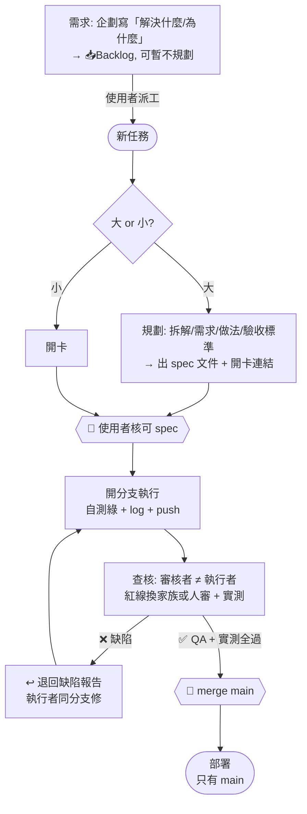

# AI 協作工作流與職責歸屬準則 (AI Collaboration Workflow) — CANONICAL

> **本檔是所有 AI 協作專案的唯一權威規則來源 (single source of truth)。** 各專案 `docs/AI_WORKFLOW.md` 只放**指向本檔的 stub + 核心鐵律速查**，不複製全文——規則只有一個家，改這裡。
> **目的**：多 AI／多模型協作下，讓每個功能可追溯、可審核、可歸因——**誰提需求、誰規劃、哪個模型執行、哪個模型查核**，並確保「執行」與「查核」獨立。
> **分工**：各專案 `CLAUDE.md` 決定「用哪一**級**模型」；各專案 Runbook/DEPLOYMENT 是「怎麼做」的操作事實；**本檔決定「哪個**階段**由誰負責、如何交接、如何留痕、如何合併與部署」**。
> **每個專案的任務 log 存在各自 repo 的 `docs/TASKS.md`**，不集中於此。本 repo 的 `TASKS.md` 只管「工作流本身的演進」。

---

## 0. 總覽（一圖流）

**先分類任務，再走對應流程**——branch/merge/deploy 全流程只對「程式碼」強制：

| 任務類型 | 分支 | 審核 | 部署／落地 |
|---|---|---|---|
| **A 程式碼變更** | ✅ 開分支 | ✅ 獨立審核（≠執行者）| 只有 main 已審核可部署 |
| **B 文件** | 記錄型(log/TASKS)：❌直接 commit｜權威型(spec/規則/API)：大型才分支 | 記錄型免審｜權威型需**事實查核/校讀**（非測試）| 不觸發部署（docs 別 bump/deploy）|
| **C 資料／維運**（爬蟲/同步生產/refresh）| ❌ 無碼可分支 | **資料 QA**（對帳/覆蓋率/健康檢查）| 非部署；生產操作**先備份後驗證**，照 Runbook |

**A 類（程式碼）主流程**：



> **三閘門 🚦**：**spec 核可**（規劃出口）→ **merge main**（審核出口，執行≠審核）→ **部署只吃 main**。細節見 §1–§8。

### 0.1 任務類型與適用流程（詳）

判斷用兩問：**(1) 有 code 進 main 嗎？(2) 錯了會誤導他人／難復原嗎？**

| 類型 | 例 | 分支 | 審核 | 落地／部署 | 留痕 |
|---|---|---|---|---|---|
| **A 程式碼** | 功能、修 bug（快線見 §2.1）、重構 | ✅ 開分支 | ✅ 獨立（紅線換家族/人審 + 實測）| 只有 main 可部署；自測綠才交付 | trailer + 卡（bug 快線免卡）|
| **B1 記錄型文件** | TASKS/log/筆記/會議紀錄 | ❌ 直接 commit | ❌ 免審（是記錄非主張）| 不部署 | 輕 trailer |
| **B2 權威型文件** | spec／規則(本檔)／API 文件／checklist | 大型才分支、小型直接 commit | ✅ 需**事實查核／校讀**（非跑測試）| 不觸發部署（docs push 別 bump/deploy）| trailer + 卡 |
| **C 資料／維運** | 爬蟲、同步生產、refresh、截圖 | ❌ 無碼可分支 | **資料 QA**（對帳/覆蓋率/健康檢查）| 非部署；**生產操作先備份後驗證**，照 Runbook | 卡/log（+ refresh_log）|

**為什麼這樣分**
- **C（爬蟲/同步）**：沒 code 進 main → 不開分支。其「審查」＝資料驗收；「閘門」＝生產前備份 + 事後驗證，非 merge。歸各專案 Runbook 管。
- **B1（記錄）**：是記錄不是主張 → 直接 commit、免審。
- **B2（權威文件）**：錯了會誤導執行者（例：spec 寫了不存在的 API）→ 要獨立查核，但查「事實對不對」，非跑 QA 測試。
- **A（程式碼）**：唯一強制全套 `branch → 審 → merge → 部署` 的類型。

> **混類型卡**（如「加功能(A) + 更新文件(B)」）→ **以最高風險類型定流程**（含 A 就整卡走 A）。

---

## 1. 角色與派工

| 角色 | 由誰 | 說明 |
|---|---|---|
| **需求 [Requirement]** | **企劃／需求方（人工）** | 寫「要解決什麼／為什麼」；**可只提需求、暫不規劃**，先進 📥Backlog |
| **派工** | **使用者（人工）** | AI **不自動派工**；由使用者把某張卡指派給執行者、排入規劃 |
| **規劃 [Plan]** | 使用者 或 規劃 AI | 把需求拆成 spec／清單（含做法 + 驗收標準） |
| **執行 [Implement]** | 各 AI（Cursor/Gemini/Claude Code…） | 由使用者派；在**分支**上寫碼 |
| **查核 [Review] + PM** | **預設 Claude Code** | 審核 + 進度看板守門 + merge 閘門。可委外（§4） |

> **Claude Code 雙重身分**：可當執行者也可當審核者，但**不可對同一張卡又實作又審核**（§2）。

---

## 2. 四階段（需求→規劃→執行→查核）+ 「實作／審核分離」鐵律


**階段語意（需求 vs 規劃，勿混）**：
- **需求 [Requirement]**：由**企劃／需求方**寫「**要解決什麼問題／為什麼**」——只給 problem statement、**不含做法**。可只提需求、**暫不規劃或暫時無法開工** → 先進 `📥Backlog` 擱著，等派工才進規劃。
- **規劃 [Plan]**：把需求拆成「**怎麼做／驗收標準**」→ 出 spec。**需求可以沒規劃就存在；規劃不得沒需求就憑空生。**
- 需求階段**不新增閘門**（三閘門仍是 `spec 核可 → merge main → 部署`）；「需求→規劃」的轉換＝**使用者派工**（AI 不自動派工，§1）。

**鐵律（不可違反）**：
1. **同一張卡的「執行」與「查核」＝兩張不同任務、不同經手者、不可同時進行**。
2. Claude Code 實作的卡 → 審核**必委由使用者或另一 AI**（§4），**不得自審**。
3. 審核者審他人碼時**不得順手改**（改了＝自審）——只能退回（§5）。

### 2.1 BUG 處理線（快線 / 慢線）
BUG 屬 **A 程式碼**（§0.1）→ **分支 + 審核不可省**（省了＝把幻覺推 main）。可省的只有**規劃 + 開卡**的簿記。分流問一句：**根因已知 且 改動局部？**

| | 快線（多數小 bug） | 慢線（根因不明／跨檔／高風險） |
|---|---|---|
| 觸發 | 根因已知、改動局部 | 需查根因、影響多檔、或碰紅線領域 |
| 卡 | **免開卡**（不進 Ledger） | 開 **bug 卡**（範本 [`templates/bug-card.md`](templates/bug-card.md)）走完整四階段 |
| 分支 | `fix/<slug>` | `ai/<模型@工具>/BUG-<id>` |
| 流程 | **先寫會失敗的回歸測試 → 修到綠 → 審核一次 → merge** | 需求(重現)→規劃(根因/做法)→執行→查核 |
| 審核 | 仍需一次（紅線換家族/人審）；實作≠審核鐵律不變 | 同左，紅線必人審 |
| 留痕 | commit trailer + `BUGS.md` 滾動一行 | bug 卡 Log + trailer |

**鐵律**：
1. **回歸測試＝修復的一部分**：無「先紅後綠」的測試＝未完成（承 §9.3「怎麼驗證」）。此測試同時是審核者的驗收依據——讓快線敢免卡。
2. 快線只省「規劃 + 開卡」，**不省審核**；審核者不得順手改（§5）。
3. **拿不準走慢線**（開卡）。快線 bug 若一改發現牽連變廣 → 就地升級為慢線、補開卡。

---

## 3. 分支制 + 部署閘門

- **每張卡開分支**：`ai/<模型或工具>/<卡ID>`（例：`ai/gemini/ui-4`）。其他 AI 若在別 clone／雲端，須 `git push origin` 分支供審。
- 審核通過 → 由**審核者（Claude Code/PM）** merge 進 `main`。
- **部署鐵律 🚀**：**只有 `main`（已審核合併）能部署，分支一律不部署**。（各專案部署細節見其 Runbook/DEPLOYMENT）
- **硬性強制（建議）**：GitHub **branch protection**（`require pull request review`），讓「未審不得進 main」由平台強制。

### 3.1 多 AI 並行 = git worktree（同機同 repo 的隔離鐵律）

> 教訓（cpbl-analytics 2026-07-12）：兩個 AI session 共用同一工作目錄，發生「A 的未 commit 工作區被 B 的 `git add -A` 掃進 commit」與「A amend 到 B 剛做的 merge commit」兩起事故。同目錄並行 = 必然互踩。

- **鐵律：同一時段一個工作目錄只准一個 AI session 操作 git。** 要並行，每個 AI 一個 worktree：
  ```bash
  git worktree add ../<repo>-<卡ID> -b ai/<模型>/<卡ID>   # 建目錄+分支
  git worktree remove ../<repo>-<卡ID>                    # 用畢清理
  ```
- 各 worktree **自備環境**（venv/node_modules 各自安裝，不共用）；dev server / API port 錯開；共用 DB 唯讀開發無妨，**要跑 migration 先協調**。
- **會合規則：後 merge 者解衝突**（先講好順序）。派工時把「已知交集檔案」寫進卡（如共用的 client/測試快照），交集越小卡切得越好。
- 派工者（PM）負責建/清 worktree 與記錄目錄→卡的對應；執行 AI 不得跨出自己的 worktree 操作其他分支。
- **審核交接（推薦）**：執行者收尾停手後，審核者**直接進駐其 worktree**（環境現成可跑測試/實測，免重裝）——所有權交接不違反一目錄一 session。守則：
  1. 進駐前驗交接：`git status` 乾淨＋`HEAD` == 已推送分支尖端（`git rev-parse HEAD origin/ai/<x>/<卡>` 相同）；不乾淨＝執行者未收尾，退回別碰。
  2. 審核者對 git **唯讀**：只讀碼/跑測試/留 findings，不 amend、不改寫執行者 commit（實作/審核分離）；修復走退回流程。
  3. 審畢離場，通過後照原流程 merge。不進駐的替代：`git diff main...<分支>` 純審，或 `git worktree add --detach` 同 commit 開獨立目錄（同分支不可兩處 checkout，detached 可）。

---

## 4. 獨立性（兩維）+ 委外審核 + 紅線

| 維度 | 抓什麼錯 | 同模型不同工具（如 Cursor-Claude 寫、ClaudeCode-Claude 審） |
|---|---|---|
| **context/session 獨立** | 疏忽、spec 偏移、作者自我合理化 | ✅ 仍成立（新 session 無對方推理記憶） |
| **模型架構獨立** | 模型**系統性盲點**（同權重＝同偏誤） | ❌ 不成立（同一顆腦，換工具不換盲點） |

**規則**：
1. **一般卡**：context 獨立即可 → 同家族不同 session/工具審**可接受**。
2. **紅線卡**（安全、金流、統計/ML 正確性、資安部署、資料正確性…）：審核**必換模型家族或人審**（Gemini/GPT 或使用者），且**必跑實測**。同家族審（含 Opus 審 Sonnet）**不算數**。
3. **委外審核**：審核可派給跨家族 AI 避免盲點；`Reviewed-by` 記**實際模型@工具**。
4. **使用者是最終獨立背板**：最高風險項一律使用者 sign-off。

### 4.1 審核核心：聚焦任務目標與潛在缺漏（防盲目複驗）
審核者（Reviewer）的核心職責是**理解並驗收「任務目標」與「使用者體驗（UX）」**，而非僅僅把執行者（Implementer）寫在 Log 裡的步驟去進行盲目複驗。

審核時，必須主動思考以下維度，主動提出可能缺漏的項目：
1. **領域邏輯與邊界條件**：統計指標定義是否正確、分母是否漏掉特定情況（例如：計算打擊率是否漏掉三振等非場內出局母體）。
2. **極端情境與小樣本防護**：零值、空值、或低樣本數量時，圖表、按鈕或熱區是否會造成誤導，是否需要適當過濾或灰底降級顯示。
3. **不同角色的視覺語意**：同一頁面存在不同角色切換時（如投手與打者），資料標題與指標是否混淆、篩選按鈕門檻是否對各角色均合理。
4. **語系與映射一致性**：名詞解釋或 Tooltip 映射的 Key 與 UI 顯示的 Label 語系及字樣是否一致。
5. **圖表互動與詳情呈現**：散點圖上的特殊標記、質心或平均值，是否能在 hover 時清楚識別其對應項目或所屬球種，而非僅顯示無意義的座標數值。

如果審核者發現上述邏輯或 UX 上的缺陷，即使執行者完全符合了首輪規劃的執行步驟，仍應撰寫詳細的缺陷報告並**↩退回**修復，嚴禁順手修改。

---

## 5. 審查失敗流程 (Rejection Flow)

1. 缺陷 → 卡轉 **↩退回** + 缺陷報告（哪條驗收沒過 + 重現步驟）。
2. 回**原執行者**，於**同一分支**修 → `re-submit` → 重審。
3. 審核者**不得代改**（維持獨立）。
4. 同卡連續 **≥3 次退回** → 升級（換更高階模型／換執行者／退回重新規劃 spec）。
5. 每次退回／重審**都留 log**。

---

## 6. 留痕 (Logging) — 三層，git 為單一事實來源

### 6.1 Git commit trailers（durable、grep-able）
```
Requested-by:   <人＝GitHub 帳號，如 ruan6047 | 業務/來源>
Planned-by:     <人＝GitHub 帳號 | AI 名/模型>
Implemented-by: <模型@工具>
Reviewed-by:    <人＝GitHub 帳號 | 模型@工具>
```
**身分寫法（強制）**：**人一律用 GitHub 帳號**（如 `ruan6047`、`mor`），**嚴禁泛稱「使用者」**——多人協作下「使用者」無鑑別度、無法歸因。**AI 用 `模型@工具`**（`Claude-Opus-4.8@ClaudeCode`、`Gemini-2.x@AIStudio`）。查詢：`git log --grep="Reviewed-by: ruan6047"`。

### 6.2 各專案 `docs/TASKS.md` 卡片 log
每卡一段時間線：`日期 | 階段 | 經手（模型@工具 / 需求方）| 通過/退回`。

### 6.3 各專案 Ledger 總表（一卡一檔）
`docs/TASKS.md`＝**Ledger 索引表 only**（常駐、輕量）：規則抬頭 + 一卡一列的表格 + 依賴／相關卡註記，**不內嵌任何卡片明細段**。卡片明細**一卡一檔**於 `docs/tasks/<卡ID>.md`；Ledger「卡ID」欄以相對連結指向卡檔。**文件與 git 衝突以 git 為準。**

### 6.4 封存與算力衛生（Context Hygiene）
**原則：AI 每 session 常駐讀取的檔案（`TASKS.md`／`CLAUDE.md`／Runbook）只留現行有效資訊；歷史「可查而不常駐」。封存≠刪除——git 仍是單一事實來源。**
1. **看板只留活卡**：卡片一到 🏁完成 或 📥封存，結案時 `git mv docs/tasks/<卡ID>.md docs/archive/tasks/<卡ID>.md`，並從 `docs/TASKS.md` Ledger **刪該列**、抄一列到 `docs/archive/TASKS_ARCHIVE.md` 的封存 Ledger。
2. **spec／規劃／交接文件**：所屬卡片全數結案後移入 `docs/archive/`；**搬移時修好引用**（文內相對連結、AI 記憶指標、其他文件的路徑）。
3. **常駐文件內的過期段落**同理：已失效的規劃/狀態描述刪除或移封存，不留「歷史敘事」佔 context。
4. 封存屬 **B1 記錄型**（直接 commit，免審）。
5. **一卡一檔算力衛生**：常駐只讀輕量 Ledger（`docs/TASKS.md`），卡片明細**按需載入**；規劃／執行只讀本卡＋依賴註記點名的相關卡。**更新狀態＝改 Ledger 一格 + 卡檔補一行 Log**——兩處職責不同、不重複（狀態住 Ledger、時序住 Log）。

### 6.4.1 遷移指南（單檔 `TASKS.md` → 一卡一檔）
既有專案（單檔 `TASKS.md` 內嵌所有卡）轉換：
1. 為每張**活卡**建 `docs/tasks/<卡ID>.md`（範本 [`templates/tasks-card.md`](templates/tasks-card.md)），貼入卡片明細（**去掉狀態欄**）。
2. `TASKS.md` 瘦身為 Ledger 索引 + 依賴註記；「卡ID」欄加連結指向卡檔。
3. 已 🏁/📥 的卡：明細移 `docs/archive/tasks/<卡ID>.md`、Ledger 列移 `docs/archive/TASKS_ARCHIVE.md`。
4. commit（B1 記錄型，直接）：`docs: migrate task board to one-card-per-file`。

---

## 7. 任務卡格式

**每張卡＝一個獨立檔 `docs/tasks/<卡ID>.md`（一卡一檔，見 §6.3/§6.4）**；`TASKS.md` 只留 Ledger 索引。**狀態住 Ledger、不進卡檔**（單一來源，承 §7.1）；卡檔只留 Log（時序自然為準）。卡格式（範本 [`templates/tasks-card.md`](templates/tasks-card.md)）：

```
# <卡ID> <功能名>  〔🔴紅線 / ⚪一般〕
- 需求：<>　規劃：<>　分支：ai/<>/<卡ID>
- 執行：<模型@工具>　查核：<模型@工具>（須 ≠ 執行）
- 範圍：見 <spec 檔> §X（大規劃，連結不複製內容—承 §7.1）／或於此簡述（小任務）
- 狀態住 ../TASKS.md Ledger

## Log
- MM-DD 階段 by <模型@工具> → ✅/↩(原因)
```
**狀態機**（住 Ledger「狀態」欄）：`💡需求 → 📥Backlog(待規劃) → ⏳待執行 → 🔨執行中 → 🔍待查核 → ✅通過→merge → 🏁完成`／`↩退回→回🔨`
**相關卡**：以 Ledger 的「依賴註記」表達（規劃／大卡分切時判定連動範圍），不逐卡雙鏈、不強求對稱。

### 7.1 spec 文件 vs 任務看板（何時開文件、何時只開卡）
- **大型／多步規劃**（研究、RFC、多項清單、含驗收標準或程式碼片段）→ 存**獨立 spec 文件**（如 `docs/*_PROPOSALS.md`、`docs/*_CHECKLIST.md`），並在 `TASKS.md` **開卡連結**它。
- **小任務**（單一改動、無需長篇）→ **只開卡**，不另立文件。
- **鐵律**：spec 文件放「**做什麼／怎麼做／驗收標準**」（內容）；`TASKS.md` 放「**狀態／誰做／分支**」（狀態），卡檔 `docs/tasks/<卡ID>.md` 放「**誰做／分支／範圍連結／log**」。**狀態只住 `TASKS.md` Ledger，卡檔與 spec 文件皆不得另記一份**（避免兩處不同步）——spec 文件頂部只放**一行**指向其看板卡即可。
- **卡片明細**（含範圍摘要）住卡檔，範圍以**連結**指向 spec 段落（`見 <spec> §X`）、**不複製內容**。
- **結案後**：spec 文件隨卡片封存（§6.4），移入 `docs/archive/`。

---

## 8. 跨專案採用 (Adoption)

新專案採用本機制，見 [`ADOPTION.md`](ADOPTION.md)。三步：
1. 專案 `docs/AI_WORKFLOW.md` 放 stub（見 [`templates/project-stub.md`](templates/project-stub.md)）——指向本 canonical + 核心鐵律速查。
2. 專案 `docs/TASKS.md` 用 [`templates/TASKS.md`](templates/TASKS.md) 起一個看板。
3. 專案 `CLAUDE.md` 加一行指引。

**規則演進**：只改本 repo 的 `AI_WORKFLOW.md`；各專案 stub 指針不變、無需同步（因不複製全文）。

---

## 9. 通用工程紅線（防幻覺 / 究責 / 安全）

> 流程之外的跨專案通用紅線。收錄自 projectARG 既有實務（2026-07）。

### 9.1 防幻覺（最高頻錯源）
1. **先讀再說**：陳述「專案現有 X」前先開檔確認；不確定就說不確定，**嚴禁腦補**。
2. **不虛構**：不存在的 API 端點／資料表／環境變數／指令／函式，一律不得當成存在。（反例：規劃文件寫了不存在的 `/api/players/search` 就是這條沒守。）
3. **程式碼是事實**：文件與程式碼矛盾 → **以程式碼為準**並回頭修文件；發現不一致，小的直接修、大的記進該專案「已知不一致清單」並開 issue。

### 9.2 究責
- **提交 AI 產出的人＝視同本人所寫**：派工者／提交者必須**看懂**該產出並為它負**最終責任**。（trailer 的 `Implemented-by` 記「哪個模型做的」，但責任在提交的人。）

### 9.3 交付格式
- 交付／PR **必附三件**：**改了什麼／為什麼／怎麼驗證的**（附實測：curl 輸出、截圖、對帳數字）。**「應該可以」不算完成。**

### 9.4 安全
- **Secrets 永不進 git**：`.env`／密鑰／token／密碼不進版控、不貼 commit 訊息／PR／issue／文件；範例值放 `.env.example`。
- 合併前 reviewer 檢查「敏感資訊未上傳」。

### 9.5 穩定性
- **不擅自升級鎖定版本／依賴**（lockfile、釘死的版本）——要升走正常任務卡。
- **一個 commit 一件事**：順手改的拆開。

### 9.6 衝突解決順序
**程式碼 > 設定檔 > 專案文件（AGENTS/CLAUDE）> README > 規劃／願景文件。** 矛盾一律以上位者為準，並回頭修下位文件。
