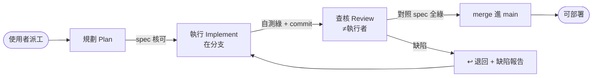

# AI 協作工作流與職責歸屬準則 (AI Collaboration Workflow) — CANONICAL

> **本檔是所有 AI 協作專案的唯一權威規則來源 (single source of truth)。** 各專案 `docs/AI_WORKFLOW.md` 只放**指向本檔的 stub + 核心鐵律速查**，不複製全文——規則只有一個家，改這裡。
> **目的**：多 AI／多模型協作下，讓每個功能可追溯、可審核、可歸因——**誰提需求、誰規劃、哪個模型執行、哪個模型查核**，並確保「執行」與「查核」獨立。
> **分工**：各專案 `CLAUDE.md` 決定「用哪一**級**模型」；各專案 Runbook/DEPLOYMENT 是「怎麼做」的操作事實；**本檔決定「哪個**階段**由誰負責、如何交接、如何留痕、如何合併與部署」**。
> **每個專案的任務 log 存在各自 repo 的 `docs/TASKS.md`**，不集中於此。本 repo 的 `TASKS.md` 只管「工作流本身的演進」。

---

## 1. 角色與派工

| 角色 | 由誰 | 說明 |
|---|---|---|
| **需求／派工** | **使用者（人工）** | AI **不自動派工**；由使用者指派某張卡給某個執行者 |
| **規劃 [Plan]** | 使用者 或 規劃 AI | 產出 spec／清單（含驗收標準） |
| **執行 [Implement]** | 各 AI（Cursor/Gemini/Claude Code…） | 由使用者派；在**分支**上寫碼 |
| **查核 [Review] + PM** | **預設 Claude Code** | 審核 + 進度看板守門 + merge 閘門。可委外（§4） |

> **Claude Code 雙重身分**：可當執行者也可當審核者，但**不可對同一張卡又實作又審核**（§2）。

---

## 2. 三階段 + 「實作／審核分離」鐵律



**鐵律（不可違反）**：
1. **同一張卡的「執行」與「查核」＝兩張不同任務、不同經手者、不可同時進行**。
2. Claude Code 實作的卡 → 審核**必委由使用者或另一 AI**（§4），**不得自審**。
3. 審核者審他人碼時**不得順手改**（改了＝自審）——只能退回（§5）。

---

## 3. 分支制 + 部署閘門

- **每張卡開分支**：`ai/<模型或工具>/<卡ID>`（例：`ai/gemini/ui-4`）。其他 AI 若在別 clone／雲端，須 `git push origin` 分支供審。
- 審核通過 → 由**審核者（Claude Code/PM）** merge 進 `main`。
- **部署鐵律 🚀**：**只有 `main`（已審核合併）能部署，分支一律不部署**。（各專案部署細節見其 Runbook/DEPLOYMENT）
- **硬性強制（建議）**：GitHub **branch protection**（`require pull request review`），讓「未審不得進 main」由平台強制。

---

## 4. 獨立性（兩維）+ 委外審核 + 紅線

| 維度 | 抓什麼錯 | 同模型不同工具（如 Cursor-Claude 寫、ClaudeCode-Claude 審） |
|---|---|---|
| **context/session 獨立** | 疏忽、spec 偏移、作者自我合理化 | ✅ 仍成立（新 session 無對方推理記憶） |
| **模型架構獨立** | 模型**系統性盲點**（同權重＝同偏誤） | ❌ 不成立（同一顆腦，換工具不換盲點） |

**規則**：
1. **一般卡**：context 獨立即可 → 同家族不同 session/工具審**可接受**。
2. **紅線卡**（安全、金流、統計/ML 正確性、資安部署、資料正確性…）：審核**必換模型家族或人審**（Gemini/GPT 或使用者），且**必跑實測**。同家族審（含 Opus 審 Sonnet）**不算數**。
3. **委外審核**：審核可派給跨家族 AI 避免盲點；`Reviewed-by` 記**實際模型@工具**。
4. **使用者是最終獨立背板**：最高風險項一律使用者 sign-off。

---

## 5. 審查失敗流程 (Rejection Flow)

1. 缺陷 → 卡轉 **↩退回** + 缺陷報告（哪條驗收沒過 + 重現步驟）。
2. 回**原執行者**，於**同一分支**修 → `re-submit` → 重審。
3. 審核者**不得代改**（維持獨立）。
4. 同卡連續 **≥3 次退回** → 升級（換更高階模型／換執行者／退回重新規劃 spec）。
5. 每次退回／重審**都留 log**。

---

## 6. 留痕 (Logging) — 三層，git 為單一事實來源

### 6.1 Git commit trailers（durable、grep-able）
```
Requested-by:   <需求提供方：使用者 | 業務/來源>
Planned-by:     <使用者 | AI 名/模型>
Implemented-by: <模型@工具>
Reviewed-by:    <模型@工具>
```
「模型@工具」寫具體：`Claude-Opus-4.8@ClaudeCode`、`Gemini-2.x@AIStudio`、`使用者`。查詢：`git log --grep="Reviewed-by:"`。

### 6.2 各專案 `docs/TASKS.md` 卡片 log
每卡一段時間線：`日期 | 階段 | 經手（模型@工具 / 需求方）| 通過/退回`。

### 6.3 各專案 Ledger 總表
`TASKS.md` 頂部一張表，一卡一列。**文件與 git 衝突以 git 為準。**

---

## 7. 任務卡格式

```
### <卡ID> <功能名>  〔🔴紅線 / ⚪一般〕
- 需求提供方：<>　規劃：<>　分支：ai/<>/<卡ID>
- 執行：<模型@工具>　查核：<模型@工具>（須 ≠ 執行）
- 狀態：<>　Commit/PR：<>
- Log：MM-DD 階段 by <模型@工具> → ✅/↩(原因)
```
**狀態機**：`📥Backlog → ⏳待執行 → 🔨執行中 → 🔍待查核 → ✅通過→merge → 🏁完成`／`↩退回→回🔨`

### 7.1 spec 文件 vs 任務看板（何時開文件、何時只開卡）
- **大型／多步規劃**（研究、RFC、多項清單、含驗收標準或程式碼片段）→ 存**獨立 spec 文件**（如 `docs/*_PROPOSALS.md`、`docs/*_CHECKLIST.md`），並在 `TASKS.md` **開卡連結**它。
- **小任務**（單一改動、無需長篇）→ **只開卡**，不另立文件。
- **鐵律**：spec 文件放「**做什麼／怎麼做／驗收標準**」（內容）；`TASKS.md` 放「**狀態／誰做／分支／log**」（狀態）。**狀態只住 `TASKS.md`，spec 文件不得另記一份**（避免兩處不同步）——spec 文件頂部只放**一行**指向其看板卡即可。

---

## 8. 跨專案採用 (Adoption)

新專案採用本機制，見 [`ADOPTION.md`](ADOPTION.md)。三步：
1. 專案 `docs/AI_WORKFLOW.md` 放 stub（見 [`templates/project-stub.md`](templates/project-stub.md)）——指向本 canonical + 核心鐵律速查。
2. 專案 `docs/TASKS.md` 用 [`templates/TASKS.md`](templates/TASKS.md) 起一個看板。
3. 專案 `CLAUDE.md` 加一行指引。

**規則演進**：只改本 repo 的 `AI_WORKFLOW.md`；各專案 stub 指針不變、無需同步（因不複製全文）。
