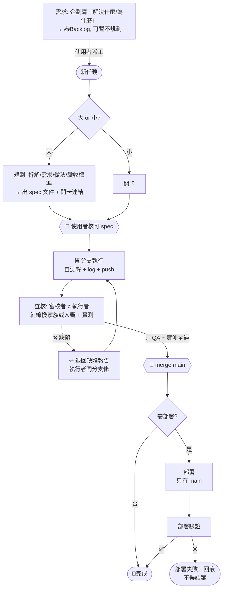
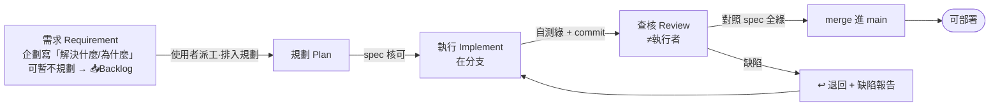

# AI 協作工作流與職責歸屬準則 (AI Collaboration Workflow) — CANONICAL

> **本檔是所有 AI 協作專案的唯一權威規則來源 (single source of truth)。** 各專案 `docs/AI_WORKFLOW.md` 只放**指向本檔的 stub + 核心鐵律速查**，不複製全文——規則只有一個家，改這裡。
> **目的**：多 AI／多模型協作下，讓每個功能可追溯、可審核、可歸因——**誰提需求、誰規劃、哪個模型執行、哪個模型查核**，並確保「執行」與「查核」獨立。
> **分工**：各專案 `CLAUDE.md` 決定「用哪一**級**模型」；各專案 Runbook/DEPLOYMENT 是「怎麼做」的操作事實；**本檔決定「哪個**階段**由誰負責、如何交接、如何留痕、如何合併與部署」**。
> **每個專案的任務 log 存在各自 repo 的 `docs/TASKS.md`**，不集中於此。本 repo 的 `TASKS.md` 只管「工作流本身的演進」。

---

## 0. 總覽（一圖流）

**先分類任務，再走對應流程**——branch/merge/deploy 全流程只對「程式碼」強制：

| 任務類型 | 分支 | 審核 | 部署／落地 |
|---|---|---|---|
| **A 程式碼變更** | ✅ 開分支 | ✅ 獨立審核（≠執行者）| 只有 main 已審核可部署；需部署者驗證後才完成 |
| **B 文件** | 記錄型(log/TASKS)：❌直接 commit｜權威型(spec/規則/API)：大型才分支 | 記錄型免審｜權威型需**事實查核/校讀**（非測試）| 不觸發部署（docs 別 bump/deploy）|
| **C 資料／維運**（爬蟲/同步生產/refresh）| ❌ 無碼可分支 | **資料 QA**（對帳/覆蓋率/健康檢查）| 非部署；生產操作**先備份後驗證**，照 Runbook |

**A 類（程式碼）主流程**：



> **三閘門 🚦**：**spec 核可**（規劃出口）→ **merge main**（審核出口，執行≠審核）→ **部署只吃 main，驗證成功才完成**。細節見 §1–§8。

### 0.1 任務類型與適用流程（詳）

判斷用兩問：**(1) 有 code 進 main 嗎？(2) 錯了會誤導他人／難復原嗎？**

| 類型 | 例 | 分支 | 審核 | 落地／部署 | 留痕 |
|---|---|---|---|---|---|
| **A 程式碼** | 功能、修 bug（快線見 §2.1）、重構 | ✅ 開分支 | ✅ 獨立（紅線換家族/人審 + 實測）| 只有 main 可部署；需部署者驗證成功才完成 | trailer + 卡（bug 快線免卡）|
| **B1 記錄型文件** | TASKS/log/筆記/會議紀錄 | ❌ 直接 commit | ❌ 免審（是記錄非主張）| 不部署 | 輕 trailer |
| **B2 權威型文件** | spec／規則(本檔)／API 文件／checklist | 大型才分支、小型直接 commit | ✅ 需**事實查核／校讀**（非跑測試）| 不觸發部署（docs push 別 bump/deploy）| trailer + 卡 |
| **C 資料／維運** | 爬蟲、同步生產、refresh、截圖 | ❌ 無碼可分支 | **資料 QA**（對帳/覆蓋率/健康檢查）| 非部署；**生產操作先備份後驗證**，照 Runbook | 卡/log（+ refresh_log）|

**為什麼這樣分**
- **C（爬蟲/同步）**：沒 code 進 main → 不開分支。其「審查」＝資料驗收；「閘門」＝生產前備份 + 事後驗證，非 merge。歸各專案 Runbook 管。
- **B1（記錄）**：是記錄不是主張 → 直接 commit、免審。
- **B2（權威文件）**：錯了會誤導執行者（例：spec 寫了不存在的 API）→ 要獨立查核，但查「事實對不對」，非跑 QA 測試。
- **A（程式碼）**：唯一強制全套 `branch → 審 → merge → 部署` 的類型。

> **混類型卡**（如「加功能(A) + 更新文件(B)」）→ **以最高風險類型定流程**（含 A 就整卡走 A）。

---

## 1. 角色與派工

| 角色 | 由誰 | 說明 |
|---|---|---|
| **需求 [Requirement]** | **企劃／需求方（人工）** | 寫「要解決什麼／為什麼」；**可只提需求、暫不規劃**，先進 📥Backlog |
| **派工** | **使用者（人工）** | AI **不自動派工**；由使用者把某張卡指派給執行者、排入規劃 |
| **規劃 [Plan]** | 使用者 或 規劃 AI | 把需求拆成 spec／清單（含做法 + 驗收標準） |
| **執行 [Implement]** | 各 AI（Cursor/Gemini/Claude Code…） | 由使用者派；在**分支**上寫碼 |
| **查核 [Review]** | 使用者指定、且 ≠ 執行者 | 驗收任務目標、實測與獨立性；紅線依 §4 換家族或人審 |
| **協調 [Coordinator]／PM** | 使用者指定；未指定才由 Claude Code | 管理階段所有權、看板、交接與 merge 閘門；擔任該卡執行者時不得兼任查核 |

> **工具不綁死角色**：Claude、Gemini、GPT 都可負責不同階段；同一卡同一時間只有一個階段所有者 [Stage Owner]。完成交接前，下一階段 AI 不得修改該卡、分支或 worktree。任何 AI 都**不可對同一張卡又實作又審核**（§2）。

---

## 2. 四階段（需求→規劃→執行→查核）+ 「實作／審核分離」鐵律



**階段語意（需求 vs 規劃，勿混）**：
- **需求 [Requirement]**：由**企劃／需求方**寫「**要解決什麼問題／為什麼**」——只給 problem statement、**不含做法**。可只提需求、**暫不規劃或暫時無法開工** → 先進 `📥Backlog` 擱著，等派工才進規劃。
- **規劃 [Plan]**：把需求拆成「**怎麼做／驗收標準**」→ 出 spec。**需求可以沒規劃就存在；規劃不得沒需求就憑空生。**
- 需求階段**不新增閘門**（三閘門仍是 `spec 核可 → merge main → 部署`）；「需求→規劃」的轉換＝**使用者派工**（AI 不自動派工，§1）。

**鐵律（不可違反）**：
1. **同一張卡的「執行」與「查核」＝兩張不同任務、不同經手者、不可同時進行**。
2. 任一 AI 實作的卡 → 審核**必委由使用者或另一 AI**（§4）；紅線另須換模型家族，**不得自審**。
3. 審核者審他人碼時**不得順手改**（改了＝自審）——只能退回（§5）。
4. **階段交接有出口條件**：規劃→執行須 spec 核可；執行→查核須工作區乾淨、分支已推、自測綠且附驗證證據；查核→merge 須 findings 清零、實測通過與必要 sign-off 完成。

### 2.1 BUG 處理線（快線 / 慢線）
BUG 屬 **A 程式碼**（§0.1）→ **分支 + 審核不可省**（省了＝把幻覺推 main）。可省的只有**規劃 + 開卡**的簿記。分流問一句：**根因已知 且 改動局部？**

| | 快線（多數小 bug） | 慢線（根因不明／跨檔／高風險） |
|---|---|---|
| 觸發 | 根因已知、改動局部 | 需查根因、影響多檔、或碰紅線領域 |
| 卡 | **免開卡**（不進 Ledger） | 開 **bug 卡**（範本 [`templates/bug-card.md`](templates/bug-card.md)）走完整四階段 |
| 分支 | `fix/<slug>` | `ai/<模型@工具>/BUG-<id>` |
| 流程 | **先寫會失敗的回歸測試 → 修到綠 → 審核一次 → merge** | 需求(重現)→規劃(根因/做法)→執行→查核 |
| 審核 | 仍需一次（紅線換家族/人審）；實作≠審核鐵律不變 | 同左，紅線必人審 |
| 留痕 | commit trailer + `BUGS.md` 滾動一行 | bug 卡 Log + trailer |

**鐵律**：
1. **回歸測試＝修復的一部分**：無「先紅後綠」的測試＝未完成（**通用鐵律見 §9.3.1**——須實際對缺陷版本跑出紅燈，不是宣稱）。此測試同時是審核者的驗收依據——讓快線敢免卡。
2. 快線只省「規劃 + 開卡」，**不省審核**；審核者不得順手改（§5）。
3. **拿不準走慢線**（開卡）。快線 bug 若一改發現牽連變廣 → 就地升級為慢線、補開卡。

---

## 3. 分支制 + 部署閘門

- **每張卡開分支**：`ai/<模型或工具>/<卡ID>`（例：`ai/gemini/ui-4`）。其他 AI 若在別 clone／雲端，須 `git push origin` 分支供審。
- 審核通過 → 由**審核者（Claude Code/PM）** merge 進 `main`。
- **執行者不得自行 merge／push main**（承 §2 鐵律 1）。**`git push origin HEAD:main` 是違規動作，不是捷徑**——它跳過的正是本流程唯一的品質閘門。
- **部署鐵律 🚀**：**只有 `main`（已審核合併）能部署，分支一律不部署**。（各專案部署細節見其 Runbook/DEPLOYMENT）
- **硬性強制**：A 類 repo **應開啟** GitHub **branch protection**（`require pull request review`），讓「未審不得進 main」由平台強制。
  > 教訓（cpbl-analytics 2026-07-15）：同一個執行者 AI 連續**三張卡**直接 push main 才回報「待查核」，順序完全顛倒；且刪掉分支與 worktree，讓查核者無處進駐。三張都是在規則白紙黑字的情況下違反的。**靠自律擋不住——AI 會繞過任何不由平台強制的閘門**，人也會。未開 branch protection 的 repo，其閘門實質上不存在。

### 3.1 多 AI 並行 = git worktree（同機同 repo 的隔離鐵律）

> 教訓（cpbl-analytics 2026-07-12）：兩個 AI session 共用同一工作目錄，發生「A 的未 commit 工作區被 B 的 `git add -A` 掃進 commit」與「A amend 到 B 剛做的 merge commit」兩起事故。同目錄並行 = 必然互踩。

- **鐵律：同一時段一個工作目錄只准一個 AI session 操作 git。** 要並行，每個 AI 一個 worktree：
  ```bash
  git worktree add ../<repo>-<卡ID> -b ai/<模型>/<卡ID>   # 建目錄+分支
  git worktree remove ../<repo>-<卡ID>                    # 用畢清理（**順序與時機見 §3.1.1**）
  ```
  > **誰建、誰清、何時清 → §3.1.1**。清理有順序陷阱（worktree 必須先於 branch 刪），照這兩行直覺操作會卡住。
- 各 worktree **自備環境**（venv/node_modules 各自安裝，不共用）；dev server / API port 錯開；共用 DB 唯讀開發無妨，**要跑 migration 先協調**。
- **會合規則：後 merge 者解衝突**（先講好順序）。派工時把「已知交集檔案」寫進卡（如共用的 client/測試快照），交集越小卡切得越好。
- 派工者（PM）負責建/清 worktree 與記錄目錄→卡的對應；執行 AI 不得跨出自己的 worktree 操作其他分支。
- **審核交接（推薦）**：執行者收尾停手後，審核者**直接進駐其 worktree**（環境現成可跑測試/實測，免重裝）——所有權交接不違反一目錄一 session。守則：
  1. 進駐前驗交接：`git status` 乾淨＋`HEAD` == 已推送分支尖端（`git rev-parse HEAD origin/ai/<x>/<卡>` 相同）；不乾淨＝執行者未收尾，退回別碰。
  2. 審核者對 git **唯讀**：只讀碼/跑測試/留 findings，不 amend、不改寫執行者 commit（實作/審核分離）；修復走退回流程。
  3. 審畢離場，通過後照原流程 merge。不進駐的替代：`git diff main...<分支>` 純審，或 `git worktree add --detach` 同 commit 開獨立目錄（同分支不可兩處 checkout，detached 可）。

### 3.1.1 worktree 生命週期（誰建、誰清、何時清）

> 教訓（cpbl-analytics 2026-07-15）：一張卡查核退回 → 開修復卡 → 再開一個 worktree → 修復卡 merge 後，**原 worktree 與原分支殘留、原卡停在 `↩退回` 沒人收**，最後由使用者手動清。規則只寫了「怎麼建、怎麼清」，沒寫**誰負責、什麼時候**——沒有 owner 的清理動作＝不會發生的清理動作。

**鐵律**：
1. **一個「卡族」[card family] 一個 worktree**，目錄名＝`<repo>-<卡族ID>`——這是後續對帳的唯一依據。
   - **卡族**＝原卡 **及其所有修復卡**（`<原卡ID>-FIX<n>`，§5.1）。**卡族 ID＝原卡 ID**。
   - 絕大多數卡沒有修復卡 → 卡族＝該卡本身 → 實務上就是「一卡一 worktree、目錄名＝卡 ID」。
   - 例：`RECORD-API1` 與其修復卡 `RECORD-API1-FIX1` 同屬卡族 `RECORD-API1`，共用 `../cpbl-analytics-RECORD-API1`。**不是**再開一個 `-RECORD-API1-FIX1` 目錄。
2. **worktree 屬於卡族，不屬於分支**。分支仍是**一卡一條**（修復卡有自己的分支，在同一個 worktree 內 `git switch -c` 切出即可）；**worktree 不隨分支增生**。退回時 worktree **保留**（要回去修），不另開新的。
3. **清理者＝merge 者**（查核通過後執行 merge 的人／PM）。**merge 是一組動作，缺一不可**，不得只做第 1 步。**順序不可調換**：
   ```bash
   cd <主工作目錄>                                          # 0. 先離開 worktree（見下方陷阱）
   git switch main && git merge --no-ff ai/<模型>/<卡ID>    # 1. 合併該卡的分支（帶 §6.1 trailers）
   git push origin main
   #   → 更新卡片狀態（📦已合併／🏁完成）並依 §6.4 封存

   # 2. 卡族**還有活卡**（如原卡待修復卡帶動結案）→ worktree 留著，到此為止。
   #    卡族**全數結案** → 才做以下收尾，且順序不可調換：
   git worktree remove ../<repo>-<卡族ID>                   # 2a. 先移除 worktree
   git branch -d ai/<模型>/<卡ID>                           # 2b. 再刪本地分支（卡族內每條都刪）
   git push origin --delete ai/<模型>/<卡ID>                # 2c. 刪遠端分支
   ```
   **兩個必踩的陷阱**（皆已實測）：
   - **worktree 必須先於 branch 刪除**。分支仍被 worktree checkout 時，`git branch -d` 直接失敗：`error: cannot delete branch 'x' used by worktree at '...'`。順序反了就卡住。
   - **`worktree remove` 前先 `cd` 離開該目錄**，否則 shell 的 cwd 消失，後續指令會噴 `fatal: Unable to read current working directory` 並靜默失敗。
4. **對帳（PM 定期執行）**：`git worktree list` 的每個目錄，都必須對得上 Ledger 裡一個**尚有活卡的卡族**（活卡＝`🔨執行中`／`🔍待查核`／`↩退回`）。
   - **有 worktree、卡族已全數結案** → 收尾沒做完（漏了第 2a–2c 步）。
   - **有活卡、無 worktree** → 執行者提前刪了，查核者無處進駐（違反 §3.1 審核交接）。
   - 兩者皆為**流程缺陷，須立即補正並記入卡片 Log**。
5. **卡族全數結案時**（原卡 + 所有修復卡皆 `🏁完成`／封存），該卡族的 worktree 與分支必須皆為 0。這是結案的出口條件之一（承 §2 鐵律 4）。**原卡尚未結案 → worktree 不得移除**（§5.1 鐵律 3：原卡由修復卡帶動結案）。

### 3.2 GitHub PR Merge 與通用部署契約

> **原則：canonical 定義狀態與介面，各專案定義部署實作。** 不在本規則綁定 Vercel、Cloud Run、Docker、SSH 或其他平台。

#### 雙軌狀態

交付狀態 [Delivery Status] 與部署狀態 [Deployment Status] 必須分欄，避免「已 merge」被誤當「已上線」：

- **交付**：`💡需求 → 📥Backlog → ⏳待執行 → 🔨執行中 → 🔍待查核 → ✅通過 → 📦已合併 → 🏁完成`／`↩退回`
- **部署**：`—不適用`，或 `⏸未部署 → 🚀待部署 → ⏳部署中 → ✅已部署 → 🧪驗證中 → ✅已驗證`；失敗支線為 `❌部署失敗`／`⏪已回滾`
- **完成條件**：需部署的 A 類卡只有 `📦已合併 + ✅已驗證` 才能進 `🏁完成`；不需部署者在 merge 後完成。部署失敗或回滾不得結案、不得封存。

#### GitHub PR 自動轉態

1. PR 必須可由標題、body 或分支名唯一取得卡 ID。
2. Merge 前的必要狀態檢查 [Required Status Check] 應驗證：卡為 `✅通過`、執行者 ≠ 查核者、必要測試／實測與紅線 sign-off 已完成。未通過不得 merge。
3. `pull_request` 的 merged 事件發生後，狀態回報器將交付狀態改為 `📦已合併`，記錄 PR URL 與 merge SHA；`deployable=false` 則可直接完成。

#### 專案部署契約 [Deployment Contract]

每個專案在自己的 Runbook／`DEPLOYMENT.md` 定義部署 adapter，至少包含：

| 欄位 | 契約 |
|---|---|
| `deployable` | 該卡是否需要部署 |
| `environment` | staging／production 等目標環境 |
| `source_sha` | 實際部署的 main commit SHA |
| `trigger` | 自動、手動或排程 |
| `verify` | smoke test／健康檢查與通過條件 |
| `rollback` | 回滾方式與觸發條件 |
| `status_reporter` | 如何更新 Ledger／GitHub Deployment |
| `owner` | 部署失敗的處理責任者 |

adapter 最終必須回報：`environment`、`source_sha`、`status`（`pending | in_progress | success | failure | rollback`）；成功時另附 `verified_at`，可選附 `deployment_url`。

部署、驗證、狀態更新應在**同一條 workflow 執行鏈**完成（例如 `deploy → verify → update-task-status`，最後一段 `if: always()`）。不可假設用 repository `GITHUB_TOKEN` 建立的事件一定會喚醒下一個 workflow；GitHub 會阻止多數此類遞迴觸發。若確需跨 workflow，由各專案選擇 GitHub App、`workflow_dispatch` 或 `repository_dispatch`，並採最小權限。

狀態回報本身是 **B1 記錄型文件**；各專案可依 branch protection 選擇受信任 bot 直接提交或開狀態 PR，但不得把「等待人工補 Ledger」當成正常成功路徑。

---

## 4. 獨立性（兩維）+ 委外審核 + 紅線

| 維度 | 抓什麼錯 | 同模型不同工具（如 Cursor-Claude 寫、ClaudeCode-Claude 審） |
|---|---|---|
| **context/session 獨立** | 疏忽、spec 偏移、作者自我合理化 | ✅ 仍成立（新 session 無對方推理記憶） |
| **模型架構獨立** | 模型**系統性盲點**（同權重＝同偏誤） | ❌ 不成立（同一顆腦，換工具不換盲點） |

**規則**：
1. **一般卡**：context 獨立即可 → 同家族不同 session/工具審**可接受**。
2. **紅線卡**（安全、金流、統計/ML 正確性、資安部署、資料正確性…）：審核**必換模型家族或人審**（Gemini/GPT 或使用者），且**必跑實測**。同家族審（含 Opus 審 Sonnet）**不算數**。
3. **委外審核**：審核可派給跨家族 AI 避免盲點；`Reviewed-by` 記**實際模型@工具**。
4. **使用者是最終獨立背板**：最高風險項一律使用者 sign-off。

### 4.1 審核核心：聚焦任務目標與潛在缺漏（防盲目複驗）
審核者（Reviewer）的核心職責是**理解並驗收「任務目標」與「使用者體驗（UX）」**，而非僅僅把執行者（Implementer）寫在 Log 裡的步驟去進行盲目複驗。

審核時，必須主動思考以下維度，主動提出可能缺漏的項目：
1. **領域邏輯與邊界條件**：統計或計算指標的定義是否正確、分母與母體計算是否漏掉特定邊界情況（如計量型公式未考慮非顯性出局/排除條件）。
2. **極端情境與小樣本防護**：零值、空值、少樣本或極端邊界數值時，圖表、按鈕或互動區域是否會造成視覺或認知誤導，是否需要適當過濾、降級或提供 Placeholder/灰底防護。
3. **不同角色的視覺語意**：同一個頁面或功能存在不同操作角色/視角切換時，標題、計量單位與資料欄位是否混淆，篩選門檻與交互行為是否對各角色均合理。
4. **語系與映射一致性**：字典對照、名詞解釋、語系包或 Tooltip 映射的 Key，與 UI 實際顯示的 Label 語系及字樣是否完全一致。
5. **圖表互動與詳情呈現**：圖表或視覺化組件上的特殊標記、質心或統計平均線，在 hover 或觸控詳情中是否能清晰識別其所屬資料集或關聯維度，而非僅顯示無情境的座標數值。

如果審核者發現上述邏輯或 UX 上的缺陷，即使執行者完全符合了首輪規劃的執行步驟，仍應撰寫詳細的缺陷報告並**↩退回**修復，嚴禁順手修改。

---

## 5. 審查失敗流程 (Rejection Flow)

1. 缺陷 → 卡轉 **↩退回** + 缺陷報告（哪條驗收沒過 + 重現步驟）。
2. 回**原執行者**，於**同一分支、同一 worktree** 修 → `re-submit` → 重審。
3. 審核者**不得代改**（維持獨立）。
4. 同卡連續 **≥3 次退回** → 升級（換更高階模型／換執行者／退回重新規劃 spec）。
5. 每次退回／重審**都留 log**。

> **預設路徑是「同分支修」，不是「開新卡」**。退回**不新增卡、不新增分支、不新增 worktree**——碼還在分支上，直接改就是了。只有下方 §5.2 的例外才准開修復卡。

### 5.1 修復卡（僅事後查核適用）— 防止孤兒卡與 worktree 殘留

碼**已在 main**（§5.2）而無法「同分支修」時，才開**修復卡**。此時必須守：

1. **一次查核＝一張修復卡**：該次查核的**全部 findings 收斂進同一張卡**。**嚴禁一 finding 一卡**——那會長出 N 條分支、N 個 worktree，而原卡不知該在誰結案時跟著結案。findings 僅在**彼此獨立且需平行處理**時才可分卡，且分卡須全部列進原卡的依賴註記。
2. **卡 ID＝`<原卡ID>-FIX<n>`**，與原卡同屬**卡族 `<原卡ID>`**：**沿用原卡族的 worktree**（在其中 `git switch -c ai/<模型>/<原卡ID>-FIX<n>` 開新分支），**不另開目錄**（§3.1.1 鐵律 1–2）。
3. **原卡不得獨立結案**：原卡標 `↩退回` 並註記「由 `<FIX卡>` 承接」。**修復卡 merge 且驗證通過時，兩張卡一起結案**——原卡的結案由修復卡帶動，這是它唯一的出路。
   > 沒有這條，原卡會永遠停在 `↩退回`：修復卡結案了，沒人記得回頭收原卡（cpbl-analytics 2026-07-15 實際發生，由使用者手動收）。
4. **主線帶著已知缺陷的期間**：缺陷已在 main → **不得部署**該缺陷涉及的功能；若已部署，記入 `BUGS.md` 並列為最優先。
5. 修復卡的查核者**須 ≠ 修復卡的執行者**；沿用原查核者是可以的（他熟脈絡，且他本來就 ≠ 執行者）。

### 5.2 事後查核 (Post-merge Review) — 補救路徑，不是正常路徑

**定義**：碼**已進 main** 才發現未經查核（執行者違規 push main、或閘門失效）。

**這是流程失敗後的補救，不是可選路線**。代價必須誠實揭露：

1. **findings 擋不下合併**——碼已在 main。查核者的退回只能轉成修復卡（§5.1），不能阻止缺陷進主線。
2. 原卡**必須在 Log 中揭露流程缺失**（誰、哪個 commit、跳過了什麼），不得粉飾。
3. 執行者若已刪除分支與 worktree → **必須重建**（推回遠端、重開 worktree），否則查核者無處進駐、無環境實測。
4. 是否採事後查核、或回退 main 重走流程，**由使用者裁示**——AI 不得自行決定「就這樣算了」。

**根治手段是 §3 的 branch protection**，不是把事後查核制度化。

---

## 6. 留痕 (Logging) — 三層，git 為單一事實來源

### 6.1 Git commit trailers（durable、grep-able）
```
Requested-by:   <人＝GitHub 帳號，如 ruan6047 | 業務/來源>
Planned-by:     <人＝GitHub 帳號 | AI 名/模型>
Implemented-by: <模型@工具>
Reviewed-by:    <人＝GitHub 帳號 | 模型@工具>
```
**身分寫法（強制）**：**人一律用 GitHub 帳號**（如 `ruan6047`、`mor`），**嚴禁泛稱「使用者」**——多人協作下「使用者」無鑑別度、無法歸因。**AI 用 `模型@工具`**（`Claude-Opus-4.8@ClaudeCode`、`Gemini-2.x@AIStudio`）。查詢：`git log --grep="Reviewed-by: ruan6047"`。

### 6.2 各專案 `docs/TASKS.md` 卡片 log
每卡一段時間線：`日期 | 階段 | 經手（模型@工具 / 需求方）| 通過/退回`。

### 6.3 各專案 Ledger 總表（一卡一檔）
`docs/TASKS.md`＝**Ledger 索引表 only**（常駐、輕量）：規則抬頭 + 一卡一列的表格 + 依賴／相關卡註記，**不內嵌任何卡片明細段**。卡片明細**一卡一檔**於 `docs/tasks/<卡ID>.md`；Ledger「卡ID」欄以相對連結指向卡檔。**文件與 git 衝突以 git 為準。**

### 6.4 封存與算力衛生（Context Hygiene）
**原則：AI 每 session 常駐讀取的檔案（`TASKS.md`／`CLAUDE.md`／Runbook）只留現行有效資訊；歷史「可查而不常駐」。封存≠刪除——git 仍是單一事實來源。**
1. **看板只留活卡**：卡片一到 🏁完成 或 📥封存，結案時 `git mv docs/tasks/<卡ID>.md docs/archive/tasks/<卡ID>.md`，並從 `docs/TASKS.md` Ledger **刪該列**、抄一列到 `docs/archive/TASKS_ARCHIVE.md` 的封存 Ledger。需部署的 A 類卡只有部署狀態為 `✅已驗證` 才能完成／封存；`❌部署失敗` 或 `⏪已回滾` 必須留在活卡。
2. **spec／規劃／交接文件**：所屬卡片全數結案後移入 `docs/archive/`；**搬移時修好引用**（文內相對連結、AI 記憶指標、其他文件的路徑）。
3. **常駐文件內的過期段落**同理：已失效的規劃/狀態描述刪除或移封存，不留「歷史敘事」佔 context。
4. 封存屬 **B1 記錄型**（直接 commit，免審）。
5. **一卡一檔算力衛生**：常駐只讀輕量 Ledger（`docs/TASKS.md`），卡片明細**按需載入**；規劃／執行只讀本卡＋依賴註記點名的相關卡。**更新狀態＝改 Ledger 一格 + 卡檔補一行 Log**——兩處職責不同、不重複（狀態住 Ledger、時序住 Log）。

### 6.4.1 遷移指南（單檔 `TASKS.md` → 一卡一檔）
既有專案（單檔 `TASKS.md` 內嵌所有卡）轉換：
1. 為每張**活卡**建 `docs/tasks/<卡ID>.md`（範本 [`templates/tasks-card.md`](templates/tasks-card.md)），貼入卡片明細（**去掉狀態欄**）。
2. `TASKS.md` 瘦身為 Ledger 索引 + 依賴註記；「卡ID」欄加連結指向卡檔。
3. 已 🏁/📥 的卡：明細移 `docs/archive/tasks/<卡ID>.md`、Ledger 列移 `docs/archive/TASKS_ARCHIVE.md`。
4. commit（B1 記錄型，直接）：`docs: migrate task board to one-card-per-file`。

---

## 7. 任務卡格式

**每張卡＝一個獨立檔 `docs/tasks/<卡ID>.md`（一卡一檔，見 §6.3/§6.4）**；`TASKS.md` 只留 Ledger 索引。**狀態住 Ledger、不進卡檔**（單一來源，承 §7.1）；卡檔只留 Log（時序自然為準）。卡格式（範本 [`templates/tasks-card.md`](templates/tasks-card.md)）：

```
# <卡ID> <功能名>  〔🔴紅線 / ⚪一般〕
- 需求：<>　規劃：<>　分支：ai/<>/<卡ID>
- 執行：<模型@工具>　查核：<模型@工具>（須 ≠ 執行）
- worktree：<../repo-卡族ID>（**僅 A 類**；B/C 類填 `—不適用`。結案時必須已移除—§3.1.1）
- 部署：<是/否>　環境：<staging/production/—>　PR：<#/URL>　Merge SHA：<SHA/—>
- 範圍：見 <spec 檔> §X（大規劃，連結不複製內容—承 §7.1）／或於此簡述（小任務）
- 狀態住 ../TASKS.md Ledger

## Log
- MM-DD 階段 by <模型@工具> → ✅/↩(原因)
```
> **worktree 欄是 §3.1.1 對帳的依據**：`git worktree list` 的每個目錄都要對得上一個尚有活卡的卡族。缺欄＝對不了帳＝殘留會長期無人發現。
> **B 類（文件）與 C 類（資料／維運）不開分支、也不開 worktree**（§0.1）→ 該欄填 `—不適用`，與「部署」欄同理。**強制 A 類以外的卡填 worktree，等於逼人捏造一個不存在的東西**。
**狀態機**（住 Ledger，詳見 §3.2）：交付狀態 `💡需求 → 📥Backlog(待規劃) → ⏳待執行 → 🔨執行中 → 🔍待查核 → ✅通過 → 📦已合併 → 🏁完成`／`↩退回→回🔨`；部署狀態獨立為 `—不適用` 或 `⏸未部署 → 🚀待部署 → ⏳部署中 → ✅已部署 → 🧪驗證中 → ✅已驗證`，失敗為 `❌部署失敗`／`⏪已回滾`。
**相關卡**：以 Ledger 的「依賴註記」表達（規劃／大卡分切時判定連動範圍），不逐卡雙鏈、不強求對稱。

### 7.1 spec 文件 vs 任務看板（何時開文件、何時只開卡）
- **大型／多步規劃**（研究、RFC、多項清單、含驗收標準或程式碼片段）→ 存**獨立 spec 文件**（如 `docs/*_PROPOSALS.md`、`docs/*_CHECKLIST.md`），並在 `TASKS.md` **開卡連結**它。
- **小任務**（單一改動、無需長篇）→ **只開卡**，不另立文件。
- **鐵律**：spec 文件放「**做什麼／怎麼做／驗收標準**」（內容）；`TASKS.md` 放「**狀態／誰做／分支**」（狀態），卡檔 `docs/tasks/<卡ID>.md` 放「**誰做／分支／範圍連結／log**」。**狀態只住 `TASKS.md` Ledger，卡檔與 spec 文件皆不得另記一份**（避免兩處不同步）——spec 文件頂部只放**一行**指向其看板卡即可。
- **卡片明細**（含範圍摘要）住卡檔，範圍以**連結**指向 spec 段落（`見 <spec> §X`）、**不複製內容**。
- **結案後**：spec 文件隨卡片封存（§6.4），移入 `docs/archive/`。

---

## 8. 跨專案採用 (Adoption)

新專案採用本機制，見 [`ADOPTION.md`](ADOPTION.md)。基本三步；有部署者再接 Deployment Contract：
1. 專案 `docs/AI_WORKFLOW.md` 放 stub（見 [`templates/project-stub.md`](templates/project-stub.md)）——指向本 canonical + 核心鐵律速查。
2. 專案 `docs/TASKS.md` 用 [`templates/TASKS.md`](templates/TASKS.md) 起一個看板。
3. 專案 `CLAUDE.md` 加一行指引。
4. 有部署的專案在 Runbook／`DEPLOYMENT.md` 實作 §3.2 adapter；部署平台由專案決定。

**規則演進**：只改本 repo 的 `AI_WORKFLOW.md`；各專案 stub 指針不變、無需同步（因不複製全文）。

---

## 9. 通用工程紅線（防幻覺 / 究責 / 安全）

> 流程之外的跨專案通用紅線。收錄自 projectARG 既有實務（2026-07）。

### 9.1 防幻覺（最高頻錯源）
1. **先讀再說**：陳述「專案現有 X」前先開檔確認；不確定就說不確定，**嚴禁腦補**。
2. **不虛構**：不存在的 API 端點／資料表／環境變數／指令／函式，一律不得當成存在。（反例：規劃文件寫了不存在的 `/api/players/search` 就是這條沒守。）
3. **程式碼是事實**：文件與程式碼矛盾 → **以程式碼為準**並回頭修文件；發現不一致，小的直接修、大的記進該專案「已知不一致清單」並開 issue。

### 9.2 究責
- **提交 AI 產出的人＝視同本人所寫**：派工者／提交者必須**看懂**該產出並為它負**最終責任**。（trailer 的 `Implemented-by` 記「哪個模型做的」，但責任在提交的人。）

### 9.3 交付格式
- 交付／PR **必附三件**：**改了什麼／為什麼／怎麼驗證的**（附實測：curl 輸出、截圖、對帳數字）。**「應該可以」不算完成。**

### 9.3.1 測試必須先紅後綠（通用，非僅 BUG 卡）
**任何宣稱「擋得住回歸」的測試，都必須先對缺陷版本跑出紅燈**——把修復 `git stash` 掉再跑一次，確認測試真的會失敗。原本只綁在 BUG 快線（§2.1），現升為通用。

> 教訓（cpbl-analytics 2026-07-15）：新增的兩支回歸測試中，有一支**斷言方向寫反**（斷言恆真），是靠這步才抓到。沒做這步，它會靜靜變成永遠不會失敗的假測試——**比沒有測試更糟，因為它給人已被覆蓋的錯覺**。

### 9.3.2 驗證證據須註明環境；新 worktree 先建立基線
1. **「測試綠」若不註明在哪跑，就可能是假綠燈。** 驗證證據須附環境（哪個 worktree／容器／有無特殊環境變數）。
2. **新開 worktree 後第一件事：跑一次全套測試建立基線**，再開始改。否則分不清「我弄壞的」與「本來就壞的」，查核者複驗時還會再踩一次。

> 教訓（cpbl-analytics 2026-07-15）：某卡回報「pytest 120 passed」屬實——但那個 shell 恰好帶了 `PYTHONPATH`。換成乾淨 checkout，整套 collection 直接失敗（測試互相 import，repo 未設 `pythonpath`）。**該卡的驗證迴圈實際上是失效的，而所有人都以為它是綠的。**

### 9.3.3 同一判準只寫一份（單一定義）
同一個語意判準（「現役球員」「有效訂單」「已完成」…）**只可有一份實作**，其他地方一律引用。複製第二份 ≠ 重複程式碼的美學問題，而是**兩份會分岔**：改了一份忘了另一份，錯誤靜默且難察覺。

**這是查核者的具體檢查點**：發現關鍵判準時反問一句「**這個判準有沒有第二份拷貝？**」——比抽象的 DRY 原則可執行得多。

> 教訓（cpbl-analytics 2026-07-15）：「現役」＝登錄名單 ∪ 本季有成績，在同一個檔案裡被寫了兩份，第二份漏掉一個來源 → 有成績但已離隊的球員被標成非現役。查核者實測抓到。

### 9.4 安全
- **Secrets 永不進 git**：`.env`／密鑰／token／密碼不進版控、不貼 commit 訊息／PR／issue／文件；範例值放 `.env.example`。
- 合併前 reviewer 檢查「敏感資訊未上傳」。

### 9.5 穩定性
- **不擅自升級鎖定版本／依賴**（lockfile、釘死的版本）——要升走正常任務卡。
- **一個 commit 一件事**：順手改的拆開。

### 9.6 衝突解決順序
**程式碼 > 設定檔 > 專案文件（AGENTS/CLAUDE）> README > 規劃／願景文件。** 矛盾一律以上位者為準，並回頭修下位文件。

---

## 10. 模型分級與階段路由

> **資料基準日：2026-07-14。** 模型名稱、可用性與生命週期會變；本節是建議名單、不是永久綁定。每季或重大發布後由規則卡查核官方模型目錄、價格與 deprecation，再更新本節。

### 10.1 分級名單

| 等級 | 適用 | Anthropic | OpenAI | Google |
|---|---|---|---|---|
| **L1 經濟型** | 大量、低風險、機械性任務 | Claude Haiku 4.5 | GPT-5.6 Luna (`gpt-5.6-luna`) | Gemini 3.1 Flash-Lite (`gemini-3.1-flash-lite`) |
| **L2 主力型** | 一般規劃、coding、review | Claude Sonnet 5 (`claude-sonnet-5`) | GPT-5.6 Terra (`gpt-5.6-terra`) | Gemini 3.5 Flash (`gemini-3.5-flash`) |
| **L3 高階型** | 跨模組、根因不明、高風險 | Claude Opus 4.8 (`claude-opus-4-8`) | GPT-5.6 Sol (`gpt-5.6-sol`) | Gemini 3.1 Pro Preview (`gemini-3.1-pro-preview`) |
| **L4 Frontier／特殊** | 多日、極難、長時間自主工作 | Claude Fable 5 (`claude-fable-5`) | GPT-5.6 Sol Pro／Sol `max`（依工具可用性） | 暫缺；Gemini 3.5 Pro 發布並實測後再評估 |

**官方來源**：
- Anthropic：[Fable 5](https://www.anthropic.com/claude/fable)、[Sonnet 5](https://www.anthropic.com/news/claude-sonnet-5)
- OpenAI：[Models](https://developers.openai.com/api/docs/models)、[GPT-5.6](https://openai.com/index/gpt-5-6/)
- Google：[Models](https://ai.google.dev/gemini-api/docs/models)、[Model lifecycle](https://ai.google.dev/gemini-api/docs/deprecations)

### 10.2 階段建議

| 階段／任務 | 預設 | 升級條件 |
|---|---|---|
| 卡片分類、摘要、純文字校正 | L1 | 需求含糊或會改變規則語意 → L2 |
| 一般 spec／小型架構規劃 | L2 | 跨系統、不可逆或紅線 → L3；多日研究才考慮 L4 |
| 一般功能實作／已知根因 bug | L2 | 跨模組、未知根因、長時間 agentic coding → L3 |
| 一般 review | L2，且 ≠ 執行者 | 高風險或多次退回 → 跨家族 L3 |
| 安全、金流、統計／ML、資料正確性 | L3 + 跨家族 review + 人工 sign-off | L4 只增加分析能力，不取代實測與人審 |
| 部署轉態、格式檢查 | **L0 deterministic automation** | AI 不應成為必要閘門 |
| 部署／migration 異常分析 | L2 | 根因不明、資安或不可逆資料風險 → L3 |

### 10.3 路由限制

1. **先選風險等級，再選供應商**；不得把某家公司永久綁死在單一階段。
2. **Review 先看獨立性**：紅線卡必須換模型家族；使用更高階但同家族的模型仍不算跨家族查核。
3. **Stable 優先**：自動化生產流程使用明確 model ID；禁用會熱切換的 `latest` alias。Preview 只在卡片明記風險、替代模型與重跑策略後使用。
4. **特殊模式不是新模型**：OpenAI `medium/high/xhigh/max` 是 reasoning effort；`ultra` 是多代理協作。Claude Agent Teams 同理。啟用多代理模式須卡片明確授權，對外仍只有一個階段所有者。
5. **Fable 5 限制**：適合大型長時間工作，但資安／生物／化學請求可能被 safeguards 攔截並 fallback 至 Opus 4.8；敏感資料使用前須確認 Anthropic 當期 retention 政策。合法資安工作不得把 Fable 當唯一 reviewer。
6. **暫不納入**：Gemini 3.5 Pro 在正式發布、取得可用 model ID 並完成本專案實測前，不列入推薦；受限的 Claude Mythos 5 不列入一般路由。
7. **成本升級有理由**：L4 不作預設。只有 L3 已不足、任務可驗收且失敗成本高於推理成本時才升級，並在卡片 Log 記原因。
