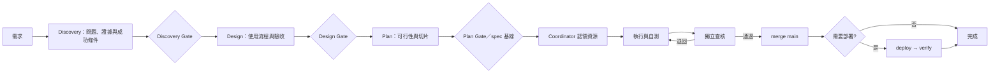

# AI 協作工作流與職責歸屬準則 (AI Collaboration Workflow) — CANONICAL

> 本檔是跨專案 AI 協作的**短版權威規則**：定義不可違反的不變量與專案必須實作的契約。操作命令、事故脈絡與供應商細節一律不放這裡；它們住在 [`templates/`](templates/) 與各專案 Runbook。程式碼與文件衝突時，以程式碼為準並修正文件。

## 0. 分類與狀態

先判斷「有 code 進 main 嗎？」與「錯了是否難復原？」；混合卡以最高風險類型處理。

| 類型 | 例 | 分支／審核／落地 |
|---|---|---|
| A 程式碼 | 功能、bug、重構 | 分支 + 獨立審核；只有已審 main 可部署 |
| B1 記錄文件 | log、TASKS、會議紀錄 | 直接 commit；免審，不部署 |
| B2 權威文件 | spec、規則、API、checklist | 小改可直接 commit；需獨立事實查核／校讀，不部署；canonical 規則本體與指定 T4 文件除外 |
| C 資料／維運 | 同步、refresh、爬蟲 | 無碼不開分支；資料 QA，生產操作先備份後驗證 |

交付狀態只住 Ledger：`💡需求 → 📥Backlog → ⏳待執行 → 🔨執行中 → 🔍待查核 → ✅通過 → 📦已合併 → 🏁完成`，或 `↩退回`、`⏸阻塞`、`🚨已升級`。部署狀態獨立：`—不適用`，或 `⏸未部署 → 🚀待部署 → ⏳部署中 → ✅已部署 → 🧪驗證中 → ✅已驗證`；失敗／回滾不得結案。

變更級別 [change tier] 決定流程強度，不得只按估時或檔案數降級；取風險、影響範圍與可逆性的最高者。任一碰到 public contract、權限／安全、金流、資料寫入／migration、production 或紅線，即至少 T3，紅線一律 T4。

| 級別 | 適用條件 | 最低閘門 |
|---|---|---|
| T0 記錄 | B1 log、非權威格式、無語意影響文字 | 直接 commit；格式／連結檢查 |
| T1 編修 | 已知 typo、展示文案或細節調整；無行為、契約或資料影響 | 聚焦自查；可直接 commit，必要時抽查 |
| T2 局部修正 | 根因已知、可逆、局部的程式／設定變更 | 分支、聚焦回歸測試、獨立輕量查核 |
| T3 標準交付 | 一般功能、跨檔或需求不確定的修正 | spec／卡、分支、自測、獨立查核、merge gate |
| T4 紅線 | §5 列舉風險 | T3 + 跨家族或人工審核、實測與必要 sign-off |

## 1. 角色與所有權

| 角色 | 責任 |
|---|---|
| 需求方 | 擁有問題優先序、目標、非目標與各 Gate 的最終核可；AI 不可自行派工 |
| Discovery lead | 把使用者／市場／既有資料研究整理為證據、假設與研究限制；不得把 AI 推測當成使用者證據 |
| 設計者 | 定義使用流程、資訊架構、狀態、錯誤回饋、可及性與可用性驗收；不自行決定商業優先序或技術架構 |
| 技術規劃者 | 寫可行性、架構取捨、風險、驗證與切片計畫；不可在未回寫 Gate 的情況下改變已核可的問題或設計 |
| 執行者 | 在獲認領的分支／worktree 實作與自測 |
| 查核者 | 對照目標與證據驗收；不得代改被審 source branch，但必須留下 finding／結論 |
| Coordinator | 認領、資源鎖、交接、merge 與對帳；未指定時由專案指定預設者 |

同一卡同一時間只能有一個階段所有者 [Stage Owner]；下一階段完成交接前不得動卡、分支或 worktree。查核者可寫入 PR review 或 control-plane 的 review event，這不是代改實作。

## 2. 不可違反的規則

1. **實作與審核分離**：同一張 A 卡的執行者不得查核或 merge 自己的變更；查核者發現缺陷只退回，不順手改。
2. **平台優先強制**：A 類 repo 必開 branch protection／required checks；`git push origin HEAD:main` 是違規，不是捷徑。
3. **main 才能部署**：分支不可部署；需要部署的卡只有 main 的 source SHA 完成驗證才可結案。
4. **可驗證交接**：執行→查核前，工作區乾淨、分支已推送、自測與環境證據齊全；查核→merge 前，findings 清零、實測通過、必要 sign-off 完成。每次交接記錄 owner、時間、iteration、source SHA、證據與阻塞原因；查核 finding 須可追溯且不可覆寫。
5. **同機並行一 worktree 一 session**：每張 A 卡／卡族有獨立 worktree；建置、交接與清理由 [`worktree-lifecycle.md`](templates/worktree-lifecycle.md) 執行。
6. **不可偽造測試證據**：宣稱可防回歸的測試必須先對缺陷版本跑紅；新 worktree 先建立全套測試基線；所有驗證都標註 worktree／容器／環境變數。
7. **一個 commit 一件事**：不混入無關重構、依賴升級或 secrets；所有 commit 依 §6 留適用 trailer。
8. **資料庫是共享可變基礎設施**：依 §4 隔離與序列化；口頭協調不是鎖。
9. **事實、安全與責任**：先讀再說，不虛構 API、表、環境變數或指令；secrets 永不進 git；提交 AI 產出的人視同作者並負最終責任。

## 3. 任務流程



- **Discovery** 回答「是否在解對的問題」：T3／T4、大卡、跨系統與不可逆變更先完成 Discovery Gate，明列目標使用者／利害關係人、觸發情境、痛點、成功條件、非目標、已知證據與待驗證假設。Discovery lead 將證據標為使用者研究、既有產品資料、公開研究或 AI 推測；AI 可調查既有資料、程式脈絡與競品，但不得將推測當作使用者證據。需求方確認問題與研究限制後，才可進 Design。
- **Design** 回答「解法是否適合使用者」：所有使用者可見的 T3／T4 卡，及 Initiative 的使用者旅程改變，必須有 Design Brief，定義主要流程、資訊架構、正常／空／錯誤／權限狀態、可及性與可用性驗收。設計者提出方案，需求方核可取捨與驗收；真實訪談、prototype 或可用性測試由需求方依風險決定，AI 只能協助準備與整理。純技術 T3／T4 可標註 Design Gate `N/A`，但必須記錄理由。
- **Plan** 回答「如何安全實作」：技術規劃者只在已核可的 Discovery／Design 基線上產出 spec、依賴圖、風險、驗證與子卡切片。發現不可行或成本超出邊界時，回寫受影響的 Discovery／Design brief 並重新核可；不可只在實作卡內改變方向。T0–T2 至少在卡或 commit 說明範圍與驗收。
- 大型工作以 Initiative 父卡管理：父卡保存目標、spec 基線版本、依賴圖、里程碑、決策與風險；子卡採可獨立驗證的垂直切片。checkpoint 發現設計／需求變更時，先更新父卡基線、標註受影響子卡與重新核可，再繼續；禁止只在子卡內靜默改方向。
- 根因已知且局部的 bug 依 T1／T2 處理；不確定、跨檔或紅線 bug 至少 T3。細節見 [`bug-workflow.md`](templates/bug-workflow.md)。
- 退回預設回原執行者、原分支、原 worktree 並遞增 iteration；只有碼已進 main 的事後查核才開 `<原卡>-FIX<n>` 修復卡。連續三次退回轉 `🚨已升級`，由需求方選擇重規劃、換執行者、人工接手或放棄。原卡由修復卡帶動結案。

## 4. 多 AI 與資料庫契約

### 4.1 Control-plane Contract

每個多 AI 專案必須在 Runbook 實作一個 control-plane adapter（Coordinator、受保護 workflow 或具原子操作的服務）：

- 只有 adapter 可原子認領／釋放卡、建 worktree、轉交付狀態與核發資源租約 [lease]。adapter 的 append-only event log 是作業狀態事實來源；Ledger 是由它產生的可讀投影，git 是程式碼與已提交文件的事實來源。
- claim 必須一次驗證卡可執行、無有效 owner、依賴已滿足，並記錄 `card_id`、owner、branch、worktree、`claimed_at`、`lease_expires_at`。
- 共享可寫資源必須宣告並互斥：`file:<path>`、`port:<n>`、`container:<name>`、`db:<env>:schema`、`db:<env>:table:<name>`；read-only 才可共用。
- lease 可續約、可到期回收；回收前先檢查未提交變更，禁止靜默刪除工作內容。claim、handoff、review finding、status change、merge、release 都要以事件記錄 iteration、actor、時間、source SHA、證據／原因，並對帳。

本機可採原子目錄鎖；跨主機必須使用具併發控制的服務或 workflow。Markdown、聊天訊息與「請勿同時操作」皆不構成鎖。

### 4.2 Database Contract

有 DB 的專案必須以 [`database-contract.md`](templates/database-contract.md) 建立自己的 `docs/DATABASE_CONTRACT.md`；填入引擎、ORM／migration 工具、runner、環境 namespace、lock、備份、回滾與驗證命令。canonical 不綁技術選型。

- 卡片必填 `db_scope = none | read | write | schema | data-migration`；後兩者另列環境、資源與 `migration_phase = expand | migrate | contract`。`schema`、`data-migration` 均為資料正確性紅線。
- 會寫入或測試 DB 的 A 卡必須使用以 `CARD_ID` 隔離的 DB namespace（database、schema 或等價資源）；container、cache、queue、port 同樣 namespace 化。共用可寫 dev/test DB 是例外，必須有 owner、lock、清理方式。
- 同一 `<environment, schema>` 最多一個 migration writer；同表／同資料集的 data migration 也必須鎖定。schema 卡依 lane 順序 merge，不平行產生互相依賴的 migration。
- production 寫入憑證只給受保護的 CI/CD runner；它在 main 的 source SHA 取得 lane lock 後才可 migration，並回報 migration ID、時間、結果與證據。
- schema 演進採 **expand → migrate → contract**；不可逆 DDL、刪欄／表與大量轉換必須獨立卡。資料 migration 必須可重跑、可續跑、受批次限制，並完成 rehearsal、復原方案、對帳與 smoke test。

## 5. 審核與紅線

一般卡只要求新 context／session 的獨立性。紅線卡（安全、金流、統計／ML、資料正確性、資安部署與 production migration）另須：

- 換模型家族或人工審核；同家族不同工具不算模型架構獨立。
- 實測與驗證證據；最高風險項由使用者 sign-off。
- Reviewer 檢查任務目標、邊界值、資料來源／語系映射、角色 UX、關鍵判準是否有第二份實作，以及 security／performance 風險。

連續三次退回：轉 `🚨已升級`，升級模型、換執行者、回到規劃或人工接手由需求方決定。`⏸阻塞` 必填 owner、原因、等待對象與解除條件。事後查核是違規補救，不是正常路徑；是否回退 main 由使用者決定。

## 6. 留痕與交付

- git 是程式碼／文件衝突時的事實來源；adapter event log 是作業狀態事實來源；`docs/TASKS.md` 是活卡 Ledger 投影，卡片一檔，結案即封存。範本見 [`TASKS.md`](templates/TASKS.md)、[`tasks-card.md`](templates/tasks-card.md)。
- 實作 commit 必加：
  ```text
  Requested-by: <GitHub 帳號／來源>
  Planned-by: <GitHub 帳號／模型@工具>
  Implemented-by: <模型@工具>
  ```
- merge commit、PR 結案紀錄或 B2 權威文件的核可 commit 另必加：
  ```text
  Reviewed-by: <GitHub 帳號／模型@工具>
  ```
- review event 必答：結論、finding（severity／證據／處置）、iteration 與 source SHA；交付／PR 必答：改了什麼、為什麼、怎麼驗證；不得用「應該可以」。不擅自升級鎖定依賴；secrets 不進 git、訊息、PR 或文件。

## 7. 專案採用與延伸

新專案依 [`ADOPTION.md`](ADOPTION.md) 建立 stub、Ledger、control-plane adapter，以及有 DB／部署時各自的 Contract。這些是**專案規格**，不是 canonical 的內容：

| 文件 | 專案自行決定 |
|---|---|
| Runbook | claim 實作、TTL、worktree／port／container 命令、事件／Ledger 投影、WIP limit、事故處理 |
| `DATABASE_CONTRACT.md` | DB 引擎、ORM、runner、namespace、migration／rollback 命令 |
| `DEPLOYMENT.md` | 環境、trigger、驗證、回滾與 status reporter |
| `MODEL_ROUTING.md` | 模型名單、成本、供應商與路由（範本見 [`MODEL_ROUTING.md`](MODEL_ROUTING.md)） |

規則演進只改本 repo；專案只保留指向本檔的 stub，不複製全文。模型清單與事故案例是可替換的操作知識，非永久流程鐵律。
