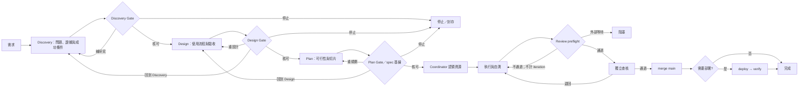

# AI 協作工作流與職責歸屬準則 (AI Collaboration Workflow) — CANONICAL

> 本檔是跨專案 AI 協作的**短版權威規則**：定義不可違反的不變量與專案必須實作的契約。操作命令、事故脈絡與供應商細節一律不放這裡；它們住在 [`templates/`](templates/) 與各專案 Runbook。程式碼與文件衝突時，以程式碼為準並修正文件。

> **基線 v2（WF-22 Wave 2，2026-08-05 成文）**：本版把 2026-08-04 工作流總檢討的十三項決議與其後的實戰裁決寫入正文——治理與單一寫入通道（§1.1、§2.10、§4.3）、卡範圍與鏈式停損（§2.11、§2.12、§3.2、§3.3）、規劃閘門三級制（§3.1）、資源互斥與 worktree 註冊制（§4.4、§4.5）、查核第一判準與跨家族查核範式（§5.1、§5.2）、派工包標準條款與證據紀律（§6.1、§6.2）、多專案適用（§7.1）。決議原文（唯一基線）：cpbl-analytics `docs/research/WORKFLOW-REVIEW-2026-08-04.md`（merge `a8f6f4c`）。**§6.1 第 4 條的新聞／第三方佐證四約束（定性 only、數值以官方紀錄為權威、引用附 URL ＋日期、適用所有第三方來源）不在該決議文件內**，源頭為需求方 2026-08-05 於 `ruan6047/ai-workflow#7` 查核留言的追認裁決；實戰依據＝連段語意翻案（cpbl #90 二次裁定、#89 更正）。決議中屬一次性專案決定者——產品化時序、在途流程卡逐張處置、60 天回顧指標——留在 WF-22 Initiative 卡，**不入本檔通則**。

## 0. 分類與狀態

先判斷「有 code 進 main 嗎？」與「錯了是否難復原？」；混合卡以最高風險類型處理。

| 類型 | 例 | 分支／審核／落地 |
|---|---|---|
| A 程式碼 | 功能、bug、重構 | T2 以上才可改 versioned source／設定；分支 + 獨立審核，只有已審 main 可部署 |
| B1 記錄文件 | log、TASKS、會議紀錄 | 直接 commit；免審，不部署 |
| B2 權威文件 | spec、規則、API、checklist | 小改可直接 commit；需獨立事實查核／校讀，不部署；canonical 規則本體與指定 T4 文件除外 |
| C 資料／維運 | 同步、refresh、爬蟲 | 無碼不開分支；資料 QA，生產操作先備份後驗證 |

交付狀態為 `💡需求 → 🔬研究中 → 🧭規劃中 → 📥Backlog → 🔨執行中 → 🔍待查核 → ✅通過 → 📦已合併 → 🏁完成`，或 `↩退回`、`⏸阻塞`、`🚨已升級`、`🛑已停止`。**廢止的歷史值**（向後相容，已寫的卡留著，新寫入不得用）：`🚧進行中`、`⏳待執行`。不可覆寫 event log 是狀態歷史，Ledger 是由 event log 產生的 current-state projection；兩者不得各自人工改寫（狀態面實作與唯一寫入通道見 §4.3）。`🛑已停止` 必填決策與原因後封存。部署狀態獨立：`—不適用`，或 `⏸未部署 → 🚀待部署 → ⏳部署中 → ✅已部署 → 🧪驗證中 → ✅已驗證`；失敗／回滾不得結案。release 事件必以**終態**交付狀態落地：免部署卡 release 即 `🏁完成`，需部署卡在部署 `✅已驗證` 前不得 release；結案清單（終態事件、封存、Ledger、資源清理、對帳）見 [`worktree-lifecycle.md`](templates/worktree-lifecycle.md)。

變更級別 [change tier] 決定流程強度，不得只按估時或檔案數降級；取風險、影響範圍與可逆性的最高者。任一碰到 public contract、權限／安全、金流、資料寫入／migration、production 或紅線，即至少 T3，紅線一律 T4。適用順序為：紅線／法規與安全限制 → 類型的最低閘門 → tier；B2 的獨立事實查核不得被 T1 省略。

| 級別 | 適用條件 | 最低閘門 |
|---|---|---|
| T0 記錄 | B1 log、非權威格式、無語意影響文字 | 直接 commit；格式／連結檢查 |
| T1 編修 | 已知 typo、非執行期文案或細節調整；不得改 versioned source、設定、生成物或 API／規格文字 | 聚焦自查；可直接 commit，必要時抽查 |
| T2 局部修正 | 根因已知、可逆、局部的程式／設定變更 | 分支、聚焦回歸測試、獨立輕量查核 |
| T3 標準交付 | 一般功能、跨檔或需求不確定的修正 | spec／卡、分支、自測、獨立查核、merge gate |
| T4 紅線 | §5 列舉風險 | T3 + 跨家族或人工審核、實測與必要 sign-off |

### 0.1 兩軸狀態模型（WF-STAGE-STATE-TWO-AXIS1，2026-08-24 定案）

⚠️ **本節定義目標狀態，尚未切換。** 上方 §0 的單欄序列仍是現行實作；切換屬子卡射程，
且**消費端相容層必須先於欄位切換落地**——`cpbl` 有六個檔綁該語彙，而 `roadmap_lines.gate_of`
對未知狀態 fail closed，其 docstring 逐字「狀態詞彙表變更時應該要有人知道」。

#### 為什麼要兩軸

單欄把「階段」與「狀態」擠在一起：`🔬研究中` 是階段、`↩退回` 是狀態、`📥Backlog` 兩者都不是。
後果可量：**退回時階段資訊當場消失**。`cpbl#166` 被退回時欄位只剩「退回」，退到哪要靠 owner
名字猜；而退回不一定只退一階——`cpbl#162` 的查核者逐字裁定「退回需求方裁決」，跨三階。
兩軸下 `需求／退回` 與 `需求／待辦` 是兩件不同的事，單欄表達不出來。

#### 階段（7，可選）

`需求 → 研究 → 規劃 → 執行 → 審核 → 部署 → 維護`

**階段可選**，開卡時宣告，比照現行部署宣告動詞的「—不適用」機制。⛔ 純文件卡不進部署；
排程、爬蟲、告警這類靠外部觸發的交付物**必須**宣告維護階段。

⛔ **「合併」與「收尾」不是階段。** 判準：**階段是有人在那裡做判斷的地方**，而兩者是 CLI 的
機械步驟。⚠️ 該判準係本卡提出、非既有 canonical 條文。
⭐ **但機械步驟留下的位置必須有狀態可表達**——見下方「已合併」。

#### 狀態

**通用（8）**：`待辦 · 進行中 · 待確認 · 已合併 · 完成 · 退回 · 阻塞 · 升級`
**卡層終態（1）**：`停止`
**部署專屬（+1）**：`已部署待驗證`——部署與驗證之間隔著真實時間，消費端實務是「須等 revalidate 到期重測 mtime 更新」。
**維護專屬（3）**：`運行中 · 失效 · 停止`——⭐ **維護不會「完成」**。`cpbl#115` 逐字記載某週排程「交付後從未掛上」，⇒ 交付後靜默死掉需要一個狀態承接。

⛔ **「轉移」不是狀態**（需求方 2026-08-24 裁定移除）：轉移完成後卡不會停在「轉移中」，
它會停在新持有者的「待辦」或「進行中」；且它與 `handoff` 這個動詞是同一件事。

⭐ **「已合併」對應收尾未走完的位置。** 依據：現行 §0 序列已含 `📦已合併` 且逐字載明它
「仍算現役、仍佔資源交集檢查」；`templates/worktree-lifecycle.md` 第 5 條逐字記載
「實務曾三次停在 `📦已合併` 留下假活卡」；上述快照顯示**四張卡正停在該值**，最久 **20 天**
（`INGEST-GAME-TM-REFACTOR1`；其餘 `DATA-TIE-REMEDY1` 18 天、`UX-GAME-PA1` 與
`UX-HOME-LIVE-STRIP1` 各 9 天，年齡以該快照的 generated_at 為基準）。
⇒ 它不是瞬間通過的點，是真實位置。

    階段 = 執行   狀態 = 完成      ← 碼寫完、查核通過
    階段 = 執行   狀態 = 已合併    ← 進了 main，收尾未走完
    階段 = 部署   狀態 = 待辦

#### 結案

⛔ **結案不是任何角色可直接設定的值**，是 **CLI 清理成功後自身寫下的結果**。
⇒ 在這個定義下，「終態先於清理」寫不出來。

⚠️ **這是本模型的要求，不是今日 wfcli 的既成事實**。今日的執行者與其邊界：
`cleanup.classify_state`（`cli/src/wf_cli/cleanup.py`）只在**事後偵測**
`illegal_terminal_before_cleanup` 並拒絕代修；而 `handoff --status`
（`cli/src/wf_cli/commands/handoff_cmd.py` 的 `if args.status:` 分支）**不驗值、也不驗
部署狀態**，它取用的分支排在讀 `部署狀態` 的 `elif ... == "release"` 閘門**之前**
⇒ 今天任何呼叫者都寫得出終態。⚠️ **此處刻意以符號而非行號指認**——原文寫的 `:511`／`:513`
今日已分別指到 `:532`／`:535`，⛔ 而宣稱本身仍成立 ⇒ 腐爛的是引用形態不是判斷。
⭐ 邊界外會發生什麼：`cpbl#166`（2026-08-22）。⛔ 收掉這個逃生門屬子卡，本卡只定義。

⭐ 本模型**落地後**修掉 2026-08-22 `cpbl#166` 的形狀：`illegal_terminal_before_cleanup` 的本質是
**收尾未完成卻已寫終態**，在本模型下它顯示為 `執行／已合併` 而非終態——**看板上就看得見**，
不需要人去讀 stderr。

**結案的觸發是「最後一個適用階段進入完成」**，而非固定在某個階段：純文件卡止於審核、
會上生產的卡止於部署、⭐ **而宣告了維護階段的卡永遠不結案**——它只有運行中、失效或停止。

#### ⛔ 非射程（WF-STAGE-STATE-TWO-AXIS1）

本卡**只交付條文**。以下七項**刻意不做**，⛔ 不是遺漏：

1. ⭐ **不處理「需求方被當訊息匯流排」**——那是本卡核心痛點原本的第一段，已降為非目標。
   成因是跨家族查核者沒有 wfcli 寫入通道，⇒ 裁決與派審詞一律靠人工轉貼。該段由四張卡
   具名承接，⚠️ **而指名承接不等於已排程**——四張的實測狀態各不相同：

   下表的交付狀態與最後交接日期取自上述版控快照（⛔ 非臨時查詢）；`ROADMAP` 欄取自
   `docs/ROADMAP.md` 該版本的文字。

   | 承接卡 | 快照交付狀態 | 快照最後交接 | ROADMAP 文字 |
   |---|---|---|---|
   | `aiwf#66` | 📥Backlog（待指派） | 2026-08-12 | 列於 §3 的**必要**清單 |
   | `aiwf#38` | 📥Backlog（待指派） | 2026-08-13 | 2026-08-12 裁定降級；逐字「很可能被 #66 取代」 |
   | `aiwf#86` | 📥Backlog（待指派） | 2026-08-13 | ⛔ 0 命中 |
   | `aiwf#115` | 📥Backlog（待指派） | 2026-08-20 | ⛔ 0 命中 |

   ⭐ **四張在看板上都是 `📥Backlog`、owner 皆為待指派——實際排程數為零。**
   ⚠️ 而 `aiwf#66` 同時被 `ROADMAP` §3 列為「必要」⇒ **文字與看板不一致**，本節逐字保留
   該不一致而非擇一敘述；⛔ 消解它屬 `ROADMAP` 維護，不在本卡射程。

   ⇒ ⛔ 寫下承接卡號**不構成**「這件事有著落」的證據，⛔ 被文件列為「必要」也不構成——
   要判斷它有沒有著落，唯一的方法是去查那張卡在看板上此刻的交付狀態與 owner。

2. **不實作** wfcli 寫入端、Project 欄位切換、cpbl 讀取端。
3. **不回填既有卡的簡介**（上述快照為 188 張）——回填本身要另開卡，且 ⛔ 未驗證簡介對 AI 判斷相關性的實效。
4. **不做「結案時強制指名承接者」**（Discovery 假設 A，已否決）。
5. **不做 root_cause_id 的自動清單產生**（Discovery 假設 C，已否決：322 occurrence 對
   315 個相異名，⇒ 自動歸併會產出幾乎等於原始清單的東西）。
6. **不把「這張卡值不值得做」交給跨家族查核者**——理由見 §6.4 第 2 個來源。
7. **不處理 aiwf#122**（「允許的狀態轉移」下放後兩專案皆未填），也**不處理 Backlog
   成為墓地**——兩者與狀態模型**正交**：Backlog 塞住是排程問題，換一組狀態值不會讓它動。

#### 本卡條文的執行者狀態（機械窮舉，WF-STAGE-STATE-TWO-AXIS1）

本卡只交付條文，⛔ **不實作 wfcli／Project 欄位／消費端**。故本卡新增的**每一句強制語氣**
在今天都**沒有機械執行者**，全部是**約定**（沿用 `WF-24-EVIDENCE-STRENGTH1` 的 (e) 形態）。
下表窮舉本卡新增的每一句強制語氣。⭐ **查核者可複現**（基線釘死為字面 SHA
`cd88270f`，⛔ 不用動態 merge-base——合併後它會變成空集合）：

```
git diff cd88270f 337f4c1 -- AI_WORKFLOW.md | grep '^+' | grep -v '^+++' | sed 's/^+//' \
 | awk '/^#### 本卡條文的執行者狀態/{skip=1} /^#### 終態卡的封存/{skip=0} !skip' \
 | grep -E '擋下|拒絕|不可能|寫不出來|不得|必須|一律'
```

⚠️ 實得 **14 行對應 12 句**（表列 12 行）。⭐ **遠端必須釘死為 `337f4c1`**（本卡交付）——
原文省略遠端故隱含 `HEAD`，於是 `bc5bcbb` 在本節**之外**新增的三行強制語氣（改寫 §6.3）
把實得值由 14 推成 16，而本段仍寫 14。⇒ ⛔ 那不是筆誤，是**本表自己示範了它在描述的病**：
一句寫成可執行形狀的宣稱，只釘一端就會被無關的相鄰編輯推翻。承接者＝`WF-CANONICAL-SELF-STALENESS1`。
兩處差異須逐一對上：第 4、5 行**同屬第 4 句**
（該句因加註今日逃生門而跨兩行）；第 6 行是**描述句不是強制語氣**——「裁決與派審詞一律靠
人工轉貼」陳述現況，被關鍵字 `一律` 誤命中。⭐ 這個誤命中本身即證據：**關鍵字集是 PM 挑的**
（已登記於交付附件的單方面決定清冊第七項），換一組會得到不同的行數 ⇒ 本表的權威來自逐列
對照，⛔ 不是來自那個數字。
awk 段是排除本節自身，否則本表的說明文字會被自己算進去。


| # | 條文位置 | 今日執行者 | 邊界外會發生什麼 |
|---|---|---|---|
| 1 | §0.1 消費端相容層須先於欄位切換落地 | ⛔ 無。`cpbl` 六個檔綁舊語彙 | 切換即 `roadmap_lines.gate_of` 對不上，兩專案看板同時失真 |
| 2 | §0.1 外部觸發交付物須宣告維護階段 | ⛔ 無。承接者＝子卡的 `open` 驗證 | 排程掛掉沒有狀態可表達，重演「交付後沒人看」 |
| 3 | §0.1 機械步驟留下的位置須有狀態可表達 | ⛔ 無，本身是設計判準 | 回到單欄位，`cpbl#166` 形狀在看板上仍不可見 |
| 3b | §0.1 不得以「終態佔比高」證成封存 | ⛔ 無。承接者＝查核者人工審 | 用一個只反映專案年齡的比例證成工作，如本卡 R4 前的三輪 |
| 4 | §0.1 結案不可由角色直接設定 | ⚠️ 僅事後偵測：`cleanup.classify_state`。逃生門 `handoff_cmd.py` 的 `if args.status:` 分支敞開 | 見該節逐字說明 |
| 5 | §6.3 parser 須沿用 `resources.py` 哨兵、不得自寫 markdown 解析 | ✅ **有**：`brief.py` 的 `_reuse_probe()` 於模組載入時檢查（`WF-CARD-BRIEF-AND-TWO-AXIS-WRITE1`） | 自寫解析會與資源宣告的哨兵漂移，兩居所偵測失效 |
| 5b | §6.4 不得據 5 族樣本宣稱「其餘各屬一階段」 | ⛔ 無。承接者＝查核者人工審 | 6 個零命中族被硬派階段，該印時不印 |
| 5c | §6.3 每張卡必有簡介 | ⚠️ **通道有、守衛無**：`open --brief`／`amend --brief` 已落地（`WF-CARD-BRIEF-AND-TWO-AXIS-WRITE1`），但 `--brief` 可選且 `validation.py` 不驗。承接者＝`WF-CARD-BRIEF-BACKFILL1`（回填） | 一張沒有簡介的卡，`open` 得出來、`amend`／`handoff` 一路走到終態都不會被擋——⭐ 這是**結構性的**（`--brief` 可選、`brief.try_parse_block` 對解析失敗回 `None` 走 fail-open、`validation.py` 對簡介零命中），⛔ 不是「今天有幾張卡沒寫」。⚠️ **本格刻意不記數字**——⭐ 數字量的是**回填活動**，本欄問的是**邊界外會發生什麼**，兩者正交：回填把每張卡都補齊，`--brief` 仍然是可選的。且它每天在變（`bc5bcbb` 寫下的 198/8 在兩小時內即成 201/11；`54d23e87` 於 2026-08-28T12:59+08:00 以下述量法實測已是 206/208）。本格何時再變假：`--brief` 由可選改為必填，或 `validation.py` 出現以 `brief.parse_block` 為判準的檢查。要現值的量法：以 `wf_cli.brief.parse_block` 對 `list_items` 逐張試解析 |
| 5d | §6.4.1 驗收條件須於離開規劃前填實 | ⛔ 無。承接者＝查核者人工審 | 重演 aiwf#129 R1-002：帶佔位符送審 |
| 6 | §6.4.2 未驗清單每項須標明驗不了的原因 | ⛔ 無。承接者＝查核者人工審 | 重演 `aiwf#129` R2：寫下「未驗」而其實兩分鐘可驗 |
| 7 | §6.4.2 標不出原因者不得列入 | ⛔ 無，同上 | 同上 |
| 8 | §6.4.2 兩種「未驗」須分開 | ⛔ 無，同上 | 「驗不了」與「沒去驗」混為一談，揭露變成免責聲明 |

⛔ **不得宣稱本卡任何一條已機械化。** 機械化屬子卡；子卡落地時應回頭更新本表。

#### 終態卡的封存

終態卡以 `archiveProjectV2Item` 移出活卡視圖。⛔ **維護卡不封存**——那會重演
「交付後沒人看」。

**本節引用的所有看板數字，來源是版控過的快照 artifact，⛔ 不是臨時查詢。** 依據：
`origin/snapshots` 分支 commit `4cc3070` 的 `snapshots/2026-08-24/snapshot.json`
（`generated_at` 為 `2026-08-24T10:43:38+08:00`、sha256 前綴 `42392ff4`、188 張卡）。
⭐ **時戳本身不是證據**——它只說明宣稱指向哪一刻，不證明那一刻的事實；⛔ 自行查詢後
附上時戳仍然是自陳（跨家族查核 R4-001 逐字：「不可把時戳本身當成證據」）。

由該快照導出的分桶：

| 桶 | 張數 |
|---|---|
| 終態（完成或已停止） | 126 |
| 從未開工 | 29 |
| 需求方裁定降級 | 23 |
| 已合併未收尾 | 4 |
| 阻塞 | 3 |
| ⭐ **真正在動** | **3** |

⚠️ **封存不是主要的修法，本節不假裝它是。** 同一份快照顯示：封存 126 張只把 188 降到 62，
而需要被看見的是 **3 張** ⇒ 那是**檢視與過濾**的問題，封存只解決其中一小部分。

⛔ **更不得以「終態佔比高」證成封存。** 跨六天的快照（`snapshots/2026-08-19` 至
`2026-08-24`）顯示該比例自 56% 單調升到 67%，而「真正在動」始終是 0 至 5 張
⇒ **該比例衡量的是專案活了多久，不是任何缺陷**；它會一路趨近 100%，而那代表做完的事變多。

### 0.2 允許的狀態轉移（canonical 本體；採用專案**引用不複製**）

> **本節 2026-08-26 由 `templates/control-plane-contract.md` §2.1 原樣搬入**
> （`WF-TRANSITION-TABLE-UNWRITTEN1`，`ruan6047/ai-workflow#122`，跨家族查核 R1-001）。
> (a) **落在 §0 底下是刻意的**，⛔ 不在 §4.1（Control-plane Contract）、⛔ 也不在 §7（專案採用）。
> (b) 為什麼：本節管的是**交付狀態這個軸的值域與其轉移**——值域與序列由 §0 定義、兩軸模型
> 由 §0.1 定義，而下方表七的 D1 更是直接**裁定 §0 那條序列只是敘述、不是約束**；裁定與被裁
> 定的條文分居兩節，那條序列就會繼續被讀成約束。⛔ 不放 §4.1／§7 的理由是那兩節是**委派面**
> ——把規則本體擺進委派面，正是下方第 3 點指出的那個矛盾形狀。
> (c) ⛔ **不得由「它從範本搬來」推出「範本仍是它的居所之一」**：範本側現在只有連結與差異
> 宣告，⛔ 沒有本體；⛔ 也不得推出「採用專案的 `CONTROL_PLANE_CONTRACT.md` 該複製一份」
> ——那正是本節裁定要治的病。
>
> ⚠️ **下方全文是裁定當時的原文，本次搬遷⛔ 不改寫**（改寫就失去逐位元可證性）。本次只動三
> 處：節次改號、窮舉性片段的取材檔改指本檔、一個搬家後會指錯的「本檔」改成具名檔。三處讀法
> 先寫明：其一，下方的「canonical §X」指的就是**本檔**；其二，下方的 `<專案實作>` 指範本 §2
> 在本卡之前的**空白佔位符**，本卡已把它換成「不得留空、須指名執行者」的差異宣告；其三，下方
> 第 3 點所述「佔位符與 §7 委派表互相矛盾」**已由本卡消解**，而消解方式是**移除佔位符**，
> ⛔ 不是改 §7 的委派表——§7 那一欄是「專案自行決定」，而差異宣告是**揭露不是決定**，補進去
> 反而會被讀成「專案可以自訂轉移」。

> **歸屬裁定**（`WF-TRANSITION-TABLE-UNWRITTEN1`，`ruan6047/ai-workflow#122`，2026-08-26）：
> 本表**上收 canonical**——⛔ 不留在 `<專案實作>`，⛔ 也不採「canonical 定通則＋專案宣告
> 差異」的兩層制。理由見下方四點；代價見「代價，不掩飾」。
>
> ⚠️ **採用專案建立自己的 `CONTROL_PLANE_CONTRACT.md` 時，本節請以連結引用，⛔ 不複製全文**
> ——形狀比照 canonical §7「專案只保留指向本檔的 stub，不複製全文」。複製即產生第二份會漂移
> 的權威，那正是本節要治的病。

> ⚠️ **本節刻意不把 mention-only、not-established、deploy-state 這類字串放進獨立反引號**
> （⭐ 上一句自己也沒放，理由同下——本註解的初稿放了，於是它一寫下去就把 `--check` 弄紅）。
> (a) 刻意如此，⛔ 不是排版失誤。
> (b) 為什麼：`scripts/contract_tool_reconcile.py` 的 `_KEBAB_IN_BACKTICKS` 以**詞法**導出契約
> 的事件型別 universe——判準是「整段反引號恰好是一個 kebab token」。散文裡順手加一對反引號，
> 那個字串就會被判成「契約宣告了一個事件型別」而長出一個假缺口，使 `--check` 轉紅（本節初稿
> 實際觸發過五個，缺口數由 59 變成 64）。形狀同源於 `cli/src/wf_cli/pitfalls.py` 那段
> 「刻意不列舉交付狀態的字面值」的既有註解。
> (c) ⛔ **不得由此推出**「本節提到的每個帶連字號的詞都不是事件型別」——`preflight-failed`、
> `escalation-resolution`、`handoff-accepted` 三個**是**，故仍以反引號書寫；⛔ 也不得推出
> 「對帳器的過度抽取是缺陷」，那是它明文選擇的取捨（見 `docs/CONTRACT_TOOL_RECONCILE.md` §2）。

#### 為什麼不下放（直接回應「一個看板服務兩個 repo」）

1. **看板是一個、repo 是兩個，這是量得出來的。** 2026-08-26 的版控快照（`origin/snapshots`
   `413bd4d`，`snapshots/2026-08-26/snapshot.json`，`generated_at` 為 `2026-08-26T10:40:12+08:00`）
   共 **202 張卡**，依 `issue_url` 分屬 `ruan6047/cpbl-analytics` **117**、`ruan6047/ai-workflow`
   **84**，另 **1** 張 DraftIssue 無 Issue URL。⇒ 一張共用看板不可能有兩份互相獨立的「允許的
   狀態轉移」表，而 `<專案實作>` 佔位符預設它可以。

2. **唯一寫入通道也只有一份，而且它住在 canonical repo。** canonical §4.3 明訂狀態寫入的
   唯一通道＝祕書 CLI（`ruan6047/ai-workflow` 的 `cli/` 之 `wfcli`），§7.1 明訂「規則與祕書 CLI 住本
   repo（跨專案共用資產）」。轉移能不能發生，今天是由 `wfcli` 的分支決定的 ⇒ **執行者已經
   在 canonical repo 裡**。把規則寫在專案側會造成「條文在 A、執行者在 B」，而那正是
   `handoff_cmd.py` 逐字治過的病：「**先有條文才有這段碼**——讓工具執行 canonical 沒說的規則，
   正是 `WF-BACKLOG-STAGE1` 要治的病，重演一次即是回歸」。

3. **canonical §7 的委派表本來就沒有列狀態轉移。** `AI_WORKFLOW.md` §7 給
   `CONTROL_PLANE_CONTRACT.md` 的專案自決範圍逐字是「狀態面目標（repo／Project）、**哪些 CLI
   入口屬破壞性須驗 lease**、**當前仍有副作用的 CLI 入口清單**、資源宣告詞彙」——⛔ 四項裡
   沒有狀態轉移。⇒ `templates/control-plane-contract.md` 原 §2 的佔位符與 §7 的委派表
   **互相矛盾**，而矛盾的一方是佔位符。

4. **下放已經實測失敗，而失敗的機制已經被寫下來了。** canonical §6.4 逐字：「該前例是警告：
   同檔的『允許的狀態轉移』下放後**兩個專案都從未填過**（`aiwf#122` 為此而開且至今 OPEN）……
   ⇒ **下放不落空的條件是『可自動產生』，不是『有佔位符』**」。狀態轉移表**產不出來**（它要人
   憑空寫）⇒ 條件不成立。實查佐證：`cpbl-analytics/docs/CONTROL_PLANE_CONTRACT.md`（220 行，
   @ `3b470d70`）對 `轉移`／`⏸阻塞`／`📥Backlog`／`規劃中` 四個關鍵詞命中**全部是 0**；
   `ruan6047/ai-workflow` **根本沒有**這個檔。

#### 代價，不掩飾

上收讓兩個專案失去「宣告自己不同」的**預設**位置。處置是上方的差異宣告：⛔ 不是取消該位置，
是把它從**空白佔位符**改成**必須非空、且必須指名執行者**的差異宣告。

⭐ **本表不關任何一個口。** 它產出的是一張說得出合法性的表；把口關上屬各 `WF-CLI-*` 動詞卡，
本表是它們的**輸入**（需求方 2026-08-22 裁定 1 已明示並接受此代價）。

#### 兩軸不可合讀 ⭐

2026-08-26 起 `handoff` 的 Log 行開始記**階段**（`handoff_cmd.py` 的 `PHASE_LOG_LABEL`；行形狀
為 `…；階段 <離開側>；踩坑回應 N 族（…）；證據 …`）。⛔ **那不是交付狀態，兩者是不同的軸。**

| | 軸一：**階段** | 軸二：**交付狀態** | 軸三：**部署狀態** |
|---|---|---|---|
| 值域 | 7（canonical §0.1） | 15（`project.FIELD_SPECS`） | 7 |
| 寫入者 | `open`（恆「需求」）、`handoff`（`STAGE_PHASE` 六鍵；⛔ `backlog` 刻意不在表內） | `open`／`assign`／`handoff`／`review` **四個呼叫點**（`set_field_value` 全域窮舉） | `wfcli deploy-declare`／`wfcli deploy-state` |
| Log 行記不記 | ✅ 記，且記的是**離開側** | ⛔ **不記** | ✅ 記（Issue timeline 逐字 `transition: A → B`） |
| 事後可否由留痕反推 | 可反推**離開側**階段 | ⛔ **反推不出** | ✅ 可 |
| 轉移是否受檢查 | ⛔ 無（階段欄跟著 `--next-stage` 走，不驗前身） | 逐列見表一（多數為 ⛔ 無） | ✅ **只准相鄰前進**（`DEPLOYMENT_TRANSITIONS`；`deploy_state_cmd.py` 的 `expected != args.to` → `rc=4`） |

⇒ **「階段已可反推」⛔ 不蘊含「狀態轉移已可重建」。** 兩者記的東西不同、方向相反：Log 記的是
**離開側**階段，而本次寫入的是**進入側**狀態，兩者不互推（`handoff_cmd.py` 的 `PHASE_LOG_LABEL`
上方註解逐字給了兩個理由）。因此 `doctor.UNDECIDABLE_HANDOFF`（值 `handoff_status_not_in_log`）
在 `aiwf#148` 之後**判定未變**。

⭐ **三軸裡只有軸三「有一張表、而且那張表真的被執行」**，形狀值得照抄：轉移表是碼裡的一個
`dict`，而閘門逐字比對 `DEPLOYMENT_TRANSITIONS.get(current) != args.to` 即拒絕。軸二今天沒有
這樣的 `dict`——⛔ 本表**不是**那個 `dict`，它是條文；把它變成碼屬 `WF-CLI-*` 動詞卡。

**2026-08-26 現場量測**（唯讀；走 `wfcli` 自己的讀取路徑 `project.list_items` ＋
`doctor.audit_state_face_drift_batch`，常數由 `import` 取得而非手打，⛔ 未呼叫任何寫入動詞）：

| 量 | 值 |
|---|---:|
| 有卡 ID 的 item | 204 |
| `undecidable`／`drift`／`consistent` | 185／13／6 |
| 其中 `handoff_status_not_in_log` | **172** |
| Project `階段` 欄有值 | 17（空值 187） |
| 卡面 Log 含 `；階段 ` 字面 | **3** |

⚠️ **最後兩列是那個「新事實」的實際覆蓋率。** `；階段` 2026-08-26 才上線 ⇒ 任何以它為輸入的
檢查在**既有卡上回放幾乎全滅**，只能對新卡生效，且須先釘一個界線（形狀比照
`pitfalls.PITFALL_GATE_EPOCH` 與 `doctor.STATE_FACE_DRIFT_EPOCH`）。
⛔ **不得由「Log 已記階段」推出「現在就可以據它做檢查」。**

#### 表一：交付狀態的允許轉移

**讀法**：`唯一合法動詞` 欄寫 ⛔ 無動詞者，表示今天只有自由文字逃生門寫得進去（第 17 列）。
⭐ **`機械執行者` 欄的每一格都指得出是哪一段程式在檢查，或明說沒有**——這是本表的紅線（`docs/ROADMAP.md`
§1：沒有執行者的偵測器不算達成目標 1）。⛔ 沒有「大概有檢查」這種值。

> ⚠️ **「機械執行者」欄刻意以「檔名＋符號或運算式」指認，⛔ 不寫行號。**
> (a) 刻意如此。
> (b) 為什麼：canonical `AI_WORKFLOW.md` §0.1 已經吃過這個虧並逐字記下來——「原文寫的
> `:511`／`:513` 今日已分別指到 `:532`／`:535`，⛔ 而宣稱本身仍成立 ⇒ **腐爛的是引用形態不是
> 判斷**」。本表的壽命以年計，行號的壽命以次計。
> (c) ⛔ **不得由此推出「這一欄不可複驗」**：每一格寫的都是可以 `grep` 到唯一命中的字面
> （符號名或該行的實際運算式），複驗方式是拿它去搜、看它落在哪個分支上；⛔ 也不得推出
> 「指不出行號＝沒有執行者」——那一欄裡沒有執行者的格子一律逐字寫「⛔ **無**」。

| # | 從 → 到 | 唯一合法動詞 | 前提檢查 | 機械執行者（指到符號） | 誠實邊界 |
|---:|---|---|---|---|---|
| 1 | （無）→ `💡需求` | `wfcli open` | ⛔ 無（新卡無前身） | ⚠️ 有的是**單一寫入路徑**不是前提檢查：值來自 `card.py` 的 dataclass 預設 `delivery_status: str = "💡需求"`，`open` 無 `--status` 旋鈕（`open_cmd.py` 的 `values["交付狀態"] = card.delivery_status`） | 「寫不出別的值」**只對 `open` 這個入口成立**；卡開完的下一秒 `assign --status`／`handoff --status` 就能改成任何 Project 既有選項 |
| 1b | 任意 → `💡需求`（**退回需求方裁決**） | `handoff --next-stage requirement` | ⛔ 無 | ⛔ **無**：與第 2、3、6、7 列同一個 `else: new_status = STAGE_STATUS[args.next_stage]`，**不讀現值** | ⭐ 這條真的被走過——本卡自己 2026-08-22 即以此被退回（Log 逐字「退回 💡需求」）。⚠️ 它可以**跨階退回**（canonical §0.1 舉的 `cpbl#162` 逐字「退回需求方裁決」跨三階），⛔ 而留痕不記進入側狀態 ⇒ 事後看不出退到哪一格 |
| 2 | 任意 → `🔬研究中` | `handoff --next-stage research` | ⛔ 無 | ⛔ **無**：`handoff_cmd.run` 末尾的 `else: new_status = STAGE_STATUS[args.next_stage]`，**不讀現值** | 需求方 2026-08-22「高複雜或影響較大的卡必跑 `🔬研究中`」在此**無執行者**，見表六第 1 列 |
| 3 | 任意 → `🧭規劃中` | `handoff --next-stage planning` | ⛔ 無 | ⛔ **無**：同上 `else` 分支 | canonical §3 的三個 Gate（Discovery／Design／Plan）今天**都沒有動詞** ⇒ 轉進這一格⛔ 不蘊含任何 Gate 事實 |
| 4 | `🧭規劃中` → `📥Backlog`（**T2／T3／T4，及級別讀不到／為空／語彙外者**） | `handoff --next-stage backlog` | ✅ 當下交付狀態必須逐字為 `🧭規劃中`（`BACKLOG_REQUIRED_PRIOR_STATUS`） | ✅ **有**：`handoff_cmd.py` 的 `if current_status != BACKLOG_REQUIRED_PRIOR_STATUS:` → `return 4` | ⛔ 只證明**狀態面說**它來自規劃，不證明規劃做過（`🧭規劃中` 本身也寫得進 `--status`）；且它**管不住級別本身**——`amend --tier` 改成 T1 就掉到第 5 列 |
| 5 | 任意 → `📥Backlog`（**T0／T1**） | 同上 | ⛔ **無，而且是刻意的** | ⛔ **無**：`handoff_cmd.py` 的 `if tier in BACKLOG_GATE_EXEMPT_TIERS:` 直通分支，只往 stderr 印一行「**本次未做任何前身狀態檢查**」 | (a) 刻意如此 (b) canonical §3.1 的表**沒有 T0／T1 的列**，沒有條文就沒有可執行的前提，硬編一個等於工具自己立法 (c) ⛔ 不得由「這個動詞成功了」推出這張 T0／T1 卡走過規劃 |
| 6 | 任意 → `🔨執行中` | `assign`（`--status` 預設 `🔨執行中`）／`handoff --next-stage implementation` | ⛔ 無 | ⛔ **無**：`assign_cmd.py` 的 `set_field_value(..., fields["交付狀態"], args.status)` 無條件寫；`handoff` 走同一個 `else` 分支 | ⭐ **含終態**：`🏁完成`／`🛑已停止` 的卡也拉得回來，見第 16 列 |
| 7 | 任意 → `🔍待查核` | `handoff --next-stage review` | ⛔ 無 | ⛔ **無**：同 `else` 分支 | canonical §3 的 review preflight（不符時寫 `preflight-failed`、⛔ 不得派 reviewer）**無 writer**；該事件型別在 `docs/CONTRACT_TOOL_RECONCILE.md` 的登記表判 「mention-only」 |
| 8 | `🔍待查核` → `✅通過` | `wfcli review --review-result APPROVE` | ⚠️ **只警示不擋** | ⚠️ `review_cmd.py` 的 `if current_status != AWAITING_REVIEW_STATUS:` 只 `print(... file=sys.stderr)` 後**照寫**（該處註解逐字「不硬擋」）。⛔ 這一格**沒有**前身閘門 | 真正 fail-closed 的是**別的東西**：`attempt_id` 去重（`validation.check_attempt_not_duplicated`）與 checkpoint 閘門（表四）。⛔ 不得把它們讀成前身狀態檢查 |
| 9 | `🔍待查核` → `↩退回` | `wfcli review --review-result REQUEST_CHANGES` | 同上 | 同上；值由 `review.py` 的 `STATUS_BY_RESULT` 決定 | 同上 |
| 10 | `↩退回` → `🔨執行中`（iteration + 1） | `handoff --next-stage implementation` | ⛔ 無 | ⛔ **無前身檢查**；iteration 遞增在 `handoff_cmd.py` 的 `elif args.next_stage == "implementation": new_iteration = current_iteration + 1` 是**無條件**的，⛔ 不驗現值是否為 `↩退回` | ⇒ 從任何狀態下 `--next-stage implementation` 都會 +1。⛔ **不得由「iteration 高」推出「被退回過那麼多次」** |
| 11 | `✅通過` → `📦已合併` | ⛔ **無動詞** | — | ⛔ **無** | 只有 `assign --status`／`handoff --status` 寫得進去。canonical §4.4 明訂「現役的定義含 `📦已合併`」「停在 `📦已合併` 不收尾＝假活卡」，而**它是怎麼被寫進去的，工具帳上分不出來**（若是看板 UI 直接改欄位即違反 §4.3 紅線）——已登記於 `docs/CONTRACT_TOOL_RECONCILE.md` §4.1，待需求方裁定 |
| 12 | `📦已合併` → `🏁完成` | `handoff --next-stage release --cleanup --repo-path <路徑>` | ✅ 兩道，⚠️ **但都不是前身狀態檢查** | ✅ (a) 部署閘門：`handoff_cmd.py` 的 `if deployment_status not in (None, "—不適用", "✅已驗證"): ... return 4`；(b) 收尾守衛：終態由 `cleanup.execute_closeout_transition` 在清理**確實完成後**才呼叫 `write_release_terminal` ⇒「終態先於清理」在這條路徑上**寫不出來**（`_CallbackEffectWriter` 的 docstring 逐字：不是靠呼叫端自律） | ⛔ **不檢查前身是否為 `📦已合併`**——任何狀態都 release 得出去。另有兩分支契約：帶 `--repo-path` 卻不帶 `--cleanup` 一律 `rc=2`（`REPO_PATH_WITHOUT_CLEANUP_REFUSAL`）；不帶 `--repo-path` 則放行並把「收尾清理未執行」寫進 Log（`NO_REPO_PATH_TRACE_SUFFIX`） |
| 13 | 任意 → `⏸阻塞` | ⛔ **無動詞** | — | ⛔ **無** | 只有 `--status` 自由文字。canonical §5 末段要求「`⏸阻塞` 必填 owner、原因、等待對象與解除條件」——⛔ **那四個必填今天沒有任何地方可以驗**，因為沒有專責動詞。TTL 見表三 |
| 13b | 任意 → `🛑已停止`（撤卡／停止） | ⛔ **無動詞** | — | ⛔ **無** | 只有 `--status` 自由文字。canonical §0 逐字「`🛑已停止` **必填決策與原因後封存**」——⛔ 那兩個必填一樣沒有地方可以驗。⚠️ 它是 `TERMINAL_STATUSES` 的成員 ⇒ 一旦寫入，`assign` 的資源交集檢查會把這張卡**整張跳過**（`for other in items:` 迴圈裡的 `continue`），它宣告的資源即刻視為釋放 |
| 14 | 任意 → `🚨已升級` | ⛔ **無動詞** | — | ⛔ **無** | `checkpoint --decision escalate` **不改交付狀態**，只印一行提示要人手打 `handoff --status 🚨已升級`（`checkpoint_cmd.py` 逐字：「本指令不改交付狀態」）⇒ **「該不該升級」與「卡真的變成已升級」之間沒有機械連線** |
| 15 | `🚨已升級` → `🔨執行中`（解除） | ⛔ **無動詞** | — | ⛔ **無** | `escalation-resolution` 是 `templates/review-escalation.md` §4 已裁定的**獨立事件型別**，其 writer **未實作**（`validation.validate_checkpoint_input` 對 `escalation_resolution` 鍵 fail-closed 拒收並逐字說明）。⇒ 在它落地前，事件流上該區間**恆為升級中** |
| 16 | `🏁完成`／`🛑已停止` → `🔨執行中`（**終態被拉回**） | `assign` | ⛔ **無** | ⛔ **無**：`TERMINAL_STATUSES`（`assign_cmd.py`）只在資源交集迴圈 `for other in items:` 裡的 `if (other.delivery_status or "") in TERMINAL_STATUSES: continue` 被讀——那是在掃**別張卡**。**本卡自己的終態一個字都不讀** ⇒ `rc=0`、無警告 | Discovery 實驗 F（2026-08-22）。⛔ 本卡不修（非射程），承接者未指名，見表六第 3 列 |
| 17 | 任意 → 任意（**逃生門**） | `handoff --status <自由文字>`／`assign --status <自由文字>` | ⛔ 無 | ⛔ **無**：兩處 `--status` 皆**無 `choices`**；且 `handoff_cmd.run` 的 `if args.status:` 分支排在**所有**閘門之前 ⇒ 給了它，部署閘門與 Backlog 前身閘門**一條都不跑** | 唯一的實際約束來自平台：`project.set_field_value` 要求該值是 Project 上既有的 SINGLE_SELECT 選項 ⇒ 寫得進去的是那 15 個值，⛔ 不是任意字串。收斂 `--status` 成 `choices` 已登記於 `docs/CONTRACT_TOOL_RECONCILE.md` §4.1，⛔ 不在本表射程 |
| 18 | 任意 → `⏳待執行`／`🚧進行中`（**廢止值**） | `--status` 自由文字 | ⛔ 無 | ⛔ **無** | canonical §0 逐字「新寫入不得用」，而兩個值仍在 `project.FIELD_SPECS` 的選項列舉裡 ⇒ `--status` 寫得進去。⚠️ SINGLE_SELECT 的選項一經建立，`ensure_fields` 對已存在欄位「原樣保留」⇒ **移不掉**，只能靠條文 |

> (a) **第 18 列刻意保留在表內，而它描述的是一個被禁止的轉移。**
> (b) 為什麼：本表若只列「允許的」，讀者無從分辨「沒列到」與「列了但擋不住」。第 11、13、13b、
> 14、15、16、17、18 這八列全是**寫得出來但沒有執行者**的格子——它們不在表內，這張表就會
> 變成「看起來完備」的東西。
> (c) ⛔ **不得由「它在表內」推出「它是合法轉移」**：合法性看「唯一合法動詞」欄，執行力看
> 「機械執行者」欄，兩欄各自獨立。

> ⭐ **表一的窮舉性是跑出來的，⛔ 不是人工宣稱的。** 值域由 `import` 取得而非手打；
> 複驗（2026-08-26 實跑，結果為「未涵蓋 0 個狀態、0 個 next-stage」）：
>
> ```bash
> python3 - <<'EOF'
> import re, sys, pathlib
> sys.path.insert(0, "cli/src")
> from wf_cli.project import FIELD_SPECS
> doc = pathlib.Path("AI_WORKFLOW.md").read_text(encoding="utf-8")
> # 標題以行首錨定：本區塊自己也寫了「表一／表二」字樣，但它們前面有 `> `，
> # 故不是行首命中 ⇒ 自指不會把切片截斷。⭐ 自指命中是可見的，⛔ 不是被偷偷排除的。
> lo = re.search(r'(?m)^#### 表一：', doc).start()
> hi = re.search(r'(?m)^#### 表二：', doc).start()
> t = doc[lo:hi]
> print("未涵蓋的狀態:", [x for x in FIELD_SPECS["交付狀態"][1] if x not in t])
> print("未涵蓋的 next-stage:", [g for g in
>       ("requirement","research","planning","backlog","implementation","review","release")
>       if f"--next-stage {g}" not in t])
> EOF
> ```
>
> ⛔ **不得由「窮舉」推出「完備」**：本表窮舉的是**值域**（每個狀態至少出現在一列），
> ⛔ 不是**狀態對**（15×15 的組合）。後者絕大多數今天由第 17 列那一格逃生門統包，
> 逐對展開只會得到 200 多列同樣寫著「⛔ 無」的東西。

#### 表二：Gate／preflight 退回

| Gate／退回點 | canonical 出處 | 動詞／事件 | 機械執行者（指到符號） |
|---|---|---|---|
| Discovery Gate | §3、§3.1 | ⛔ 無 | ⛔ **無** |
| Design Gate | §3 | ⛔ 無 | ⛔ **無，而且連記錄的地方都沒有**：卡面 `Design` 區塊在 `docs/CONTRACT_TOOL_RECONCILE.md` 的卡面欄位表判 `absent`（open 渲染=否、amend 可改=否） |
| Plan Gate／spec 基線 | §3 | `wfcli contract-baseline` | ⚠️ **部分**：`checkpoint_cmd.run_contract_baseline` 的 `if history.baseline_count:` → `return 2`（one-shot cutover，`review-escalation.md` §5「該 marker 為 one-shot cutover」）。⛔ 它擋的是**重複 baseline**，不是「Plan 有沒有做」 |
| 規劃閘門三級制 T3 的「需求方批註放行」 | §3.1 | ⛔ 無 | ⛔ **無，且刻意不做**：`docs/ROADMAP.md` §1——本 repo 全部角色共用同一個 GitHub 帳號 `ruan6047`，該節逐字禁止「寫看起來在驗證身分、實際恆真的條文」 |
| 進 `📥Backlog` 的前身狀態 | §3.1 | `handoff --next-stage backlog` | ✅ **有**（T2 以上）：見表一第 4 列。⛔ T0／T1 無：見表一第 5 列 |
| review preflight | §3、`review-escalation.md` §3 第 1 款 | `preflight-failed` 事件 | ⛔ **無 writer，且今天結構上不可能有**：`validation.derive_preflight_basis` **恆回** `PREFLIGHT_NOT_ESTABLISHED`（該函式 docstring 逐字寫明本 repo 今天恆為 not-established），成因是沒有受管轄的 preflight pass event writer，且本 repo 唯一可能的通道訊號（留言 author）**無鑑別力**——全部角色共用同一帳號。恆虛性以 `preflight_basis_binding: structurally-unavailable` 加蓋進事件而非拒寫 |
| 踩坑族清冊「離開閘門」 | §6.4 | `handoff --pitfall-report` | ✅ **有**：`handoff_cmd.run` 的 `gate = _pitfall_gate(...)` → `if gate.rc != 0: return gate.rc`，且該行之前**零寫入**（由 `test_missing_report_makes_no_gh_write_call_at_all` 以唯讀呼叫白名單釘住）。⚠️ **三條分流有兩條是明文豁免**：時戳早於 `pitfalls.PITFALL_GATE_EPOCH`、離開階段判不出來。⭐ 後者是**真實的口**：把交付狀態改成沒有反函數的值（`📥Backlog`／`📦已合併`／`⏸阻塞`）就繞得過去 |
| 查核退回 → 執行 | §3 | `handoff --next-stage implementation` | ⚠️ **有副作用、無前提**：iteration 無條件 +1，⛔ 不驗現值是否為 `↩退回`（表一第 10 列） |

#### 表三：`⏸阻塞` 的 TTL

⛔ **今天不存在。** 三件事各自為真，逐條寫明，⛔ 不以任何一條單獨成立：

1. **canonical 沒有條文。** `AI_WORKFLOW.md` 對 TTL 只在 **lease** 上有話（§4.1「lease 可續約、
   可到期回收；回收前先檢查未提交變更」），而 §7 的委派表把 TTL 列在 **Runbook** 那一欄，
   ⛔ 不在 `CONTROL_PLANE_CONTRACT.md` 那一欄。⇒ 「`⏸阻塞` 的 TTL」這句要求指向一個**在
   canonical 沒有本體**的東西。
2. **欄位不存在。** `project.FIELD_SPECS` 沒有任何時限欄；`⏸阻塞` 又沒有專責動詞，⇒ canonical
   §5 末段的四個必填（owner／原因／等待對象／解除條件）**沒有地方可以要求、也沒有地方可以驗**。
3. **碼裡零命中。** `cli/src/` 對 `lease_expires_at`／`--ttl`／`expires_at` 三個字串
   **全部 0 命中**（2026-08-26 實跑 `grep -rn`，`rc=1`）。

⭐ **零命中 ≠ 沒有機制**——這種落空有四類歸因（名稱猜錯／機制在別的模組／機制在別的 repo／
真的沒有）。本項取第四類，**依據是第 1、2 點**（條文與欄位都不存在），⛔ **不是**靠 grep 落空
本身。

⇒ **裁定**：`⏸阻塞` 今天**沒有 TTL，也沒有等待上限的執行者**。⛔ 不得在此寫一個看起來有時限
的數字——那會正好是 `docs/ROADMAP.md` §1 禁止的那種條文。要有 TTL，前置是先有 `⏸阻塞` 的
**專責動詞**（已登記於 `docs/CONTRACT_TOOL_RECONCILE.md` §4.1）。

#### 表四：escalation checkpoint

| 項 | 內容 |
|---|---|
| 規則本體 | `templates/review-escalation.md` §3／§4／§5；canonical §5 末段 |
| 觸發條件 | 第三個及其後**每一個可計數 attempt** 出現時，先建立 checkpoint；⛔ 不得只按整數直接寫 `🚨已升級` |
| 動詞 | `wfcli checkpoint`（`commands/checkpoint_cmd.py`） |
| 機械執行者 | ✅ **有**：`validation.check_checkpoint_gate`，由 `review_cmd` 在**寫入任何遠端狀態之前**呼叫（與 `check_attempt_not_duplicated` 同一個 `try:` 區塊）。判準是**兩面一致**——留言的結構化區塊 ＋ Issue body `## Log` 的同行索引，只有其一視為未建立 |
| 欄位檢查 | ✅ **有**：`validation.validate_checkpoint_input`——`trigger_attempt_id` 須合 `<card>-e<epoch>-<40 hex sha>`、反解出的卡與 epoch 須相符、`unique_attempt_count >= 3`、`checkpoint_decision ∈ CHECKPOINT_DECISIONS`、`checkpoint_rationale` 非空且不含三連反引號（圍籬字元會破壞結構化區塊） |
| ⚠️ **誠實邊界（必讀）** | **這道閘門今天恆不觸發。** 鏈條逐段可查：`review_cmd` 只在 `preflight.established` 時算 `counts`，而 `validation.derive_preflight_basis` **恆回** `PREFLIGHT_NOT_ESTABLISHED` ⇒ `counts` 恆為 `None` ⇒ 事件寫的是 `escalation_account: not-asserted` ⇒ `fact.counts` 恆為假 ⇒ `validation.counted_attempts` 恆為空 ⇒ `check_checkpoint_gate` 在 `if len(counted) < 3: return` 恆早退。⭐ **這是「有執行者、但前提在本 repo 結構上無法成立」的一格，⛔ 不得計為「有檢查」** |
| checkpoint **不改**交付狀態 | `checkpoint_cmd` 明文，`decision=escalate` 之後仍要人手打 `handoff --status 🚨已升級` ⇒ 表一第 14 列 |

#### 表五：`🚨已升級` 的決策 owner

| 問 | 答 |
|---|---|
| 誰**決定** | **需求方**（本 repo ＝ `ruan6047`）。canonical §1「需求方擁有問題優先序、目標、非目標與**各 Gate 的最終核可**」；§1.1「決策 100% 屬需求方本人」；§5 末段「不同根因且逐輪閉合、持續收斂時**由需求方決定**續修、重規劃、換執行者或升級」 |
| 誰**寫** | **唯一的 PM 祕書 session**，經 `wfcli`（canonical §1.1、§4.3）。checkpoint 事件的 `written_by` 取自 `review_cmd.resolve_platform_login` |
| 機械執行者 | ⛔ **無，而且結構上不可能有。** `docs/ROADMAP.md` §1 逐字：本 repo 的人類、PM、每個執行者、每個查核者**共用同一個 GitHub 帳號 `ruan6047`**；該節同時逐字禁止「寫看起來在驗證身分、實際恆真的條文」 |
| ⇒ 正解 | **記下宣告，不追求驗證**（ROADMAP §1 的裁定）：`written_by` 與 `checkpoint_rationale` 是宣告；代貼他人裁定時須在留言內註明**代擬代貼與授權來源**——那就是角色欄位的散文形式 |
| **解除** | 另一則 `escalation-resolution` 事件（`review-escalation.md` §4「escalate 之後的第三種結果」）。⛔ **writer 未實作** ⇒ 表一第 15 列 |

#### 表六：規劃期須納入的三項，各自的落點與「今天有沒有執行者」

| # | 事項 | 在本表的落點 | 今日執行者 |
|---:|---|---|---|
| 1 | 需求方 2026-08-22 的流程意向：**高複雜或影響較大的卡必跑 `🔬研究中`** | 表一第 2 列的前提欄；以及第 4、6 列的前提欄——因為「必跑過研究」只能在**離開**時檢查，不能在進入時 | ⛔ **無。** canonical §3 只寫「T3／T4、大卡、跨系統與不可逆變更先完成 Discovery Gate」，⛔ 沒有把它綁到 `🔬研究中` 這個狀態值；`handoff --next-stage research` 不讀級別也不讀前身。<br>⭐ **可行的形狀 2026-08-26 之後才出現**：Log 行現在記離開側階段，而 `研究` 是 `STAGE_PHASE` 的值之一 ⇒「Log 裡有沒有一筆離開研究階段的 handoff」**變成機械可判**。⚠️ 這正是 `WF-BACKLOG-STAGE1` 當時否決的候選 A，而它的否決理由（「handoff 的 Log 行不記 `--next-stage`」）**只對進入側成立**。<br>⛔ **但今天做不了**：實測全板只有 **3／204** 張卡的 Log 帶該標記 ⇒ 回放既有卡幾乎全滅，只能對新卡生效且須先釘界線 |
| 2 | 需求方 2026-08-22 的流程意向：**`🧭規劃中` 必含 Design Gate** | 表二「Design Gate」列；以及表一第 4 列（`🧭規劃中 → 📥Backlog`）的前提欄 | ⛔ **無，且連記錄的地方都沒有**：卡面 `Design` 區塊判 `absent`。canonical §3 已寫「純技術 T3／T4 可標註 Design Gate `N/A`，但**必須記錄理由**」⇒ 今天那個「記錄」**無處可放** |
| 3 | Discovery 實驗 F（2026-08-22）：`🏁完成` 的終態卡被 `assign` 直接拉回 `🔨執行中`，`rc=0` 且無任何警告 | 表一第 16 列 | ⛔ **無。** `TERMINAL_STATUSES` 只在掃**別張卡**的資源交集迴圈裡被讀，本卡自己的終態不讀。⛔ 本表不修（非射程），**承接者未指名** |

#### 表七：條文 ↔ `handoff_cmd.py` 的落差登記

**對帳基準**：`6148bd4495fd3134f0e42db926b558a02761fda8`。⚠️ 該檔在 `6148bd4` → `b169c242`
（其後的 main）之間**零改動**（`git diff <兩個 SHA> -- cli/src/wf_cli/commands/handoff_cmd.py`
為空），故以工作樹現值對帳與以基準對帳等價。

**表 ↔ 碼：0 條不一致。** 上面各表凡宣稱 `handoff_cmd` 的格子，其引用的字面共 18 個，逐一在
該檔命中（3 個為「定義處＋使用處」各一，其餘唯一）。⛔ 這一句不是「已對帳」三個字——複驗方式
是把每個格子裡的字面拿去 `grep -F`，命中 0 次即本表寫錯。

**條文 ↔ 碼：7 條落差**，逐條標明哪一邊要改：

| # | 條文說 | 碼實際做 | 哪一邊要改 |
|---:|---|---|---|
| D1 | canonical §0 給了一條交付狀態的**序列** | `--next-stage` 的六個非 release 值走同一個 `else`，**完全不讀現值** ⇒ 任何順序都走得通 | ⚖️ **條文**。§0 那一行是**敘述順序，不是約束**；本節表一已把它寫成「哪幾格有前提、哪幾格沒有」。要把它變成約束屬 `WF-CLI-*` 動詞卡，⛔ 不是把序列重寫一次 |
| D2 | canonical §5：`⏸阻塞` **必填** owner、原因、等待對象與解除條件 | `⏸阻塞` 沒有專責動詞 ⇒ **沒有任何地方可以要求或驗這四個欄位** | 🔧 **碼**。前置是先有 `⏸阻塞` 的專責動詞（已登記於 `docs/CONTRACT_TOOL_RECONCILE.md` §4.1） |
| D3 | canonical §0：`🛑已停止` **必填決策與原因後封存** | 同 D2，只有 `--status` 寫得進去 | 🔧 **碼**。同一前置 |
| D4 | canonical §0：廢止值 `⏳待執行`／`🚧進行中` **新寫入不得用** | 兩者仍在 `project.FIELD_SPECS` 的選項裡，`--status` 寫得進去 | 🔧 **碼**（收斂 `--status` 成 `choices`；已登記，⛔ 不在本節射程）。⚠️ Project 的 SINGLE_SELECT 選項刪不掉，故只能擋在 CLI 這一層 |
| D5 | canonical §3.1 T3：**需求方批註放行**後才進 `📥Backlog` | 未實作，且 `handoff_cmd` 的 docstring 逐字說明**刻意不實作** | ⚖️ **條文**。`docs/ROADMAP.md` §1 已裁定：本 repo 全角色同帳號 ⇒ 該款恆真，正解是**記下宣告不驗證身分**。⛔ 不得做成一個看起來在檢查的欄位 |
| D6 | canonical §0：release 以**終態**落地，序列上它排在 `✅通過`／`📦已合併` 之後 | `--next-stage release` **不檢查前身狀態**，任何格子都 release 得出去 | 🔧 **碼**（低優先）。主要危害已被收尾守衛擋住——`--cleanup` 路徑上終態只能在清理完成後寫；剩下的是「跳過查核直接結案」這條，屬動詞卡 |
| D7 | 「iteration」被口語讀成**被退回幾次** | `--next-stage implementation` **無條件** `+1`，⛔ 不驗現值是否為 `↩退回` | ⚖️ **條文／讀法**。碼是對的：iteration 的語意是「第幾輪」，而交回執行就是開新一輪。⛔ 要改的是任何把 iteration 讀成退回次數的說法（本節表一第 10 列已寫明） |

⭐ **D1、D5、D7 標「條文」，⛔ 不是因為改條文比較省事**——三者各有具名依據：D1 的 §0 那一行
自己就只是列舉、從未寫「不得跳過」；D5 是 `ROADMAP` §1 已裁定的一整類；D7 是碼的語意本來
就對。⛔ 其餘四條一律標「碼」，⛔ 不得反過來以「條文寫得太嚴」為由放寬。

#### 承接卡的狀態（需求方 2026-08-22 裁定 2 的另一半）

⚠️ **裁定 2 指名要另開的那張卡，至今未註冊。** 2026-08-26 以 `project.list_items` 現場掃 Project #4
全部 204 張，卡 ID 與功能欄命中「UNDECIDABLE／next-stage／stage-log」等關鍵詞的**只有一張**，
而那是已 🏁完成 的 `WF-BACKLOG-STAGE1`（`aiwf#120`，即當初把這件事延後的那張）；卡面 body 提到
`UNDECIDABLE_HANDOFF` 的只有 `WF-OPEN-INITIAL-STATUS1`（`aiwf#118`，🏁完成）與本卡。
⭐ **關鍵字沒命中 ⛔ 不等於不存在**——本項的依據是「用兩個不同的欄位面各掃一次都只掃到已完成的
卡」，⛔ 不是單一 grep 落空。

⭐ **前半的狀況要寫對，⛔ 不是「已被反序做掉」那麼簡單。** `WF-STAGE-PITFALL-LIST1`（`aiwf#148`，
🏁完成）確實讓 Log 行開始記階段，**但記的是離開側，而裁定 2 講的「記下 stage」是進入側**，而且
那是**刻意的相反選擇**：`handoff_cmd.py` 的 `PHASE_LOG_LABEL` 上方註解逐字給了兩個理由，第二個
正是「記進入側會讓 `--next-stage` 變得可反推，而 doctor 的狀態面漂移推導以『handoff 的留痕反推
不出狀態』為前提……⇒ 不製造需要改它的漂移」。⇒ **前半不是被提前做掉，是被做成了相反方向**；
後半（翻掉 `doctor.UNDECIDABLE_HANDOFF` 及其守衛）**一個字都沒動**，且 `aiwf#148` 之後它成立的
理由更強。

⇒ **本節的表不因此改變形狀**（兩軸已在上方分開）。承接卡的**射程需重寫**，兩條路徑互斥，
⛔ 本節不選、也不代開卡：

- **甲：讓寫入端留下可反推的東西**（Log 行加記進入側狀態，或加記 `--next-stage` 鍵）。代價已被
  測試預先標明——`cli/tests/test_commands_mocked.py` 的
  `test_handoff_log_line_never_carries_the_status_it_wrote` 會轉紅，而它的 docstring 逐條寫了
  「這三條各自會被什麼推翻」。⭐ **轉紅是守衛在做它該做的事，⛔ 不是違反它。**
- **乙：讓讀取端從離開側階段推導寫入狀態。** ⛔ **不成立**：離開側不含進入側資訊，`STAGE_PHASE`
  在六個鍵上單射只保證「進入側 → 階段」可算，⛔ 反方向算不回來。

#### ⛔ 本節刻意不做的（非射程）

1. ⛔ 不改 `handoff` 的 Log 記法、不改 `doctor.UNDECIDABLE_HANDOFF` 及其守衛（需求方
   2026-08-22 裁定 2：拆兩張，本表是那張卡的**輸入**）。
2. ⛔ 不補「終態卡可被 `assign` 直接拉回執行中」那個洞。
3. ⛔ 不把 `--status` 收斂成 `choices`。
4. ⛔ 不新增、不移除任何狀態值或 Project 欄位。
5. ⛔ 本節是**條文不是碼**：它不會擋下任何一次違規轉移。要它擋得住，得有 `WF-CLI-*` 動詞卡
   把它翻成軸三那樣的 `dict` ＋ 閘門。⛔ 不得把「表寫好了」讀成「口關上了」。

## 1. 角色與所有權

| 角色 | 責任 |
|---|---|
| 需求方 | 擁有問題優先序、目標、非目標與各 Gate 的最終核可；AI 不可自行派工 |
| Discovery lead | 把使用者／市場／既有資料研究整理為證據、假設與研究限制；不得把 AI 推測當成使用者證據 |
| 設計者 | 定義使用流程、資訊架構、狀態、錯誤回饋、可及性與可用性驗收；不自行決定商業優先序或技術架構 |
| 技術規劃者 | 寫可行性、架構取捨、風險、驗證與切片計畫；不可在未回寫 Gate 的情況下改變已核可的問題或設計 |
| 執行者 | 在獲認領的分支／worktree 實作與自測 |
| 查核者 | 對照目標與證據驗收；不得代改被審 source branch，但必須留下 finding／結論 |
| Coordinator／PM 祕書 [secretary] | control-plane 的**唯一寫入者**：認領、資源鎖、交接、merge 與對帳；只執行需求方已裁決的機械寫入，不做決策、不代擬優先序（§1.1） |

同一卡同一時間只能有一個階段所有者 [Stage Owner]；下一階段完成交接前不得動卡、分支或 worktree。查核者可寫入 PR review 或 control-plane 的 review event，這不是代改實作。

### 1.1 治理模型：決策與機械寫入分離

- **決策 100% 屬需求方本人**：開卡、派工、追加前置、資源調度、結案。AI 不得自行開卡或代擬優先序。需求方不在場時，決策進**決策佇列**，AI 只能續做已派工作。
- **機械寫入由唯一 PM 祕書 session 代行**：事件、狀態轉換、worktree 建立與註冊、結案清理與對帳。canonical 各處提到的 Coordinator 職責即由該 session 承擔。
- **其他 session 一律不得寫 control plane**：不得自行開卡、改板狀態、寫 lifecycle 事件或建立背景待辦（§6.1 第 1 條）。
- **溝通限制**：session 之間僅得就**直接相關工作**溝通（審核者↔執行者、前後端接口）；跨卡協調、範圍變更與優先序調整一律經需求方／祕書，不得 session 之間私下對齊。

## 2. 不可違反的規則

1. **實作與審核分離**：同一張 A 卡的執行者不得查核或 merge 自己的變更；查核者發現缺陷只退回，不順手改。**例外（僅限 merge 的機械操作）**：獨立查核 APPROVE／必要 sign-off 完成後，需求方明確授權時，執行者可代行 merge；merge commit 必帶 `Reviewed-by`，merge 事件必記授權來源。審核獨立性不因此豁免——授權只能豁免「誰按下 merge」，不能豁免查核本身。
2. **平台優先強制**：A 類 repo 的 main 必須有**平台級歷史防線**。標準實作＝GitHub **ruleset**（`deletion` ＋ `non_fast_forward`，target 預設分支，**bypass 清空**使 admin 同受管轄——個人 repo 的傳統 branch protection 對 admin 是假防線）。**required status checks 不是預設要求**：對 §0 允許的 B1／T0–T1 直推 main 工作流，它會鎖死既有路徑，只有採 PR 流的 repo 才納入。防線管的是「歷史被改寫或分支被刪」與「A 類未審程式碼進 main」；直推本身不是違規，T2 以上程式碼仍必須走分支與獨立查核。
3. **main 才能部署**：分支不可部署；需要部署的卡只有 main 的 source SHA 完成驗證才可結案。
4. **可驗證交接**：執行→查核前，工作區乾淨、分支已推送、自測與環境證據齊全；查核→merge 前，findings 清零、實測通過、必要 sign-off 完成。每次交接記錄 owner、時間、iteration、source SHA、證據與阻塞原因；查核 finding 須可追溯且不可覆寫。
5. **同機並行一 worktree 一 session**：每張 A 卡／卡族有獨立 worktree；建置、交接與清理由 [`worktree-lifecycle.md`](templates/worktree-lifecycle.md) 執行。
6. **不可偽造測試證據**：宣稱可防回歸的測試必須先對缺陷版本跑紅；新 worktree 先建立全套測試基線；所有驗證都標註 worktree／容器／環境變數。
7. **一個 commit 一件事**：不混入無關重構、依賴升級或 secrets；所有 commit 依 §6 留適用 trailer。
8. **資料庫是共享可變基礎設施**：依 §4 隔離與序列化；口頭協調不是鎖。
9. **事實、安全與責任**：先讀再說，不虛構 API、表、環境變數或指令；secrets 永不進 git；提交 AI 產出的人視同作者並負最終責任。
10. **治理集權、狀態寫入單通道**：開卡、派工、追加前置、資源調度與結案由需求方裁定；機械寫入由唯一 PM 祕書 session 經祕書 CLI 執行。不經該通道的狀態寫入——包含在看板 UI 直接改欄位——即違規（§1.1、§4.3）。
11. **一根問題一張卡**：卡的範圍單位是「問題」不是「授權」；一根問題的多個窄寫入授權列在同一張卡。執行者遇授權缺口時**停下**，寫「阻塞發現」進決策佇列，不得自行擴權或開新卡（§3.2）。
12. **鏈深不過二層**：每張卡必填「服務的原始目標」；全域問題一律脫鏈獨立運行；鏈深超過原始目標之下 2 層時強制整鏈重審，不得逕行加深（§3.3）。

## 3. 任務流程


```mermaid
flowchart LR
  R[需求] --> D[Discovery：問題、證據與成功條件]
  D --> DG{Discovery Gate}
  DG -->|核可| DSN[Design：使用流程與驗收]
  DG -->|補研究| D
  DG -->|停止| STOP[停止／封存]
  DSN --> DSG{Design Gate}
  DSG -->|核可| P[Plan：可行性與切片]
  DSG -->|重設計| DSN
  DSG -->|回到 Discovery| D
  DSG -->|停止| STOP
  P --> PG{Plan Gate／spec 基線}
  PG -->|核可| C[Coordinator 認領資源]
  PG -->|重規劃| P
  PG -->|回到 Design| DSN
  PG -->|停止| STOP
  C --> I[執行與自測]
  I --> PF{Review preflight}
  PF -->|不通過；不計 iteration| I
  PF -->|外部等待| BLK[阻塞]
  PF -->|通過| V[獨立查核]
  V -->|退回| I
  V -->|通過| M[merge main]
  M --> DEP{需要部署?}
  DEP -->|是| DV[deploy → verify]
  DEP -->|否| Z[完成]
  DV --> Z
```

- **Discovery** 回答「是否在解對的問題」：T3／T4、大卡、跨系統與不可逆變更先完成 Discovery Gate，明列目標使用者／利害關係人、觸發情境、痛點、成功條件、非目標、已知證據與待驗證假設。Discovery lead 將證據標為使用者研究、既有產品資料、公開研究或 AI 推測；AI 可調查既有資料、程式脈絡與競品，但不得將推測當作使用者證據。需求方確認問題與研究限制後，才可進 Design。
- **Design** 回答「解法是否適合使用者」：所有使用者可見的 T3／T4 卡，及 Initiative 的使用者旅程改變，必須有 Design Brief，定義主要流程、資訊架構、正常／空／錯誤／權限狀態、可及性與可用性驗收。設計者提出方案，需求方核可取捨與驗收；真實訪談、prototype 或可用性測試由需求方依風險決定，AI 只能協助準備與整理。純技術 T3／T4 可標註 Design Gate `N/A`，但必須記錄理由。
- **Plan** 回答「如何安全實作」：技術規劃者只在已核可的 Discovery／Design 基線上產出 spec、依賴圖、風險、驗證與子卡切片。發現不可行或成本超出邊界時，回寫受影響的 Discovery／Design brief 並重新核可；不可只在實作卡內改變方向。T0–T2 至少在卡或 commit 說明範圍與驗收。Plan 產出必含建議執行／查核能力層級與理由（層級語彙見專案 `MODEL_ROUTING.md`）；建議反映任務風險，不得因當下額度預先降級——派工可依可用性偏離，偏離與理由記入 claim 事件。
- 大型工作以 Initiative 父卡管理：父卡保存目標、spec 基線版本、依賴圖、里程碑、決策與風險；子卡採可獨立驗證的垂直切片。checkpoint 發現設計／需求變更時，先更新父卡基線、標註受影響子卡與重新核可，再繼續；禁止只在子卡內靜默改方向。基線變更的凍結、影響評估（none／scope／blocked／invalidated）、傳播與查核防線見 [`baseline-cascade.md`](templates/baseline-cascade.md)。
- 根因已知且局部的 bug 依 T1／T2 處理；不確定、跨檔或紅線 bug 至少 T3。細節見 [`bug-workflow.md`](templates/bug-workflow.md)。
- 正式查核前必過 review preflight：卡面／baseline／Gate／依賴、handoff SHA、branch tip、工作區、必要證據與 trailer 等機械條件不符時寫 `preflight-failed`，不得派 reviewer、不得建立 review event 或遞增 iteration；外部依賴未滿足不屬 preflight failure，應轉 `⏸阻塞`。查核順序、artifact 或獨立性不成立則記 `review-invalid`，同樣不計 iteration。完整分流見 [`review-escalation.md`](templates/review-escalation.md)。
- 有效的實質退回預設回原執行者、原分支、原 worktree 並遞增 iteration；只有碼已進 main 的事後查核才開 `<原卡>-FIX<n>` 修復卡。同一卡、同 escalation epoch、同 source SHA 的多位 reviewer 合併為一個 review attempt，最多計一次；同 attempt、同 finding 的結構化狀態衝突須 fail loud，以 `review-correction` 事件裁決。第三個可計數 attempt 先進 escalation checkpoint；只有相同根因反覆出現、既有 blocking finding 未處理，或需求方於 checkpoint 裁定時才轉 `🚨已升級`。重規劃／換執行者須由需求方以 epoch-change 事件明示授權，epoch 逐一遞增，歷史保留但重新計數。原卡由修復卡帶動結案。

### 3.1 規劃閘門三級制

閘門深度依風險分三級。**祕書機械把關欄位齊備；需求方把關內容**——欄位齊備不等於通過。

| 級別 | 閘門 |
|---|---|
| Initiative／T4／不可逆 | **同步對抗式質詢真對話**（grilling 類手法）。brief 是對話的殘渣，**不得以 brief 代替對話** |
| T3 | **核心痛點三問**非同步輕質詢：痛點是什麼／成功怎麼觀察／最大的未驗證前提是什麼。需求方批註放行後才進 `📥Backlog` |
| 所有 T2 以上 | spec 的**前提清單逐條附實查證據**（SQL 結果、實際讀到的程式、fresh `origin/main` SHA）。未驗證前提**必須標示**，且**不得設為硬前置** |

存活下來的反駁寫回 discovery brief 的「待驗證假設」與「非目標」，被推翻的前提直接修正問題陳述（[`discovery-brief.md`](templates/discovery-brief.md)）。

**進 `📥Backlog` 的狀態前提依級別分流**（需求方 2026-08-21 於 `ruan6047/ai-workflow#120` 的裁定）：**T2 以上**的卡轉入 `📥Backlog` 時，**當下的交付狀態必須是 `🧭規劃中`**——上表第三列的「所有 T2 以上」是**疊加下限**不是替代選項，T2 起即負規劃義務，就必須有一個狀態表達它；**T0／T1 直通**，不檢查前身狀態，因為上表沒有它們的列（§0 對這兩級只要求「直接 commit」＋格式／聚焦自查）。**級別讀不到、為空、或不在 T0–T4 語彙內時，一律照 T2 以上處理。** 合法前身**只有 `🧭規劃中` 一個**：⛔ 不得因為「這張卡曾經被阻塞」就把 `⏸阻塞` 一併認成前身——實查全部阻塞卡皆由執行態或查核退回態進入、解阻回 `🔨執行中`，`⏸阻塞` → `📥Backlog` 的實例為 0，認了只是一條零資訊的檢查。⚠️ 這條前提**只證明狀態面說這張卡來自規劃，不證明規劃真的做過**：`🧭規劃中` 同樣寫得進自由文字的 `--status`（§4.3 的單一寫入通道現況）；它把門檻由「沒有」升到「至少得先移動到規劃」，不是升到不可偽造。

### 3.2 卡範圍與開卡條件

- **一根問題一張卡**：同一根問題的所有寫入授權列在同一張卡；窄授權可以有多條（保留防呆），但不得為了逐條授權而把一根問題切成多張卡。
- 執行中發現授權缺口：**停** → 寫「阻塞發現」進決策佇列 → 由需求方裁決擴授權或開新卡。執行者不得自行決定。
- **開新卡僅限三情形**：(1) 需要不同能力域的執行者；(2) 紅線隔離（`schema`／`data-migration`）；(3) 可真平行（寫入集不相交）。三者皆不成立時，正解是擴充現卡授權，不是開卡。

### 3.3 鏈式停損與原始目標

- 每張卡必填「**服務的原始目標**」——這根鏈最終要解的問題。
- 新前置出現時**先分流**：
  - **全域問題一律脫鏈獨立運行**：不入鏈、不繼承鏈的急迫性、不計鏈深，優先序由需求方全局裁定；鏈上只記等待條件。
  - **鏈私有前置**觸發停損裁決，固定兩問：以原始目標的價值，這條鏈還值得加深嗎？有無降級繞道？
- **鏈深硬上限＝原始目標之下 2 層**；超過時強制整鏈重審，**預設答案是擱置或降級，不是繼續鑽**。祕書 CLI 於開卡時機械擋下（`--chain-depth` > 2 直接拒絕）。

## 4. 多 AI 與資料庫契約

### 4.1 Control-plane Contract

每個有兩個以上人類／AI writer，或會並行操作共享資源的專案，必須在 Runbook 實作 control-plane adapter。採聯邦式混合架構：remote coordination adapter（GitHub 為預設實作）處理跨人 task、review、lease 與 CI；local resource adapter 處理 worktree、port、container 與未提交變更。local lock 只保護暫時資源，不是協作狀態事實來源。

- remote coordination adapter 是唯一 lifecycle event writer。以 GitHub Issues 為狀態面的專案，事件載體＝**Issue timeline ＋結構化 comment**；因其非嚴格不可覆寫，必須以**每日 snapshot export 回 git** 建立離線稽核副本（§4.3）。未採 Issues 狀態面的專案，把 event 追加到受保護 Git history 或外部 append-only store。
- 只有 remote coordination adapter 可原子認領／釋放卡、轉交付狀態與核發資源租約 [lease]；local resource adapter 只能建立／釋放資源並回報 telemetry，不得改 card state 或遞增 `state_version`。append-only event log 是作業狀態事實來源；Ledger 是它的可讀投影，git 是程式碼與已提交文件的事實來源。
- lifecycle event 只能追加於受保護 main、或等價的共享 event store（採 Issues 狀態面時＝該卡的 Issue，見 §4.3），並與 Ledger 投影同一變更重建；**執行分支不得攜帶、補寫或修改 control-plane event 與 Ledger**，分支 merge 時上述路徑衝突一律以 main 為準。事件跟執行分支走會使 Ledger 對在途卡永遠停留在認領前狀態，current-state 投影失義。
- lifecycle event 最小 schema：`event_id`、`card_id`、`type`、`actor`、`occurred_at`、`state_version`、`iteration`、`evidence`，以及 claim 時的 `branch`、`worktree`、`lease_expires_at`；review／handoff／handoff-accepted／merge／release 必填 `source_sha`。review attempt 另以 `attempt_id`、`escalation_epoch`、`preflight_passed`、結構化 findings 與 adapter 推導的 `counts_toward_escalation` 表達，不得從 evidence 自由文字猜測；有效但不計數的 review 與 `review-correction` 仍可閉合 finding。epoch 只能由需求方核可的 `escalation-epoch-change` 逐一推進；欄位契約見 [`review-escalation.md`](templates/review-escalation.md)。同一卡的 `state_version` 必須單調遞增。`occurred_at` 必須取自寫入當下的系統時鐘，不得估算、遞增推定或沿用先前事件的時間（append-only 使時戳誤差不可回改）。local telemetry 使用同一 envelope，但標記 `lifecycle=false`、引用 `claim_event_id`，不含 `state_version`。
- **跨 writer handoff 是 remote lifecycle event，不是聊天訊息**：T2 以上、或任何 owner 變更，必須使用 [`handoff-contract.md`](templates/handoff-contract.md)。sender 必須先 push 指定的完整 40 字元 `source_sha`；receiver 僅在驗證 SHA、spec 基線、有效 lease 與所需證據後，才可追加 `handoff-accepted` 事件並取得下一階段所有權。缺欄、無法解析的 SHA 或不符基線一律拒收／轉阻塞，不得自行腦補修正。
- **tmux 僅為可選 local adapter**：它可開啟 worktree session 或送出可遺失的 wake-up；不得持有 lifecycle state、lease、queue 的唯一副本，也不得直接改寫 remote event／Ledger。專案若採本機 inbox/outbox，runtime 必須 `.gitignore`，只可引用 remote handoff event；跨人／跨主機一律以 remote coordination 為準。
- claim 必須一次驗證卡可執行、無有效 owner、依賴已滿足，並記錄 `card_id`、owner、branch、worktree、`claimed_at`、`lease_expires_at`。
- 共享可寫資源必須宣告並互斥：`file:<path>`、`port:<n>`、`container:<name>`、`db:<env>:schema`、`db:<env>:table:<name>`；read-only 才可共用。⚠️ `schema` 與 `table` 是**字面關鍵字**，只有 `<env>`／`<name>` 是佔位符——把 `schema` 換成 schema 名（如 `db:prod:cpbl`）會被文法拒收——⚠️ 而**沒被拒收的那條路徑才是危險的**：寫進 spec 檔而不是卡面時無人檢查，於是宣告等同不存在（詳見 [`database-contract.md`](templates/database-contract.md)）。⚠️ 互斥判定是**完全字串比對**：`db:<env>:schema` **不支配** `db:<env>:table:<name>`。
- lease 可續約、可到期回收；回收前先檢查未提交變更，禁止靜默刪除工作內容。claim、handoff、review finding、status change、merge、release 都要以事件記錄 iteration、actor、時間、source SHA、證據／原因，並對帳。

本機可採原子目錄鎖；跨主機必須使用具併發控制的服務或 workflow。Markdown、聊天訊息與「請勿同時操作」皆不構成鎖。

### 4.2 Database Contract

有 DB 的專案必須以 [`database-contract.md`](templates/database-contract.md) 建立自己的 `docs/DATABASE_CONTRACT.md`；填入引擎、ORM／migration 工具、runner、環境 namespace、lock、備份、回滾與驗證命令。canonical 不綁技術選型。

- 卡片必填 `db_scope = none | read | write | schema | data-migration`；後兩者另列環境、資源與 `migration_phase = expand | migrate | contract`。`schema`、`data-migration` 均為資料正確性紅線。
- 會寫入或測試 DB 的 A 卡必須使用以 `CARD_ID` 隔離的 DB namespace（database、schema 或等價資源）；container、cache、queue、port 同樣 namespace 化。共用可寫 dev/test DB 是例外，必須有 owner、lock、清理方式。
- 同一 `<environment, schema>` 最多一個 migration writer；同表／同資料集的 data migration 也必須鎖定。schema 卡依 lane 順序 merge，不平行產生互相依賴的 migration。
- production 寫入憑證只給受保護的 CI/CD runner；它在 main 的 source SHA 取得 lane lock 後才可 migration，並回報 migration ID、時間、結果與證據。
- schema 演進採 **expand → migrate → contract**；不可逆 DDL、刪欄／表與大量轉換必須獨立卡。資料 migration 必須可重跑、可續跑、受批次限制，並完成 rehearsal、復原方案、對帳與 smoke test。

### 4.3 狀態面與單一寫入通道

- **卡狀態＝Issue**；**看板＝Projects**（user-level Project 跨 repo 聚合即多專案面板）；**事件＝Issue timeline ＋結構化 comment**，由祕書驗證後寫入。規格文件與程式碼留 git。
- **唯一寫入通道＝祕書 CLI**（本 repo [`cli/`](cli/) 的 `wfcli`）。繞過它的狀態寫入——包含在看板 UI 直接改欄位——即違規。CLI 不做權限強制（單機信任模型）；紀律由治理承擔，不是技術鎖死。
- **祕書每日 snapshot export 回 git**：Issue timeline 不是嚴格不可覆寫的 store，快照是離線稽核副本與事後對帳依據。
- **狀態面不可用時（平台中斷）狀態操作暫停**：不得改用聊天、本機檔案或記憶暫代。已派工作可續作，狀態轉換等恢復後補寫。
- 已 cutover 的專案，其舊 event log 與 Ledger 投影**封存唯讀**——不得再追加事件或重建投影。

### 4.4 資源宣告、互斥派工與命令護欄

- **派工時機械比對交集**：祕書比對「本卡寫入集 × 現役卡寫入集」，有交集即**排隊**。口頭協調不是鎖，宣告才是。
- **現役的定義含 `📦已合併`**：只要卡未走完結案收尾就仍佔交集檢查。停在 `📦已合併` 不收尾＝假活卡，會把後續卡卡死。
- **資源宣告生命週期**：merge 後該卡的 `file:` 資源**即釋放**（祕書改宣告，或直接走完收尾把板狀態收掉）；仍待部署驗證的卡只保留部署面資源，不再佔 repo 檔案。
- **破壞性重建類 CLI（build／rebuild／migration）啟動時驗 lease，無 lease 拒跑**。不做全面 namespace 隔離——護欄擋在命令入口，成本低於全面隔離。專案在自己的 Contract 列出哪些入口屬破壞性（§7）。
- 交付必要的**重現工具**（掃描器、對帳腳本、artifact 產生器）屬交付物，必須列入資源宣告——完整性宣稱要能被重跑驗證（§6.2）。

### 4.5 worktree 註冊制

- **放棄命名慣例、順應 harness**：worktree 路徑與分支名由實際建立者決定（harness 自產名亦可）。認領時祕書把**實際路徑＋分支**寫進卡；一卡一 worktree 靠**註冊查重**，不靠猜名字。
- **`doctor` 對帳在派工前必跑**：一次列出孤兒 worktree、死路徑、submodule 未初始化、殘留 lease。它是唯讀報告工具，**不自動清理**；結案清理由祕書批次執行。
- `git worktree add` **不帶 submodule 內容**：新 worktree 內的 submodule 目錄為空是預期行為，不是缺陷。需要其內容時明確初始化；跨 repo 的證據引用照 §5.2 辦。

## 5. 審核與紅線

一般卡只要求新 context／session 的獨立性。紅線卡（安全、金流、統計／ML、資料正確性、資安部署與 production migration）另須：

- 換模型家族或人工審核；同家族不同工具不算模型架構獨立。
- 實測與驗證證據；最高風險項由使用者 sign-off。
- Reviewer 檢查任務目標、邊界值、資料來源／語系映射、角色 UX、關鍵判準是否有第二份實作，以及 security／performance 風險。
- 統計／ML 與資料正確性紅線卡必須在卡面列「紅線（違反即退回）」區塊並具體化窗口與門檻（範本見 [`statistical-redline.md`](templates/statistical-redline.md)）；§2 第 6 點「先跑紅」對統計結論不適用，以紅線區塊＋查核者重跑為等價防線。範本清單中的**結果解讀通則（#7 小樣本、#9 母體漂移、#10 離群個案）適用於所有研究結論，不限紅線卡**（裁決源頭見範本）。

升級只計入已通過 preflight、有效且含 executor 歸屬之實質 blocking finding 的 review attempt；治理 metadata、Coordinator／規劃錯誤、外部阻塞、無效查核與同一 SHA 的重複 review 不計。第三次可計數退回先建立 escalation checkpoint：相同根因連續反覆或既有 blocking finding 未處理才自動轉 `🚨已升級`；不同根因且逐輪閉合、持續收斂時由需求方決定續修、重規劃、換執行者或升級。精確分類與 epoch 規則見 [`review-escalation.md`](templates/review-escalation.md)。`⏸阻塞` 必填 owner、原因、等待對象與解除條件。事後查核是違規補救，不是正常路徑；是否回退 main 由使用者決定。

### 5.1 查核第一判準：核心痛點

- 每張卡必填「**核心痛點**」（祕書 CLI 開卡時機械檢查）。查核報告**第一行必答**：核心痛點是否已消失、證據是什麼。此判準**具否決權**。
- **驗收清單全過但痛點未消 → `REQUEST_CHANGES`，並退回修 spec**。清單與痛點脫節本身即 spec 缺陷，歸屬記 `planner` 而非 `executor`（[`review-escalation.md`](templates/review-escalation.md) §2、§3）。

#### 5.1.1 第二判準：服務的原始目標（WF-STAGE-STATE-TWO-AXIS1）

⛔ **卡有兩個目標欄位，而現行只查一個。** `核心痛點` 由 `core_pain_resolved` 檢查且具
否決權；`服務的原始目標` 在 `review` 的實作中**零命中**——它在 `open`、`card`、
`validation`（只驗非空）、`snapshot`（只投影）被寫、被存、被顯示，⛔ **從未被拿來對照交付**。

⭐ 實證：`cpbl#166` 的兩欄分別是「cpbl main 沒有 required status check」與
「**測試要在碼進 main 之前跑，而不是之後**」。原始目標在 ruleset 上線那一刻即達成，
而後續**十輪**查的是**會被 `amend` 修改**的那個欄位。⇒ **檢查了會漂移的欄位，
沒檢查不會漂移的那個。** corpus 中已有一個名為「核心痛點與服務的原始目標分家」的根因記錄過此混淆。

⇒ review schema 增 `service_goal_still_served`（`yes` / `no` / `unsure`），與
`core_pain_resolved` 並列。值域語意與填答者比照第一判準；填 `no` 或 `unsure` 時須說明
交付與原始目標的落差。⚠️ ⛔ **本節只定義，實作屬子卡。**

⛔ **已驗為假**（2026-08-26，`WF-MARKER-WRITE-BOUNDARY1` 第三輪）：`amend` **改不了**這一欄——`amend_cmd.py` 的 22 個旗標中沒有一個對應這一欄，全檔對 `service_goal`（含連字號變體）零命中。⇒ 該欄只在 `open` 寫得進去，**寫入後即不可改**。若它同樣漂移，
檢查它一樣擋不住——**本卡未查該欄的歷史 amend 次數**，⇒ 該檢查的有效性未經證實。

#### 5.1.2 卡是否仍合乎現行規範（WF-STAGE-STATE-TWO-AXIS1）

⛔ **現行只在寫入當下驗，沒有任何事後檢查。** `validation.py` 的 `validate_open_fields`
等只在該次寫入時跑；卡開完之後 canonical 改版、語彙變更、範本新增必填，**既有卡不會被重驗**。

⚠️ 唯一例外是 `doctor.py` 的 `legacy_authority_notes`——⭐ 它證明「事後掃描既有卡的過期
形態」這個需求**已經出現過一次**，但當時針對單一形態單獨做，不是通用機制。

⇒ 定義：`doctor` 應能對既有卡重跑**現行**的欄位與格式檢查，並列出不合規者。⛔ 不自動修復
（沿用 `cleanup` 的既有立場：守衛不代為修復非法態）。⚠️ ⛔ **本節只定義，實作屬子卡。**

⭐ 本卡自身即為實例：卡面一度同時存在 8 族與 13 族兩套對應表，⛔ 無任何機制發現，
由需求方一句追問攔下。

### 5.2 跨家族查核範式

查核詞（派審提示）必含四件：**進駐位置＋基準 SHA 核對**、**逐項驗收清單**、**環境紅線**、**結構化輸出要求**。範本見 [`review-prompt.md`](templates/review-prompt.md)。

- **結構化輸出**：`core_pain_resolved`、`review_result`、`findings`（每項含 `severity` 與 `blocking`），以及 **`self_run` 必填**——查核者自己實際跑過的指令與觀察到的輸出。**沒有 `self_run` 的 `APPROVE` 無效**（記 `review-invalid`，不計 iteration）。
- **R2 以後的範圍收斂**＝R1 finding 逐項閉環驗證 ＋ 回歸不倒退；不重跑 R1 已通過項，不擴審新範圍。新發現的範圍外問題寫報告回祕書，不自行擴大 finding 集合。
- **跨 repo 證據＝絕對路徑 ＋ 釘 SHA ＋ 關鍵碼段摘錄進文件**。查核者的 worktree 讀不到另一 repo 的檔案（含未初始化的 submodule，§4.5），所以「檔案不在我的樹裡」不足以推翻宣稱，「只給對方樹裡的路徑」也不成立——雙方一律以釘住的 SHA ＋ 內嵌碼段對帳。
- **查核環境紅線**：查核是唯讀驗證，**嚴禁真跑有副作用的 CLI**（爬蟲、訓練、資料重建）。需要驗證 CLI 行為時走密封探針或容器，不真送請求、不真寫庫。

## 6. 留痕與交付

- git 是程式碼／文件衝突時的事實來源；adapter event log 是作業狀態事實來源；活卡 current-state 見狀態面（§4.3），`docs/TASKS.md` 是它在 cutover **之前**的可讀投影，⚠️ **cutover 之後即封存唯讀、不再重建**——`wfcli snapshot` 寫的是 `snapshot.json` 與 `SNAPSHOT.md`，**從不產生 `TASKS.md`**（實測：`cli/src` 的 `write_text` 只有四處，無一寫本檔）。凡讀 `TASKS.md` 當現況者必然讀到 cutover 當下的凍結快照。卡片一檔，結案即封存。範本見 [`TASKS.md`](templates/TASKS.md)、[`tasks-card.md`](templates/tasks-card.md)。
- T0／T1 的直接 commit 至少記錄 `Requested-by` 與 `Implemented-by`；T2 以上的實作 commit 必加：
  ```text
  Requested-by: <GitHub 帳號／來源>
  Planned-by: <GitHub 帳號／模型@工具>
  Implemented-by: <模型@工具>
  ```
- merge commit、PR 結案紀錄或 B2 權威文件的核可 commit 另必加 `Reviewed-by`；值域另含**「不適用」形態** `Reviewed-by: —（基線更新 merge，無查核對象）`（需求方 2026-08-21 於 `ruan6047/ai-workflow#39` 的裁定留言，issuecomment-5367447565），其**唯一合法用法**是基線更新 merge 這類**沒有查核對象**的 `merge_clean`，其餘 merge commit 一律填實際查核者、不得以此標記規避查核；無查核對象時**不寫不是選項**——正解是寫下去、並把「這道閘門今天沒有鑑別力」寫在留痕上。⚠️ 這是**約定不是機械保證**：守衛只驗**鍵存在**、從不驗值（`trailer_keys()` 只回鍵集合、缺漏判定只比對鍵），故誠實填「無查核對象」與填任何值在機械上等價，差別只在留痕誠實與否。標準形態：
  ```text
  Reviewed-by: <GitHub 帳號／模型@工具>
  ```
- **trailer 必須是 commit message 末端的連續單一區塊**：上述 trailer 與專案自有 trailer（如 `Co-Authored-By`）之間**不得插入空行**。`git interpret-trailers --parse` 遇空行即切斷解析，被切掉的行不算 trailer，守衛必紅。
- review event 必答：結論、finding（severity／證據／處置）、iteration 與 source SHA，以及 §5.2 的 `core_pain_resolved` 與 `self_run`；交付／PR 必答：改了什麼、為什麼、怎麼驗證；不得用「應該可以」。不擅自升級鎖定依賴；secrets 不進 git、訊息、PR 或文件。

### 6.1 派工包標準條款

每份派工包 [dispatch package] 必須帶下列六條，執行者一體適用。骨架見 [`dispatch-package.md`](templates/dispatch-package.md)。

1. **範圍外發現寫報告回祕書／需求方**：不得自行開卡、不得 spawn 背景任務或建立背景待辦 chip。範圍外的東西只能是報告的一節，由需求方裁決。
2. **不得停等背景通知**：需要等待時前景輪詢或不結束回合；不得以「等背景通知」為由結束回合——通知叫不醒已結束的回合。
3. **分支更新禁 `gh pr update-branch`**：它產生 synthetic merge、污染歷史與守衛判讀；一律**本地 rebase ＋ `git push --force-with-lease`**。**狹義例外**（需求方 2026-08-21 於 `ruan6047/ai-workflow#39` 的裁定留言，issuecomment-5367447565）：下列兩項**須同時成立**時不要求 rebase——(i) rebase 會使 **main 上已合併的碼**所引用的 SHA 失效；(ii) rebase 會把早於 `TRAILER_GUARD_EPOCH` 的 commit 推過界線，使其翻成無法修正的違規。例外**只免除「必須 rebase」，不免除任何 trailer**：該 merge commit 仍須帶 `merge_clean` 所要求的 `Reviewed-by`，無查核對象時填 §6 的「不適用」形態。⚠️ **本例外沒有機械執行者**——「基線更新 merge」與整合 merge 在 commit 自身上都只是多個 parent，誰是 main 取決於你站在哪個 ref 上看，那是脈絡不是 commit 自身的性質，導不出來就不假裝導得出來（commit 形狀判定的實作明文如此）。故它是**派工包層的約定**：由撰寫派工包者判定並在派工包內具名、由查核者複核，⛔ 不得宣稱它已機械化。
4. **詭異數據標記「待人工判讀」交需求方**，不自行下結論。需要外部佐證時走新聞／第三方通道，但**定性佐證 only**：數值一律以官方紀錄為權威，引用必附 URL ＋ 日期。
5. **commit trailer ＝末端連續單一區塊**（§6），中間無空行。
6. **CLI 探索紅線**：查核／驗證環境不得真跑爬蟲、訓練等有副作用的 CLI（§5.2）。專案須在 stub 或 Runbook 列出**當前仍有副作用的入口清單**，派工包逐案帶入。

### 6.2 交付宣稱的證據紀律

- **完整性宣稱必須由指令輸出產生**：「全部」「全數」「零例外」不得以人工聲明成立；宣稱的數字與提交的 artifact 必須同源（同一次執行）。
- **artifact 必須在交付 HEAD 可重現**：產生工具與 artifact 同一個 commit，重跑得到同一份（不動點）。工具或測試檔本身被自己掃到時，明確歸類為**自指命中並可見列計**，不得偷偷排除。
- **介面契約變更的消費者盤點須涵蓋非同語言消費點**：shell 腳本、`python -m` 的 stdout 契約、排程器入口都是消費者。只盤點同語言 import 會漏掉它們——實證：stdout 多印一行即打斷生產同步鏈，且兩輪跨家族查核都沒抓到。

### 6.3 卡片簡介（WF-STAGE-STATE-TWO-AXIS1）

每張卡必有**簡介**，用途是讓讀者**決定相關性**——⛔ 它不是摘要。形狀取自 AI skill 的
`description`：**先「做什麼」，後「什麼時候該看這張卡」**。

⚠️ **寫入通道已落地**（`WF-CARD-BRIEF-AND-TWO-AXIS-WRITE1`）：`open` 與 `amend` 皆有
`--brief`，下述兩個形狀要求由 `cli/src/wf_cli/brief.py` 機械檢查。⇒ §4.3 的「不得繞過祕書
CLI 寫狀態」不再構成阻礙——補簡介走 `amend --brief`，⛔ 仍不得手動編輯 Issue body。

⛔ **但本條仍無機械執行者。** `--brief` 是**可選**旗標（強制必填會讓所有既有卡的動詞失效），
且 `validation.py` 完全不驗簡介 ⇒ **沒有簡介的卡寫得出來，且一路走到終態不會被任何動詞
擋下**（`brief.try_parse_block` 對解析失敗回 `None`，該 docstring 逐字寫明那是「缺簡介不
阻擋任何動詞」的 fail-open 路徑）。⚠️ **此處刻意記「寫得出來」而非比數**——⭐ 比數量的是
**回填活動**，本節問的是**執行者的有無**，兩者正交：回填把每一張卡都補齊，`--brief` 仍然
是可選的。且比數每天在變（本句初稿寫下的 198/8 在兩小時內即成 201/11；`54d23e87` 於
2026-08-28T12:59+08:00 以下述量法實測已是 206/208），⛔ 不該用一個會腐爛的定值當論據。
**本句何時再變假**：`--brief` 由可選改為必填，或 `validation.py` 出現以 `brief.parse_block`
為判準的檢查——兩者都是 `cli/src/wf_cli/` 內 `grep` 得到唯一命中的符號改動。要現值：以
`wf_cli.brief.parse_block` 對 `list_items` 逐張試解析。依 ROADMAP §0 的判準「有機械執行者
會擋下它」，本條**未達成**。
⇒ 承接者是**既有卡的補寫**與**新卡的必填時點**，⛔ 不是寫入通道——那一半已經有了。

⚠️ 本段於 2026-08-26 更正。原文逐字寫「今天沒有任何卡符合這一條」與「沒有寫入通道：
`amend` 沒有對應旗標」，在承接卡合併後即為假，而**沒有任何機制回頭重驗** ——靠四個獨立
來源各自撞到才發現（PM 自審、跨家族查核者的範圍外觀察、以及兩張卡的研究輪）。
⭐ 這是 §5.1.2 的實例，且過期的是 canonical 自己：`WF-POSTHOC-CONFORMANCE1` 的射程是**卡**，
⛔ 不含本檔 ⇒ **canonical 自身的過期至今無承接者**，屬已知缺口。

**兩個形狀要求**，皆為 CLI 可驗：

1. 必含「**適用時機**」——什麼情況下該先看這張卡。
2. 必含「**⛔ 非射程：**」——什麼不在本卡範圍。

⛔ **不設任何字數。** 依據：本專案曾以 70 個現存 skill `description` 的長度分佈推導區間，
而**該母體未經品質檢查**——實讀最短六個，全部只回答「這是什麼」、沒有一個回答「什麼時候
該用我」，是摘要不是路由訊號 ⇒ 由該母體導出的中位與百分位全部失真，四組數值整組撤回。
⭐ **長度是結果不是要求**：寫出上述兩件，長度自然到位。

⭐ **非射程那半最容易被省略、卻最能防衝突。** 實證：本專案卡片中價值最高的相關性訊號
全來自非射程宣告——`cpbl#162` 的「通用偵測器非射程」、`aiwf#45` 的「不建造是合法結論」、
`aiwf#55` 的「主張整份手寫程序都該被取代」。同形於 skill 的 `Do NOT trigger when`。

**居所：雙居所，比照 §4.4 的資源宣告。** body 哨兵區塊為權威、Project TEXT 欄位為
**恆等導出**（非摘要、非截斷）。寫入順序 **body 先、欄位後並讀回驗證**，失敗模式為
「body 已更新、欄位過期」，偵測方式為兩居所實際值**直接字串比對**。
⛔ parser 須沿用 `resources.py` 已釘住的哨兵形狀並排除 `## Log` 之後內容，**不得自寫
markdown 解析**——本專案 corpus 中至少五個根因出自自寫解析。

⚠️ 恆等導出的第二個理由是偵測最簡單：直接字串比對，⛔ 不需先算「第一句是哪一句」，
而那個切句規則本身就是一個會出錯的 parser。

⚠️ 三個機制分工，⛔ 不重疊：**資源宣告**抓同檔、**`root_cause_id`** 抓同根因、
**簡介**抓語意相關。實例：`aiwf#122` 與本卡語意相關，但檔不同、根因不同 ⇒ 前兩者都抓不到。

### 6.4 分階段踩坑清單（WF-STAGE-STATE-TWO-AXIS1）

進入階段時 CLI 印出該階段的坑，離開階段時交付須**逐項作說明**。⛔ CLI 只驗每項有非空
回答，內容由人或另一個 AI 檢閱——⚠️ **CLI 分不出「認真讀過後寫的說明」與「隨手打一行
過關」；擋敷衍的是檢閱那一環，不是 CLI。**

**清單為兩層。** 全階段族每個階段都印；階段族依階段印。依據：以 17 個失誤實例量測，
跨階段的兩族正好是母體 occurrence 最大的兩個 ⇒ **「大」與「跨階段」是同一件事的兩面**——
它們大是因為**每個階段都在寫東西**，⛔ 不是某階段特別容易犯。

**全階段族（2）**：`宣稱超過證據`（occ 54）、`列舉或覆蓋不完整`（occ 48）。兩者各橫跨
四階段，且正好是母體 occurrence 最大的兩個。

**階段族（11）**，其中 **5 族有實測階段、6 族沒有**：

⭐ **occ 的權威來源是 https://github.com/ruan6047/ai-workflow/issues/130#issuecomment-5390450940**（歸併結案留言的 13 族完整清單），⛔ 不是本表。
本表於 2026-08-26 對該留言逐格機械對帳：13 族雙向互含、11 格相符、**2 格原為 `—` 已補**
（`可重現性不足` 16、`資源或寫入集宣告` 4）。⚠️ 那不是抄寫瑕疵——本節保留了「可依 occ
加門檻」的後路，`—` 會讓**第 7 大的一族被靜默丟掉**。⛔ occ 的歸併映射從未寫下 ⇒ 今日
不可複驗，故 ⛔ **不得作為任何機械判斷的輸入**（`WF-STAGE-PITFALL-LIST1` 的 A9）。

| 族 | occ | 實測階段 |
|---|---|---|
| `守衛涵蓋不足或可被繞過` | 31 | 執行 |
| `身分或歸屬對應錯誤` | 20 | 執行 |
| `程序或規格照字面不成立` | 16 | 執行 |
| `留痕失真或遺失` | 7 | 執行 |
| `解析或正規化錯誤` | 7 | 執行 |
| `交付未落地或未接線` | 22 | ⛔ 無實測 |
| `文件與現實漂移` | 19 | ⛔ 無實測 |
| `狀態轉移或生命週期` | 14 | ⛔ 無實測 |
| `可重現性不足` | 16 | ⛔ 無實測 |
| `並發或時序不安全` | 7 | ⛔ 無實測 |
| `資源或寫入集宣告` | 4 | ⛔ 無實測 |

⛔ **「無實測」不等於「不重要」，也不等於「只屬某一階段」。** 那 6 族在 17 個實例的樣本中
**零命中**，⇒ 它們的階段歸屬**今天沒有依據**。⚠️ 而 5 族全落在執行，是**樣本的性質不是母體
的**——這兩日做的碼多、研究少，執行階段被過度取樣。⛔ 不得據此宣稱「其餘各屬一個階段」。

⇒ **處置**：無實測的 6 族**暫列入全階段層一起印**，待有實測再下放。⭐ 成本可承受的理由是
**不設每階段族數上限**（需求方 2026-08-24 裁定，issuecomment-5390801119；PM 原寫的「上限
四族」無依據且經回放量測顯示上限 3 與 4 結果完全相同、皆使涵蓋率自 100% 降至 67%）。

⚠️ 歸族與階段標註**全部由 PM 完成、無外部基準**，唯一的非循環樣本是 `aiwf#129`
（issuecomment-5391882309）——⭐ 而它**推翻了**當時的對應表：`守衛涵蓋不足或可被繞過`
原只印在規劃，實際缺陷發生在執行。⇒ 落入率第一筆觀測為 **0%（樣本數 1）**。

**清單有三個來源，⛔ 非兩個**：

1. **執行到審核**的族可由 finding 的 `root_cause_id` 歸併產生。
2. ⛔ **需求階段的族結構上永遠產不出**——finding 由跨家族查核者產生，而他無 `wfcli`、
   無 Project 讀取權、**看不到其他卡** ⇒ 他判得了「這個交付有沒有缺陷」，判不了「這張卡
   該不該存在」。該段只能由需求方與 PM 供給，**且須指名維護者**。
3. ⭐ **同一 repo 內既有解法的索引。** 實證：`aiwf#129` 的 R2 至 R6 五輪被逐一繞過，
   而跳出法早在 `cli/tests/test_amend.py` 的黃金值三件套裡，其中一條逐字叫
   `test_golden_note_is_reflow_stable`、直接命中打了五輪的折行問題。
   ⇒ **「可讀」不等於「會在該用的一刻被讀到」。** ⛔ 本卡未評估該來源可否自動產生。

**專案自訂族**：canonical 持有跨專案族，各專案檔持有領域族（形狀比照
`templates/control-plane-contract.md` §2 的**差異宣告**欄。⚠️ 該處原為 `<專案實作>` 空白
佔位符，`WF-TRANSITION-TABLE-UNWRITTEN1` 已把它換成「不得留空、無差異須逐字寫『無差異』、
每條差異須指名執行者」的差異宣告；本段引文與 §0.2 內多處提到的 `<專案實作>`，指的都是**改造
前**的那個佔位符）。
⚠️ 該前例是警告：同檔的「允許的狀態轉移」下放後**兩個專案都從未填過**（`aiwf#122` 為此
而開且至今 OPEN）。⚠️ **括號內是該句寫下當時的狀態**：`aiwf#122` 的處置是把那張表**上收
§0.2**，⛔ 不是換一個更好的佔位符——⭐ 而「為什麼上收才對」正是下一句的差別。⭐ 差別在
**誰產生**——狀態轉移表要人憑空寫，而領域族**可從該專案自己
的 finding 歸併產生** ⇒ **下放不落空的條件是「可自動產生」，不是「有佔位符」。**

#### 6.4.1 驗收條件的填實時點

**驗收條件與驗證兩欄須於「離開規劃」前填實**，⛔ 不得帶 `TODO` 佔位符進入執行或審核。

依據：`aiwf#129` 的 R1-002（severity=major、blocking=true、attribution=coordinator、
root_cause_id 為 review-preflight-required-sections-left-todo）是**打在一條沒有寫下來的
規則上**——本檔在此之前 `grep TODO` 命中 0。⭐ 查核者判得對，但 canonical 沒給依據 ⇒
執行者無從預先自查。本條把它補成明文。

⚠️ **規劃之前帶佔位符是合法的**：Discovery 與規劃期間驗收條件本來就還沒定案。
本卡自己在 2026-08-24T05:09 與 05:11 兩次交接時兩欄皆為 `TODO`，⭐ 那**不算違規**，
13:12 填實、17:36 才送審。⇒ 界線在**離開規劃**，不在「任何交接」。

（需求方 2026-08-24 於對話裁定納入；⚠️ 條文由 PM 提出，見交付附件的單方面決定清冊。）

#### 6.4.2 未驗清單的形狀要求

未驗清單的**每一項**必須標明**驗不了的原因**——缺什麼、要等什麼、需要誰。
⛔ **標不出原因的，代表它驗得了 ⇒ 不得列入，應直接驗。**

⭐ 依據是一個間隔 0 輪的實例：`aiwf#129` 的 R2 派審包逐字寫下「含換行或特殊字元未驗」，
**同一輪的裁決 R2-001（major、blocking）就是折行繞過**，而該項後來以掃填充長度重現、
**耗時不到兩分鐘**。⇒ 揭露被當成了勞動的替代品，且把攻擊向量交給了查核者。

⚠️ 兩種「未驗」必須分開：**驗不了**（需要真實環境、需要未來資料、需要另一方）——揭露是
唯一選項；**驗得了但沒驗**——揭露是替代勞動。⇒ 本要求只擋後者。

## 7. 專案採用與延伸

新專案依 [`ADOPTION.md`](ADOPTION.md) 建立 stub、Ledger、control-plane adapter，以及有 DB／部署時各自的 Contract。這些是**專案規格**，不是 canonical 的內容：

| 文件 | 專案自行決定 |
|---|---|
| Runbook | claim 實作、TTL、worktree／port／container 命令、事件／Ledger 投影、WIP limit、事故處理 |
| `CONTROL_PLANE_CONTRACT.md` | 狀態面目標（repo／Project）、**哪些 CLI 入口屬破壞性須驗 lease**、**當前仍有副作用的 CLI 入口清單**、資源宣告詞彙 |
| `DATABASE_CONTRACT.md` | DB 引擎、ORM、runner、namespace、migration／rollback 命令、**哪些表要宣告** |
| `DEPLOYMENT.md` | 環境、trigger、驗證、回滾與 status reporter |
| `MODEL_ROUTING.md` | 模型名單、成本、供應商與路由（範本見 [`MODEL_ROUTING.md`](MODEL_ROUTING.md)） |

規則演進只改本 repo；專案只保留指向本檔的 stub，不複製全文。模型清單與事故案例是可替換的操作知識，非永久流程鐵律。

### 7.1 多專案適用

本套規則屬 **canonical 層、適用所有專案**，不是任一專案的私規：

- **規則與祕書 CLI 住本 repo**（跨專案共用資產）。專案層只留 stub 與上表的**契約填空**，不複製規則、不各自造工具。
- **單一祕書跨專案服務**：一個 PM 祕書 session 以 repo 為 namespace 操作各專案的狀態面；**決策佇列全局唯一**。
- **看板單一入口**：user-level Project 跨 repo 聚合即多專案面板。
