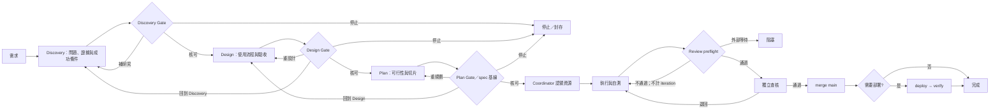

# AI 協作工作流與職責歸屬準則 (AI Collaboration Workflow) — CANONICAL

> 本檔是跨專案 AI 協作的**短版權威規則**：定義不可違反的不變量與專案必須實作的契約。操作命令、事故脈絡與供應商細節一律不放這裡；它們住在 [`templates/`](templates/) 與各專案 Runbook。程式碼與文件衝突時，以程式碼為準並修正文件。

> **基線 v2（WF-22 Wave 2，2026-08-05 成文）**：本版把 2026-08-04 工作流總檢討的十三項決議與其後的實戰裁決寫入正文——治理與單一寫入通道（§1.1、§2.10、§4.3）、卡範圍與鏈式停損（§2.11、§2.12、§3.2、§3.3）、規劃閘門三級制（§3.1）、資源互斥與 worktree 註冊制（§4.4、§4.5）、查核第一判準與跨家族查核範式（§5.1、§5.2）、派工包標準條款與證據紀律（§6.1、§6.2）、多專案適用（§7.1）。決議原文（唯一基線）：cpbl-analytics `docs/research/WORKFLOW-REVIEW-2026-08-04.md`（merge `a8f6f4c`）。**§6.1 第 4 條的新聞／第三方佐證四約束（定性 only、數值以官方紀錄為權威、引用附 URL ＋日期、適用所有第三方來源）不在該決議文件內**，源頭為需求方 2026-08-05 於 `ruan6047/ai-workflow#7` 查核留言的追認裁決；實戰依據＝連段語意翻案（cpbl #90 二次裁定、#89 更正）。決議中屬一次性專案決定者——產品化時序、在途流程卡逐張處置、60 天回顧指標——留在 WF-22 Initiative 卡，**不入本檔通則**。

## 0. 分類與狀態

先判斷「有 code 進 main 嗎？」與「錯了是否難復原？」；混合卡以最高風險類型處理。

| 類型 | 例 | 分支／審核／落地 |
|---|---|---|
| A 程式碼 | 功能、bug、重構 | T2 以上才可改 versioned source／設定；分支 + 獨立審核，只有已審 main 可部署 |
| B1 記錄文件 | log、TASKS、會議紀錄 | 直接 commit；免審，不部署 |
| B2 權威文件 | spec、規則、API、checklist | 小改可直接 commit；需獨立事實查核／校讀，不部署；canonical 規則本體與指定 T4 文件除外 |
| C 資料／維運 | 同步、refresh、爬蟲 | 無碼不開分支；資料 QA，生產操作先備份後驗證 |

交付狀態為 `💡需求 → 🔬研究中 → 🧭規劃中 → 📥Backlog → ⏳待執行 → 🔨執行中 → 🔍待查核 → ✅通過 → 📦已合併 → 🏁完成`，或 `↩退回`、`⏸阻塞`、`🚨已升級`、`🛑已停止`。**廢止的歷史值**（向後相容，已寫的卡留著，新寫入不得用）：`🚧進行中`、`⏳待執行`。不可覆寫 event log 是狀態歷史，Ledger 是由 event log 產生的 current-state projection；兩者不得各自人工改寫（狀態面實作與唯一寫入通道見 §4.3）。`🛑已停止` 必填決策與原因後封存。部署狀態獨立：`—不適用`，或 `⏸未部署 → 🚀待部署 → ⏳部署中 → ✅已部署 → 🧪驗證中 → ✅已驗證`；失敗／回滾不得結案。release 事件必以**終態**交付狀態落地：免部署卡 release 即 `🏁完成`，需部署卡在部署 `✅已驗證` 前不得 release；結案清單（終態事件、封存、Ledger、資源清理、對帳）見 [`worktree-lifecycle.md`](templates/worktree-lifecycle.md)。

變更級別 [change tier] 決定流程強度，不得只按估時或檔案數降級；取風險、影響範圍與可逆性的最高者。任一碰到 public contract、權限／安全、金流、資料寫入／migration、production 或紅線，即至少 T3，紅線一律 T4。適用順序為：紅線／法規與安全限制 → 類型的最低閘門 → tier；B2 的獨立事實查核不得被 T1 省略。

| 級別 | 適用條件 | 最低閘門 |
|---|---|---|
| T0 記錄 | B1 log、非權威格式、無語意影響文字 | 直接 commit；格式／連結檢查 |
| T1 編修 | 已知 typo、非執行期文案或細節調整；不得改 versioned source、設定、生成物或 API／規格文字 | 聚焦自查；可直接 commit，必要時抽查 |
| T2 局部修正 | 根因已知、可逆、局部的程式／設定變更 | 分支、聚焦回歸測試、獨立輕量查核 |
| T3 標準交付 | 一般功能、跨檔或需求不確定的修正 | spec／卡、分支、自測、獨立查核、merge gate |
| T4 紅線 | §5 列舉風險 | T3 + 跨家族或人工審核、實測與必要 sign-off |

## 1. 角色與所有權

| 角色 | 責任 |
|---|---|
| 需求方 | 擁有問題優先序、目標、非目標與各 Gate 的最終核可；AI 不可自行派工 |
| Discovery lead | 把使用者／市場／既有資料研究整理為證據、假設與研究限制；不得把 AI 推測當成使用者證據 |
| 設計者 | 定義使用流程、資訊架構、狀態、錯誤回饋、可及性與可用性驗收；不自行決定商業優先序或技術架構 |
| 技術規劃者 | 寫可行性、架構取捨、風險、驗證與切片計畫；不可在未回寫 Gate 的情況下改變已核可的問題或設計 |
| 執行者 | 在獲認領的分支／worktree 實作與自測 |
| 查核者 | 對照目標與證據驗收；不得代改被審 source branch，但必須留下 finding／結論 |
| Coordinator／PM 祕書 [secretary] | control-plane 的**唯一寫入者**：認領、資源鎖、交接、merge 與對帳；只執行需求方已裁決的機械寫入，不做決策、不代擬優先序（§1.1） |

同一卡同一時間只能有一個階段所有者 [Stage Owner]；下一階段完成交接前不得動卡、分支或 worktree。查核者可寫入 PR review 或 control-plane 的 review event，這不是代改實作。

### 1.1 治理模型：決策與機械寫入分離

- **決策 100% 屬需求方本人**：開卡、派工、追加前置、資源調度、結案。AI 不得自行開卡或代擬優先序。需求方不在場時，決策進**決策佇列**，AI 只能續做已派工作。
- **機械寫入由唯一 PM 祕書 session 代行**：事件、狀態轉換、worktree 建立與註冊、結案清理與對帳。canonical 各處提到的 Coordinator 職責即由該 session 承擔。
- **其他 session 一律不得寫 control plane**：不得自行開卡、改板狀態、寫 lifecycle 事件或建立背景待辦（§6.1 第 1 條）。
- **溝通限制**：session 之間僅得就**直接相關工作**溝通（審核者↔執行者、前後端接口）；跨卡協調、範圍變更與優先序調整一律經需求方／祕書，不得 session 之間私下對齊。

## 2. 不可違反的規則

1. **實作與審核分離**：同一張 A 卡的執行者不得查核或 merge 自己的變更；查核者發現缺陷只退回，不順手改。**例外（僅限 merge 的機械操作）**：獨立查核 APPROVE／必要 sign-off 完成後，需求方明確授權時，執行者可代行 merge；merge commit 必帶 `Reviewed-by`，merge 事件必記授權來源。審核獨立性不因此豁免——授權只能豁免「誰按下 merge」，不能豁免查核本身。
2. **平台優先強制**：A 類 repo 的 main 必須有**平台級歷史防線**。標準實作＝GitHub **ruleset**（`deletion` ＋ `non_fast_forward`，target 預設分支，**bypass 清空**使 admin 同受管轄——個人 repo 的傳統 branch protection 對 admin 是假防線）。**required status checks 不是預設要求**：對 §0 允許的 B1／T0–T1 直推 main 工作流，它會鎖死既有路徑，只有採 PR 流的 repo 才納入。防線管的是「歷史被改寫或分支被刪」與「A 類未審程式碼進 main」；直推本身不是違規，T2 以上程式碼仍必須走分支與獨立查核。
3. **main 才能部署**：分支不可部署；需要部署的卡只有 main 的 source SHA 完成驗證才可結案。
4. **可驗證交接**：執行→查核前，工作區乾淨、分支已推送、自測與環境證據齊全；查核→merge 前，findings 清零、實測通過、必要 sign-off 完成。每次交接記錄 owner、時間、iteration、source SHA、證據與阻塞原因；查核 finding 須可追溯且不可覆寫。
5. **同機並行一 worktree 一 session**：每張 A 卡／卡族有獨立 worktree；建置、交接與清理由 [`worktree-lifecycle.md`](templates/worktree-lifecycle.md) 執行。
6. **不可偽造測試證據**：宣稱可防回歸的測試必須先對缺陷版本跑紅；新 worktree 先建立全套測試基線；所有驗證都標註 worktree／容器／環境變數。
7. **一個 commit 一件事**：不混入無關重構、依賴升級或 secrets；所有 commit 依 §6 留適用 trailer。
8. **資料庫是共享可變基礎設施**：依 §4 隔離與序列化；口頭協調不是鎖。
9. **事實、安全與責任**：先讀再說，不虛構 API、表、環境變數或指令；secrets 永不進 git；提交 AI 產出的人視同作者並負最終責任。
10. **治理集權、狀態寫入單通道**：開卡、派工、追加前置、資源調度與結案由需求方裁定；機械寫入由唯一 PM 祕書 session 經祕書 CLI 執行。不經該通道的狀態寫入——包含在看板 UI 直接改欄位——即違規（§1.1、§4.3）。
11. **一根問題一張卡**：卡的範圍單位是「問題」不是「授權」；一根問題的多個窄寫入授權列在同一張卡。執行者遇授權缺口時**停下**，寫「阻塞發現」進決策佇列，不得自行擴權或開新卡（§3.2）。
12. **鏈深不過二層**：每張卡必填「服務的原始目標」；全域問題一律脫鏈獨立運行；鏈深超過原始目標之下 2 層時強制整鏈重審，不得逕行加深（§3.3）。

## 3. 任務流程


```mermaid
flowchart LR
  R[需求] --> D[Discovery：問題、證據與成功條件]
  D --> DG{Discovery Gate}
  DG -->|核可| DSN[Design：使用流程與驗收]
  DG -->|補研究| D
  DG -->|停止| STOP[停止／封存]
  DSN --> DSG{Design Gate}
  DSG -->|核可| P[Plan：可行性與切片]
  DSG -->|重設計| DSN
  DSG -->|回到 Discovery| D
  DSG -->|停止| STOP
  P --> PG{Plan Gate／spec 基線}
  PG -->|核可| C[Coordinator 認領資源]
  PG -->|重規劃| P
  PG -->|回到 Design| DSN
  PG -->|停止| STOP
  C --> I[執行與自測]
  I --> PF{Review preflight}
  PF -->|不通過；不計 iteration| I
  PF -->|外部等待| BLK[阻塞]
  PF -->|通過| V[獨立查核]
  V -->|退回| I
  V -->|通過| M[merge main]
  M --> DEP{需要部署?}
  DEP -->|是| DV[deploy → verify]
  DEP -->|否| Z[完成]
  DV --> Z
```

- **Discovery** 回答「是否在解對的問題」：T3／T4、大卡、跨系統與不可逆變更先完成 Discovery Gate，明列目標使用者／利害關係人、觸發情境、痛點、成功條件、非目標、已知證據與待驗證假設。Discovery lead 將證據標為使用者研究、既有產品資料、公開研究或 AI 推測；AI 可調查既有資料、程式脈絡與競品，但不得將推測當作使用者證據。需求方確認問題與研究限制後，才可進 Design。
- **Design** 回答「解法是否適合使用者」：所有使用者可見的 T3／T4 卡，及 Initiative 的使用者旅程改變，必須有 Design Brief，定義主要流程、資訊架構、正常／空／錯誤／權限狀態、可及性與可用性驗收。設計者提出方案，需求方核可取捨與驗收；真實訪談、prototype 或可用性測試由需求方依風險決定，AI 只能協助準備與整理。純技術 T3／T4 可標註 Design Gate `N/A`，但必須記錄理由。
- **Plan** 回答「如何安全實作」：技術規劃者只在已核可的 Discovery／Design 基線上產出 spec、依賴圖、風險、驗證與子卡切片。發現不可行或成本超出邊界時，回寫受影響的 Discovery／Design brief 並重新核可；不可只在實作卡內改變方向。T0–T2 至少在卡或 commit 說明範圍與驗收。Plan 產出必含建議執行／查核能力層級與理由（層級語彙見專案 `MODEL_ROUTING.md`）；建議反映任務風險，不得因當下額度預先降級——派工可依可用性偏離，偏離與理由記入 claim 事件。
- 大型工作以 Initiative 父卡管理：父卡保存目標、spec 基線版本、依賴圖、里程碑、決策與風險；子卡採可獨立驗證的垂直切片。checkpoint 發現設計／需求變更時，先更新父卡基線、標註受影響子卡與重新核可，再繼續；禁止只在子卡內靜默改方向。基線變更的凍結、影響評估（none／scope／blocked／invalidated）、傳播與查核防線見 [`baseline-cascade.md`](templates/baseline-cascade.md)。
- 根因已知且局部的 bug 依 T1／T2 處理；不確定、跨檔或紅線 bug 至少 T3。細節見 [`bug-workflow.md`](templates/bug-workflow.md)。
- 正式查核前必過 review preflight：卡面／baseline／Gate／依賴、handoff SHA、branch tip、工作區、必要證據與 trailer 等機械條件不符時寫 `preflight-failed`，不得派 reviewer、不得建立 review event 或遞增 iteration；外部依賴未滿足不屬 preflight failure，應轉 `⏸阻塞`。查核順序、artifact 或獨立性不成立則記 `review-invalid`，同樣不計 iteration。完整分流見 [`review-escalation.md`](templates/review-escalation.md)。
- 有效的實質退回預設回原執行者、原分支、原 worktree 並遞增 iteration；只有碼已進 main 的事後查核才開 `<原卡>-FIX<n>` 修復卡。同一卡、同 escalation epoch、同 source SHA 的多位 reviewer 合併為一個 review attempt，最多計一次；同 attempt、同 finding 的結構化狀態衝突須 fail loud，以 `review-correction` 事件裁決。第三個可計數 attempt 先進 escalation checkpoint；只有相同根因反覆出現、既有 blocking finding 未處理，或需求方於 checkpoint 裁定時才轉 `🚨已升級`。重規劃／換執行者須由需求方以 epoch-change 事件明示授權，epoch 逐一遞增，歷史保留但重新計數。原卡由修復卡帶動結案。

### 3.1 規劃閘門三級制

閘門深度依風險分三級。**祕書機械把關欄位齊備；需求方把關內容**——欄位齊備不等於通過。

| 級別 | 閘門 |
|---|---|
| Initiative／T4／不可逆 | **同步對抗式質詢真對話**（grilling 類手法）。brief 是對話的殘渣，**不得以 brief 代替對話** |
| T3 | **核心痛點三問**非同步輕質詢：痛點是什麼／成功怎麼觀察／最大的未驗證前提是什麼。需求方批註放行後才進 `📥Backlog` |
| 所有 T2 以上 | spec 的**前提清單逐條附實查證據**（SQL 結果、實際讀到的程式、fresh `origin/main` SHA）。未驗證前提**必須標示**，且**不得設為硬前置** |

存活下來的反駁寫回 discovery brief 的「待驗證假設」與「非目標」，被推翻的前提直接修正問題陳述（[`discovery-brief.md`](templates/discovery-brief.md)）。

### 3.2 卡範圍與開卡條件

- **一根問題一張卡**：同一根問題的所有寫入授權列在同一張卡；窄授權可以有多條（保留防呆），但不得為了逐條授權而把一根問題切成多張卡。
- 執行中發現授權缺口：**停** → 寫「阻塞發現」進決策佇列 → 由需求方裁決擴授權或開新卡。執行者不得自行決定。
- **開新卡僅限三情形**：(1) 需要不同能力域的執行者；(2) 紅線隔離（`schema`／`data-migration`）；(3) 可真平行（寫入集不相交）。三者皆不成立時，正解是擴充現卡授權，不是開卡。

### 3.3 鏈式停損與原始目標

- 每張卡必填「**服務的原始目標**」——這根鏈最終要解的問題。
- 新前置出現時**先分流**：
  - **全域問題一律脫鏈獨立運行**：不入鏈、不繼承鏈的急迫性、不計鏈深，優先序由需求方全局裁定；鏈上只記等待條件。
  - **鏈私有前置**觸發停損裁決，固定兩問：以原始目標的價值，這條鏈還值得加深嗎？有無降級繞道？
- **鏈深硬上限＝原始目標之下 2 層**；超過時強制整鏈重審，**預設答案是擱置或降級，不是繼續鑽**。祕書 CLI 於開卡時機械擋下（`--chain-depth` > 2 直接拒絕）。

## 4. 多 AI 與資料庫契約

### 4.1 Control-plane Contract

每個有兩個以上人類／AI writer，或會並行操作共享資源的專案，必須在 Runbook 實作 control-plane adapter。採聯邦式混合架構：remote coordination adapter（GitHub 為預設實作）處理跨人 task、review、lease 與 CI；local resource adapter 處理 worktree、port、container 與未提交變更。local lock 只保護暫時資源，不是協作狀態事實來源。

- remote coordination adapter 是唯一 lifecycle event writer。以 GitHub Issues 為狀態面的專案，事件載體＝**Issue timeline ＋結構化 comment**；因其非嚴格不可覆寫，必須以**每日 snapshot export 回 git** 建立離線稽核副本（§4.3）。未採 Issues 狀態面的專案，把 event 追加到受保護 Git history 或外部 append-only store。
- 只有 remote coordination adapter 可原子認領／釋放卡、轉交付狀態與核發資源租約 [lease]；local resource adapter 只能建立／釋放資源並回報 telemetry，不得改 card state 或遞增 `state_version`。append-only event log 是作業狀態事實來源；Ledger 是它的可讀投影，git 是程式碼與已提交文件的事實來源。
- lifecycle event 只能追加於受保護 main、或等價的共享 event store（採 Issues 狀態面時＝該卡的 Issue，見 §4.3），並與 Ledger 投影同一變更重建；**執行分支不得攜帶、補寫或修改 control-plane event 與 Ledger**，分支 merge 時上述路徑衝突一律以 main 為準。事件跟執行分支走會使 Ledger 對在途卡永遠停留在認領前狀態，current-state 投影失義。
- lifecycle event 最小 schema：`event_id`、`card_id`、`type`、`actor`、`occurred_at`、`state_version`、`iteration`、`evidence`，以及 claim 時的 `branch`、`worktree`、`lease_expires_at`；review／handoff／handoff-accepted／merge／release 必填 `source_sha`。review attempt 另以 `attempt_id`、`escalation_epoch`、`preflight_passed`、結構化 findings 與 adapter 推導的 `counts_toward_escalation` 表達，不得從 evidence 自由文字猜測；有效但不計數的 review 與 `review-correction` 仍可閉合 finding。epoch 只能由需求方核可的 `escalation-epoch-change` 逐一推進；欄位契約見 [`review-escalation.md`](templates/review-escalation.md)。同一卡的 `state_version` 必須單調遞增。`occurred_at` 必須取自寫入當下的系統時鐘，不得估算、遞增推定或沿用先前事件的時間（append-only 使時戳誤差不可回改）。local telemetry 使用同一 envelope，但標記 `lifecycle=false`、引用 `claim_event_id`，不含 `state_version`。
- **跨 writer handoff 是 remote lifecycle event，不是聊天訊息**：T2 以上、或任何 owner 變更，必須使用 [`handoff-contract.md`](templates/handoff-contract.md)。sender 必須先 push 指定的完整 40 字元 `source_sha`；receiver 僅在驗證 SHA、spec 基線、有效 lease 與所需證據後，才可追加 `handoff-accepted` 事件並取得下一階段所有權。缺欄、無法解析的 SHA 或不符基線一律拒收／轉阻塞，不得自行腦補修正。
- **tmux 僅為可選 local adapter**：它可開啟 worktree session 或送出可遺失的 wake-up；不得持有 lifecycle state、lease、queue 的唯一副本，也不得直接改寫 remote event／Ledger。專案若採本機 inbox/outbox，runtime 必須 `.gitignore`，只可引用 remote handoff event；跨人／跨主機一律以 remote coordination 為準。
- claim 必須一次驗證卡可執行、無有效 owner、依賴已滿足，並記錄 `card_id`、owner、branch、worktree、`claimed_at`、`lease_expires_at`。
- 共享可寫資源必須宣告並互斥：`file:<path>`、`port:<n>`、`container:<name>`、`db:<env>:schema`、`db:<env>:table:<name>`；read-only 才可共用。⚠️ `schema` 與 `table` 是**字面關鍵字**，只有 `<env>`／`<name>` 是佔位符——把 `schema` 換成 schema 名（如 `db:prod:cpbl`）會被文法拒收——⚠️ 而**沒被拒收的那條路徑才是危險的**：寫進 spec 檔而不是卡面時無人檢查，於是宣告等同不存在（詳見 [`database-contract.md`](templates/database-contract.md)）。⚠️ 互斥判定是**完全字串比對**：`db:<env>:schema` **不支配** `db:<env>:table:<name>`。
- lease 可續約、可到期回收；回收前先檢查未提交變更，禁止靜默刪除工作內容。claim、handoff、review finding、status change、merge、release 都要以事件記錄 iteration、actor、時間、source SHA、證據／原因，並對帳。

本機可採原子目錄鎖；跨主機必須使用具併發控制的服務或 workflow。Markdown、聊天訊息與「請勿同時操作」皆不構成鎖。

### 4.2 Database Contract

有 DB 的專案必須以 [`database-contract.md`](templates/database-contract.md) 建立自己的 `docs/DATABASE_CONTRACT.md`；填入引擎、ORM／migration 工具、runner、環境 namespace、lock、備份、回滾與驗證命令。canonical 不綁技術選型。

- 卡片必填 `db_scope = none | read | write | schema | data-migration`；後兩者另列環境、資源與 `migration_phase = expand | migrate | contract`。`schema`、`data-migration` 均為資料正確性紅線。
- 會寫入或測試 DB 的 A 卡必須使用以 `CARD_ID` 隔離的 DB namespace（database、schema 或等價資源）；container、cache、queue、port 同樣 namespace 化。共用可寫 dev/test DB 是例外，必須有 owner、lock、清理方式。
- 同一 `<environment, schema>` 最多一個 migration writer；同表／同資料集的 data migration 也必須鎖定。schema 卡依 lane 順序 merge，不平行產生互相依賴的 migration。
- production 寫入憑證只給受保護的 CI/CD runner；它在 main 的 source SHA 取得 lane lock 後才可 migration，並回報 migration ID、時間、結果與證據。
- schema 演進採 **expand → migrate → contract**；不可逆 DDL、刪欄／表與大量轉換必須獨立卡。資料 migration 必須可重跑、可續跑、受批次限制，並完成 rehearsal、復原方案、對帳與 smoke test。

### 4.3 狀態面與單一寫入通道

- **卡狀態＝Issue**；**看板＝Projects**（user-level Project 跨 repo 聚合即多專案面板）；**事件＝Issue timeline ＋結構化 comment**，由祕書驗證後寫入。規格文件與程式碼留 git。
- **唯一寫入通道＝祕書 CLI**（本 repo [`cli/`](cli/) 的 `wfcli`）。繞過它的狀態寫入——包含在看板 UI 直接改欄位——即違規。CLI 不做權限強制（單機信任模型）；紀律由治理承擔，不是技術鎖死。
- **祕書每日 snapshot export 回 git**：Issue timeline 不是嚴格不可覆寫的 store，快照是離線稽核副本與事後對帳依據。
- **狀態面不可用時（平台中斷）狀態操作暫停**：不得改用聊天、本機檔案或記憶暫代。已派工作可續作，狀態轉換等恢復後補寫。
- 已 cutover 的專案，其舊 event log 與 Ledger 投影**封存唯讀**——不得再追加事件或重建投影。

### 4.4 資源宣告、互斥派工與命令護欄

- **派工時機械比對交集**：祕書比對「本卡寫入集 × 現役卡寫入集」，有交集即**排隊**。口頭協調不是鎖，宣告才是。
- **現役的定義含 `📦已合併`**：只要卡未走完結案收尾就仍佔交集檢查。停在 `📦已合併` 不收尾＝假活卡，會把後續卡卡死。
- **資源宣告生命週期**：merge 後該卡的 `file:` 資源**即釋放**（祕書改宣告，或直接走完收尾把板狀態收掉）；仍待部署驗證的卡只保留部署面資源，不再佔 repo 檔案。
- **破壞性重建類 CLI（build／rebuild／migration）啟動時驗 lease，無 lease 拒跑**。不做全面 namespace 隔離——護欄擋在命令入口，成本低於全面隔離。專案在自己的 Contract 列出哪些入口屬破壞性（§7）。
- 交付必要的**重現工具**（掃描器、對帳腳本、artifact 產生器）屬交付物，必須列入資源宣告——完整性宣稱要能被重跑驗證（§6.2）。

### 4.5 worktree 註冊制

- **放棄命名慣例、順應 harness**：worktree 路徑與分支名由實際建立者決定（harness 自產名亦可）。認領時祕書把**實際路徑＋分支**寫進卡；一卡一 worktree 靠**註冊查重**，不靠猜名字。
- **`doctor` 對帳在派工前必跑**：一次列出孤兒 worktree、死路徑、submodule 未初始化、殘留 lease。它是唯讀報告工具，**不自動清理**；結案清理由祕書批次執行。
- `git worktree add` **不帶 submodule 內容**：新 worktree 內的 submodule 目錄為空是預期行為，不是缺陷。需要其內容時明確初始化；跨 repo 的證據引用照 §5.2 辦。

## 5. 審核與紅線

一般卡只要求新 context／session 的獨立性。紅線卡（安全、金流、統計／ML、資料正確性、資安部署與 production migration）另須：

- 換模型家族或人工審核；同家族不同工具不算模型架構獨立。
- 實測與驗證證據；最高風險項由使用者 sign-off。
- Reviewer 檢查任務目標、邊界值、資料來源／語系映射、角色 UX、關鍵判準是否有第二份實作，以及 security／performance 風險。
- 統計／ML 與資料正確性紅線卡必須在卡面列「紅線（違反即退回）」區塊並具體化窗口與門檻（範本見 [`statistical-redline.md`](templates/statistical-redline.md)）；§2 第 6 點「先跑紅」對統計結論不適用，以紅線區塊＋查核者重跑為等價防線。範本清單中的**結果解讀通則（#7 小樣本、#9 母體漂移、#10 離群個案）適用於所有研究結論，不限紅線卡**（裁決源頭見範本）。

升級只計入已通過 preflight、有效且含 executor 歸屬之實質 blocking finding 的 review attempt；治理 metadata、Coordinator／規劃錯誤、外部阻塞、無效查核與同一 SHA 的重複 review 不計。第三次可計數退回先建立 escalation checkpoint：相同根因連續反覆或既有 blocking finding 未處理才自動轉 `🚨已升級`；不同根因且逐輪閉合、持續收斂時由需求方決定續修、重規劃、換執行者或升級。精確分類與 epoch 規則見 [`review-escalation.md`](templates/review-escalation.md)。`⏸阻塞` 必填 owner、原因、等待對象與解除條件。事後查核是違規補救，不是正常路徑；是否回退 main 由使用者決定。

### 5.1 查核第一判準：核心痛點

- 每張卡必填「**核心痛點**」（祕書 CLI 開卡時機械檢查）。查核報告**第一行必答**：核心痛點是否已消失、證據是什麼。此判準**具否決權**。
- **驗收清單全過但痛點未消 → `REQUEST_CHANGES`，並退回修 spec**。清單與痛點脫節本身即 spec 缺陷，歸屬記 `planner` 而非 `executor`（[`review-escalation.md`](templates/review-escalation.md) §2、§3）。

### 5.2 跨家族查核範式

查核詞（派審提示）必含四件：**進駐位置＋基準 SHA 核對**、**逐項驗收清單**、**環境紅線**、**結構化輸出要求**。範本見 [`review-prompt.md`](templates/review-prompt.md)。

- **結構化輸出**：`core_pain_resolved`、`review_result`、`findings`（每項含 `severity` 與 `blocking`），以及 **`self_run` 必填**——查核者自己實際跑過的指令與觀察到的輸出。**沒有 `self_run` 的 `APPROVE` 無效**（記 `review-invalid`，不計 iteration）。
- **R2 以後的範圍收斂**＝R1 finding 逐項閉環驗證 ＋ 回歸不倒退；不重跑 R1 已通過項，不擴審新範圍。新發現的範圍外問題寫報告回祕書，不自行擴大 finding 集合。
- **跨 repo 證據＝絕對路徑 ＋ 釘 SHA ＋ 關鍵碼段摘錄進文件**。查核者的 worktree 讀不到另一 repo 的檔案（含未初始化的 submodule，§4.5），所以「檔案不在我的樹裡」不足以推翻宣稱，「只給對方樹裡的路徑」也不成立——雙方一律以釘住的 SHA ＋ 內嵌碼段對帳。
- **查核環境紅線**：查核是唯讀驗證，**嚴禁真跑有副作用的 CLI**（爬蟲、訓練、資料重建）。需要驗證 CLI 行為時走密封探針或容器，不真送請求、不真寫庫。

## 6. 留痕與交付

- git 是程式碼／文件衝突時的事實來源；adapter event log 是作業狀態事實來源；活卡 current-state 見狀態面（§4.3），`docs/TASKS.md` 是它在 cutover **之前**的可讀投影，⚠️ **cutover 之後即封存唯讀、不再重建**——`wfcli snapshot` 寫的是 `snapshot.json` 與 `SNAPSHOT.md`，**從不產生 `TASKS.md`**（實測：`cli/src` 的 `write_text` 只有四處，無一寫本檔）。凡讀 `TASKS.md` 當現況者必然讀到 cutover 當下的凍結快照。卡片一檔，結案即封存。範本見 [`TASKS.md`](templates/TASKS.md)、[`tasks-card.md`](templates/tasks-card.md)。
- T0／T1 的直接 commit 至少記錄 `Requested-by` 與 `Implemented-by`；T2 以上的實作 commit 必加：
  ```text
  Requested-by: <GitHub 帳號／來源>
  Planned-by: <GitHub 帳號／模型@工具>
  Implemented-by: <模型@工具>
  ```
- merge commit、PR 結案紀錄或 B2 權威文件的核可 commit 另必加：
  ```text
  Reviewed-by: <GitHub 帳號／模型@工具>
  ```
- **trailer 必須是 commit message 末端的連續單一區塊**：上述 trailer 與專案自有 trailer（如 `Co-Authored-By`）之間**不得插入空行**。`git interpret-trailers --parse` 遇空行即切斷解析，被切掉的行不算 trailer，守衛必紅。
- review event 必答：結論、finding（severity／證據／處置）、iteration 與 source SHA，以及 §5.2 的 `core_pain_resolved` 與 `self_run`；交付／PR 必答：改了什麼、為什麼、怎麼驗證；不得用「應該可以」。不擅自升級鎖定依賴；secrets 不進 git、訊息、PR 或文件。

### 6.1 派工包標準條款

每份派工包 [dispatch package] 必須帶下列六條，執行者一體適用。骨架見 [`dispatch-package.md`](templates/dispatch-package.md)。

1. **範圍外發現寫報告回祕書／需求方**：不得自行開卡、不得 spawn 背景任務或建立背景待辦 chip。範圍外的東西只能是報告的一節，由需求方裁決。
2. **不得停等背景通知**：需要等待時前景輪詢或不結束回合；不得以「等背景通知」為由結束回合——通知叫不醒已結束的回合。
3. **分支更新禁 `gh pr update-branch`**：它產生 synthetic merge、污染歷史與守衛判讀；一律**本地 rebase ＋ `git push --force-with-lease`**。
4. **詭異數據標記「待人工判讀」交需求方**，不自行下結論。需要外部佐證時走新聞／第三方通道，但**定性佐證 only**：數值一律以官方紀錄為權威，引用必附 URL ＋ 日期。
5. **commit trailer ＝末端連續單一區塊**（§6），中間無空行。
6. **CLI 探索紅線**：查核／驗證環境不得真跑爬蟲、訓練等有副作用的 CLI（§5.2）。專案須在 stub 或 Runbook 列出**當前仍有副作用的入口清單**，派工包逐案帶入。

### 6.2 交付宣稱的證據紀律

- **完整性宣稱必須由指令輸出產生**：「全部」「全數」「零例外」不得以人工聲明成立；宣稱的數字與提交的 artifact 必須同源（同一次執行）。
- **artifact 必須在交付 HEAD 可重現**：產生工具與 artifact 同一個 commit，重跑得到同一份（不動點）。工具或測試檔本身被自己掃到時，明確歸類為**自指命中並可見列計**，不得偷偷排除。
- **介面契約變更的消費者盤點須涵蓋非同語言消費點**：shell 腳本、`python -m` 的 stdout 契約、排程器入口都是消費者。只盤點同語言 import 會漏掉它們——實證：stdout 多印一行即打斷生產同步鏈，且兩輪跨家族查核都沒抓到。

## 7. 專案採用與延伸

新專案依 [`ADOPTION.md`](ADOPTION.md) 建立 stub、Ledger、control-plane adapter，以及有 DB／部署時各自的 Contract。這些是**專案規格**，不是 canonical 的內容：

| 文件 | 專案自行決定 |
|---|---|
| Runbook | claim 實作、TTL、worktree／port／container 命令、事件／Ledger 投影、WIP limit、事故處理 |
| `CONTROL_PLANE_CONTRACT.md` | 狀態面目標（repo／Project）、**哪些 CLI 入口屬破壞性須驗 lease**、**當前仍有副作用的 CLI 入口清單**、資源宣告詞彙 |
| `DATABASE_CONTRACT.md` | DB 引擎、ORM、runner、namespace、migration／rollback 命令、**哪些表要宣告** |
| `DEPLOYMENT.md` | 環境、trigger、驗證、回滾與 status reporter |
| `MODEL_ROUTING.md` | 模型名單、成本、供應商與路由（範本見 [`MODEL_ROUTING.md`](MODEL_ROUTING.md)） |

規則演進只改本 repo；專案只保留指向本檔的 stub，不複製全文。模型清單與事故案例是可替換的操作知識，非永久流程鐵律。

### 7.1 多專案適用

本套規則屬 **canonical 層、適用所有專案**，不是任一專案的私規：

- **規則與祕書 CLI 住本 repo**（跨專案共用資產）。專案層只留 stub 與上表的**契約填空**，不複製規則、不各自造工具。
- **單一祕書跨專案服務**：一個 PM 祕書 session 以 repo 為 namespace 操作各專案的狀態面；**決策佇列全局唯一**。
- **看板單一入口**：user-level Project 跨 repo 聚合即多專案面板。
