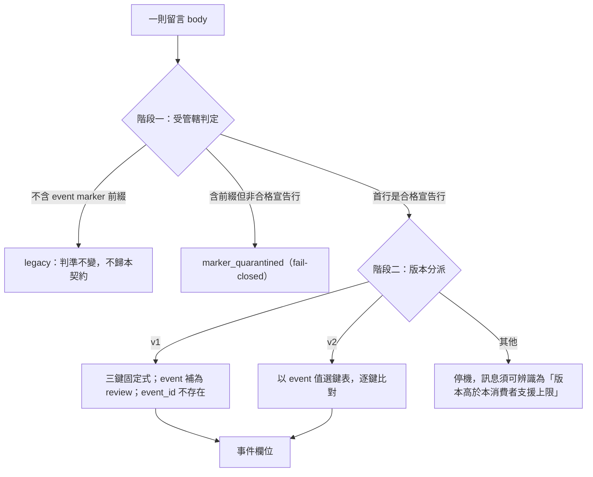

# WF-EVENT-MARKER-V2-SCOPE1 — lifecycle 事件 marker 的版本升級與覆蓋面

> 卡：[ai-workflow#35](https://github.com/ruan6047/ai-workflow/issues/35)　狀態：契約設計，**尚未實作**
> 規範主體歸 [`templates/handoff-contract.md`](../templates/handoff-contract.md) §3.1／§3.2；本檔是裁定的理由、逐項相依對照與可重跑的證據。
>
> ⚠️ **引用紀律**：本檔為了規範文法，必然逐字含 event marker 前綴（3 處：§3.1 語法、§3.2 表、§5.1 構造案例）。契約 §3.1.4 把**任何含該前綴的留言**判為受管轄，引用即停機——本 repo 已有 9 則留言因此凍住 4 張卡。**不得把本檔任一段照貼進 Issue／PR 留言**；轉述時寫「event marker 前綴」，紀律見 `templates/dispatch-package.md` §「留言引用紀律」。

## 0. 這份設計要解什麼，以及它**不能**做到什麼

三張卡各自需要在 lifecycle 事件上帶結構化欄位，全部撞上同一堵牆：`cli/src/wf_cli/doctor.py:211` 的 `_CONFORMANT_MARKER_RE` 把「順序固定、單一空白分隔、鍵集合封閉」編進同一條 regex，多一鍵即不匹配，而 `doctor.py:249`–`:257` 對不匹配者的處置是 fail-closed 停該卡的自動裁決判定。同時，六個承接動詞裡只有 `review` 會發出 marker（`cli/src/wf_cli/review.py:458`），其餘動詞的事件根本沒有可搭載的識別符。

**本卡的寫入集是 `docs/WF_EVENT_MARKER_V2.md` 與 `templates/handoff-contract.md` 兩個檔，不含 `cli/`。** 這件事決定了本檔所有宣稱的強度上限：

- 凡本檔寫「寫入端拒收」「解析器讀不回」「必須被擋下」，其今天的機械執行者**只存在於 §7 的探針裡**（一份參考實作），不存在於 `wfcli` 的任何寫入路徑。
- 因此本檔對實作的部分一律是**契約要求**，不是既成事實。哪些是要求、哪些已成立，逐條列在 §8。
- 唯一今天就成立的機械事實是 §7 探針跑出來的那 1,237 格斷言，其中 A 組與 E 組是拿**現行 `doctor` 本人**（`import`，不是複製一份判定邏輯）去比對真實 timeline 的結果。

## 1. 裁定一：v1 升 v2，且 v1 永久有效、不遷移

### 1.1 必須升版

`handoff-contract.md` §3.1.3 明文「鍵集合封閉：`v1` 只有上列三鍵……要擴充欄位必須升版本」。三項具名相依（§5）都需要新欄位。不升版的替代方案只有兩個，都不成立：

- **放寬 v1 讓未知鍵通過** —— §3.1.3 自己已經駁回：「擋住未知版本卻放行未知欄位，只是把同一個漏洞換個位置」。
- **另立一個新前綴** —— 見 §2.4，那是本卡開卡要制止的形態。

### 1.2 既有 v1 事件不遷移，而且**不得**遷移

真實 timeline 上有 **49 則 v1 marker**，散在 16 張卡（issue #9、#13、#15、#16、#17、#19、#20、#21、#22、#23、#24、#25、#37、#38、#39、#43）。裁定：**一則都不動。**

三個理由，任一單獨成立即足夠：

1. **契約自己禁止。** §3.1.4 的修復路徑明文「不得刪除被停機的留言，也不得回寫既有事件」。遷移就是回寫既有事件。
2. **編輯有副作用。** `review-escalation.md` §5 的 `review-marker-clearance` 以留言 body hash 綁定；批次編輯會讓每一則留言帶上 GitHub 的 `edited` 標記，而該標記正是 §4 (b′) 用來評估「有沒有人事後改寫」的訊號之一。為了升版而把 49 則事件全部染上 `edited`，等於把一個安全訊號用完。
3. **沒有收益。** v1 承載的三欄在 v2 的欄位空間裡語意完整且無歧義（`event=review` 為隱含值）。v2 相對 v1 只多兩鍵，其中 `event` 對歷史事件是常數，`event_id` 見下方的誠實殘餘。

**誠實殘餘（不因裁定而消失）**：`event_id` 對 cutover 之前寫下的事件不存在。[`WF_EVENT_IDEMPOTENCY1`](WF_EVENT_IDEMPOTENCY1.md) §5.1 步驟 3 的收斂性論證（「鍵對鏈的狀態不敏感，所以重試必然自我辨識」）因此**只在 cutover 之後成立**：一張卡若在 cutover 前已寫下某動詞的首寫，cutover 後以同一意圖重跑會查不到鍵而寫出重複事件。這不是可以靠遷移補的——補上去的 `event_id` 是事後推導的，若導出式與當時的參數不一致就是偽造。可用的處置是 `WF-22-CLI4`（#9）已經發明的那個裝置：以一則 one-shot `contract-baseline` 事件把「本卡在此點之前的事件不帶該事實」寫進事件流，讓消費者對更早的區間 fail-closed 而不是誤判。本檔指名該裝置，不代為定義。

### 1.3 並存期的判定規則：兩階段，互不知道對方



兩階段的分工是硬界線，兩邊都不得越界：

- **階段一只看前綴出現在哪裡，完全不看版本。** 它今天的判準是 `doctor.py:230`–`:247`（全文含前綴 → 首行須為 marker → 全文只能有一處前綴）；[`WF-MARKER-SCOPE-CLEARANCE1`](https://github.com/ruan6047/ai-workflow/issues/30) 會把它收窄成宣告行三分類。**本卡一個字都不動階段一**——那是 #30 的射程，兩張卡同時改同一段是 §4 要處理的事。
- **階段二只看版本與鍵，完全不看行的位置。** 它不知道 marker 是在首行還是第三行；那個問題在它被呼叫之前就已經有答案。

這個切分不是排版偏好，它是本卡能同時進行而不與 #30 打架的**唯一**理由：#30 改的是階段一的邊界，本卡改的是階段二的內容，兩者的輸入輸出介面（「一行合格宣告行」）不變。

### 1.4 cutover：讀取器先行是硬需求，不是最佳實務

現行 `doctor.py:249`–`:251` 對版本不是 `v1` 者一律回「未知或不支援的 marker 版本……只認 v1；不得回退 legacy」，而該回傳值在 `doctor.py:430`–`:432` 被歸進 `quarantine_reasons`，於 `doctor.py:460`–`:462` 讓**整張卡**落 `marker_quarantined`。

**因此：第一則寫進任何一張卡的 v2 事件，會讓所有還在跑 v1-only 讀取器的消費者當場停掉那張卡。** 這不是推論，§7 探針的 D8 格就是拿現行 `doctor` 本人對一則合格 v2 marker 實跑的結果。

實作卡的順序因此被釘死：

1. **讀取器先落地**（`doctor` 同時認 v1 與 v2），且該版本已發佈。
2. **寫入端才可以切**到 v2。
3. 兩步不得合併成一個 commit 之外的任何形式的「同時」——它們可以在同一個 release 裡，但 release 的**安裝**不是原子的。

**殘餘風險與其失效方向（不假裝解決）**：`wfcli` 沒有版本協商，也沒有任何機制知道「別台機器上的那份 `wfcli` 升級了沒」。多份安裝並存時，舊安裝讀到 v2 會停機。這是 fail-closed——它不會讀錯，只會停——但可用性代價是真的。可以做而且必須做的最小改善是：**未知版本的停機訊息必須把成因指名為「版本高於本消費者支援上限，請升級 `wfcli`」**，而不是與「marker 寫壞了」共用同一句話。這一條把一次困惑轉成一次可行動的停機，是本卡在沒有協商機制的前提下能給的全部。

### 1.5 v2 之後，「加欄位」不再需要升版本

v2 只加兩個鍵，選取判準是**「不解析 payload 就必須知道」**：

- `event`：它選定其餘鍵集合與 payload schema。不先知道它就無從解析任何後續內容。
- `event_id`：`WF_EVENT_IDEMPOTENCY1` §5.1.1 的 **P5** 要求「能在不解析 payload 語意的前提下取出」——因為 §5.4 要在 payload 已被竄改時仍能取鍵。放進 payload 就違反 P5。

**其餘一律進 payload（同一則留言內的 fenced 區塊，§3.3）。** 這是本卡對核心痛點的實質回答：那堵牆的成因不是「v1 少了幾個欄位」，是**「事件的語意欄位與識別符擠在同一個封閉鍵集合裡」**。分開之後，`review_prompt_url`、`closure_reporting_requested`、被收窄的 `finding_id` 集合、owner 快照這些欄位的增刪都只動 payload schema，不動 marker，也就不再有「加一個欄位＝整批卡停機」。

⚠️ **「v2 是最後一次為加欄位而升版」這句話沒有機械執行者**，見 §8 第 1 條。

## 2. 裁定二：另外幾個動詞

### 2.1 先更正一個數字

卡面驗收寫「另外**五個**動詞（`open`／`assign`／`amend`／`handoff`／`deploy-declare`／`deploy-state`）」——括號裡是**六個**。`WF_EVENT_IDEMPOTENCY1` §5.1.1 末段的「五個動詞」是把 `open` 排除後的數字（該卡 §8 明示不承接 `open`）。本檔對六個逐一裁定，不挑一個數字硬湊；`review` 併入為第七項以求完整。

### 2.2 現況：各動詞今天寫到哪個平面，有沒有識別符

| 動詞 | 寫入平面 | 今天的識別符 | 讀碼依據 |
|---|---|---|---|
| `open` | 建立 Issue | Issue number（GitHub 保證唯一、不重號） | `commands/open_cmd.py` |
| `assign` | Issue body `## Log` 追加一行 | **無** | `commands/assign_cmd.py:149`–`:155` |
| `amend` | body Log 一行 ＋（部分路徑）一則留言 | `op <8 位 hex>`，值為 `uuid.uuid4().hex[:8]`（`amend_cmd.py:558`） | `amend_cmd.py:713`–`:716`、`:385` |
| `handoff` | body Log 一行 | **無** | `commands/handoff_cmd.py:282`–`:287` |
| `review` | 留言（首行 marker）＋ body Log 索引行 | `wf-review-event:v1` marker | `review.py:456`–`:461`、`review_cmd.py:230`／`:233`–`:244` |
| `deploy-declare` | 留言 | **無**（`## deployment-declaration` ＋ `- event: …` 散文條列） | `deploy_declare_cmd.py:51`–`:62` |
| `deploy-state` | 留言 | **無**（同上形態） | `deploy_state_cmd.py:62`–`:76` |

`amend` 的 `op` 看起來像識別符，但它不是：值是每次執行現取的隨機 UUID 前 8 碼，**不由意圖決定**，因此無法滿足 `WF_EVENT_IDEMPOTENCY1` §3.1 對「重試必須算出同一個鍵」的要求；而且它從未被任何契約定義過，`amend_cmd.py:405`–`:407` 的註解甚至明講不要拿它做完整格式比對。

`deploy-declare`／`deploy-state` 的留言是最危險的一格：它已經有結構的**外觀**（固定標題 ＋ `- key: value`），但沒有任何一個字元是機器錨點。任何人打一則同樣格式的留言，消費者分不出那是事件還是引用——這正是 `WF-CARD-FIELD-CORRECTION1`（#37）在路由行上修掉的那個病，只是還沒有人在這裡發作。

### 2.3 裁定

| 動詞 | 需要 marker？ | 事件如何被唯一識別 |
|---|---|---|
| `open` | **否** | Issue number。一張卡恰有一個 `open`，GitHub 保證編號唯一且不重用，故 P1（可枚舉）與 P2（唯一歸屬）由 Issue 本身滿足，不需要第二個識別符。`WF_EVENT_IDEMPOTENCY1` §8 已明示不承接 `open`，本裁定與之一致。 |
| `assign` | **是**（identity-only） | v2 marker，`event=assign`。今天完全無識別符，P1／P2 皆不成立。 |
| `amend` | **是**（identity-only） | v2 marker，`event=amend`。`op` 保留為人讀線索，但**不再是識別符**；兩者不得混用。 |
| `handoff` | **是**（identity ＋ payload） | v2 marker，`event=handoff`。它另需承載語意欄位（§5 相依一），故必須走留言平面。 |
| `deploy-declare` | **是**（identity ＋ payload） | v2 marker，`event=deployment-declaration`。既有留言的 `- key: value` 條列改為 payload 區塊。 |
| `deploy-state` | **是**（identity ＋ payload） | v2 marker，`event=deployment-status-change`。同上。 |
| `review` | **是**（已有，升 v2） | v2 marker，`event=review`。 |

### 2.4 為什麼不新增第二個前綴字面

把非 `review` 的事件掛在一個新前綴（例如 `wf-lifecycle-event:`）下，看起來乾淨，但：

1. **它就是本卡開卡要制止的形態。** #9 在其切片 A 已經因為同一個理由拒絕過一次（`review.py` 模組註記：「#30 正在設計宣告行三分類、#35 正在設計版本升級策略，此刻自立第三套 marker 文法就是 #35 開卡要制止的形態」）。本卡沒有理由自己去犯。
2. **它讓 #30 的三分類要做兩份。** #30 的宣告行三分類是對「一個前綴」定義的；兩個前綴就是兩份互斥且窮盡的證明、兩份回歸語料。
3. **前綴改名是 fail-open 方向的改動。** 對已有消費者的 `review` 事件而言，換前綴等於讓舊消費者看不見新事件——`doctor` 會回 `unobservable`（「沒有人查核過」）而不是停機。那是把一個 fail-closed 的洞換成 fail-open 的洞。

因此：**一個前綴字面，版本在前綴之後，事件型別由 `event=` 鍵承擔。** 代價是前綴名字（含 `review`）成為誤稱。這個代價是明知而付的：名字難看不會讓任何判定出錯，多一套文法會。

### 2.5 為什麼不把 marker 放進 Issue body 的 Log 行

`assign`／`amend`／`handoff` 今天只寫 body，最省事的做法是把識別符塞進 Log 行或 body。**否決。** 理由是一個已實證的故障模式：

本 repo 的真實 timeline 上，**9 則留言因為在內文引用了 event marker 前綴而使 4 張卡（#15、#17、#19、#21）停機**（`gh` 全量掃描結果，§7 E 組語料；`docs/CONSUMER_CONFORMANCE.md` 落差 7 已記錄其中兩張）。這 9 則全部是派審詞與 PM 註記——也就是**會把卡面內容貼進留言**的那一類。`templates/dispatch-package.md:56` 已為此立下引用紀律。

若把前綴寫進 Issue body，這條紀律就守不住了：派工包本來就要引用卡面，一次照貼即帶入前綴，同一形態會從偶發變成系統性。

**裁定：lifecycle 事件的 canonical 載體一律是留言；Issue body 的 `## Log` 行是索引，不是事件。** 這與 `review` 今天的形狀一致，也與 #9 選的「fenced 區塊 ＋ Log 索引行」一致——差別只在本卡把識別符從缺席補成 marker。

## 3. v2 語法（規範）

### 3.1 逐字語法

```text
<!-- wf-review-event:v2 event=<E> <event 專屬鍵，依表列順序> event_id=<ID> -->
```

- marker 恰為留言首行，整則留言只能出現一處前綴（判準沿用 v1，屬階段一，本卡不動）。
- 鍵以**單一空白**分隔，順序固定：`event` 恆為第一鍵，`event_id` 恆為最後一鍵。
- `event` 第一是因為它選定其餘鍵集合；`event_id` 最後是因為 `event_id=(\S+) -->` 給出一個穩定的右錨點。

### 3.2 逐 event 的鍵表（封閉）

| `event` 值 | `event` 與 `event_id` 之間的鍵（依此順序） |
|---|---|
| `review` | `card_id` `source_sha` `attempt_id` |
| `handoff` | `card_id` `source_sha` |
| `assign` | `card_id` |
| `amend` | `card_id` |
| `deployment-declaration` | `card_id` |
| `deployment-status-change` | `card_id` |
| `review-marker-clearance` | `card_id` `quarantined_comment_id` |

`event` 值是**封閉語彙**，不在表內即 fail-closed。缺鍵、多出未定義鍵、順序不符、非單一空白，一律 fail-closed（§7 D 組窮舉證明）。

`review-marker-clearance` 一列是**為 #30 預留的介面**，不是本卡的交付；其欄位語意歸 `review-escalation.md` §5，表示法歸 #30。列在這裡是為了讓 #30 不必再發明第四套文法（§6 消費者二）。

### 3.3 逐欄位字母集（保留字元清單的白名單形式）

marker 語法裡承擔結構的字元是：`<!--`／`-->`（界定）、單一空白（分隔）、`=`（鍵值分隔）、換行（marker 是單行結構）。**v2 不以黑名單宣告它們不得出現在值裡，改以白名單宣告每個欄位的值可以是什麼**：

| 欄位 | 字母集（`re.fullmatch`） |
|---|---|
| `event` | `[a-z][a-z-]*`，且須為 §3.2 表列成員 |
| `card_id` | `[A-Z0-9][A-Z0-9-]*` |
| `source_sha` | `[0-9a-f]{40}` |
| `attempt_id` | `[A-Z0-9][A-Z0-9-]*-e[0-9]+-[0-9a-f]{40}` |
| `quarantined_comment_id` | `[0-9]+` |
| `event_id` | `[0-9a-f][0-9a-f-]{15,63}` |

白名單強於黑名單：它讓「結構字元進不了值」成為**構造上的**性質，而不是一份要維護的禁用清單。所有結構字元（空白、`=`、`<`、`>`、`!`、換行、tab）都不在任何欄位的字母集裡，所以界定符與分隔符在值裡不可能出現。

**兩件事必須講清楚，因為它們是實測出來的、不是外觀推的：**

1. **`-` 在值裡是合法的**（`card_id`、`attempt_id`、`event_id` 都用它），儘管它是 `-->` 的組成。這安全的理由不是「`-` 無害」，而是**終止符是 ` -->`（含前導空白）而空白已被排除**，所以值再多的 `-` 也接不出終止符。§7 C 組矩陣逐格量到這一點。
2. **字母集本身不足以保證往返。** C 組矩陣實測抓到：`event=review` 時把 `card_id` 尾綴一個 `-`，字母集放行、解析端的三欄自洽檢查退回——**寫得出、讀不回**，正是 #21 的形態。因此判準不是「值的字元合法」，而是**寫入端的接受集必須 ⊆ 讀取端的接受集**：跨欄位不變量（三欄自洽）也必須在寫入端擋。這一條是矩陣找到的，不是設計時想到的。

**用 `re.fullmatch` 而不是 `^…$`。** Python 的 `$` 容許結尾換行，`re.match(r"^[A-Z-]+$", "WF-A\n")` 為真。探針第一版就是這樣寫的，於是 C 組把「值結尾帶換行」量成無害——一個恆真的格子。矩陣抓到了自己的判準缺陷，這是「實測而非外觀推定」最直接的一次回報。

### 3.4 payload：同一則留言內的 fenced 區塊

marker 之外的所有語意欄位走 payload。**payload 是另一個格式，不共用 marker 的字母集**——它的值含自由散文與 URL，白名單策略在那裡不可行（見 §6 消費者三）。payload 的規範不由本卡定義；本卡只釘三件事：

1. payload 與 marker **必須可分離解析**（P5）：取 `event_id` 不得先解析 payload。
2. payload 解析失敗的失效範圍是**該筆查詢**，不是該張卡。marker 讀得出來，事件的身分就成立；payload 壞掉只讓「這則事件的某個語意欄位是什麼」無解。把 payload 的解析失敗升級成 per-card 停機，等於把 §3.1.4 的停機權交給一個沒有簽章性質的區塊。
3. payload 必須服從 §6 的三條格式規則，包含**宣告自己的結構字元與逃逸方式**。

## 4. 與 `WF-MARKER-SCOPE-CLEARANCE1`（#30）的介面

### 4.1 兩張卡改的不是同一件事

- **#30 改階段一**：受管轄判準由「全文含前綴」收窄為宣告行三分類，並新增 `review-marker-clearance` 的留言平面表示法與 writer。
- **本卡改階段二**：既有 event marker 的鍵集合與覆蓋面。

介面是 §1.3 那張圖裡的那條邊——「一行合格宣告行」。#30 決定哪些行會走到階段二，本卡決定階段二拿到那行之後怎麼判。兩者都不得跨界：#30 不得在三分類裡看版本或鍵，本卡不得在鍵表裡看行的位置。

### 4.2 先後順序：#30 先，本卡的實作卡後

三個理由：

1. **本卡的實作會把帶前綴的留言數量放大 3–5 倍**（六個動詞而非一個，每張卡每輪至少 `assign`／`handoff`／`review` 三則）。在今天「全文含前綴即受管轄」的判準下，帶前綴的留言愈多，被誤引用而停機的機會愈大。#30 的收窄必須先在，否則 v2 上線會讓一個已知的 fail-closed 痛點顯著惡化。
2. **#30 的回歸語料（#15／#17／#21）會被 v2 動到。** 先跑 #30 的前後對照、再上 v2，兩次都有乾淨基線；反過來則 #30 的語料在一個正在改的文法上取，白跑一輪。
3. **寫入集硬相交。** #30 宣告 `cli/src/wf_cli/doctor.py`、`commands/doctor_cmd.py`、`cli.py`、`tests/test_doctor.py`；本卡的實作卡必然要動 `doctor.py` 與 `test_doctor.py`。必須先後派工，不得並行。

### 4.3 共存規則：clearance 用 v2 的文法，不另立型別

#30 的驗收寫「clearance 的留言平面表示法：首行 marker 承載識別、fenced 區塊承載全欄位；clearance marker 適用與事件 marker 相同的三分類」。**本卡把「相同的三分類」再往前推一步：相同的文法。** clearance 是 §3.2 表裡的 `event=review-marker-clearance`，不是第四套 marker。

一個必須先答的疑慮：**被停機的卡，讀得到解除它的那則 clearance 嗎？** 讀得到，而且理由是結構性的——階段一的三分類是 per-comment 的，停機是 per-card 的；一則合格的 clearance 宣告行在階段一被判為「完整宣告行」，與同一張卡上另一則壞掉的 marker 互不影響。停機是**判定的結論**，不是**解析的前置**。

## 5. 三項具名相依，逐一對照

**先說結論：三項不是「都被一個通用擴充點解決了」。一項完整承載、一項只承載 schema、一項承載但附條件。**

### 5.1 相依一：派審事件帶 `review_prompt_url` 與 `closure_reporting_requested`

`WF-ESCALATION-DEFERRED-FINDINGS1` 於 `539c333` 定稿的 §4 `instruction-omitted` 專節 (a)(b)：事件流上須有本 epoch 的派審事件，其 `review_prompt_url` 逐字等於 `defer_ruling_url`，且 `closure_reporting_requested` 恰為 `false`。

**判定：完整承載。**

派審事件＝`handoff --next-stage review`。v2 給它 `event=handoff` 的 marker（identity）＋ payload（語意）。構造案例：

```text
<!-- wf-review-event:v2 event=handoff card_id=WF-ESCALATION-DEFERRED-FINDINGS1 source_sha=8d27bedd20a95690bcb0949777c8dd7dcc32d5b7 event_id=11111111111111111111111111111111 -->
```

（marker 行由 §7 探針 B3 格實跑產生並讀回，值逐字相同。）payload：

    wf_dispatch: v1
    next_stage: review
    review_prompt_url: "https://github.com/ruan6047/ai-workflow/issues/22#issuecomment-5262064584"
    closure_reporting_requested: false

兩欄之所以是 payload 而非 marker 鍵：`review_prompt_url` 是 URL（含 `:`／`/`／`#`，不可能塞進 marker 的字母集），`closure_reporting_requested` 是布林語意欄位而非識別符。§1.5 的分界線在這裡第一次被實際檢驗，結論是它成立。

**這一項本卡實際貢獻的是「派審事件從 body 平面移到留言平面」這個裁定**（§2.5）。在 v2 之前，`handoff` 只寫一行 Log，沒有任何地方可以掛結構化欄位——不是欄位沒定義，是**沒有載體**。

### 5.2 相依二：裁定事件帶被收窄的 `attempt_id` 與 `finding_id` 集合

同卡於 `8d27bed` 的 (b′-1)：「採用專案的寫入通道在該裁定事件上記下被收窄的 `attempt_id` 與 `finding_id` 集合。此 schema 歸 `handoff-contract.md` 管轄……該 schema 目前尚未存在，故本路徑暫不可用。」

**判定：只承載 schema，(b′-1) 仍不可用。而且 (b′-1) 相對 (b′-2) 的宣稱優勢在本 repo 的載體上不存在。**

schema 側（本卡能給的）：`event=spec-narrowing-ruling` 可加入 §3.2 的表，payload 承載 `trigger_attempt_id`、`finding_ids`、`defer_cause`。這不難。

兩個檔在本卡的寫入集之外、且無法由本卡關掉的洞：

1. **沒有需求方可用的 writer。** (b′-1) 要求的是「需求方的收窄裁定」這件事本身成為結構化事件。需求方是在 GitHub 網頁上打字的人，不跑 `wfcli`。若改由 checkpoint writer（#9）代為轉錄，寫下這件事的就是**受該裁定嘉惠那一方的工具**——而 §4 第 3 款的整個設計意圖正是「defer 的裁定者必須不是被 defer 所嘉惠的人」。轉錄會把授權來源從平台身分換成工具自述，那是 (a′) 明文拒絕的東西。
2. **(b′-1) 宣稱的 append-only 性質，在本 repo 的載體上不成立。** `review-escalation.md` §4 給 (b′-1) 的理由是：「寫入通道產生的事件是 append-only 的，不隨留言編輯而變」。**這在 GitHub Issue 留言上是假的**——具 repo 寫入權者可以編輯任何留言，包含 `wfcli` 寫的那些。同一段條文自己在下一行承認「具 repo 寫入權者能編輯他人留言」，但只把它算成 (b′-2) 的限制。本卡指名：那是**兩條路徑共有**的限制，(b′-1) 沒有因為值由工具寫出就變得不可編輯。

   (b′-1) 相對 (b′-2) **真正**的優勢只有一個，而且應該這樣寫：**結構化欄位可機械逐字比對，散文不行。** 這個優勢是真的、值得做；「不隨編輯而變」不是。

**本檔不改 `review-escalation.md`**（不在寫入集）。上述第 2 點作為 finding 指名，處置歸該檔的持有者。

### 5.3 相依三：`event_id` 的載荷格式與回讀契約（P1–P5）

`WF_EVENT_IDEMPOTENCY1` §5.1.1 把最小必要性質釘為五條。逐條對照：

| # | 性質 | v2 是否滿足 | 依據與條件 |
|---|---|---|---|
| **P1** | 可枚舉 | ✅ | 事件一律是留言（§2.5），`GET /issues/{n}/comments` 即可列出全部；§7 E 組實跑 275 則。 |
| **P2** | 唯一歸屬 | ✅ | 一則留言恰一個 marker（階段一的「只能出現一處前綴」）；一個 marker 恰一個 `event_id`（鍵集合封閉，D 組窮舉）。 |
| **P3** | 位元組穩定 | ⚠️ **有條件** | 成立的前提是**消費者讀 API 回傳的原始 body**。GitHub 不改動儲存的位元組，但渲染會（自動連結、Markdown）。任何從渲染後 HTML 取值的消費者不受此保證。這是對消費者的要求，不是格式的性質——必須寫成前提，不能寫成保證。 |
| **P4** | 不觸發既有隔離 | ✅ **且是本卡主要的設計壓力來源** | marker 本身就是合格宣告行，故不觸發隔離。這條性質正是 §2.5 否決 body 平面、§2.4 否決第二前綴的理由：兩者都會讓前綴出現在「不是事件」的位置。 |
| **P5** | 可與 payload 分離 | ✅ | `event_id` 在 marker 行，解析它只需要一條 regex，不碰 fenced 區塊（§3.4 第 1 條）。 |

**額外滿足的一條（#23 指名的硬約束）**：#23 §5.1.1 末段指出「在既有 marker 上加一個 `event_id=` 欄不是低成本選項，而是會讓每一張卡當場停機的改動；要走這條路必須升版本並改契約（紅線 PR）」。本卡就是那次升版與那份契約改動，§1.4 逐字給出「當場停機」的機械證據與規避順序。

**未關掉的部分**：§1.2 的誠實殘餘——cutover 前的事件沒有 `event_id`，#23 §5.1 步驟 3 的收斂性只從 cutover 起算。

## 6. 文字格式的設計規則（三條）與三個消費者

規則本體寫進 [`templates/handoff-contract.md`](../templates/handoff-contract.md) §3.2（那是規範的家）。本節只做**三個消費者的逐一對照**，因為卡面要求「不得只寫成散文期許」。

三條規則的機械形式可以壓成一句：**序列化成功 ⟹ 解析成功且回傳逐字相同的值。** 規則一（保留字元清單）與規則二（寫入端拒收）是達成它的手段，規則三（往返測試）是它的驗證。

### 6.1 消費者一：本卡的 marker v2 鍵集合

**遵守。** 逐條：

- **規則一**：結構字元逐字列於 §3.3；策略是白名單（比黑名單強）。逐欄位而非全格式一份清單——`-` 對 `card_id` 合法、對 `source_sha` 不合法，這是欄位的性質。
- **規則二**：`serialize_v2()` 在組出字串之前逐欄位檢查字母集，並檢查跨欄位不變量（三欄自洽），任一不合即 `MarkerError`。⚠️ 該函式今天只存在於 §7 探針裡；`wfcli` 的寫入路徑沒有它（§8 第 3 條）。
- **規則三**：§7 B 組，343 × 2 格往返，語料是真實 timeline 的 49 組 `card_id`／`source_sha`／`attempt_id`。

**規則一在本消費者身上被實測修正過兩次**（§3.3 末兩段）：`$` 容許結尾換行、字母集不涵蓋跨欄位不變量。兩次都是矩陣抓的，不是讀出來的。

### 6.2 消費者二：#30 的 clearance marker 表示法

**可遵守，前提是它採用 §4.3 的裁定。** 其欄位全部是封閉字母集：`quarantined_comment_id` 是十進位數字、`clearance_decision` 是五值封閉語彙、body hash 是 hex。白名單策略直接適用，§7 C 組已把 `review-marker-clearance` 一併納入矩陣（35 格）。

**不可遵守的部分在它的 fenced 區塊**：`clearance_rationale` 是自由散文，白名單不可行。那一半歸消費者三的結論管。

### 6.3 消費者三：#9（`WF-22-CLI4`）的 checkpoint payload

**部分不遵守，而且——規則一的措辭過嚴，該改的是規則。**

#9 的 payload（分支 `claude/WF-22-CLI4`，`cli/src/wf_cli/review.py` 的 `_yaml_scalar`／`_parse_yaml_subset`）走的是**逃逸**而不是保留字元：含空白／`#`／`:`／引號者加雙引號，內部的 `\` 與 `"` 反斜線逃逸。這是正當的，而且在這裡是**必要的**——`defer_reason`、`checkpoint_rationale` 是中文散文，禁掉冒號和空白等於禁掉散文。

> **規則一的措辭「宣告它們不得出現在值裡」把保留字元策略寫成了唯一解，那是過嚴。** 正確的措辭是：**必須明列哪些字元承擔結構，並逐欄位宣告處置方式是「保留」（禁入值）還是「逃逸」（定義逃逸式並證明往返）**。#37 的路由行選保留，#9 的 payload 選逃逸，兩者都合格；規則要管的是**有沒有明列、有沒有在寫入端擋、有沒有往返證明**，不是選哪一種。已依此修正寫入 `handoff-contract.md` §3.2。

修正措辭之後，#9 的 payload 仍有**兩格真實不合格**，實測（對 `origin/claude/WF-22-CLI4` 的 `_yaml_scalar` → `_parse_yaml_subset` 跑 14 個值）：

| 輸入值 | 寫出 | 讀回 | 判定 |
|---|---|---|---|
| `"line1\nline2"` | `"line1 line2"` | `line1 line2` | ❌ 往返失真 |
| `"a  b"`（兩個空白） | `"a b"` | `a b` | ❌ 往返失真 |
| 其餘 12 格（冒號、`#`、雙引號、單引號、反斜線、前導 `-`、空字串、URL、中文散文含全形括號與 `#123`、含 ``` 的值） | — | — | ✅ 逐字相同 |

成因是 `_yaml_scalar` 第一行的 `" ".join(str(value).split())`——**那是正規化，不是逃逸**。它把換行與連續空白摺掉，於是寫入端**靜默寫出一個與輸入不同的值**。這正是規則二要消滅的形態，只是換了個方向：不是「寫得出、讀不回」，是「寫得出、讀回來變成別的」。

**建議處置（歸 #9，本檔不代改）**：把摺疊改成**拒收**——值含換行或連續空白時 `ValidationError`，訊息指名該欄不接受換行。理由與 §3.3 的裁定同源：寫入端的接受集必須 ⊆ 讀取端能忠實還原的集合。

⚠️ 順帶記一件容易誤讀的事：值裡含 ``` 目前**不會**破壞 fenced 區塊，但那是因為摺疊把它拉回同一行、而 `_iter_fenced_blocks` 只認行首的圍籬。**修掉摺疊會讓這個保護一起消失**，因此拒收清單必須同時涵蓋 ``` 與換行，不能只改一半。#9 今天只對 `checkpoint_rationale` 檢查 ``` （分支 `claude/WF-22-CLI4` 的 `cli/src/wf_cli/validation.py:748`；該分支尚未併入 main），`preflight_summary`／`accepted_reason` 等欄沒有。

## 7. 驗證：機械探針

**跑一次就知道，不需要人判斷格式寫得夠不夠清楚。** 於 repo 根目錄：

```bash
awk '/^<!-- probe:begin -->$/{f=1;next} /^<!-- probe:end -->$/{f=0} f' \
    docs/WF_EVENT_MARKER_V2.md | sed '1d;$d' > /tmp/wf_marker_v2_probe.py
python3 /tmp/wf_marker_v2_probe.py            # 離線，用內嵌真實語料
python3 /tmp/wf_marker_v2_probe.py --live     # 另以 gh 拉全 timeline 用完整原文重放
```

四組（＋ live 第五組）互不重疊的斷言：

- **A｜v1 重放非退化**：49 則真實 v1 marker，v2 讀取器的判定必須與**現行 `doctor` 本人**逐則相同。探針 `import wf_cli.doctor.inspect_event_marker`，**不重寫一份**——重寫只證明「我的兩份實作彼此一致」，不證明升版對真正在跑的那個消費者無害。import 失敗即 `SystemExit(3)`，不退回內嵌副本。
- **B｜往返**：七個 event 型別 × 49 組真實值，序列化 → 解析 → 值逐字相同；另含 §5 兩個具名相依的構造案例。
- **C｜保留字元矩陣**：7 個欄位 × 10 個候選字元，逐格量測後果並分四類（寫入端拒收／寫得出讀不回／靜默讀成別的值／無害）。後兩類一格都不得存在。解析側走 `inspect_v2`（整則留言）而非單行解析，否則會漏掉「值裡的換行把 marker 切成兩行」整類。
- **D｜鍵集合突變**：少一鍵、多一鍵、錯序、雙空白各自**窮舉所有位置**，加上未知 `event` 值、未知版本、換 `event` 不換鍵集合，全部必須被拒；並含正向對照（斷言非空）與 **D8：現行 v1-only `doctor` 遇到 v2 必須停機**（§1.4 的機械證據）。
- **E｜`--live` 全量重放**：以 `gh` 拉 issue #1–#46 的**全部留言原文**（不是縮減 fixture），逐則比對現行 `doctor` 與 v2 讀取器的判定。

**實測結果（2026-08-12，於本分支）**：

```text
離線：PASS 961 / 961 格（v1 語料 49 則）
--live：PASS 1237 / 1237 格（275 則真實留言，判定改變 0 則）

C 組實測矩陣（W=寫入端拒收／!=寫得出讀不回／M=靜默讀成別的值／.=無害）
  欄位                                   ' '   '='   '>'   '<'   '!'   '-'  '\n'  '\t'   '"'   '#'
  review-marker-clearance.card_id        W     W     W     W     W     .     W     W     W     W
  review-marker-clearance.event_id       W     W     W     W     W     .     W     W     W     W
  review-marker-clearance.quarantined_comment_id     W     W     W     W     W     W     W     W     W     W
  review.attempt_id                      W     W     W     W     W     W     W     W     W     W
  review.card_id                         W     W     W     W     W     W     W     W     W     W
  review.event_id                        W     W     W     W     W     .     W     W     W     W
  review.source_sha                      W     W     W     W     W     W     W     W     W     W
```

矩陣裡三格 `.`（`-` 對 `event_id` 與 clearance 的 `card_id`）是**刻意的**：`-` 是這些欄位字母集的成員，注入後往返成立。它們不是漏擋，是「這個字元對這個欄位不敏感」的量測結果——`review.card_id` 同一格是 `W`，因為 `review` 有三欄自洽的跨欄位約束。**「哪些字元對哪個欄位敏感」是量出來的，不是照 §3.1 的外觀推的。**

<!-- probe:begin -->
```python
"""wf-event-marker v2 機械探針（WF-EVENT-MARKER-V2-SCOPE1）。

四組互不重疊的斷言，全部機械判定、不需人讀格式：

  A. **v1 重放非退化**：對真實 timeline 的 49 則 v1 marker，v2 讀取器的判定必須與
     **現行 doctor 本人**（import，不是複製一份）逐則相同。任何一則由 conformant 變
     quarantined 即 FAIL。
  B. **往返**：v2 序列化器寫得出的，v2 解析器必須讀回**逐位元組相同的值**。語料含
     真實使用過的 card_id／source_sha／attempt_id。
  C. **保留字元矩陣（實測，非外觀推定）**：欄位 × 候選結構字元，逐格量測注入後的
     後果，並斷言宣告的字母集恰好排除掉所有「解析失敗」與「靜默讀成別的值」的格子。
  D. **鍵集合突變**：多一鍵／少一鍵／錯序／多空白／未知 event／未知版本，窮舉後
     必須全部被拒；正向對照必須通過。判定不得退化為寬鬆。

用法（AI_WORKFLOW repo 根目錄）：

    awk '/^<!-- probe:begin -->$/{f=1;next} /^<!-- probe:end -->$/{f=0} f' \\
        docs/WF_EVENT_MARKER_V2.md | sed '1d;$d' > /tmp/wf_marker_v2_probe.py
    python3 /tmp/wf_marker_v2_probe.py            # 離線，用內嵌真實語料
    python3 /tmp/wf_marker_v2_probe.py --live     # 另以 gh 拉全 timeline 用完整原文重放

退出碼 0＝全通過；非 0＝有斷言失敗（訊息指名哪一格）。
"""

from __future__ import annotations

import os
import re
import sys
from pathlib import Path

# --------------------------------------------------------------------------
# 0. 現行消費者（v1 判定的**來源**，不是複製品）
# --------------------------------------------------------------------------
#
# 驗值不等於驗來源：若這裡自己重寫一份 v1 判定，A 組就只證明「我的兩份實作彼此
# 一致」，不證明升版對**真正在跑的那個消費者**無害。因此一律 import doctor 本人，
# import 不到就 fail-closed，不退回內嵌副本。

_REPO_ROOT = Path(os.environ.get("WF_REPO", ".")).resolve()
sys.path.insert(0, str(_REPO_ROOT / "cli" / "src"))
try:
    from wf_cli.doctor import inspect_event_marker as _doctor_v1_inspect
except Exception as exc:  # pragma: no cover - 環境問題
    print(f"FAIL[setup] 無法 import 現行 doctor 消費者：{exc!r}")
    print("            A 組的非退化宣稱依賴它；不得以內嵌副本代替。")
    raise SystemExit(3)


# --------------------------------------------------------------------------
# 1. v2 規範（參考實作；實作卡須採用同一份判準）
# --------------------------------------------------------------------------

PREFIX = "wf-review" "-event:"          # 與 v1 同一個字面，刻意不新增第二個前綴
_OPEN = "<!-- " + PREFIX
_CLOSE = " -->"

# event 值：封閉語彙。未列即 fail-closed。
EVENTS: dict[str, tuple[str, ...]] = {
    # event 名 -> event= 與 event_id= 之間的鍵，依此順序、單一空白分隔
    "review": ("card_id", "source_sha", "attempt_id"),
    "handoff": ("card_id", "source_sha"),
    "assign": ("card_id",),
    "amend": ("card_id",),
    "deployment-declaration": ("card_id",),
    "deployment-status-change": ("card_id",),
    "review-marker-clearance": ("card_id", "quarantined_comment_id"),
}

# 逐欄位的**值字母集**（白名單）。白名單強於黑名單：它把「哪些字元可以出現」講死，
# 因此不必窮舉「哪些字元不可以出現」也能保證結構字元進不了值。C 組負責證明這個
# 白名單確實排除掉所有會壞事的字元（而不是只排除掉看起來像分隔符的那幾個）。
ALPHABETS: dict[str, str] = {
    "event": r"[a-z][a-z-]*",
    "card_id": r"[A-Z0-9][A-Z0-9-]*",
    "source_sha": r"[0-9a-f]{40}",
    "attempt_id": r"[A-Z0-9][A-Z0-9-]*-e[0-9]+-[0-9a-f]{40}",
    "quarantined_comment_id": r"[0-9]+",
    "event_id": r"[0-9a-f][0-9a-f-]{15,63}",
}

# **用 ``fullmatch`` 不用 ``^…$``**：Python 的 ``$`` 容許結尾換行，
# ``re.match("^[A-Z-]+$", "WF-A\n")`` 為真。第一版本探針就是這樣寫的，C 組矩陣
# 把「值結尾帶換行」量成 harmless——一個恆真的格子。矩陣抓到了自己的判準缺陷，
# 這正是「實測而非外觀推定」的用處。
_ALPHA_RE = {k: re.compile(v) for k, v in ALPHABETS.items()}


class MarkerError(ValueError):
    """寫入端拒收：值不合字母集，或 event 不在封閉語彙內。"""


def serialize_v2(event: str, values: dict[str, str]) -> str:
    """v2 marker 產生端（參考實作）。

    **寫入端拒收**：任何欄位的值不落在 ``ALPHABETS`` 內即 ``MarkerError``，
    在組出字串之前就擋掉。這是規則 (2) 的機械執行者所在——本函式是設計參考，
    實作卡須把等價檢查放進 ``wfcli`` 的寫入路徑（見設計文件 §7 的自我適用欄）。
    """
    if event not in EVENTS:
        raise MarkerError(f"event 不在封閉語彙內：{event!r}；可用 {sorted(EVENTS)}")
    keys = ("event", *EVENTS[event], "event_id")
    supplied = {"event": event, **values}
    missing = [k for k in keys if k not in supplied]
    if missing:
        raise MarkerError(f"缺欄位 {missing}（event={event} 的鍵集合為 {list(keys)}）")
    extra = [k for k in supplied if k not in keys]
    if extra:
        raise MarkerError(f"多出未定義鍵 {extra}（event={event} 的鍵集合為 {list(keys)}）")
    for k in keys:
        v = supplied[k]
        if not _ALPHA_RE[k].fullmatch(v):
            raise MarkerError(
                f"{k} 的值不落在宣告字母集 {ALPHABETS[k]} 內：{v!r}"
                "——結構字元不得同時當資料（設計文件 §6 規則 1）"
            )
    # **跨欄位不變量也必須在寫入端擋。** 字元層的字母集不足以保證往返：
    # C 組矩陣實測抓到 review.card_id 尾綴一個 ``-`` 時，字母集放行、
    # 解析端的三欄自洽檢查退回——寫得出、讀不回，正是 #21 的形態。
    # 判準因此不是「值的字元合法」，而是「寫入端的接受集 ⊆ 讀取端的接受集」。
    if event == "review":
        d = _ATTEMPT_RE.fullmatch(supplied["attempt_id"])
        if not d or d.group("card") != supplied["card_id"] or d.group("sha") != supplied["source_sha"]:
            raise MarkerError(
                "三欄不自洽：attempt_id 反解出的 card_id／source_sha 必須與欄位值逐字相同"
                f"（attempt_id={supplied['attempt_id']!r}）"
            )
    body = " ".join(f"{k}={supplied[k]}" for k in keys)
    return f"{_OPEN}v2 {body}{_CLOSE}"


_V1_RE = re.compile(
    r"^" + re.escape(_OPEN) + r"v1 "
    r"card_id=(?P<card_id>\S+) source_sha=(?P<source_sha>[0-9a-f]{40}) "
    r"attempt_id=(?P<attempt_id>\S+)" + re.escape(_CLOSE) + r"$"
)
_ATTEMPT_RE = re.compile(r"^(?P<card>.+)-e(?P<epoch>\d+)-(?P<sha>[0-9a-f]{40})$")


def _parse_v2_line(line: str) -> dict[str, str]:
    """解析一行 v2 marker；不合格一律 ``MarkerError``。不解析 payload（P5）。"""
    if not line.startswith(_OPEN + "v2 ") or not line.endswith(_CLOSE):
        raise MarkerError("非 v2 marker 行")
    inner = line[len(_OPEN + "v2 "): -len(_CLOSE)]
    parts = inner.split(" ")
    if any(p == "" for p in parts):
        raise MarkerError("欄位間必須恰為單一空白")
    pairs = []
    for p in parts:
        if p.count("=") != 1:
            raise MarkerError(f"非 key=value：{p!r}")
        pairs.append(tuple(p.split("=")))
    if pairs[0][0] != "event":
        raise MarkerError("第一個鍵必須是 event（它選定其餘鍵集合）")
    event = pairs[0][1]
    if event not in EVENTS:
        raise MarkerError(f"未知 event：{event!r}")
    expected = ("event", *EVENTS[event], "event_id")
    got = tuple(k for k, _ in pairs)
    if got != expected:
        raise MarkerError(f"鍵集合或順序不符：期望 {list(expected)}，收到 {list(got)}")
    values = dict(pairs)
    for k, v in values.items():
        if not _ALPHA_RE[k].fullmatch(v):
            raise MarkerError(f"{k} 的值不落在字母集內：{v!r}")
    if event == "review":
        d = _ATTEMPT_RE.fullmatch(values["attempt_id"])
        if not d or d.group("card") != values["card_id"] or d.group("sha") != values["source_sha"]:
            raise MarkerError("三欄不自洽：attempt_id 反解與欄位值不符")
    return values


def inspect_v2(body: str) -> tuple[dict[str, str] | None, str | None]:
    """v2 讀取器：同時認 v1 與 v2。回傳 ``(欄位, 不合格原因)``，恰有一個為 None。

    受管轄判準與 v1 逐字相同（含 §3.1.4 已承認的保守誤判），本卡不動它——那是 #30
    的射程。改的只有：版本分支多認一個 v2、且 v1 事件的欄位以 ``event=review`` 補齊。
    """
    if PREFIX not in body:
        return None, None
    lines = body.splitlines()
    first = lines[0] if lines else ""
    if not first.startswith(_OPEN):
        return None, "受管轄但首行不是 marker"
    if sum(1 for line in lines if PREFIX in line) - 1 > 0:
        return None, "首行是 marker 但另有前綴出現"
    version = first[len(_OPEN):].split(" ")[0]
    if version == "v1":
        m = _V1_RE.match(first)
        if not m:
            return None, "marker 不符 v1 語法"
        vals = m.groupdict()
        d = _ATTEMPT_RE.fullmatch(vals["attempt_id"])
        if not d or d.group("card") != vals["card_id"] or d.group("sha") != vals["source_sha"]:
            return None, "marker 三欄不自洽"
        # v1 事件在 v2 的欄位空間裡等價於 event=review、event_id 不存在。
        # **不得補一個假的 event_id**：缺值是資料事實，消費者對它 fail-closed 的是
        # 「這則事件能否回答 event_id 查詢」，不是「這張卡是否受管轄」。
        return {"event": "review", **vals}, None
    if version == "v2":
        try:
            return _parse_v2_line(first), None
        except MarkerError as exc:
            return None, f"marker 不符 v2 語法：{exc}"
    return None, (
        f"未知或不支援的 marker 版本：{version}"
        "（本消費者支援 v1／v2；版本高於支援上限時請升級 wfcli，不得回退 legacy）"
    )


# --------------------------------------------------------------------------
# 2. 語料：真實使用過的值
# --------------------------------------------------------------------------

REAL_V1_MARKERS: tuple[str, ...] = (
    _OPEN + 'v1 card_id=WF-22-CLI4 source_sha=78d406438682e13f3f2a558af12b378d1c52746f attempt_id=WF-22-CLI4-e0-78d406438682e13f3f2a558af12b378d1c52746f -->',
    _OPEN + 'v1 card_id=WF-22-CLI4 source_sha=779e5755c49382522ae1551ab576334604fd14f0 attempt_id=WF-22-CLI4-e0-779e5755c49382522ae1551ab576334604fd14f0 -->',
    _OPEN + 'v1 card_id=WF-25-REVIEW-WRITE-CHANNEL1 source_sha=7451b72ba7679893043950d71bad9642665e25da attempt_id=WF-25-REVIEW-WRITE-CHANNEL1-e0-7451b72ba7679893043950d71bad9642665e25da -->',
    _OPEN + 'v1 card_id=WF-REVIEW-EVENT-MARKER-CONTRACT1 source_sha=07358d772146b63133fd16c2fe0d1d222dcd6677 attempt_id=WF-REVIEW-EVENT-MARKER-CONTRACT1-e0-07358d772146b63133fd16c2fe0d1d222dcd6677 -->',
    _OPEN + 'v1 card_id=WF-ORCHESTRATION-RECONCILE1 source_sha=ff7d1a76d560459103e65b34011b5a02a53a9304 attempt_id=WF-ORCHESTRATION-RECONCILE1-e0-ff7d1a76d560459103e65b34011b5a02a53a9304 -->',
    _OPEN + 'v1 card_id=WF-ORCHESTRATION-RECONCILE1 source_sha=357b40b01cbc7797b95ef1d35fcff82579d57fe2 attempt_id=WF-ORCHESTRATION-RECONCILE1-e0-357b40b01cbc7797b95ef1d35fcff82579d57fe2 -->',
    _OPEN + 'v1 card_id=WF-ORCHESTRATION-RECONCILE1 source_sha=58eb9133756256a2791ae173703ff95326b4bfc0 attempt_id=WF-ORCHESTRATION-RECONCILE1-e0-58eb9133756256a2791ae173703ff95326b4bfc0 -->',
    _OPEN + 'v1 card_id=WF-ORCHESTRATION-RECONCILE1 source_sha=a599d8ec82b820d19468f80cb9dc9ff1b623f414 attempt_id=WF-ORCHESTRATION-RECONCILE1-e0-a599d8ec82b820d19468f80cb9dc9ff1b623f414 -->',
    _OPEN + 'v1 card_id=WF-ORCHESTRATION-RECONCILE1 source_sha=3e407d9a699e29a408294405527bbc6447c94ad4 attempt_id=WF-ORCHESTRATION-RECONCILE1-e0-3e407d9a699e29a408294405527bbc6447c94ad4 -->',
    _OPEN + 'v1 card_id=WF-ORCHESTRATION-RECONCILE1 source_sha=1b1a8f07de7f2d983933371804892203d7bd60f6 attempt_id=WF-ORCHESTRATION-RECONCILE1-e0-1b1a8f07de7f2d983933371804892203d7bd60f6 -->',
    _OPEN + 'v1 card_id=WF-ORCHESTRATION-RECONCILE1 source_sha=308434d3cbc58dc41d689e72175c4cd4e09209ee attempt_id=WF-ORCHESTRATION-RECONCILE1-e0-308434d3cbc58dc41d689e72175c4cd4e09209ee -->',
    _OPEN + 'v1 card_id=WF-ORCHESTRATION-RECONCILE1 source_sha=4510647c8c8d0fc9879e0be0a2ce6792f7e6f3bc attempt_id=WF-ORCHESTRATION-RECONCILE1-e0-4510647c8c8d0fc9879e0be0a2ce6792f7e6f3bc -->',
    _OPEN + 'v1 card_id=WF-ORCHESTRATION-RECONCILE1 source_sha=ea4e8e5d540d7a897735db231e147d044df1b1ce attempt_id=WF-ORCHESTRATION-RECONCILE1-e0-ea4e8e5d540d7a897735db231e147d044df1b1ce -->',
    _OPEN + 'v1 card_id=WF-ORCHESTRATION-RECONCILE1 source_sha=d6ec049fb0dd2db1e935b34579a69a6da91263c3 attempt_id=WF-ORCHESTRATION-RECONCILE1-e0-d6ec049fb0dd2db1e935b34579a69a6da91263c3 -->',
    _OPEN + 'v1 card_id=WF-ORCHESTRATION-RECONCILE1 source_sha=538ef0cc44fb48e87b4159fa98e3f331da68b465 attempt_id=WF-ORCHESTRATION-RECONCILE1-e0-538ef0cc44fb48e87b4159fa98e3f331da68b465 -->',
    _OPEN + 'v1 card_id=WF-ORCHESTRATION-RECONCILE1 source_sha=0e0d39b9596c61117f069e9bbda91654f468290d attempt_id=WF-ORCHESTRATION-RECONCILE1-e0-0e0d39b9596c61117f069e9bbda91654f468290d -->',
    _OPEN + 'v1 card_id=WF-ORCHESTRATION-RECONCILE1 source_sha=168e433c578435de47568ffa905bafb72b93b4c3 attempt_id=WF-ORCHESTRATION-RECONCILE1-e0-168e433c578435de47568ffa905bafb72b93b4c3 -->',
    _OPEN + 'v1 card_id=WF-REVIEW-EVENT-MARKER-ENFORCE1 source_sha=c5889833351a86964283a20f1ad3a0c412785bdf attempt_id=WF-REVIEW-EVENT-MARKER-ENFORCE1-e0-c5889833351a86964283a20f1ad3a0c412785bdf -->',
    _OPEN + 'v1 card_id=WF-CLI-CARD-AMEND1 source_sha=0cd30aa7c50b23f0e65256536c89c89594d60e59 attempt_id=WF-CLI-CARD-AMEND1-e0-0cd30aa7c50b23f0e65256536c89c89594d60e59 -->',
    _OPEN + 'v1 card_id=WF-REVIEW-CHANNEL-THIRD-FACE1 source_sha=a40449643dce6e03e3bb3ae5b278e64c1310efe7 attempt_id=WF-REVIEW-CHANNEL-THIRD-FACE1-e0-a40449643dce6e03e3bb3ae5b278e64c1310efe7 -->',
    _OPEN + 'v1 card_id=WF-CLI-ROUTING-TIER1 source_sha=26a0149262ac1d99fa9bd0f6490be531a7ec0978 attempt_id=WF-CLI-ROUTING-TIER1-e0-26a0149262ac1d99fa9bd0f6490be531a7ec0978 -->',
    _OPEN + 'v1 card_id=WF-CLI-ROUTING-TIER1 source_sha=d81d604d0bd393cf5126103c682eee7a6b04e73b attempt_id=WF-CLI-ROUTING-TIER1-e0-d81d604d0bd393cf5126103c682eee7a6b04e73b -->',
    _OPEN + 'v1 card_id=WF-CLI-ROUTING-TIER1 source_sha=8cfb1b312a611280ace9880cbf98f9014b293c30 attempt_id=WF-CLI-ROUTING-TIER1-e0-8cfb1b312a611280ace9880cbf98f9014b293c30 -->',
    _OPEN + 'v1 card_id=WF-CLI-ROUTING-TIER1 source_sha=6325ae2ca0972ee10f9440d6f73cd7bc80eff6b4 attempt_id=WF-CLI-ROUTING-TIER1-e0-6325ae2ca0972ee10f9440d6f73cd7bc80eff6b4 -->',
    _OPEN + 'v1 card_id=WF-CLI-ROUTING-TIER1 source_sha=c8ffc3e7ed0b4122474485cf6ffb5499c1a12acf attempt_id=WF-CLI-ROUTING-TIER1-e0-c8ffc3e7ed0b4122474485cf6ffb5499c1a12acf -->',
    _OPEN + 'v1 card_id=WF-CLI-ROUTING-TIER1 source_sha=e928050d52cb585906d9a6928c4a2f7ad2c961ea attempt_id=WF-CLI-ROUTING-TIER1-e0-e928050d52cb585906d9a6928c4a2f7ad2c961ea -->',
    _OPEN + 'v1 card_id=WF-ESCALATION-DEFERRED-FINDINGS1 source_sha=1c84a26e5cf588b70b3a3d73f9456c2eb36b2679 attempt_id=WF-ESCALATION-DEFERRED-FINDINGS1-e0-1c84a26e5cf588b70b3a3d73f9456c2eb36b2679 -->',
    _OPEN + 'v1 card_id=WF-ESCALATION-DEFERRED-FINDINGS1 source_sha=f63c1c0673c079c2a84f639fb6239a0439ca1b41 attempt_id=WF-ESCALATION-DEFERRED-FINDINGS1-e0-f63c1c0673c079c2a84f639fb6239a0439ca1b41 -->',
    _OPEN + 'v1 card_id=WF-ESCALATION-DEFERRED-FINDINGS1 source_sha=b3663a5835f0792e650cce8ebf724f4df5db7e74 attempt_id=WF-ESCALATION-DEFERRED-FINDINGS1-e0-b3663a5835f0792e650cce8ebf724f4df5db7e74 -->',
    _OPEN + 'v1 card_id=WF-ESCALATION-DEFERRED-FINDINGS1 source_sha=539c3336152881ab74ed91eb38735acc910f961d attempt_id=WF-ESCALATION-DEFERRED-FINDINGS1-e0-539c3336152881ab74ed91eb38735acc910f961d -->',
    _OPEN + 'v1 card_id=WF-ESCALATION-DEFERRED-FINDINGS1 source_sha=8d27bedd20a95690bcb0949777c8dd7dcc32d5b7 attempt_id=WF-ESCALATION-DEFERRED-FINDINGS1-e0-8d27bedd20a95690bcb0949777c8dd7dcc32d5b7 -->',
    _OPEN + 'v1 card_id=WF-EVENT-IDEMPOTENCY1 source_sha=ad8056faf2cd7260decb3a72e4f5cbab8bb04a3e attempt_id=WF-EVENT-IDEMPOTENCY1-e0-ad8056faf2cd7260decb3a72e4f5cbab8bb04a3e -->',
    _OPEN + 'v1 card_id=WF-EVENT-IDEMPOTENCY1 source_sha=1ee62b088dca5ef2c6d625e4eff6cfe6a2c9ec86 attempt_id=WF-EVENT-IDEMPOTENCY1-e0-1ee62b088dca5ef2c6d625e4eff6cfe6a2c9ec86 -->',
    _OPEN + 'v1 card_id=WF-EVENT-IDEMPOTENCY1 source_sha=50021ce8f3c1771e2fe6a312bf0552d172e1fd2c attempt_id=WF-EVENT-IDEMPOTENCY1-e0-50021ce8f3c1771e2fe6a312bf0552d172e1fd2c -->',
    _OPEN + 'v1 card_id=WF-RESOURCE-WRITESET1 source_sha=0ae8a1171376842e7ef6b8a57a40bff2d57ee134 attempt_id=WF-RESOURCE-WRITESET1-e0-0ae8a1171376842e7ef6b8a57a40bff2d57ee134 -->',
    _OPEN + 'v1 card_id=WF-RESOURCE-WRITESET1 source_sha=cb6028fc9f704459fd68456491bbf7238f8e10be attempt_id=WF-RESOURCE-WRITESET1-e0-cb6028fc9f704459fd68456491bbf7238f8e10be -->',
    _OPEN + 'v1 card_id=WF-RESOURCE-WRITESET1 source_sha=3cd2865780dcd54b1a6ab30f0497726d9c0a20cb attempt_id=WF-RESOURCE-WRITESET1-e0-3cd2865780dcd54b1a6ab30f0497726d9c0a20cb -->',
    _OPEN + 'v1 card_id=WF-RESOURCE-WRITESET1 source_sha=75555caa848bd5f4f717a6205f5b584a8dbacec9 attempt_id=WF-RESOURCE-WRITESET1-e0-75555caa848bd5f4f717a6205f5b584a8dbacec9 -->',
    _OPEN + 'v1 card_id=WF-RESOURCE-WRITESET1 source_sha=3e45646d1f9fdfd1c8f1bc1ff777a5b6e8d4653f attempt_id=WF-RESOURCE-WRITESET1-e0-3e45646d1f9fdfd1c8f1bc1ff777a5b6e8d4653f -->',
    _OPEN + 'v1 card_id=WF-CLEANUP-GUARD1 source_sha=a036ed5088ae44054654e532fe896ad6e14e7663 attempt_id=WF-CLEANUP-GUARD1-e0-a036ed5088ae44054654e532fe896ad6e14e7663 -->',
    _OPEN + 'v1 card_id=WF-CLEANUP-GUARD1 source_sha=b1273ab6a8b05adbb6496b774ebfb1935d384d78 attempt_id=WF-CLEANUP-GUARD1-e0-b1273ab6a8b05adbb6496b774ebfb1935d384d78 -->',
    _OPEN + 'v1 card_id=WF-CLEANUP-GUARD1 source_sha=bc099f658642ce53d1dd7e7106a291df6b4adc5d attempt_id=WF-CLEANUP-GUARD1-e0-bc099f658642ce53d1dd7e7106a291df6b4adc5d -->',
    _OPEN + 'v1 card_id=WF-CLEANUP-GUARD1 source_sha=bbce273877ac8d8df9409c9a5c7830fd2f4eb415 attempt_id=WF-CLEANUP-GUARD1-e0-bbce273877ac8d8df9409c9a5c7830fd2f4eb415 -->',
    _OPEN + 'v1 card_id=WF-CLEANUP-GUARD1 source_sha=4353c1863f8b83e5532585dbcdcdb25e876098a2 attempt_id=WF-CLEANUP-GUARD1-e0-4353c1863f8b83e5532585dbcdcdb25e876098a2 -->',
    _OPEN + 'v1 card_id=WF-CARD-FIELD-CORRECTION1 source_sha=d232faec632dd762ec2e4c0a93997adb834bb7df attempt_id=WF-CARD-FIELD-CORRECTION1-e0-d232faec632dd762ec2e4c0a93997adb834bb7df -->',
    _OPEN + 'v1 card_id=WF-DISPATCH-PRECHECK1 source_sha=0681cc7f1f146d5b3ada45c7055e144ed0fd2336 attempt_id=WF-DISPATCH-PRECHECK1-e0-0681cc7f1f146d5b3ada45c7055e144ed0fd2336 -->',
    _OPEN + 'v1 card_id=WF-DISPATCH-PRECHECK1 source_sha=88f07b95e434a034a14c18160d60957816f4135d attempt_id=WF-DISPATCH-PRECHECK1-e0-88f07b95e434a034a14c18160d60957816f4135d -->',
    _OPEN + 'v1 card_id=WF-ESCALATION-RESOLUTION-GAP1 source_sha=41a9f419df9c375b5df45a72c2ff5439edce0fa8 attempt_id=WF-ESCALATION-RESOLUTION-GAP1-e0-41a9f419df9c375b5df45a72c2ff5439edce0fa8 -->',
    _OPEN + 'v1 card_id=WF-RESOURCE-BLOCK-ANCHOR1 source_sha=bf777d434288a48aa8120bc2601869a75d753075 attempt_id=WF-RESOURCE-BLOCK-ANCHOR1-e0-bf777d434288a48aa8120bc2601869a75d753075 -->',
)

# 真實派審／PM 留言的形狀（引用前綴但首行不是 marker）——這是本 repo 已實證會停機的
# 那一類。此處只保留形狀（首行 ＋ 前綴出現位置），全文重放走 --live。
REAL_QUARANTINING_SHAPES: tuple[str, ...] = (
    "## 派審：R3 獨立校讀\n\n請注意 " + PREFIX + " 前綴的處理\n\n再提一次 " + PREFIX + "\n",
    "## 派審：WF-REVIEW-EVENT-MARKER-ENFORCE1\n\n契約 " + PREFIX + " 的判準是語法\n",
    "## PM 補記：收據已驗證\n\n" + PREFIX + "v1 的三欄自洽規則\n",
)


# --------------------------------------------------------------------------
# 3. 四組斷言
# --------------------------------------------------------------------------

FAILURES: list[str] = []
COUNTS: dict[str, int] = {}


def check(group: str, ok: bool, detail: str) -> None:
    """記一格斷言。``group`` 是短代號（A1／C2…），細節只在失敗時輸出。"""
    COUNTS[group] = COUNTS.get(group, 0) + 1
    if not ok:
        FAILURES.append(f"{group}: {detail}")


def group_a_replay() -> None:
    """A. 真實 v1 事件重放：v2 讀取器與現行 doctor 逐則同判。"""
    for line in REAL_V1_MARKERS:
        body = line + "\n## 查核裁決：APPROVE\n"
        d_attempt, d_reason = _doctor_v1_inspect(body)
        v2_vals, v2_reason = inspect_v2(body)
        check(
            "A1",
            (d_reason is None) == (v2_reason is None),
            f"doctor reason={d_reason!r} 但 v2 reason={v2_reason!r}｜{line[:80]}",
        )
        check(
            "A2",
            d_attempt == (v2_vals or {}).get("attempt_id"),
            f"doctor={d_attempt!r} v2={(v2_vals or {}).get('attempt_id')!r}",
        )
    for body in REAL_QUARANTINING_SHAPES:
        d_attempt, d_reason = _doctor_v1_inspect(body)
        _, v2_reason = inspect_v2(body)
        check(
            "A3",
            (d_reason is not None) and (v2_reason is not None),
            f"doctor reason={d_reason!r} v2 reason={v2_reason!r}",
        )


def group_b_roundtrip() -> None:
    """B. 往返：寫得出的必須讀得回，且值逐字相同。語料取自真實 marker。"""
    real_triples = []
    for line in REAL_V1_MARKERS:
        m = _V1_RE.match(line)
        if m:
            real_triples.append(m.groupdict())
    check("B0", len(real_triples) >= 40, f"語料只取到 {len(real_triples)} 組真實值")

    for t in real_triples:
        cases = [
            ("review", {**t, "event_id": "a" * 32}),
            ("handoff", {"card_id": t["card_id"], "source_sha": t["source_sha"], "event_id": "b" * 32}),
            ("assign", {"card_id": t["card_id"], "event_id": "c" * 32}),
            ("amend", {"card_id": t["card_id"], "event_id": "d" * 32}),
            ("deployment-declaration", {"card_id": t["card_id"], "event_id": "e" * 32}),
            ("deployment-status-change", {"card_id": t["card_id"], "event_id": "f" * 32}),
            ("review-marker-clearance",
             {"card_id": t["card_id"], "quarantined_comment_id": "5262064584", "event_id": "0" * 32}),
        ]
        for event, values in cases:
            line = serialize_v2(event, values)
            back = _parse_v2_line(line)
            expect = {"event": event, **values}
            check(
                "B1",
                back == expect,
                f"in={expect} out={back}",
            )
            v2_vals, v2_reason = inspect_v2(line + "\n本體\n")
            check(
                "B2",
                v2_reason is None and v2_vals == expect,
                f"reason={v2_reason!r} vals={v2_vals!r}",
            )

    # 三項具名相依的構造案例（設計文件 §5）。
    dep_cases = [
        ("handoff", {"card_id": "WF-ESCALATION-DEFERRED-FINDINGS1",
                     "source_sha": "8d27bedd20a95690bcb0949777c8dd7dcc32d5b7",
                     "event_id": "1" * 32}),
        ("review", {"card_id": "WF-22-CLI4",
                    "source_sha": "779e5755c49382522ae1551ab576334604fd14f0",
                    "attempt_id": "WF-22-CLI4-e0-779e5755c49382522ae1551ab576334604fd14f0",
                    "event_id": "2" * 32}),
    ]
    for event, values in dep_cases:
        back = _parse_v2_line(serialize_v2(event, values))
        check("B3", back == {"event": event, **values}, f"event={event} out={back}")


# 候選結構字元：marker 語法裡承擔結構的，加上兩個對照組（不承擔結構者）。
CANDIDATE_CHARS: dict[str, str] = {
    " ": "欄位分隔符",
    "=": "鍵與值的分隔符",
    ">": "右界定符 --> 的組成",
    "<": "左界定符 <!-- 的組成",
    "!": "左界定符 <!-- 的組成",
    "-": "界定符 <!-- 與 --> 的組成（也是 card_id 的合法組成，故必須實測而非外觀推定）",
    "\n": "marker 是單行結構",
    "\t": "空白類，可能被誤當分隔",
    '"': "對照組：不承擔 marker 結構",
    "#": "對照組：不承擔 marker 結構",
}


def _classify_injection(event: str, values: dict[str, str], field: str, ch: str) -> str:
    """把「把 ch 塞進 field 的值」的後果分成四類，逐格實測。

    - ``write-rejected``：序列化端拒收（規則 2 生效，安全）
    - ``read-rejected``：**寫得出但讀不回**——寫入端靜默產出一個自己讀不回的字串。
      這正是 #21 的往返缺陷形態，也是規則 2 要消滅的東西。不得存在。
    - ``silent-misread``：寫得出、讀得回，但值不同。最危險，不得存在。
    - ``harmless``：寫得出、讀得回、值逐字相同。

    解析側走 ``inspect_v2``（**整則留言**）而不是 ``_parse_v2_line``（單行）：
    真正在跑的是前者，只驗後者會漏掉「值裡的換行把 marker 切成兩行」這一整類。
    """
    injected = dict(values)
    injected[field] = values[field] + ch
    try:
        line = serialize_v2(event, injected)
    except MarkerError:
        return "write-rejected"
    got, reason = inspect_v2(line + "\n本體散文\n")
    if reason is not None or got is None:
        return "read-rejected"
    return "harmless" if got == {"event": event, **injected} else "silent-misread"


def group_c_reserved_matrix() -> None:
    """C. 保留字元矩陣：宣告的字母集必須恰好擋掉所有非 harmless 的格子。"""
    base = {
        "review": {
            "card_id": "WF-22-CLI4",
            "source_sha": "779e5755c49382522ae1551ab576334604fd14f0",
            "attempt_id": "WF-22-CLI4-e0-779e5755c49382522ae1551ab576334604fd14f0",
            "event_id": "a" * 32,
        },
        "review-marker-clearance": {
            "card_id": "WF-22-CLI4",
            "quarantined_comment_id": "5262064584",
            "event_id": "a" * 32,
        },
    }
    unsafe_cells = 0
    matrix: dict[tuple[str, str], str] = {}
    for event, values in base.items():
        for field in values:
            for ch in CANDIDATE_CHARS:
                verdict = _classify_injection(event, values, field, ch)
                matrix[(f"{event}.{field}", ch)] = verdict
                if verdict != "harmless":
                    unsafe_cells += 1
                check(
                    "C1",
                    verdict != "silent-misread",
                    f"{event}.{field} 注入 {ch!r}：寫得出、讀得回，但值不同",
                )
                check(
                    "C2",
                    verdict != "read-rejected",
                    f"{event}.{field} 注入 {ch!r}：寫入端寫得出、解析器讀不回"
                    "（規則 2：寫入端必須拒收）",
                )
    check("C3", unsafe_cells > 0,
          "所有格都 harmless，代表這組候選字元沒有鑑別力，矩陣是空的")
    _print_matrix(matrix)


def _print_matrix(matrix: dict[tuple[str, str], str]) -> None:
    """把實測矩陣印出來——「哪些字元對哪個欄位敏感」是量到的，不是推的。"""
    fields = sorted({f for f, _ in matrix})
    chars = list(CANDIDATE_CHARS)
    head = "".join(f"{repr(c):>6}" for c in chars)
    print("  C 組實測矩陣（W=寫入端拒收／!=寫得出讀不回／M=靜默讀成別的值／.=無害）")
    print(f"    {'欄位':<34}{head}")
    symbol = {"write-rejected": "W", "read-rejected": "!", "silent-misread": "M", "harmless": "."}
    for f in fields:
        cells = "".join(f"{symbol[matrix[(f, c)]]:>6}" for c in chars)
        print(f"    {f:<34}{cells}")


def group_d_key_mutations() -> None:
    """D. 鍵集合突變：多一鍵／少一鍵／錯序／多空白，窮舉後必須全拒。"""
    values = {
        "card_id": "WF-22-CLI4",
        "source_sha": "779e5755c49382522ae1551ab576334604fd14f0",
        "attempt_id": "WF-22-CLI4-e0-779e5755c49382522ae1551ab576334604fd14f0",
        "event_id": "a" * 32,
    }
    good = serialize_v2("review", values)
    check("D0", inspect_v2(good + "\n")[1] is None, f"正向對照被拒：{good}")

    inner = good[len(_OPEN + "v2 "): -len(_CLOSE)]
    pairs = inner.split(" ")

    # 少一鍵：窮舉每一個位置
    for i in range(len(pairs)):
        mutated = " ".join(pairs[:i] + pairs[i + 1:])
        line = f"{_OPEN}v2 {mutated}{_CLOSE}"
        check("D1", inspect_v2(line + "\n")[1] is not None, f"少一鍵未被拒：{line}")

    # 多一鍵：窮舉每一個插入位置
    for i in range(len(pairs) + 1):
        mutated = " ".join(pairs[:i] + ["extra_key=x"] + pairs[i:])
        line = f"{_OPEN}v2 {mutated}{_CLOSE}"
        check("D2", inspect_v2(line + "\n")[1] is not None, f"多一鍵未被拒：{line}")

    # 錯序：窮舉每一組相鄰交換
    for i in range(len(pairs) - 1):
        mutated = pairs[:]
        mutated[i], mutated[i + 1] = mutated[i + 1], mutated[i]
        line = f"{_OPEN}v2 {' '.join(mutated)}{_CLOSE}"
        check("D3", inspect_v2(line + "\n")[1] is not None, f"錯序未被拒：{line}")

    # 多空白：窮舉每一個分隔位置
    for i in range(1, len(pairs)):
        line = f"{_OPEN}v2 {' '.join(pairs[:i])}  {' '.join(pairs[i:])}{_CLOSE}"
        check("D4", inspect_v2(line + "\n")[1] is not None, f"雙空白未被拒：{line}")

    # 未知 event 值
    for bad in ("Review", "release", "handoff-review", ""):
        line = good.replace("event=review ", f"event={bad} ", 1)
        check("D5", inspect_v2(line + "\n")[1] is not None, f"未知 event {bad!r} 未被拒：{line}")

    # 未知版本
    for bad in ("v0", "v3", "v10", "V2"):
        line = good.replace(f"{PREFIX}v2 ", f"{PREFIX}{bad} ", 1)
        check("D6", inspect_v2(line + "\n")[1] is not None, f"未知版本 {bad!r} 未被拒：{line}")

    # 跨 event 的鍵集合不得互通
    line = serialize_v2("assign", {"card_id": "WF-22-CLI4", "event_id": "a" * 32})
    line_wrong = line.replace("event=assign", "event=review")
    check("D7", inspect_v2(line_wrong + "\n")[1] is not None, f"換 event 不換鍵集合未被拒：{line_wrong}")

    # 現行 doctor（v1-only）對 v2 的反應：必須是 fail-closed 的停機，不得誤放行。
    d_attempt, d_reason = _doctor_v1_inspect(good + "\n")
    check("D8", d_attempt is None and d_reason is not None,
          f"v1-only doctor 未對 v2 停機：attempt={d_attempt!r} reason={d_reason!r}")


def group_e_live() -> None:
    """--live：以 gh 拉全 timeline，用**完整留言原文**重放，不用縮減 fixture。"""
    import json
    import subprocess

    bodies: list[tuple[int, int, str]] = []
    for n in range(1, 60):
        p = subprocess.run(
            ["gh", "api", "--paginate",
             f"repos/ruan6047/ai-workflow/issues/{n}/comments?per_page=100",
             "--jq", ".[] | {id: .id, body: .body}"],
            capture_output=True, text=True,
        )
        if p.returncode != 0:
            continue
        for raw in p.stdout.splitlines():
            if not raw.strip():
                continue
            row = json.loads(raw)
            bodies.append((n, row["id"], row["body"]))
    check("E0", len(bodies) > 100, f"live 語料只取到 {len(bodies)} 則留言")
    changed = []
    for issue, cid, body in bodies:
        d_attempt, d_reason = _doctor_v1_inspect(body)
        v2_vals, v2_reason = inspect_v2(body)
        same = (d_reason is None) == (v2_reason is None) and \
               d_attempt == (v2_vals or {}).get("attempt_id")
        if not same:
            changed.append((issue, cid, d_attempt, d_reason, v2_reason))
        check("E1", same, f"issue#{issue} comment {cid}: doctor=({d_attempt!r},{d_reason!r}) v2=({v2_reason!r})")
    print(f"    live：{len(bodies)} 則留言，判定改變 {len(changed)} 則")


def main() -> int:
    group_a_replay()
    group_b_roundtrip()
    group_c_reserved_matrix()
    group_d_key_mutations()
    if "--live" in sys.argv:
        group_e_live()

    print("=" * 72)
    for group in sorted(COUNTS):
        print(f"  {group}: {COUNTS[group]} 格")
    total = sum(COUNTS.values())
    print("-" * 72)
    if FAILURES:
        print(f"FAIL：{len(FAILURES)} / {total} 格失敗")
        for f in FAILURES[:40]:
            print("  -", f)
        return 1
    print(f"PASS：{total} 格全數通過（v1 語料 {len(REAL_V1_MARKERS)} 則）")
    return 0


if __name__ == "__main__":
    raise SystemExit(main())
```
<!-- probe:end -->

## 8. 自我適用：本輪立下而**沒有機械執行者**的宣稱

卡面要求：凡寫下「拒收／擋下／不可能／不得被繞過」等字眼，須指出執行者所在的檔與行、作用域邊界、邊界外會發生什麼；沒有機械執行者的一律寫成「約定」而非「強制」。逐條：

| # | 宣稱 | 執行者 | 作用域邊界 | 邊界外 | 強制／約定 |
|---|---|---|---|---|---|
| 1 | 「v2 之後加欄位不再需要升版本」（§1.5） | **無** | — | 任何人都可以在 §3.2 的鍵表裡多加一鍵並宣稱升 v3 | **約定** |
| 2 | 「既有 v1 事件不遷移，而且不得遷移」（§1.2） | **無** | — | 有寫入權者可批次編輯 49 則留言，沒有任何檢查會發現 | **約定**（`handoff-contract.md` §3.1.4 已有同向條文，同樣是約定） |
| 3 | 「寫入端拒收含保留字元／不合字母集的值」（§3.3、§6.1） | §7 探針的 `serialize_v2()` | **只在探針進程內** | `wfcli` 的六個動詞今天沒有任何一處呼叫它；實作卡落地前，本條在生產路徑上是空的 | 探針內**強制**；`wfcli` 內**尚不存在** |
| 4 | 「讀取器先行，否則整批卡停機」（§1.4） | 部分：現行 `doctor.py:249` 的 fail-closed 分支保證**不會讀錯** | 單一安裝內 | 多份安裝並存時舊安裝會停機；沒有任何機制偵測版本落差 | 失效方向**強制**為 fail-closed；順序本身是**約定** |
| 5 | 「lifecycle 事件的 canonical 載體一律是留言」（§2.5） | **無** | — | `assign`／`handoff` 今天仍只寫 body Log；本裁定要等實作卡 | **約定** |
| 6 | 「clearance 用 v2 文法，不另立型別」（§4.3） | **無**（#30 尚未派工） | — | #30 的執行者可以另立第四套文法；本檔沒有任何東西擋得住 | **約定** |
| 7 | 「payload 解析失敗不得升級為 per-card 停機」（§3.4） | **無** | — | 消費者可以自行把它接成停機 | **約定** |
| 8 | A 組「v2 與現行 `doctor` 逐則同判」（§7） | `import wf_cli.doctor`，import 失敗即 `SystemExit(3)` | 探針執行時 | 探針沒被跑就什麼都沒有；本 repo 尚無 CI 跑它 | 探針執行內**強制**；是否被執行是**約定** |

**第 3 條是本輪最大的落差，且它是結構性的**：本卡的寫入集不含 `cli/`，因此「寫入端拒收」這件事本卡在物理上做不到。§6 立下的規則二對本卡自己而言是**待兌現**，不是**已兌現**。#37（`card.py:164`–`:194`，`open_cmd.py:146`）是同一條規則在路由行上已經兌現的存在證明——本卡指的路是走得通的，只是本卡沒有走完它的權限。

**第 8 條指名一個沒被關掉的洞**：探針是可重跑的，但本 repo 沒有 CI 跑它。一份不跑的往返測試與沒有往返測試在證據強度上相同。實作卡應把它接進 `cli/tests/`（那時它就有寫入集了）。

## 9. 給實作卡的最小清單

1. `doctor` 階段二同時認 v1 與 v2；未知版本的訊息與「marker 寫壞了」分離。**必須先於任何寫入端變更發佈。**
2. 六個動詞的寫入端改發 v2 marker（`open` 除外），載體一律留言；body `## Log` 保留為索引行。
3. `serialize_v2()` 等價物進 `wfcli`，含字母集與跨欄位不變量兩層檢查，拒收走乾淨退出碼而非 traceback（`cli.py` 的 `KNOWN_ERRORS` 不收 `ValueError`，見 `card.py:186`–`:189` 的同型說明）。
4. §7 探針接進 `cli/tests/`，A 組與 C 組不得以固定字串斷言代替。
5. `docs/CONSUMER_CONFORMANCE.md` 同一個 commit 內登記 v2 的實作與落差（該檔由 #30 持有，須協調）。
6. 前置：#30 先落地（§4.2）。
