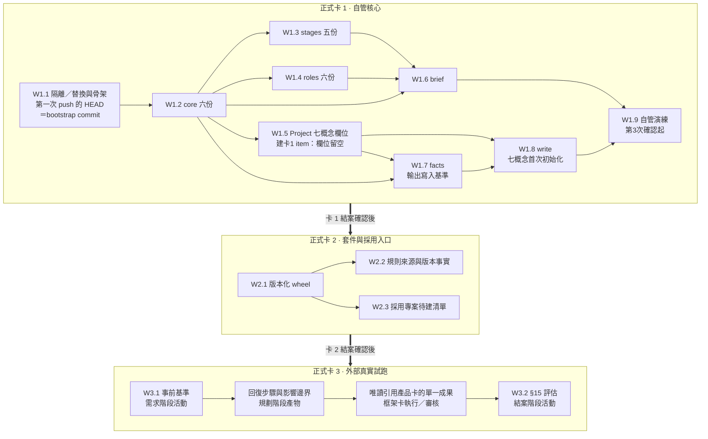

# ai-workflow vNext 重建規劃 v6.3（三張正式卡）

**Context**：`docs/research/VNEXT-REQUIREMENTS-2026-09-21.md` 已由需求方核定。v5（761 行）經 Fable 與 Astra 獨立查核後不 APPROVE；v6／v6.1／v6.2 逐項修訂。本版（v6.3）只處理三項文字修正：bootstrap commit 的現況表述、W1.5／W1.8 的時序、工作包分支前綴。⛔ 不新增需求、正式卡、機制、確認點、工作包或裁定題。

---

## 修訂摘要（七項 finding 的逐項落點）

| # | Finding | 處置 | 落點 |
|---|---|---|---|
| 1 | W1.9 要求「全五階段由 `write` 管理」，但 `write` 與新 Project 在執行階段才存在 | W1.9 改為**第 3 次確認開始**由 `write` 更新與留言，並為 #4 產出 brief。第 1、2 次保留當時的人工／`gh` 原生紀錄，在 #1 畫面標為 **bootstrap**，⛔ 不重貼、⛔ 不冒充當時已有工具。卡 1 的 Project item 在 W1.5 建板後建立（欄位留空或平台預設），**七個核心概念的首次初始化在 W1.8 由 `facts` → `write` 正常路徑完成**。完整五階段自管證據仍由卡 2 提供 | D2#1、D3 W1.9、E、J2、端到端 7 |
| 2 | 卡 3 的「含兩個主要成果就拆成相連任務」會在本輪長出第四張正式卡 | 卡 3 **恰一個主要成果**：候選任務若含開發與部署等兩個成果，只選其中**可獨立驗收**的一個；其餘成果列為本次三卡範圍外，⛔ 不得成為試跑前置或完成義務。無法獨立驗收 ⇒ **重選任務**。刪除「本輪拆出相連任務」的驗收 | D5、D2#11、E、端到端 15–16 |
| 3 | 「缺基準即拒寫」被寫成正常路徑，等於每次 mutation 先失敗一次 | `facts` 輸出 **Project item 與 Issue 的 `updatedAt`**＝寫入基準。**正常路徑＝`facts` → `write --expect-updated-at`，一次成功**；缺基準拒寫只是**負控與安全網** | C5、E W1.7／W1.8、H、端到端 6 |
| 4 | `--dry-run` 與基準的關係未定；退回演練的乾淨性證據不足 | `--dry-run` 零 mutation，**不要求基準**；若提供基準則執行相同 stale 比對並印 would-write。退回演練**預設 `--dry-run`**；證據同時比對正式卡 **Project 欄位**與 **Issue 留言數**未變。可拋棄測試資料**只在 dry-run 不足時**使用，並寫明建立者與清理步驟 | C5、D3 W1.9、E、G2、端到端 7 |
| 5 | W1.1 若先推整合分支，第一次 push 會落在舊 CI 條件下 | **第一次 push 的 HEAD 必須是含 CI 隔離條件與骨架的 bootstrap commit**。分支上已存在的本機未推送 commit `bb74bf3` 可以是它的祖先——該 commit 從未單獨 push，⛔ 不會產生任何舊 workflow run。證據＝第一次 push 所觸發 run 的 head SHA 等於 bootstrap SHA，且該 SHA 上的 `.github/workflows/ci.yml` 已含隔離條件。⛔ 不得先推一個 HEAD 仍含舊 CI 的整合分支 | D3 W1.1、E、G1、端到端 1 |
| 6 | `test_adopt_assets.py` 對改動後 `ci.yml` 寫成「紅或綠都記錄」 | 該測試逐字比對 `ci.yml`，**已知必紅**。明寫「記錄實際輸出」，⛔ 不寫紅或綠、⛔ 不列為待驗證項 | E W1.1、G1、端到端 1 |
| 7 | G1 未列 `.github/ISSUE_TEMPLATE/list-intake.yml` | 加一列：**對 vNext 不適用**；vNext 開卡由 PM 以 `gh issue create --body-file` 執行 | G1、C4 |

---

## 0. 結構定義

| 名詞 | 定義 | 數量 |
|---|---|---|
| **正式卡** | 一張 GitHub Issue ＋ 一個 Project item，唯一主要成果、唯一 owner、唯一最終需求方，完整走需求→規劃→執行→審核→結案 | **恰 3 張** |
| **工作包** | 正式卡**已核定規劃內**的有界交付單位，有邊界、依賴、可檢查證據。⛔ 不是 Issue、⛔ 不進 Project、⛔ 不是子階段、⛔ 不是獨立確認點、⛔ 不各自被退回 | 卡 1：9／卡 2：3／卡 3：0 |
| **階段活動** | 掛在特定階段、必須在該階段內完成的產出 | 見各卡 |
| **人工階段確認** | 需求方在一個畫面內確認該階段成果、疑慮與下一步 | **15 次＝無退回正常路徑** |

**15 次的語意**：15＝無退回時的基準次數（3 卡 × 5 階段）。**合法退回後，被退回的正式階段必須重新完成並重新確認，這不是增生。** 增生＝「無退回情況下同一階段出現第二次確認」或「以工作包／子階段為主題的確認」。研究子狀態、正常實作修正、測試重跑、非阻擋觀察、工作包完成⛔ 都不增加確認點（需求 §2 逐字）。

---

## A. 需求方已裁定

### A0'. 三卡結構

正式卡 3 張（自管核心／套件與採用入口／外部真實試跑），每張完整五階段。原 V／P／E 項目降為工作包或階段活動。工作包可由不同執行者協作，**每卡一位 owner 對整體交付負責**。**所有參與該卡產出者（含 owner 與每位工作包執行者）⛔ 均不得擔任該卡正式審核者**（比 §6 更嚴，本裁定優先）。退回的最小粒度是整張正式卡。卡 3 是 ai-workflow 自己的框架正式卡（#384），走它自己的五階段；外部專案的真實任務是**它自己 repository 上的獨立產品卡**（CPBL #177），走該產品卡自己的五階段，其階段確認⛔ 不計入本規劃的 15 次。卡 3 對產品卡只做**唯讀引用**，⛔ 不巢狀五階段、⛔ 本輪不拆出第四張框架正式卡。

### A1–A4

| # | 裁定 | 效力 |
|---|---|---|
| **A1** | 新建 vNext 專用 Project；**固定七個核心概念**；模組⛔ 不得新增／刪除／改義／改值域，模組資料走 `.wf/`、任務輸入、`brief` 注入、`facts` 檢查。部署與維護是**任務類型**，不是階段；兩個主要成果拆成相連任務（**這是框架通則；卡 3 本輪的適用方式見 D5——只選一個可獨立驗收的成果，⛔ 不在本輪開第二張框架正式卡**） | C4、G2、W1.5、D5 |
| **A2** | vNext 成果放獨立 `vnext/` 新樹；通過外部試跑後**另立切換需求** | D7、G3 |
| **A3** | 允許新增 `.github/workflows/vnext.yml`，只跑 vNext 直接行為；⛔ 不加行數硬門檻、⛔ 不加禁字掃描、⛔ 不作散文判讀；初期⛔ 不列 main required checks | G1、C7 |
| **A4** | 狀態六值：待辦／進行中／待確認／阻塞／完成／停止。**沒有「退回」狀態**；退回是事件（階段改回＋狀態設待辦或進行中＋一則含原因與證據的留言）。CLI ⛔ 不判退回合法性、⛔ 不建轉移表 | C3、C5、G2 |

> **A3 的「零改 `ci.yml`」前提已被需求方 2026-09-21 的最新裁定取代。** A3 允許新增 `vnext.yml` 的部分不變；但需求 227／228 要求對舊檢查安排隔離或替換且不接受暫時例外，因此本版**明示改動 `ci.yml` 的 job 層適用條件**（見 G1）。這不是新裁定題，是執行既有裁定。

### A1'. 選定方案

- **隔離靠位置＋明示停用**。vNext 全部放 `vnext/`；`ci.yml` 只改三個舊 job（`commit-trailer`／`reachability`／`cli-tests`）的適用條件，⛔ 不改任何 job 的內容。
- **所有 vNext 分支一律以 `codex/vnext-` 前綴命名**（整合分支 `codex/vnext-rebuild`、工作包分支 `codex/vnext-<工作包>`）；`ci.yml` 的隔離條件與 `vnext.yml` 的 `branches` 使用**同一個 pattern**。這是現有 CI 隔離手段的輸入限制，⛔ 不是新機制。
- **CLI 只有三個動詞**：`brief`／`facts`／`write`。採用入口⛔ 不新增第四個動詞。開卡／關卡走 `gh` 原生（平台協調操作）。
- **狀態機被刪除，不被重寫**。階段＝位置（5 值），狀態＝內建 `Status` 的 6 個選項，CLI 只檢查值在值域內。
- **卡面 JSON 被刪除**。Issue body ＝ 5 個固定章節＋自由文字。
- **工作包不進 GitHub 機制**。工作包清單住在該卡**已貼出的規劃階段完成留言**（＝已核定階段產出，`brief` 可取得），⛔ 不開子 Issue、⛔ 不加欄位、⛔ 不建計數器。
- **角色六值、六份獨立文件**；Project 只有 `owner`(text)。
- **模型資料是分層注入的資料**，`brief` 只載入呈現。
- 舊碼只有 3 個純事實檔直接重用，其餘 5 檔借形狀重寫。

**主要取捨**

- 改 `ci.yml` 的 job 適用條件：代價＝整合分支上的 `ci.yml` 與 main 不同，`test_adopt_assets.py` **必紅**（已知，非未驗證），切換時要處理。換來需求 227 被逐字滿足，⛔ 無暫時例外。
- 不沿用 Project #8：26 個舊 item 留在舊板，換零遷移。
- 使用內建 `Status`：代價＝欄名可能無法中文化（**未驗證**）。換來狀態只有一個居所。
- 3 張正式卡：代價＝執行階段交付物變大，一個畫面壓力上升（緩解見 D6）。換來 15 次確認與「一卡一成果」對齊。

**直接證據**（本規劃自行讀檔／量測，⛔ 不引用文件內統計）

- `ci.yml:22-24` 只有 `on: push:` / `pull_request:`，⛔ 無 `branches:`；四個 job key＝`secret-scan`(38)／`commit-trailer`(52)／`reachability`(83)／`cli-tests`(98)。
- `.github/workflows/` 下目前只有 `ci.yml`；`.github/ISSUE_TEMPLATE/` 下只有 `list-intake.yml`。
- `trailer_check.py:19` `ALLOWED = {requested-by, planned-by, implemented-by, reviewed-by, co-authored-by}`；第 53–62 行只在 trailer 存在時驗鍵。
- `test_adopt_assets.py:27,29` `CI = '.github/workflows/ci.yml'`、`JOBS_ANCHOR = '\njobs:\n'`。
- `reachability.py` 讀 `core/state-machine.md`、`core/enums.md`、`modules/*/module.md`；`source_budget.py:23` `TARGET="cli/src/wf"`；`test_context_roots.py:102` 的 glob 只有 `core/*.md` 與 `modules/*/module.md`。
- `test_baseline_parity.py:32` `BASELINE_SHA = 'f69f6216e575ec881222fc20549685795e2fc1c8'`，釘 `cli/src`。
- ruleset `20768920` 只套 `~DEFAULT_BRANCH`；`codex/vnext-rebuild` 實測生效規則數＝0、`bypass_actors: []`。
- `git branch -r` 無 `origin/codex/vnext-rebuild`；`gh run list --branch codex/vnext-rebuild` 回 `[]` ⇒ **W1.1 會是第一次 push，也會是第一個 PR**。本機該分支已有一筆未推送 commit `bb74bf3`（`docs: define vNext rebuild requirements and scope`），因從未 push，⛔ 未產生任何 workflow run。
- Project #8 現有自訂欄位五個（`階段`8 值／`狀態`9 值／`級別`T0–T4／`owner`／`卡ID`）。
- 新 Project 必有內建 `Status`（Todo／In Progress／Done）等 13 個內建欄位。
- 可重用層實測非空行：`client.py` 218／`target.py` 214／`writes.py` 191／`localgit.py` 36／`localrev.py` 41／`context.py` 136／`blocks.py` 172／`project_config.py` 49。

---

## B. 方案比較

### B1. vNext 位置與舊檢查處置（A2＋A3＋需求 227／228）

| 方案 | 內容 | 採用 / 不採用 |
|---|---|---|
| **新樹 `vnext/` ＋ 逐 job 明示隔離／替換**（採用） | 成果全在 `vnext/`；`ci.yml` 只改三個舊 job（`commit-trailer`／`reachability`／`cli-tests`）的適用條件；`secret-scan` 由 vNext 重新說明後保留；另開 `vnext.yml` | **採用**。需求 228 逐字要求「列出仍會作用的舊檢查，並為 vNext 停用、隔離或替換」，且需求方明示不接受暫時例外。改動面＝`ci.yml` 內上述三個舊 job 的 `if:`，⛔ 不改任何 job 內容 |
| 零改 `ci.yml`，靠「舊 job 掃不到 `vnext/`」 | v5 方案 | **不採用（需求方已否決）**。舊 job 仍在 vNext 分支上跑並能擋合併＝仍在治理，且 `commit-trailer` 的五鍵白名單會實際擋住 vNext commit |
| 就地改寫 `core/` | 直接重寫舊規則 | 不採用。改 `core/` 當下 `reachability` 與綁 repo root 的 `cli-tests` 轉紅，且改動會進 main |
| 另開 repo | vNext 放新 repository | 不採用。需求 226 逐字「在隔離分支重建」 |

### B2. CLI 動詞切分

| 方案 | 採用 / 不採用 |
|---|---|
| **三動詞 `brief`／`facts`／`write`**（採用） | 對應需求 §11 四件事；`facts` 必須能在審核者的乾淨 checkout 獨立重跑，不能只是 `brief` 的一段輸出 |
| 加 `init`／`adopt` 第四動詞 | 不採用。CLI 寫採用者檔案樹＝舊 `_adopt*.py` 704 行＋3,111 行 mutation 測試的入口，撞需求 235 |
| 加開卡／關卡進 `write` | 不採用。需求 §11 的 CLI 四件事無「建立任務」；改由 PM 以 `gh` 原生執行（C4） |
| 單動詞全印／沿用舊 7 動詞 | 不採用。前者讓 `--dry-run` 語意模糊、審核者無法逐字比對；後者的 `open`／`move`／`return` 綁 29 鍵卡面與 16 條轉移表 |

### B3. 角色形狀

**採用**：六角色、六份獨立文件、Project 只有 `owner`(text)。需求 §5 分列五個角色、§4 另立研究者責任、§6 逐字要求「研究者與規劃者使用不同工作實體或乾淨工作階段」——折疊成同一角色值就無法表達；§10 逐字「角色…各有獨立文件」。
**不採用**：四角色＋身分註記（`brief` 無法對研究者與規劃者印不同必要清單）；六角色＋角色狀態機（撞 §13 與 A1）。

### B4. 模型資料政策

**採用**：使用者層兩類純資料（`model-usage.md` 穩定／`model-availability.md` 短期，每則含來源與最後確認時間）＋規則條文寫在 `core/boundaries.md` 與 `roles/PM.md`，`brief` 只載入呈現。
**不採用**：為它開第 18 份規則文件（內容約 10 行，撞 §1 不為單一情境建機制）；`models` 動詞或額度查詢（§11 §14 逐字排除）；TTL／自動過期（§10 逐字排除）。

### B5. 退回的表達（A4 定稿）

**採用**：六狀態＋退回是事件。階段欄表達「回到哪」，狀態欄表達「現在有沒有人在做」，兩者正交。
**不採用**：五狀態（退回後無人承接卻標進行中＝看板謊報）；第七個「退回」狀態值（狀態同時是事件＝舊狀態機回流入口）。

### B6. 正式卡顆粒度（A0' 定稿）

**採用**：3 張卡＋卡內工作包。三張卡各對應一個需求方能獨立判斷的主要成果。
**不採用**：每個交付項目一張卡（主要成果變構件，撞 §2；確認次數乘五，撞 §1）；1 張大卡（需求方失去「自管可行」與「外部可安裝」兩個分水嶺）。

---

## C. 目標架構與責任邊界

### C1. 目錄

```
vnext/
  rules/
    core/
      flow.md            五階段順序、需求鎖定、方向改動即回需求、四種審核結果、
                         一次確認一個畫面與四種不增加確認點的情形、
                         退回是事件（階段改回＋狀態＋一則留言）、
                         部署／維護是任務類型不是階段、兩個主要成果拆成相連任務、
                         工作包只能在已核定規劃內執行、階段證據原則（D0）
      independence.md    角色獨立性、乾淨工作階段、跨家族審核、高風險兩視角、
                         所有參與產出者不得擔任該卡正式審核者
      research.md        研究子狀態：一次一問、來源與分歧、影響邊界、網路使用標註
      values.md          純機械值域，⛔ 無轉移表
      github.md          Issue 五章節、七個核心概念、留言四類、
                         開卡／關卡＝PM 的 `gh` 原生平台協調操作（含 --body-file），
                         寫入基準由 facts 提供、缺基準即拒寫、不宣稱原子性
      boundaries.md      分層注入四層、使用者層兩類模型資料、專案層政策、
                         CLI 邊界、模組四禁、偏移／根因／停止條件、注意事項候選
    stages/   需求.md 規劃.md 執行.md 審核.md 結案.md
    roles/    需求方.md PM.md 研究者.md 規劃者.md 執行者.md 審核者.md
  .wf/        config.json、model-policy.md（vNext 自己的專案層）
  cli/
    pyproject.toml
    src/wfx/
      core/     ⛔ 不得 import wfx.gh；任務識別＝不透明 str
      gh/       client / target / writes / localgit / localrev
      verbs/    brief / facts / write / main
    tests/
.github/workflows/vnext.yml     只跑 vnext/cli/tests，帶 codex/vnext- 分支 pattern＋pull_request
.github/workflows/ci.yml        僅三個舊 job 的適用條件受控改動（G1）
```

規則文件＝core 6 ＋ stages 5 ＋ roles 6 ＝ **17 份**（卡 2 的 W2.3 另加 `core/adopt.md`＝18 份）。模組名 `wfx`，卡 1 以 `PYTHONPATH=vnext/cli/src python -m wfx ...` 呼叫；console script 在 W2.1 提供。

### C2. 分層注入（§10）

1. **框架核心**＝`vnext/rules/`。模型資料的**規則本體**在這層；⛔ 不含任何具體模型名稱、額度數字或帳號狀態。
2. **使用者層**＝`~/.wf/`，兩檔由既有逐檔掃描載入（⛔ 不寫專用 parser）：`model-usage.md`（穩定：家族劃分、各自適合什麼、呼叫慣例）、`model-availability.md`（短期：每則含來源與最後確認時間；⛔ 不含憑證）。
3. **專案層**＝`--project-root` 下的 `.wf/`，可放 `model-policy.md`。模組補充資料也住這層。
4. **任務層**＝Issue body 五章節＋Project 七個核心概念＋**該卡已貼出的階段完成留言（＝已核定階段產出）**。

每段輸出帶 `[來源: kind:path#節]` 標記，kind 四值對應四層。⛔ 不做 delta 合成、⛔ 不做模組層。

**時效處理（無機制）**：短期備註新鮮度由 PM 在派工當下確認並寫進派工內容；過期或不確定即視為 unknown，照常派工但標明。⛔ 不建 TTL、自動過期、重置時間計算、額度查詢或模型選擇引擎。`unknown` 是備註文字，⛔ 不進值域、⛔ 不成為欄位。

### C3. 值域（`core/values.md`，無轉移表）

- 階段（5）：需求／規劃／執行／審核／結案
- 狀態（6）：待辦／進行中／待確認／阻塞／完成／停止
- 角色（6）：需求方／PM／研究者／規劃者／執行者／審核者
- 風險影響（3）：一般／重要／高風險　　緊急性（3）：一般／限時／緊急
- 審核結果（4）：批准／退回執行／退回規劃／退回需求（**寫在留言，⛔ 不是狀態值**）
- 研究的網路使用（3）：必要／允許／禁止

**退回的機械形狀**（寫在 `core/flow.md`，⛔ 不進值域）：(1) 階段改回需求／規劃／執行其一；(2) 狀態設 `待辦` 或 `進行中`；(3) 留一則含原因與證據的留言。CLI 只檢查值在值域內。**`iteration` 只識別一次執行嘗試；退回次數由既有事件歷史（階段欄變更與留言）由人推導，⛔ 不新增欄位、計數器或自動升級。**

⛔ 無模型值域、⛔ 無任務類型值域、⛔ 無工作包值域與狀態。角色值只用於 `brief --role` 與規則適用面。

### C4. GitHub 呈現（§12、A1）

**Issue body 五章節**（CLI 只驗「標題在且其下非空」）：`## 需求`（問題／主要成果／最終需求方；相連任務以 issue 連結標明）、`## 限制與非目標`、`## 驗收`、`## 風險與假設`、`## 裁定紀錄`。

**`## 裁定紀錄` 只放留言連結索引；裁定的權威居所是留言。** 首則＝需求核定紀錄（裁定者／內容／時間），在第 1／6／11 次確認時產生，使該章節非空。

**七個核心概念（唯一來源，schema 固定）**

| 概念 | 落地 | 值域 |
|---|---|---|
| 狀態 | **內建 `Status` 欄位**（唯一狀態欄） | 選項替換為六值：待辦／進行中／待確認／阻塞／完成／停止 |
| 階段 | 自訂 SingleSelect | 5 值 |
| owner | 自訂 text | 該卡唯一 owner |
| 風險 | 自訂 SingleSelect | 3 值 |
| 緊急性 | 自訂 SingleSelect | 3 值 |
| 期限 | 自訂 date | — |
| Resource | 自訂 text | 當前占用者／用途／存取模式／釋放條件，⛔ 不存歷史 |

**自訂欄位恰六個；`Status` 是第七個核心概念，由內建欄位承載。** 內建 `Status` 能否改名為 `狀態` **未驗證**——W1.5 的第一個實測就是這件事；能改則改名，不能改則沿用 `Status` 欄名並在 `core/github.md` 註明「`Status`＝狀態」。**其餘 12 個內建欄位列為不使用、不寫入，預設 view 以 `Status` 分欄。** 模組⛔ 不得新增／刪除／改義／改值域這七個概念。

**開卡與關卡＝PM 的平台協調操作**：以 **`gh issue create --body-file <五章節檔>`**（⛔ 不經 GitHub UI，⛔ 不套 `.github/ISSUE_TEMPLATE/list-intake.yml`）、`gh project item-add`、`gh issue close` 執行，寫進 `core/github.md`。**⛔ 不算框架外人工補救、⛔ 不擴充 `write` 公開契約。** item 建立當下欄位留空或維持平台預設；**七個核心概念的初始值由 PM 在 `write` 可用之後，以 `facts` → `write --expect-updated-at` 正常路徑寫入**。

**留言四類**：階段完成卡、需求方裁定、阻塞／解除、結案。退回事件的留言歸入前兩類之一。⛔ 工作包完成不發留言、⛔ 不貼移動紀錄、欄位 hash、CLI 長輸出。

期限／風險／緊急性／資源⛔ 不寫進 body（雙寫）。模型可用性住使用者層，⛔ 不進 body、⛔ 不進欄位。工作包清單住已核定的規劃階段完成留言。

### C5. 三個動詞的契約

| 動詞 | 輸入 | 輸出 | 明確不做 |
|---|---|---|---|
| `brief --task <id> --role <r> --stage <s>` | 四層來源（第 4 層＝Issue 五章節＋七個核心概念＋**該卡已貼出的階段完成留言**） | 一個畫面的派工／接手資訊：適用規則段落（含來源標記）＋任務資料（含當下階段與狀態）＋**已核定階段產出原樣納入**＋該角色該階段的必要清單＋使用者層兩類模型資料（逐字呈現其來源與最後確認時間）＋專案層政策。`--role` 收六值，各自載入 `roles/<r>.md`＋`stages/<s>.md` | ⛔ 不判內容品質、⛔ 不選模型、⛔ 不呼叫 AI、⛔ 不查額度、⛔ 不判備註是否過期或缺欄、⛔ 不解析散文語意、⛔ 不判退回是否合法、⛔ 不認識「工作包」（工作包清單只是任務層自由文字，原樣呈現） |
| `facts --task <id> [--sha <sha>]` | GitHub＋本機 git | 六類客觀事實：Issue 五章節存在且非空、**七個核心概念的當下值**、**該 Project item 與該 Issue 的 `updatedAt`（＝`write` 的寫入基準，標明各自來源物件）**、`rev-parse`／`log`／`diff --stat`／`merge-tree`、CI check 結論、權限三態（allowed／denied／unknown）。W2.2 起另印規則來源與版本 | ⛔ 不判「證據夠不夠」、⛔ 不以空結果冒充「沒有改動」、⛔ 不碰模型資料、⛔ 不推導退回次數、⛔ 不重建轉移歷史、⛔ 不統計工作包完成度 |
| `write --task <id> --field k=v … [--comment-file f] --expect-updated-at <ts>` | 同上 | 寫七個核心概念之一／貼留言；寫入前只檢查值在值域內、並以基準比對；`--dry-run` 保證零遠端 mutation | ⛔ 不在缺基準時代呼叫者讀回後逕行寫入、⛔ 不宣稱基準讀取與寫入之間具原子性、⛔ 無 envelope／fingerprint／`completed_writes`／續作／鎖定服務／寫入帳本、⛔ 不寫使用者層或模型資料、⛔ 不判轉移合法性、⛔ 不要求留言與欄位改動成對出現、⛔ 無開卡／關卡能力、⛔ 無工作包層級入口 |

**可重現性的成立條件**：`brief`／`facts` 的輸出**只在全部輸入不變時**（同一 `--task`、同一 SHA、同一規則來源、同一遠端任務資料）逐字一致。**遠端資料變動導致輸出不同是正確行為**；⛔ 不得為了讓測試穩定而快取或凍結即時遠端資料。測試以「同一次讀取的快照重跑」或「唯讀固定 SHA 的本機事實」建立可比對面。

**遠端寫入的基準（定稿）**

- **正常路徑＝`facts` → `write --expect-updated-at <ts>`，一次成功。** `facts` 已輸出 Project item 與 Issue 各自的 `updatedAt`，呼叫者從那裡取基準；改 Project 欄位帶 item 的、貼留言帶 Issue 的。**⛔ 不得把「每次 mutation 先失敗一次再重送」寫成正常路徑。**
- **缺 `--expect-updated-at` ⇒ 拒絕寫入**（rc≠0、遠端零 mutation），輸出被修改物件的當下值與當下基準。這是**負控與安全網**，用途是擋掉「跳過確認直接寫」，⛔ 不是預期會頻繁走到的路徑。
- **基準不符 ⇒ 同樣拒寫**，輸出當下值與當下基準；呼叫者重新確認後以新基準重送。
- **`--dry-run`：零遠端 mutation，⛔ 不要求基準。** 若有提供基準，則執行**相同的 stale 比對**並印出 would-write（含比對結果）；未提供則只印 would-write 並標明「未做基準比對」。
- **⛔ 不宣稱基準讀取與寫入之間具有原子性**：基準只縮小視窗，⛔ 不構成鎖。`core/github.md` 明寫此限制。

**退回的呼叫形狀**：`--field` 可一次帶多個鍵，因此一次退回事件＝**≥1 次欄位寫入 ＋ 1 則留言**；CLI ⛔ 不耦合兩者、⛔ 不阻擋單獨呼叫（兩次呼叫各自帶自己物件的基準）。

### C6. 核心與 GitHub 型別的切分

- `wfx.core.Context` 只有 `project_root`、`rules: RulesSource`、`task_id: str`（不透明）、`config: dict`。
- GitHub 專屬事實由 `wfx.gh` 產生 `GhFacts`，在動詞層與 `Context` 並列傳遞，⛔ 不進 `Context`。
- 使用者層與專案層走同一條 `RulesSource`，⛔ 不新增型別。
- 機械錨：一個測試斷言 `wfx/core/**` ⛔ 無 `import wfx.gh`、⛔ 無 `subprocess`；同一測試斷言 `wfx` 全樹⛔ 無 HTTP／模型 provider SDK import（沿用 `test_gh_scope.py:42-49` 的 import-scope 形狀）。這是對**程式碼結構**的檢查，不是散文判讀，不違反 A3。

### C7. 規模警示（§8「行數只作警示」）

| 目標 | 警示線（非空行） |
|---|---|
| `vnext/rules/`（17 份） | ≤ 600 |
| `vnext/cli/src/wfx/`（卡 1／卡 2 完成後） | ≤ 900 ／ ≤ 1,050 |
| `vnext/cli/tests/` | ≤ 1,200 |
| 單一規則文件 | ≤ 60 |

`~/.wf/` 與採用專案 `.wf/` ⛔ 不計入。**超量不是失敗，⛔ 不作為任何卡或工作包的通過條件**；超量時在階段卡說明每段直接保護哪條需求，無直接需求即刪。⛔ 不設 rc≠0 的行數 gate、⛔ 不在 `vnext.yml` 內設任何行數門檻。

### C8. 採用入口

- **安裝＝版本化 wheel**（`pip install ai-workflow-vnext==<版本>`）；規則樹以 package data 打包，`RulesSource` 預設解析到已安裝套件，`--rules-root` 可覆寫指向本機 checkout。
- **採用入口＝`brief` 的待建清單**，不是新動詞、不是 CLI 寫檔。缺 `.wf/config.json` 或缺必要鍵時，`brief` 印出：缺哪些項、每項形狀、`.wf/` 應放在哪；清單含選用的 `model-policy.md`（註明⛔ 不放帳號額度或時效資料）與**該專案 Project 應具備的七個核心概念**（含「`Status` 六選項為狀態唯一居所」與「模組不得改這七個概念」）。
- ⛔ 不做：manifest 整檔對帳、`deactivate` 反向移除、gitlink 四列對帳、九種結構缺陷代號、舊版相容層、遷移層、單一專案耦合、寫入 `~/.wf/`、代建或代改 Project 欄位。
- 規則本體＝`vnext/rules/core/adopt.md`（第 18 份，W2.3 產生）。

---

## D. 三張正式卡

### D0. 階段證據原則（⛔ 非新機制）

**任一階段的驗收證據，只能由該階段結束前已經存在的活動產生。** 具體：

- 執行階段的驗收⛔ 不得以審核階段或結案階段的活動為前提。
- **也不得以尚未建成的工具為前提**：`write` 與新 Project 在執行階段（W1.5／W1.8 完成）之後才存在，卡 1 第 1、2 次確認的紀錄因此是 **bootstrap**，以人工／`gh` 原生產生，⛔ 不得事後重貼成「由 `write` 產生」。
- 審核階段只核對交付當下 SHA 上已存在的事實；再次審核只檢查先前阻擋項及其相關回歸（需求 82）。
- 結案階段⛔ 不修改成果內容（需求 90）；該階段新增的**協調性動作**（開下一張卡、關閉本卡）是平台協調操作，⛔ 不是成果內容。
- 規劃者與獨立審核者⛔ 不得被要求在執行階段提前交付。執行者自檢在執行階段，正式審核集中在審核階段。

**結案階段的固定序**：PM 整理結案卡 → 在該卡的第 5／10／15 次確認中取得**需求方的合併授權** → PM 合併 → 驗證合併結果 → 驗證結論回報進**同一則**結案留言。**⛔ 不為此新增例行確認點**；驗證失敗且與本次成果有關 ⇒ 依需求 88 退回執行階段處理，該階段之後須重新確認。

### D1. 總覽與 DAG

三張卡線性相依，⛔ 不得平行。卡內工作包可平行。

| 正式卡 | 主要成果（唯一） | 前置 | 交付所在 |
|---|---|---|---|
| **卡 1 · 自管核心** | vNext 能以分層注入、客觀事實與狀態寫入管理自己的任務卡 | — | `vnext/`、`vnext.yml`、`ci.yml` 隔離區塊、新 Project |
| **卡 2 · 套件與採用入口** | 外部專案能安裝並載入框架 | 卡 1 結案 | `vnext/` 的套件化與 `adopt.md`；wheel |
| **卡 3 · 外部真實試跑** | 判定框架是否具備首次採用條件 | 卡 2 結案 | ai-workflow 的 §15 評估記錄；證據來源＝外部**獨立產品卡**的**單一可獨立驗收成果**（唯讀引用） |



可平行集合：{W1.3, W1.4, W1.5}、{W2.2, W2.3}。

### D2. 15 次人工階段確認（無退回正常路徑）

| # | 卡 | 階段 | 該次確認呈現的一個畫面 |
|---|---|---|---|
| 1 | 1 | 需求 | 主要成果；限制與非目標；驗收；風險與假設；**Grilling 記錄**（`stages/需求.md` 尚不存在，以需求文件 §3.1 逐項人工執行）；A0'／A1–A4 與需求 227 隔離安排的落點；**本次確認的卡片紀錄標為 bootstrap**——`write` 與新 Project 尚不存在，欄位與留言以人工／`gh` 原生產生，⛔ 不事後重貼 |
| 2 | 1 | 規劃 | 選定方案（B1–B6）；九個工作包的邊界、依賴與直接證據；**需求條號 → 預定文件對照表**；回復；停止條件。**本次確認同為 bootstrap 紀錄** |
| 3 | 1 | 執行 | 九個工作包的完成狀態與**單一交付清單**；實現後對照表；與原規劃不同的局部調整；人工補救記錄。**本次起欄位更新與階段完成留言由 `write` 產生** |
| 4 | 1 | 審核 | 獨立審核者（未參與任何工作包、不同模型家族、乾淨 worktree、exact SHA）的核對結論與四種審核結果之一；其派工輸入＝W1.9 產出的 `brief` |
| 5 | 1 | 結案 | 結案卡 → **需求方合併授權** → 合併整合分支 → 驗證 → 同一則留言回報；**AS1／AS2 的自管證據**；未驗證項標記；卡 2 是否可開始 |
| 6 | 2 | 需求 | 主要成果；限制與非目標；驗收；**Grilling 記錄**（可改以 `stages/需求.md` 執行） |
| 7 | 2 | 規劃 | 套件格式、規則來源解析、待建清單形狀；三個工作包的邊界、依賴與證據；對照表；回復 |
| 8 | 2 | 執行 | 三個工作包的交付清單與證據；局部調整；人工補救記錄 |
| 9 | 2 | 審核 | 獨立審核者在乾淨 venv 的重現結論 |
| 10 | 2 | 結案 | 授權 → 合併 → 驗證 → 回報；**此時「vNext 能管理自己的下一張任務」才取得完整五階段證據** |
| 11 | 3 | 需求 | 外部專案與**證據來源產品卡**選定（該卡是獨立產品卡，⛔ 不是本卡的工作包）；**取作證據的單一可獨立驗收成果，以及明列為本次範圍外的其他成果**；該成果作為證據的問題／限制／驗收；**W3.1 事前三項**（預期成果／人工介入點／可接受流程成本）＋**影響邊界**；Grilling 記錄 |
| 12 | 3 | 規劃 | 方案比較、影響範圍、步驟、分工、**回復步驟**與直接證據 |
| 13 | 3 | 執行 | 唯讀引用的產品卡成果證據與自檢；框架外人工補救如實記錄；偏移／越權如實記錄 |
| 14 | 3 | 審核 | 跨模型家族、乾淨工作階段、exact SHA 的獨立審核結論 |
| 15 | 3 | 結案 | 授權 → 合併 → 驗證 → 回報；**W3.2**：§15 六項記錄、需求 250 七項條件核對、三份使用成本記錄、需求方對「是否具備首次採用條件」的裁定 |

**退回後的重新確認**：任一次確認產生「退回執行／退回規劃／退回需求」時，被退回的階段重新完成後**必須重新確認**，編號沿用該階段的原編號並註明第 n 輪。這**不是增生**。

### D3. 正式卡 1 · 自管核心

**主要成果（唯一）**：vNext 能以分層注入、客觀事實與狀態寫入管理自己的任務卡。九個工作包是達成這一個成果的必要構件。

**owner 責任**：對整體交付負責；在已核定規劃內決定工作包派工與順序；彙整單一交付清單；守住工作包邊界（任一工作包要改成果／公開契約／主要技術／風險／驗收 ⇒ 立即停止該工作包並整卡退回需求）。**owner 與任何工作包執行者⛔ 不得擔任本卡正式審核者。owner ⛔ 不因 owner 身分取得流程狀態寫入權**——Project 欄位與留言由 PM 依已裁定處置寫入（需求 §5.2）。

**工作包**

| # | 工作包 | 邊界 | 依賴 |
|---|---|---|---|
| W1.1 | **舊檢查隔離／替換＋骨架** | 依 G1 讓 `commit-trailer`／`reachability`／`cli-tests` 對 vNext 分支停用（**條件須同時涵蓋 push 的 `ref_name` 與 pull_request 的 `head_ref`／`base_ref`**，並以 `codex/vnext-` 前綴 pattern 表達；⛔ 不改 job 內容）；建 `vnext/` 空骨架與 `.github/workflows/vnext.yml`（`push` ＋ `pull_request`，`branches` 用同一 pattern，⛔ 無行數／禁字 gate，⛔ 不列 required）。**順序固定**：(1) 在本機備妥含 CI 隔離條件與骨架的 **bootstrap commit，並讓它成為第一次 push 時 `codex/vnext-rebuild` 的 HEAD**——分支上已有的未推送 commit `bb74bf3` 可以是它的祖先（該 commit 從未單獨 push，⛔ 不會產生舊 workflow run）；該次 push 本身即以新條件與 `vnext.yml` 執行；**⛔ 不得推出 HEAD 仍含舊 CI 的整合分支**；(2) 再從 `codex/vnext-` 前綴的工作包分支開一個併入 `codex/vnext-rebuild` 的 PR，取得 pull_request 路徑證據。⛔ 不寫任何規則或 CLI 內容 | — |
| W1.2 | `core/` 六份 | flow／independence／research／values／github／boundaries。`flow.md` 含退回三動作、任務類型、工作包邊界、**D0 階段證據原則（含 bootstrap 例外）**；`github.md` 含七個核心概念、**開卡／關卡＝PM 的 `gh` 原生平台協調操作（`--body-file`，不套舊 ISSUE_TEMPLATE）**、**寫入基準由 `facts` 提供、缺基準即拒寫、⛔ 不宣稱原子性**；`boundaries.md` 含四層注入、模型資料政策、模組四禁 | W1.1 |
| W1.3 | `stages/` 五份 | 讀者＝該階段執行的人。`結案.md` 含 D0 的固定序。⛔ 不得出現部署／維護／研究階段 | W1.2 |
| W1.4 | `roles/` 六份 | 讀者＝該角色本人。`PM.md` 含：模型與流程協調責任、派工前確認短期模型資料、**保留未參與產出的模型家族給審核**、退回三動作、⛔ 不自行判定退回是否成立 | W1.2 |
| W1.5 | vNext Project 七個核心概念的**欄位建立** | **第一步實測內建 `Status` 能否改名**；替換其選項為六值；建六個自訂欄位；其餘內建欄位列為不使用。**本工作包完成後建立卡 1 的 Project item**（`gh project item-add`），**該 item 的欄位此時留空或維持平台預設——本工作包⛔ 不呼叫尚不存在的 `write`、⛔ 不產生任何首次寫入證據**。七個核心概念的初始值在 W1.8 寫入。⛔ 不動 Project #8 | W1.2 |
| W1.6 | `brief` | 四層注入（含第 4 層的已核定階段產出）＋六角色必要清單＋模型資料載入呈現 | W1.2 W1.3 W1.4 |
| W1.7 | `facts` | `wfx.gh` 事實層＋六類客觀事實（含七個核心概念當下值與 **Project item／Issue 各自的 `updatedAt` 寫入基準**） | W1.2 W1.5 |
| W1.8 | `write` | 值域檢查＋**以 `facts` 提供的基準比對（正常路徑一次成功；缺基準即拒寫為負控）**＋`--dry-run` 零 mutation 且不要求基準。**卡 1 item 七個核心概念的首次初始化在此完成，並作為 `facts` → `write` 正常路徑的一次成功證據**（依當下值寫入，⛔ 不回填第 1、2 次確認當時的歷史值） | W1.5 W1.7 |
| W1.9 | **自管演練（執行階段內可完成）** | 起點＝`write` 與卡 1 Project item 實際存在之後。**自第 3 次確認起**：七個核心概念由 `write` 更新至少一輪、執行階段的階段完成留言由 `write --comment-file` 貼出，並為第 4 次確認產出一份 `brief --role 審核者 --stage 審核`。**第 1、2 次確認保留當時的人工／`gh` 原生紀錄，在 #1 畫面標為 bootstrap，⛔ 不得重貼、⛔ 不得冒充當時已有工具。** 退回機械形狀取得一次證據，來源二選一：(a) 卡 1 期間**自然發生**真實退回 ⇒ 直接引用該事件；(b) 未自然發生 ⇒ **預設以 `--dry-run` 做有界演練**，**⛔ 不得在卡 1 正式卡上真的把階段改回**；`--dry-run` 不足以呈現該形狀時才改用**可拋棄測試資料**，並寫明建立者與清理步驟 | W1.6 W1.8 |

**階段活動**（⛔ 不是執行階段驗收前提，由需求方在 #5 核對）

| 代號 | 掛在 | 內容 |
|---|---|---|
| AS1 | 審核階段 | 本卡審核階段的核心概念更新與階段完成留言由 `write` 完成；審核者以 `facts` 對 exact SHA 獨立重跑 |
| AS2 | 結案階段 | 本卡結案階段的核心概念更新與結案留言由 `write` 完成 |
| AS3 | 結案階段 | **由 PM 以 `gh issue create --body-file` 與 `gh project item-add` 開立卡 2 的 Issue 與 Project item**，並以 `write` 寫入初始七個核心概念、產出卡 2 需求階段的第一份 `brief` 派工輸出。⛔ 不代卡 2 走任何階段 |

**回復**：見 D7。

**停止條件**

- **隔離手段本身不可行**（G1 的 job 層條件與 `branches-ignore` 兩種寫法，都無法**同時在 push 與 pull_request 兩條路徑上**讓舊 job 停止作用於 vNext 分支）⇒ 停止，整卡退回需求，把處置方式提給需求方裁定。
- **第一次 push 的 HEAD 不是 bootstrap commit**（第一次 push run 的 head SHA ≠ bootstrap SHA，或該 SHA 的 `ci.yml` 不含隔離條件）⇒ 停止，說明實際發生的 run 與其結論，退回規劃重排順序。
- 舊 job **因讀到 `vnext/` 內容**而轉紅 ⇒ 整卡退回需求。
- **一般 secret-scan 命中（真的有憑證進 git）⛔ 不升級為需求退回**——執行階段內移除並重跑。
- 規則文件出現轉移表／計數器／新階段／新狀態／角色狀態機／第八個核心概念 ⇒ 停止，退回規劃。
- 任一工作包要改成果／公開契約／主要技術／風險／驗收 ⇒ 停止，整卡退回需求。
- 工作包被開成獨立 Issue、進 Project、或各自發階段確認留言 ⇒ 停止，合回本卡。
- **W1.5 呼叫 `write` 或其驗收要求首次寫入證據** ⇒ 停止，退回規劃（違反 D0「不得以尚未建成的工具為前提」）。
- **W1.9 的演練在卡 1 正式卡上改動了階段欄** ⇒ 停止，依 A4 三動作把它當成真實退回事件處理（該階段須重新完成並重新確認），⛔ 不得事後把它改寫回「只是演練」。
- **第 1、2 次確認的 bootstrap 紀錄被事後以 `write` 重貼或改寫** ⇒ 停止，還原並在 #5 如實說明。

### D4. 正式卡 2 · 套件與採用入口

**主要成果（唯一）**：外部專案能安裝並載入框架。
**owner 責任**：同卡 1。另負責確認**卡 2 全程由 vNext 自己管理**——這是卡 1 主要成果的外部驗證，也是「五階段自管」的完整證據時點（卡 1 因 bootstrap 只能覆蓋第 3–5 階段）。

| # | 工作包 | 邊界 | 依賴 |
|---|---|---|---|
| W2.1 | 版本化 wheel | `pyproject.toml` 版本號、規則樹 package data、console script。⛔ 不加版本比對分支／schema 遷移／legacy 讀取路徑 | — |
| W2.2 | 規則來源與版本事實 | `facts` 印出當下解析到的規則來源與版本；取不到回 unknown。⛔ 不判來源是否正確 | W2.1 |
| W2.3 | 採用專案待建清單 | `core/adopt.md` ＋ `brief` 的待建清單輸出（含 `model-policy.md` 邊界說明、七個核心概念與模組四禁）。**CLI 零寫入採用者檔案樹、零寫入 `~/.wf/`、零建立或修改任何 Project 欄位** | W2.1 |

**停止條件**：出現版本比對分支／schema 遷移／legacy 讀取路徑、`brief` 開始寫採用者檔案樹或代建 Project 欄位、wheel 相依出現模型 provider SDK ⇒ 停止，退回規劃。任一工作包越權 ⇒ 整卡退回需求。

### D5. 正式卡 3 · 外部真實試跑

**形狀**：卡 3＝ai-workflow 自己的框架正式卡（#384），住 vNext 的板，用三動詞管理，走它自己的五階段。外部專案的真實任務是**住在它自己 repository 與板上的獨立產品卡**（CPBL #177，欄位形狀照 C4 的七個核心概念），走該產品卡自己的五階段；它的階段確認⛔ 不計入本規劃的 15 次，它的完成義務、退回、回復與合併責任⛔ 不是卡 3 的。卡 3 對它只做**唯讀引用**——取它已產生的成果、URL、exact SHA、CI 與階段紀錄作為判定證據。⛔ 沒有巢狀五階段、⛔ 不把產品卡當成卡 3 的工作包。

**主要成果（唯一）**：判定框架是否具備首次採用條件。該外部任務自身的成果是達成此判定的載體與直接證據。需求方在 #15 同時面對兩件事（產品卡的成果是否交付成功、框架是否具備首次採用條件），前者是後者的必要證據。**這兩件事分屬兩張卡**：產品卡的交付成敗由它自己的五階段與它自己的需求方結案，卡 3 只據其結果作框架判定；⛔ 不因此在框架側多開一張卡。

**任務選定的單一成果條件**

- 候選任務若含**開發與部署等兩個成果**，卡 3 **只取其中一個可獨立驗收的成果**作為判定證據的載體。
- 其餘成果在 #11 明列為**本次三卡範圍外**：**⛔ 不得成為試跑的前置條件、⛔ 不得成為卡 3 的完成義務、⛔ 不得在本輪拆出第四張框架正式卡**。產品卡自己要不要交付那些成果，由該專案決定。
- 若該任務**切不出可獨立驗收的單一成果** ⇒ **重新選證據來源**（在 #11 之內完成，⛔ 不進入規劃階段再改）。
- A1 的「兩個主要成果拆成相連任務」仍是框架通則，寫在 `core/flow.md` 供採用者使用；**本輪不執行該拆卡**。

| 代號 | 掛在 | 內容 |
|---|---|---|
| W3.1 | **需求階段** | §15 逐字三項：預期成果、人工介入點、可接受流程成本；**加上影響邊界**；**加上單一成果切分結論與範圍外成果清單**。⛔ 不走自己的五階段——它是第 11 次確認的一部分 |
| （無編號） | 規劃／執行／審核 | 就是這張卡的三個階段。**框架側回復步驟、唯讀引用邊界與該專案 `.wf/`／Project 就緒狀態的確認是規劃階段（#12）產物**（需求 52 逐字把回復方式列為規劃交付）；產品卡自身的回復步驟由它自己的規劃階段負責，⛔ 不是卡 3 的交付。**回復步驟未列出前⛔ 不得開始執行階段** |
| W3.2 | **結案階段** | §15 六項記錄＋需求 250 七項條件逐項結論＋三份使用成本記錄（模型資料政策／六狀態／七個核心概念）＋未使用項標「尚未驗證」。⛔ 不走自己的五階段——它是第 15 次確認的一部分 |

**owner 責任**：同卡 1／2。另負責確認 W3.1 的時間戳早於執行階段第一個動作（事後補記等同無基準）；守住單一成果邊界與兩卡邊界（⛔ 不代產品卡決定、⛔ 不把產品卡的完成義務接進本卡）；全程如實記錄框架外人工補救與偏移／越權，⛔ 不當場補機制。

**停止條件**：W3.1 不存在或時間戳晚於執行第一個動作 ⇒ 停止執行，回需求階段補記並重新確認；**卡 3 出現第二個完成義務成果，或範圍外成果被當成前置** ⇒ 停止，回 #11 重新界定或重選證據來源，**⛔ 不開第四張框架正式卡**；出現第二張「試跑評估卡」或 W3.1／W3.2 走自己的五階段 ⇒ 合回本卡；該專案特殊需求被寫進框架 ⇒ 退回規劃（正確做法＝寫進該專案 `.wf/`）；發生方向偏移或跨階段越權、或需要框架外人工補救 ⇒ **如實記錄，⛔ 不視為卡 3 失敗**，由 #15 交需求方判斷。

### D6. 工作包的權限邊界

**工作包只能在該卡已核定的規劃階段成果之內執行。**

| 可以 | 不可以 |
|---|---|
| 調整相鄰測試、共用函式、必要實作位置（§3.3） | 改變成果方向 |
| 修正規劃範圍內、可理解的實作或測試缺陷（§3.3） | 改變公開契約（動詞名稱與參數、七個核心概念、Issue 五章節、值域） |
| 重跑測試（§7，不算流程退回） | 改變主要技術（套件格式、規則來源解析、隔離策略） |
| 在不違反依賴下調整工作包執行順序 | 改變風險、已接受風險、驗收條件、資源需求 |
| 回報現象、證據與影響 | 新增工作包以外的交付項、擴張需求邊界 |

任一「不可以」被觸發 ⇒ 停止當前階段，整卡退回需求。**⛔ 沒有「退回某一個工作包」**。工作包**不減少任何確認**：需求方在 #2／#7／#12 核定工作包清單，在 #3／#8／#13 看到完成狀態與單一交付清單。

**一個畫面的壓力緩解**：執行階段的階段完成留言只列「工作包 → 一行狀態 → 證據連結」；證據本體放交付清單。若仍超過一個畫面，在該次確認中回報，由需求方決定是否合併工作包，⛔ 不拆成新的正式卡、⛔ 不增加確認次數。

### D7. 合併目標、main 驗證時點與回復

**合併目標＝整合分支 `codex/vnext-rebuild`。** 工作包分支（`codex/vnext-` 前綴）→ PR → 整合分支；每張卡的結案合併＝該卡工作成果併入整合分支。**切換前，需求 86 的「驗證 main」讀作「驗證整合分支 HEAD」**，並在結案留言明寫「main 零改動，未驗證 main」。main 的驗證時點＝A2 的切換需求（G3），不在本規劃內。

| 卡 | 回復目標 | 動作 |
|---|---|---|
| 卡 1 | **`origin/main` 的當下 SHA**（回復時現查，⛔ 不硬編固定 SHA，避免漂移） | 刪除遠端 `codex/vnext-rebuild`——這一步即移除所有尚未切換的 vNext commits（含 bootstrap commit 與其祖先 `bb74bf3`）＋ 關閉新 Project ＋ 刪工作包分支。因 bootstrap commit 是第一次 push 的 HEAD 且 main 零改動，`ci.yml` 隔離區塊隨遠端分支消失，⛔ 無需個別 revert |
| 卡 2 | **已接受的卡 1 基準**（卡 1 結案時的整合分支 SHA） | 只回退卡 2 引入的套件化改動。**⛔ 不刪 `vnext/` 全樹、⛔ 不關閉 Project、⛔ 不動 `ci.yml` 隔離區塊**。若 wheel 已發布至任何 index，另需撤下該版本——**若規劃階段決定發布到公開 index，撤下步驟必須在規劃成果中逐步列出**；本規劃預設只產出本機 wheel 檔 |
| 卡 3 | **框架側**＝卡 2 結案時已接受的整合分支基準 | 只回退卡 3 在框架側產生的評估記錄與文件變更；`vnext/` 的套件與規則本體在卡 3 期間⛔ 不改動。**外部產品卡的回復依它自己的回復步驟、由它自己負責，與卡 3 的回復及合併⛔ 不互相連帶** |

`core/`、`cli/`、`modules/`、Project #8 在卡 1–3 全程零改動（W1.1 驗收項在每次交付前複驗）。`~/.wf/` 是使用者資料，回復時原地保留、⛔ 不刪。依 A3 未改 ruleset required checks，回復⛔ 不需還原 ruleset。

---

## E. 驗收與最小證據集合

規則文件類工作包（W1.2 W1.3 W1.4 W2.3）**一律不使用禁用字串 grep 作為通過條件**（A3）。檢查方式：**規劃者在規劃階段**交「需求條號 → 預定文件」對照表；**執行者在執行階段**交實現後對照表（§3.3 自檢）；**獨立核對只在 #4／#9／#14 由審核者做一次**，按同一份需求條號確認是否引入舊機制（轉移表、計數器、T0–T4、大型 JSON schema、submodule 安裝路徑、模組四擴充點、舊版相容層、額度／自動過期／模型選擇引擎、新階段、第八個核心概念、「退回」狀態值、工作包層級狀態或計數器）。**判斷由人做。** 行數只作警示。

正式卡層級的驗收＝該卡所有工作包驗收成立 ＋ 該卡主要成果的整體證據。**階段活動（AS1／AS2／AS3、W3.1、W3.2）⛔ 不計入執行階段驗收**（D0）。

| 項目 | 可檢查驗收 | 最小證據 |
|---|---|---|
| W1.1 | (1) **第一次 push 所觸發 run 的 head SHA ＝ 含 CI 隔離條件與骨架的 bootstrap SHA**，且該 SHA 上的 `.github/workflows/ci.yml` 已含隔離條件——⛔ 無任何一次 push 發生在舊 CI 條件下（`bb74bf3` 為祖先且從未單獨 push，因此⛔ 無對應的舊 workflow run）；(2) `ci.yml` 中 `commit-trailer`／`reachability`／`cli-tests` 在 vNext 分支**於 push 與 pull_request 兩條路徑上都不執行**，且條件以 `codex/vnext-` 前綴 pattern 表達；(3) `secret-scan` 在兩條路徑上都仍執行，且卡 1 規劃成果中有一段重新說明其保護成果；(4) **push run 與 PR run 各一份**，兩份中這三個 job 都顯示 skipped、`secret-scan` 綠、`vnext-tests` 觸發；(5) **PR run 中 `github.ref_name` 的實際值已記錄**，且隔離條件⛔ 未以 `ref_name` 代替 `head_ref`／`base_ref`；(6) `git diff --stat origin/main..HEAD -- cli core modules` 為空，`ci.yml` 的 diff 僅限上述三個舊 job 的 `if:`；(7) `vnext.yml` 內⛔ 無行數門檻、禁字掃描、散文判讀，其 `branches` 與 `ci.yml` 隔離條件使用同一 pattern，且⛔ 未被列入 ruleset required checks；(8) **本機跑 `pytest cli/tests/test_adopt_assets.py`——該測試逐字比對 `ci.yml`，改動後為已知必紅；記錄其實際輸出**，⛔ 不阻擋卡 1（`cli-tests` 已對 vNext 分支停用），列為切換需求的已知待辦 | 第一次 push run 的 head SHA 與 bootstrap SHA 的逐字比對、`git log --oneline origin/codex/vnext-rebuild`；**push 與 pull_request 兩份 run 連結與逐 job 結論（含 skipped）**；PR run 中 `github.ref_name` 實際值的輸出；`git diff` 輸出；`ci.yml` 改動段落全文（含最終採用的 expression 與分支 pattern）；`vnext.yml` 全文；`gh api repos/:owner/:repo/rulesets/20768920` 的 required checks 清單；`test_adopt_assets.py` 的本機執行輸出 |
| W1.2 | (1) 六份文件逐條可指回需求條號；(2) `values.md` 與 C3 逐字一致，⛔ 無「退回」狀態值、⛔ 無模型／任務類型／工作包值域；(3) `flow.md` 含退回三動作＋「CLI 不判退回合法性、不建轉移表」＋部署非階段＋工作包邊界＋**D0 階段證據原則（含 bootstrap 例外）與結案固定序**；(4) `independence.md` 含「所有參與產出者不得擔任該卡正式審核者」；(5) `github.md` 列出七個核心概念、**開卡／關卡＝PM 的 `gh` 原生平台協調操作（`--body-file`）**、**寫入基準由 `facts` 提供、缺基準即拒寫、⛔ 不宣稱原子性**、裁定以留言為權威；(6) `boundaries.md` 含四層注入、模組四禁、模型資料兩類與 unknown 合法 | 需求條號→文件位置對照表（含 §10 逐條與 A1／A4／A0'／需求 227 的落點）；`vnext/rules/core` 非空行數（警示用） |
| W1.3 | (1) 五份對應 §3.1–§3.5；(2) 研究、部署、維護⛔ 不出現在 `stages/`；(3) `結案.md` 含「先取得需求方合併授權，再合併、驗證並回報同一則留言」 | 對照表；`ls vnext/rules/stages/` 恰五檔 |
| W1.4 | (1) 六份對應 §4／§5 的責任與紅線；(2) 研究者與規劃者是兩份獨立文件；(3) `PM.md` 含：**模型與流程協調責任**、派工前確認短期模型資料、**保留未參與產出的模型家族給審核（高風險兩個）**、退回三動作、⛔ 不自行判定退回是否成立；(4) **`PM.md` 明寫「不得選模型的是 CLI，不是 PM」**；(5) 任一角色文件⛔ 不賦予 owner 流程狀態寫入權 | 對照表；`PM.md` 對應段落引用位置 |
| W1.5 | (1) **內建 `Status` 能否改名為 `狀態` 的實測結果已記錄**（能改則已改名；不能改則 `core/github.md` 已註明對應）；(2) `Status` 恰六個選項且⛔ 無「退回」；(3) **自訂欄位恰六個**＝階段／owner／風險／緊急性／期限／Resource；(4) 其餘內建欄位列為不使用、不寫入，預設 view 以 `Status` 分欄；(5) ⛔ 無角色／模型／模組／任務類型／依賴／工作包欄位；(6) **卡 1 的 Project item 已建立，且其七個核心概念欄位此時為空或平台預設——本工作包⛔ 未呼叫 `write`、⛔ 未產生任何寫入證據**；(7) Project #8 未被修改 | `gh project field-list <new> --format json`（逐欄比對，`Status` 選項逐字列出）；改名嘗試的實際指令與回應；預設 view 設定輸出；`gh project item-add` 的指令與回應，以及該 item 欄位為空／預設的 `item-list` 輸出；`gh project field-list 8 --format json` |
| W1.6 | (1) **在全部輸入不變時**（同 task／role／stage／SHA／規則來源／同一次遠端讀取快照）兩次執行輸出逐字相同；(2) 六個 `--role` 各產生不同必要清單；(3) 每段帶來源標記且 kind ∈ 四層；(4) `--rules-root` 指向另一 checkout 時輸出隨之改變；(5) 缺任一層時 typed 失敗而非靜默略過；(6) 兩類模型資料原樣呈現，含其來源與最後確認時間；(7) `~/.wf/` 兩檔皆不存在時輸出「使用者層模型資料：unknown」並照常完成（**檔案層檢查，⛔ 不逐則判欄位缺漏**）；(8) 第 4 層輸入包含該卡已貼出的階段完成留言，原樣納入且⛔ 不解析；(9) `狀態=待辦` 與 `狀態=進行中` 兩種輸入都能正常呈現；(10) 全程零網路呼叫至任何模型 provider | 同輸入兩次執行的 `diff` 為空；六份 `--role` 輸出並列；一份含四層標記的輸出；負控兩組（缺層即 raise／`~/.wf/` 缺檔即 unknown 不阻擋）；一份含已核定階段產出的輸出；斷網或無 credential 環境下的成功執行 |
| W1.7 | (1) 五章節任一缺或為空時逐項指出，⛔ 不判內容好壞；(2) 印出七個核心概念當下值（此時可能為空或平台預設，照實印出），狀態為六值之一或空；(3) **印出 Project item 與 Issue 各自的 `updatedAt`，並標明各自來源物件，格式可直接餵給 `write --expect-updated-at`**；(4) 權限／git 取不到時回 unknown 或 raise，⛔ 不回空清單；(5) **在乾淨 checkout 對同一 SHA、同一次遠端讀取重跑，本機 git 事實逐字相同；遠端欄位若在兩次讀取間被改動，輸出（含 `updatedAt`）隨之不同＝正確行為，⛔ 不得快取以求一致**；(6) ⛔ 不輸出退回次數、轉移歷史或工作包完成度 | 正控＋負控各一組；一份含七個核心概念值與兩個 `updatedAt` 的輸出；乾淨 worktree 對同一 SHA 的本機事實 `diff` 為空；一組「遠端改動後輸出隨之改變」的對照輸出 |
| W1.8 | (1) **正常路徑**：`facts` 取得基準 → `write --expect-updated-at <該基準>` **一次成功寫入**，全程⛔ 無「先失敗再重送」；**卡 1 item 七個核心概念的首次初始化即以此路徑完成，並作為該路徑的一次成功證據**（依當下值，⛔ 未回填歷史值）；(2) **負控**：不帶 `--expect-updated-at` 時拒絕寫入、rc≠0、遠端零 mutation，輸出當下值與當下基準，且以該回傳基準重送後成功；(3) 基準與被改物件當下 `updatedAt` 不符時拒寫、rc≠0，並輸出當下值與當下基準；(4) **比較基準明確對應被改物件**（改欄位比 Project item、貼留言比 Issue），輸出中標示所用基準與其來源物件；(5) **`--dry-run` 不帶基準時可執行且遠端零 mutation，輸出 would-write 並標明「未做基準比對」；`--dry-run` 帶基準時執行相同 stale 比對並印出比對結果與 would-write，仍零 mutation**；(6) 輸出或說明中⛔ 不宣稱基準讀取與寫入之間具原子性；(7) `--field 狀態=待辦` 成功、`--field 狀態=退回` 被拒且訊息只說「值不在值域內」；(8) 一次退回事件可由「≥1 次欄位寫入＋1 則留言」完成（各自帶自己物件的基準），CLI ⛔ 不要求成對 | **卡 1 item 首次初始化的 `facts`→`write` 一次成功完整輸出，以及寫入前後的 `gh project item-list` 對照**；dry-run（帶／不帶基準各一次）前後 `gh project item-list` 與 Issue 留言數逐字相同；缺基準拒寫輸出 ＋ 同一次遠端 `updatedAt` 未變的證明 ＋ 帶回基準重送成功的輸出；一次人為過期（基準不符）的拒寫輸出（含基準標示）；成功與被拒的兩份值域輸出；一次完整退回事件的呼叫記錄 |
| W1.9 | (1) **第 3 次確認起**：卡 1 執行階段的核心概念更新由 `write` 完成、階段完成留言由 `write --comment-file` 貼出；(2) **第 1、2 次確認的紀錄為 bootstrap**——以人工／`gh` 原生產生，在 #1 畫面標示，且**事後未被 `write` 重貼或改寫**；(3) 已為 #4 產出一份 `brief --role 審核者 --stage 審核`；(4) 這三次確認各不超過一個畫面；(5) 規劃與執行由不同乾淨工作階段完成；(6) 派工時 PM 依 `brief` 印出的短期模型備註確認可用性，過期或不確定標 unknown 並寫進派工內容；(7) **退回的機械形狀已取得證據，且來源二選一並標明**——(a) **自然發生的真實退回**：引用該事件的欄位前後值與留言；或 (b) **有界演練**：預設以 `--dry-run` 完成，且**卡 1 正式卡的 Project 欄位與 Issue 留言數在演練前後逐字未變、確認次數未增加**；`--dry-run` 不足時才用可拋棄測試資料，並已寫明建立者與清理步驟且清理已完成。兩者皆⛔ 無「退回」狀態值、⛔ 無次數計數；(8) 如實記錄每一次框架外人工補救；(9) 全卡留言中⛔ 無任何以單一工作包為主題的階段完成留言 | 卡 1 的 Issue 連結與留言全列（第 1、2 則標示 bootstrap 與其產生方式）；`brief`／`facts`／`write` 的實際輸出；各角色的工作階段記錄；至少一則含模型可用性判斷的派工內容；**退回證據二選一**——真實事件的欄位前後值與留言連結；或演練的 `--dry-run` 輸出（或可拋棄任務 id ＋ 建立者 ＋ 清理完成輸出）＋ **演練前後 `gh project item-list` 與 `gh issue view --json comments` 留言數逐字相同的對照**；人工補救清單（可為空，檔案必須存在） |
| **卡 1 整體** | 上列九項成立。**可證的一句話＝「vNext 能對自己的卡完成分層注入、客觀事實與狀態寫入」**；**第 1、2 次確認為 bootstrap，因此卡 1 覆蓋的是第 3–5 階段**；「能管理自己的下一張任務」的完整五階段證據在卡 2 結案（#10），⛔ 不得在卡 1 結案時宣稱已驗證 | 執行階段的單一交付清單；審核者整體結論；結案留言（含合併授權、合併結果、整合分支 HEAD 驗證、bootstrap 範圍聲明） |
| AS1／AS2／AS3 | 審核與結案兩階段的核心概念更新與留言由 `write` 完成；卡 2 的 Issue 與 Project item 由 **PM 以 `gh issue create --body-file` 與 `gh project item-add`** 開立並以 `write` 寫入初始值；已產出卡 2 的第一份 `brief`。**⛔ 不在 #4 的審核範圍、⛔ 不是執行階段驗收前提**，由需求方在 #5 核對 | 審核／結案兩階段的留言與欄位變更記錄；卡 2 的 Issue 連結、Project item、第一份 `brief` 輸出 |
| W2.1 | (1) 乾淨 venv `pip install` 後**不帶 `--rules-root`** 也能跑 `brief`；(2) wheel 內含全部規則文件；(3) `--rules-root` 覆寫仍生效；(4) wheel 內⛔ 無具體模型名稱、額度數字或帳號資料；(5) 相依⛔ 無模型 provider SDK；(6) ⛔ 無版本比對分支／schema 遷移／legacy 讀取路徑 | 乾淨 venv 的安裝與執行輸出；`unzip -l`；帶／不帶 `--rules-root` 兩份輸出；`pip show -f`；審核者對 (6) 的核對記錄 |
| W2.2 | (1) `facts` 印出當下解析到的規則來源與版本；(2) 本機 checkout 與已安裝套件兩種來源印出不同且可辨識的值；(3) 取不到時回 unknown | 兩種來源各一份輸出；負控輸出 |
| W2.3 | (1) 空的採用專案目錄執行 `brief` 印出完整待建清單（含 `model-policy.md` 邊界說明、七個核心概念與值域、「`Status` 為狀態唯一居所」、「模組不得改這七個概念」）；(2) 人照清單建完後 `brief` 正常輸出；(3) CLI 全程零寫入採用者檔案樹、零寫入 `~/.wf/`、零建立或修改任何 Project 欄位；(4) `core/adopt.md` ⛔ 不含 submodule 安裝路徑、舊版相容層、遷移層、額度查詢、模型選擇或代建 Project 步驟 | 空目錄與補齊後兩份輸出；執行前後 `git status --porcelain`、`~/.wf/` 的 `ls -la`、`gh project field-list` 三者逐字相同；審核者對 (4) 的核對記錄 |
| **卡 2 整體** | 上列三項成立，且**卡 2 自身全程五階段由 vNext 管理**（Issue 五章節、七個核心概念、留言四類、三動詞）——這同時是卡 1 主要成果的外部驗證與五階段自管的完整證據 | 單一交付清單；卡 2 的 Issue 連結與五則階段留言；審核者在乾淨 venv 的重現記錄；結案留言（授權／合併／驗證） |
| W3.1 | (1) 外部專案與證據來源產品卡已由需求方在 #11 確認；(2) **取作證據的單一可獨立驗收成果已指定，範圍外成果已明列且⛔ 未被列為前置或完成義務**；(3) **事前**記錄存在且已鎖定：預期成果、人工介入點、可接受流程成本、影響邊界；(4) 時間戳早於執行階段第一個動作 | 需求方確認留言（含單一成果切分結論與範圍外清單）；事前記錄的 SHA 或留言連結（含時間戳） |
| 卡 3 規劃階段 | (1) 框架側回復步驟已列出（產品卡自身的回復步驟由它自己的規劃負責，⛔ 不是卡 3 的交付）；(2) 該專案 `.wf/` 與七個核心概念就緒（由人照 W2.3 清單建立，⛔ 非 CLI 代建）；(3) **規劃成果只涵蓋 #11 指定的那一個成果**，⛔ 未把範圍外成果納入步驟、分工或驗收 | 回復步驟清單；該專案 `gh project field-list` 輸出；規劃成果與 #11 單一成果的對照段落 |
| 卡 3 執行／審核 | (1) 卡 3 自身全程只用三動詞管理；(2) **卡 3 的遠端寫入走 `facts`→`write --expect-updated-at` 正常路徑**；(3) 審核由不同模型家族、乾淨工作階段、對 exact SHA 完成，且審核者未參與本卡任何產出；(4) 模型分工依 `model-usage.md` 的家族劃分，派工當下的可用性可追溯到某一則備註或標 unknown；(5) 七個核心概念始終未增生，狀態始終在六值內；(6) 若發生方向偏移或跨階段越權，**如實記錄現象與處置，⛔ 不視為失敗** | 卡 3 的 Issue 連結與階段留言；**唯讀引用的產品卡 URL、exact SHA、CI 與階段紀錄**；CLI 實際輸出（含一組 `facts`→`write` 一次成功）；審核者記錄（模型家族與 SHA）；試跑前後 `gh project field-list`；偏移／越權清單（可為空，檔案必須存在） |
| W3.2 | §15 逐字六項記錄；需求 250 七項條件逐項結論；另三項使用成本：(a) 模型資料政策在真實派工中是否夠用（人工確認成本、unknown 次數與後果、是否有時點讓人想加自動查詢）；(b) 六狀態是否夠用（`待辦` 是否被用到、退回三動作是否造成漏填、**真實退回是否曾發生**）；(c) 七個核心概念是否夠用（是否出現想加第八個的時點）。**若有，記錄現象，⛔ 不當場加。** 未自然發生的項目標「尚未驗證」 | 六項記錄各一段；七項條件逐項結論（含「未達成」）；(a)(b)(c) 三份記錄；需求方裁定留言 |
| **卡 3 整體** | 上列成立，且需求方在 #15 作出「是否具備首次採用條件」的明確裁定（**「否」也是有效結案**——本卡主要成果是判定，不是通過） | 完整階段留言串；W3.1／W3.2 兩份記錄；需求方裁定留言 |

**關於人工補救、偏移與 unknown**：卡 1 與卡 3 的驗收**不要求零補救、不要求零偏移**，要求的是如實記錄＋不當場補機制。模型可用性 unknown 是合法結果，⛔ 不阻擋派工、⛔ 不判定該卡失敗。發生退回不代表該卡失敗。**PM 以 `gh` 原生開卡／關卡、以及卡 1 第 1、2 次確認的 bootstrap 紀錄，⛔ 均不記為框架外人工補救。**

---

## F. 現有資產處置

### F1. 直接重用（原檔複製進 `vnext/cli/src/wfx/gh/`，內容不改）

| 資產 | 非空行 | 保護哪條需求 |
|---|---|---|
| `gh/client.py`（四類錯誤分類；未知錯誤不得推論資源不存在） | 218 | §11 客觀事實；§4 未知不得冒充 |
| `gh/localgit.py`（六類本機 git 事實） | 36 | §3.4 exact SHA 重現 |
| `gh/localrev.py`（`rev_parse`／`log_commits`／`diff_stat`，取不到就 raise） | 41 | §3.4；§2 可重現 |

小計 295 非空行，零第三方相依。

### F2. 借形狀重寫

| 資產 | 借什麼 | 換掉什麼 |
|---|---|---|
| `gh/target.py`（214） | remote precedence 四段、stable ID 合併、`PermissionFact` 三態 | 刪 `gitlink_sha`（submodule 專屬） |
| `gh/writes.py`（191） | body fenced 區塊定位、`--dry-run` gate | `LABELS` 全換為 C3；**只保留欄位寫入與留言兩種能力**，`add_to_project`／`close_issue`／`update_card_body(create=)` ⛔ 不納入公開契約（開關卡走 `gh` 原生）；**加上基準比對閘（缺基準即拒寫；`--dry-run` 不要求基準，有基準則同樣比對）**；⛔ 不帶 envelope／fingerprint；⛔ 不封裝退回為原子事件 |
| `context.py`（136） | `RulesSource` Protocol 四成員、嚴格 canonicalize、`resolve_path` | sentinel 改為 vNext 規則樹；`Context` 依 C6 剝掉 GitHub 型別；第 2 層走同一個 `FilesystemRulesSource`；W2.1 另加 package data 來源 |
| `compose/blocks.py`（172） | 逐檔掃描、來源標記四 kind、未知標籤拒收 | 掃描面改為四層＋三個規則子目錄；使用者層兩檔與專案層政策由同一逐檔掃描處理，⛔ 不寫模型專用 parser；刪 `$id` 索引 |
| `compose/project_config.py`（49） | `.wf/` 型別驗證「只驗形狀、不判內容、不連網」 | 刪 `modules` 鍵；保留 `rules`／`remote`／`project`；W2.3 起另回報缺哪些鍵供待建清單使用 |
| `verbs/main.py:41-57, 76-129` | 全域旗標前綴迴圈；bootstrap 失敗最晚時點排序 | 刪 `validate_modules` |
| `test_gh_scope.py:42-49` | stdlib-only import scope 檢查 | 套到 `wfx`，加 C6 的兩條斷言。⚠️ **⛔ 不借 `'::warning' not in quiet` 這類把警示變成硬失敗的斷言**（A3） |
| `core/adopt.md:10`「CLI 只交事實與未完成項，整合由 AI 完成」 | 這一句分工 | 其餘全檔排除 |
| 條文概念：五階段、角色紅線與獨立性、研究一次一問、PM 不判內容不代修 | 方法本身 | 逐字引用全失效（綁 T0–T4／八階段／模組），重寫為 17 份文件 |
| 記憶中的既有做法：跨家族審核分層、模型 slug 逐字不可互換 | 概念（§10 的使用者層即為此設） | **⛔ 不寫進框架規則**。由需求方維護於 `~/.wf/` 兩檔；本規劃⛔ 不代寫，只在 W1.6 以實檔或 fixture 驗證載入行為 |

### F3. 排除

| 資產 | 撞哪條 |
|---|---|
| `core/state-machine.md` 16 條轉移表＋`reachability.py`（559）＋`compose/transitions.py`（175） | §3 五階段線性；§7；A4「CLI 不判退回合法性、不建轉移表」 |
| `core/card-schema.md` 29 鍵 `wf-card`、五投影欄對帳、`schema_version` 遷移 | §12「不要求大型 JSON」；§2 不雙寫 |
| `core/verbs.md` 遠端寫入復原契約＋三份對應測試（641／376／191） | §14「不包含通用遠端寫入復原」；§9 不建鎖定服務或寫入帳本。⚠️ `--dry-run` 與基準比對本身不在排除之列（它們是單次呼叫的前置檢查，不是復原契約） |
| `.github/ISSUE_TEMPLATE/list-intake.yml` 與 `json wf-intake` 走卡格式 | 需求 227 逐字：舊卡片格式不得治理 vNext（見 G1） |
| T0–T4 級別機制全套 | §8 改為三級風險＋三級緊急性 |
| 模組四擴充點、`modules/escalation`、`modules/research` 的 delta、`verbs/move_modules.py` | §13 四項禁止；A1 |
| 讓模組改動七個核心概念的任何形狀 | A1 逐字 |
| 部署／維護做成第六／第七階段或給它專屬狀態、看板、欄位 | A1；§3 |
| 「退回」狀態值、退回次數計數器、退回專用欄位、自動升級 | A4；§7 |
| 把工作包做成 GitHub 任務、欄位、子 Issue、依賴圖、完成度計數器，或讓工作包各走五階段／各發確認／被單獨退回 | A0'；§2；§13 |
| submodule 安裝路徑、gitlink 四列對帳、`consumer-jobs.yml` 的 `submodules: true` | §14 |
| 採用 manifest 整檔 mutation（704 行＋3,111 行測試） | §14；§11 |
| 注意事項 `promote_threshold=3`／`retire_threshold=20`／`guard_review_period=20` | §7 |
| resource-lock 的 lease TTL／續約／兩個卡面欄 | §9；A1 |
| `test_baseline_parity.py`（釘 `f69f6216`）、舊 trailer P5 條文與五鍵白名單 | **需求 227 逐字**（見 G1 的隔離安排） |
| 舊版相容層與通用遷移層、任何單一專案耦合 | §14 |
| 額度查詢、自動過期、重置時間計算、模型選擇引擎、provider／AI adapter、自動模型呼叫 | §10 §11 §14。機械錨＝C6 的 import 檢查 |
| 把具體模型名稱、額度數字或帳號狀態寫進框架層規則或 wheel | §10 反向：前層不得吞下後層資料 |
| 行數硬門檻、禁用字串掃描、散文內容判讀的自動檢查（任何 CI 位置） | A3；§8；§2 |

⚠️ 排除＝**vNext 不重用、不引為判準**。卡 1–3 **不刪除**這些檔案（刪了 main 的既有工作會壞）。實際刪除時點延後至切換需求（G3）。

---

## G. CI、Project 與切換

### G1. 仍會作用的舊檢查與其隔離／替換（需求 227／228 逐字）

| 檢查 | 仍會作用嗎 | vNext 處置 | 理由 |
|---|---|---|---|
| `secret-scan`（`ci.yml:38`） | 是 | **保留，並由 vNext 重新說明其保護成果**（憑證不進 git，§9 逐字），在卡 1 規劃成果中記錄。⛔ 不複製一份到 `vnext.yml` | 需求 228 逐字：「只有能重新說明其直接保護成果的工程檢查才可保留」 |
| `commit-trailer`（`:52`） | 是（五鍵白名單） | **對 vNext 分支停用**，條件以 **`codex/vnext-` 前綴 pattern** 表達。job 層條件**必須同時涵蓋兩種 event 的來源分支**：`push` 看 `github.ref_name`；`pull_request` 看 `github.head_ref` 與 `github.base_ref`。**⛔ 不得預設 `github.ref_name` 在 PR 下等於來源分支**——PR event 的 `ref_name` 是 `<number>/merge`。精確 expression 由執行者在 W1.1 決定並把全文留進交付證據 | 它保護的是舊 provenance 契約與 P5 鍵集，無法重新說明為 vNext 的直接保護；需求 227 逐字禁止舊 trailer 規則治理 vNext，需求方明示⛔ 不接受暫時例外 |
| `reachability`（`:83`） | 是（雖然讀不到 `vnext/`） | **對 vNext 分支停用**（同一組涵蓋兩種 event、同一 pattern 的條件） | 它驗證的是舊狀態機的可達性。「恆綠」不等於「不治理」 |
| `cli-tests`（`:98`） | 是（含 `test_baseline_parity.py`、`test_adopt_assets.py`、`source_budget.py`） | **對 vNext 分支停用**（同上） | 釘死舊 `cli/src` 基準與 `ci.yml` 內容，會在切換期直接阻擋 vNext |
| **`.github/ISSUE_TEMPLATE/list-intake.yml`**（舊開卡範本，目前該目錄下唯一檔案） | 是（GitHub UI 開 Issue 時套用，其欄位形狀綁舊卡面與 `json wf-intake`） | **對 vNext 不適用**：vNext 三卡的 Issue 一律由 **PM 以 `gh issue create --body-file <C4 五章節檔>`** 建立，⛔ 不經 UI、⛔ 不套此範本、⛔ 不貼 `json wf-intake`。⛔ 不刪除該檔（main 仍在用），隔離靠**不使用該入口**。此安排在 #1 記錄 | 需求 227 逐字：舊卡片格式不得治理或阻擋 vNext |
| **新** `vnext-tests` | — | 新檔 `.github/workflows/vnext.yml`：`on: push: branches: ['codex/vnext-**']` ＋ `pull_request: branches: ['codex/vnext-rebuild']`；**`branches` pattern 與 `ci.yml` 的隔離條件使用同一個 `codex/vnext-` 前綴**；只跑 `pytest vnext/cli/tests`，Python 釘 3.14。⛔ 無行數門檻、禁字掃描、散文判讀；初期⛔ 不列 main required checks | vNext 需要自己的工程檢查；`pull_request` 觸發讓工作包分支併入整合分支時有檢查；單一 pattern 讓「被隔離的分支集合」與「被新檢查涵蓋的分支集合」逐字相同 |
| **非 CI 的舊制治理**：repo `CLAUDE.md` 的走卡規則（`json wf-intake`、PM `open` 上板、`core/tiers.md` 級別要求）、Project #8 的 8 階段／9 狀態／T0–T4 | 是 | **對 vNext 三卡不適用**：vNext 卡走新板與五階段，⛔ 不貼 `wf-intake`、⛔ 不上 Project #8、⛔ 不受 `core/tiers.md` 級別要求。此隔離在 #1 記錄 | 同上 |
| 遠端 ruleset `20768920` | **否**（只套 `~DEFAULT_BRANCH`；`codex/vnext-rebuild` 實測生效規則數＝0） | 無需處置。切換期另行處理 | 已實測 |

**改動面**：`ci.yml` 內三個舊 job（`commit-trailer`／`reachability`／`cli-tests`）的 `if:` 條件，⛔ 不改任何 job 的內容、⛔ 不改 `on:`、⛔ 不動 ruleset、⛔ 不申請 bypass、⛔ 不刪 `list-intake.yml`。

**分支命名（W1.1 的輸入限制）**：整合分支 `codex/vnext-rebuild`、所有工作包分支 `codex/vnext-<工作包>`。隔離條件與 `vnext.yml` 的 `branches` 都以這個前綴 pattern 表達；⛔ 不另建分支登錄表或命名檢查 job。

**推送順序（W1.1 的硬性前置）**：含上述 `if:` 改動與 `vnext.yml` 的 bootstrap commit **必須是第一次 push 時 `codex/vnext-rebuild` 的 HEAD**。分支上已有的未推送 commit `bb74bf3` 可以是它的祖先——該 commit 從未單獨 push，⛔ 不會產生任何舊 workflow run。該分支整體從未推送過，所以第一次 push 就落在新條件下；**⛔ 不得先推出一個 HEAD 仍含舊 CI 的整合分支再補改**——那會製造一次舊制治理 vNext 的既成事實。

**未驗證（W1.1 的兩個實測，缺一不算證明）**：

1. job 層條件在 **push** 路徑上是否確實讓三個舊 job skipped。
2. job 層條件在 **pull_request** 路徑上（工作包分支 → `codex/vnext-rebuild` 的 PR）是否同樣 skipped。**只測 push 不構成證明**；PR run 中 `github.ref_name` 的實際值必須一併記錄。

**已知（不列為未驗證）**：`test_adopt_assets.py` 逐字比對 `ci.yml`（`CI`／`JOBS_ANCHOR` 常數），改動 `if:` 後**必紅**。W1.1 只需記錄本機執行的實際輸出；vNext 分支上 `cli-tests` 已停用，**不阻擋卡 1**，列為切換需求的已知待辦。

**備案**：若 job 層條件在任一路徑不可行，改用 `on:` 層的 `push.branches-ignore` ＋ `pull_request.branches-ignore`（同樣以 `codex/vnext-` 前綴 pattern 表達；此時 `secret-scan` 也被排除，需在 `vnext.yml` 內建立一個重新說明過的等價檢查）。**兩種寫法都無法同時覆蓋兩條路徑時，才是 D3 的停止條件。**

### G2. Project（A1）

- **新建 vNext 專用 Project**（W1.5）：內建 `Status` 作為唯一狀態欄、選項替換為六值；自訂欄位恰六個；其餘內建欄位不使用、不寫入；預設 view 以 `Status` 分欄。
- **卡 1 的 item 在 W1.5 之後建立，建立當下欄位留空或維持平台預設**（第 1、2 次確認時此板尚不存在，那兩次的紀錄是 bootstrap）；**七個核心概念的初始值在 W1.8 由 `facts` → `write` 正常路徑寫入**。這個板上總共只會有 3 個 item（卡 1、卡 2 與卡 3）。外部產品卡住在該專案自己的板。**工作包⛔ 不進任何板。**
- W1.9 的有界演練**預設用 `--dry-run`**，⛔ 不建立任何 item。僅當 `--dry-run` 不足以呈現退回形狀時才用可拋棄測試資料，**該資料⛔ 不得放在此板**（放在另一個可刪除的測試 Project），且必須寫明建立者與清理步驟並在 #3 前完成清理。
- schema 固定：任何模組都不得新增／刪除／改義／改值域這七個核心概念。要改必須另立需求。
- Project #8 零改動，繼續治理 main 上的既有工作；⛔ 不建雙板同步、⛔ 不把 vNext 卡登記進 #8。
- 外部專案用它自己的板，欄位形狀照 C4；⛔ 不共用 vNext 的板。

### G3. 切換（A2）

卡 1–3 **沒有 repo 內遷移**。`~/.wf/` 是新增的資料居所，⛔ 沒有從舊資產遷入的路徑；內容由需求方首次撰寫，W1.6 驗收時第一次被讀。

**真正的切換（整合分支併入 main、刪舊樹、`wfx`→`wf` 改名、移除 `ci.yml` 的 `if:` 與舊 job、處理 `test_adopt_assets.py` 的必紅比對、處置 `list-intake.yml`、把 `vnext-tests` 列入 required checks、在 main 上驗證）在卡 3 結案、需求方於 #15 裁定具備首次採用條件之後，作為獨立需求處理，不在本規劃內。** 前置已釘死＝#15 的裁定。

---

## H. 風險與停止條件

| 風險 | 觸發訊號 | 處置 |
|---|---|---|
| **舊檢查隔離手段不可行** | job 層條件與 `on:` 層 `branches-ignore` 兩種寫法，都無法**同時在 push 與 pull_request 兩條路徑上**讓舊 job 停止作用於 vNext 分支 | 停止，整卡退回需求，把處置方式提給需求方裁定。⛔ 不退回「靠掃不到」的舊方案 |
| **隔離只在單一 event 成立** | push 路徑 skipped 但 PR 路徑仍執行（或反之）；條件只判 `github.ref_name` | 視為隔離未完成，修正條件並重取兩條路徑的實證；仍不可行則升級為上一列 |
| **分支命名與 pattern 脫鉤** | 出現不以 `codex/vnext-` 為前綴的 vNext 分支；或 `ci.yml` 隔離條件與 `vnext.yml` 的 `branches` 用了不同 pattern | 停止該分支上的工作，改名後重推；兩處 pattern 改回逐字相同 |
| **第一次 push 落在舊 CI 下** | 第一次 push run 的 head SHA ≠ bootstrap SHA；或該 SHA 的 `ci.yml` 不含隔離條件 | 停止，記錄實際發生的 run，退回規劃重排 W1.1 順序。⛔ 不以「反正之後會改」略過 |
| **舊 job 讀到 `vnext/` 內容而轉紅** | `secret-scan` 以外的 job 在停用後仍轉紅，或 `secret-scan` 因 `vnext/` 內容轉紅且非真實憑證 | 停止，整卡退回需求 |
| **一般 trailer／secret-scan 失敗** | 真實憑證進 git | **⛔ 不升級為需求退回**——執行階段內移除／修正並重跑 |
| **舊卡片格式回流** | vNext 卡以 GitHub UI 套 `list-intake.yml` 開立，或 body 出現 `json wf-intake` | 停止，以 `gh issue create --body-file` 重建 body 為 C4 五章節，並在該卡留言記錄 |
| **方向改動** | 出現「要不要也支援 X」而 X 不在需求文件或裁定內 | 停止當前階段，整卡退回需求；退回依 A4 三動作 |
| **bootstrap 被事後美化** | 第 1、2 次確認的紀錄被 `write` 重貼、改寫，或在 #5 被宣稱為「由工具產生」 | 停止，還原原始紀錄並在 #5 如實說明。正確做法＝在 #1 畫面標為 bootstrap 並保留原樣 |
| **W1.5 依賴尚未存在的 write** | W1.5 的步驟或驗收出現 `write` 呼叫、首次寫入輸出 | 停止，退回規劃；七概念初始化移回 W1.8（D0） |
| **退回演練污染正式卡** | W1.9 的演練實際改動了卡 1 正式卡的階段欄或留言數，或被登記為一次真實退回 | 依 A4 三動作把它當成真實退回事件處理（該階段重新完成並重新確認），⛔ 不得事後改寫為「只是演練」。正確做法＝`--dry-run`，不足時才用可拋棄測試資料並清理 |
| **工作包被當成正式卡跑** | 工作包被開成獨立 Issue、進 Project、有自己的五階段或確認留言、被單獨退回 | 停止該做法，合回所屬正式卡 |
| **工作包越權** | 改動成果方向、公開契約、主要技術、風險、驗收或資源需求 | 停止該工作包，整卡退回需求 |
| **確認次數增生** | **無退回情況下**同一階段出現第二次確認；或出現「工作包完成確認」「子階段確認」 | 停止並回溯：多出來的確認屬於哪一階段？合回該階段。**合法退回後重跑階段的確認⛔ 不算增生** |
| **驗收鏈自指** | 任一階段的驗收把後續階段的活動、或尚未建成的工具列為前提 | 停止，退回規劃改寫驗收（D0） |
| **卡 3 長出第二個成果或巢狀五階段** | 卡 3 出現第二個完成義務成果、產品卡的完成義務被接進卡 3、範圍外成果被當成前置；出現第二張框架側「試跑評估卡」；W3.1／W3.2 自己走五階段 | 停止。前者回 #11 重新界定或重選證據來源（**⛔ 不開第四張框架正式卡**）；後者合回卡 3 的需求／結案階段 |
| **最小核心長回舊機制** | 規則出現轉移表／計數器／新階段／新狀態／角色狀態機；CLI 出現「判斷內容」的分支 | 停止當前階段，改寫成「CLI 印資訊、AI 判斷」。偵測方式＝審核者按需求條號人工核對，⛔ 不用禁字 grep |
| **退回長回狀態機** | 加入「退回」狀態值；加退回欄或次數；CLI 檢查「從審核只能退到執行」；`write` 把三動作封裝成原子命令 | 停止，退回規劃 |
| **寫入基準被稀釋或被誤設計** | `write` 在缺 `--expect-updated-at` 時自行讀回後寫入；輸出開始宣稱「原子」「已鎖定」；**或正常路徑被寫成「每次先失敗再重送」、`facts` 不輸出 `updatedAt`**；`--dry-run` 開始強制要求基準 | 停止，退回規劃。正確做法＝`facts` 提供基準、`write` 一次成功；缺基準拒寫只是負控；`--dry-run` 不要求基準（C5） |
| **狀態長出第二個居所** | 同時寫內建 `Status` 與一個自訂 `狀態`；或預設 view 以自訂欄位分欄而 `Status` 停在 Todo | 停止，退回規劃。正確做法＝`Status` 是唯一狀態欄 |
| **公開契約外長出 mutation 路徑** | `write` 加入開卡／關卡／改 body；或開關卡被記成框架外補救 | 停止，退回規劃。正確做法＝PM 的 `gh` 原生平台協調操作（C4） |
| **部署長成第六階段** | `stages/` 出現部署或維護文件；階段選項變 6 值 | 停止，退回規劃 |
| **模組開始改 Project schema** | 模組文件或 `.wf/config.json` 出現欄位定義、選項覆寫 | 停止，退回規劃 |
| **模型資料長成額度系統** | TTL／有效期欄位；`brief` 自行判斷備註過期或缺欄；模型值域進 `values.md`；CLI 連 provider API | 停止，退回規劃。正確做法＝資料留在 `~/.wf/`、判斷留給 PM、unknown 合法 |
| **模型短期資料長期不更新** | 連續多次派工的可用性都是 unknown | ⛔ 不當場加自動查詢。記錄次數與後果進 W3.2，由 #15 裁定 |
| **模型家族用盡** | 產出角色（規劃者＋多位執行者）用掉所有可用家族 | PM 在派工前保留至少一個（高風險兩個）未參與產出的家族。若已用盡，停止派工並重新分配，⛔ 不降級審核獨立性 |
| **CI 開始做內容判讀** | `vnext.yml` 出現行數門檻、禁字 grep、散文字串斷言，或有人提議把 `vnext-tests` 列為 main required check | 停止該改動。行數只在階段卡以文字說明；required checks 屬切換需求 |
| **套件化把舊版相容層帶回** | 卡 2 出現版本比對分支、schema 遷移、legacy 讀取路徑 | 停止，退回規劃 |
| **外部試跑把該專案特殊需求寫進框架** | 卡 3 出現只為該專案存在的條文、欄位或分支 | 停止，退回規劃。正確做法＝寫進該專案 `.wf/` |
| **一個畫面裝不下** | 任一次確認的內容明顯超過一個畫面 | 在該次確認回報，由需求方決定是否合併工作包或調整呈現。⛔ 不拆新卡、⛔ 不增加確認次數 |
| **同一根因再次發生** | 「CLI 開始判內容」或「一個狀態存兩處」在宣告解除後、於審核或正式交付中再次被證實 | 停止補洞，交需求方裁定是否改方向（§7） |
| **規模失控** | 超過 C7 警示線 | **不拒收、不轉紅**；在階段卡逐項說明每段保護哪條需求，無直接需求即刪 |
| **需要框架外人工補救** | 任一階段走不下去要人手動介入 | 如實記錄內容、觸發點與哪一步走不下去；⛔ 不當場補機制。**PM 的 `gh` 開關卡與卡 1 的 bootstrap 紀錄⛔ 不計入。補救存在本身⛔ 不判定該卡失敗** |

---

## I. 角色、owner 與審核獨立性

六個角色對應 C3 值域。`brief --role` 對每個角色印不同的必要清單。**每張正式卡恰一位 owner**。

| 角色 | 何時出現 | 獨立性與職權邊界 |
|---|---|---|
| 需求方 | 15 次階段確認（含**合併授權**）、卡 3 的外部專案與**單一成果**選定、首次採用條件裁定 | 可兼任執行者，但⛔ 不得擔任該成果的正式審核者；階段確認≠正式審核；維護 `~/.wf/` 兩份模型資料 |
| PM | 全程 | **負責模型與流程協調**：依 `model-usage.md` 的家族劃分與獨立性條款決定派工分配，派工前確認短期備註的最後確認時間（過期或不確定即 unknown 並標明），**保留至少一個（高風險兩個）未參與本卡產出的模型家族給審核**。執行已裁定的退回三動作與流程狀態寫入；**每次遠端寫入先以 `facts` 取基準再 `write --expect-updated-at`**；開卡／關卡以 `gh` 原生（`--body-file`）執行。⛔ 不得兼任任何內容角色、⛔ 不得代修執行者產出、⛔ 不得自行判定退回是否成立、⛔ 不做技術裁決。**⛔ 不得選模型的是 CLI，不是 PM** |
| 研究者 | **只在需求或規劃階段**（卡 3 需求階段查外部專案現況與成果切分） | 與規劃者不同工作實體或乾淨工作階段。⛔ 不替規劃者選方案。**⛔ 不排進執行階段**——W1.1／W1.5 的遠端當下值查詢是執行者的唯讀客觀檢查 |
| 規劃者 | 每張卡的規劃階段（含工作包清單與「需求條號→預定文件」對照表） | 與執行者不同乾淨工作階段；高風險卡與研究者、執行者三方分離。**⛔ 不得被要求在執行階段交付任何產物** |
| 執行者 | 所有工作包與卡 3 的執行階段 | 同一張卡可有多位執行者分攤不同工作包。交付前完成 §3.3 四項自檢（含實現後對照表） |
| **owner**（責任位置，不是第七個角色） | 每張卡全程 | 彙整交付清單、守住工作包與單一成果邊界、在已核定規劃內派工。**⛔ 不因 owner 身分取得流程狀態寫入權**（欄位與留言由 PM 寫入）。owner 與所有參與產出者⛔ 均不得擔任該卡正式審核者 |
| 審核者 | 每張卡的審核階段 | 必須不同模型家族、乾淨工作階段、未參與本卡任何產出、對 exact SHA。**⛔ 不得被要求在執行階段提前核對**；獨立核對只在審核階段做一次。卡 1／卡 2／卡 3 建議兩個獨立審核視角 |

**模型資料的完整鏈路**：家族劃分與適用性＝`~/.wf/model-usage.md`（穩定）；當下可用性＝`~/.wf/model-availability.md`（短期，每則含來源與最後確認時間）；專案政策＝`.wf/model-policy.md`。`brief` 原樣印出三者；**PM 在派工當下判斷新鮮度與分配**；CLI ⛔ 不選、⛔ 不查、⛔ 不算、⛔ 不判過期。角色表的能力描述⛔ 不指定任何模型 slug。

**派工內容的來源**：必須能由適用的框架規則、使用者層資料、Issue body、七個核心概念、**已核定階段卡片**與 `.wf/` 重新產生（需求 216 逐字）。⛔ 不得引用未登記的 PM 私有對話；對話中的裁定須先由 PM 忠實登記為留言，才能作為派工輸入。

---

## J. 未涵蓋與未驗證

### J1. 明示延後

1. **模組機制**：卡 1–3 ⛔ 不實作任何擴充點，`.wf/config.json` ⛔ 無 `modules` 鍵。等有真實第二個採用專案再設計；屆時仍受 A1 四禁拘束。
2. **注意事項分層機制**：只用留言登記卡片級候選，⛔ 不建 F-／P-／T- 編號、提升流程或門檻計數器。
3. **切換期整包**：整合分支併入 main、刪舊樹、`wfx`→`wf` 改名、移除 `ci.yml` 的 `if:` 與舊 job、處理 `test_adopt_assets.py` 的必紅、處置 `list-intake.yml`、required checks、main 驗證。前置＝#15 的裁定。
4. **卡 3 範圍外成果**（若候選任務含開發＋部署）：本輪⛔ 不取作證據、⛔ 不開框架正式卡；該成果是否由產品卡自己交付由該專案決定。框架側是否另立需求由需求方在 #15 之後決定。
5. **資源租用的實際驗證**：`Resource` 會建立，若未實際占用共享資源，於 W3.2 標「尚未驗證」。
6. **模型資料政策的自動化版本**：§10 逐字排除於第一版。W3.2 記錄人工成本與 unknown 次數；是否要做由需求方在 #15 之後以獨立需求決定。⛔ 不預留擴充點。
7. **多使用者共用一份模型資料的形狀**：未判。
8. **舊分支處置**：`wf/WF-019`（ahead 5）與 `claude/wf-framework-lightweight-ed47aa`（ahead 90 / behind 93）的 diff 未讀，是否救回未判。
9. **`core/glossary.md`、`modules/stat-redline`／`snapshot`／`db-contract`／`pitfalls-13` 的條文本體**：未逐條比對。若 W1.2–W1.4 撰寫時發現缺口，在卡 1 的研究子狀態內處理。
10. **`root_cause_id` 字串池**：未判。卡 1 用自然語言描述根因。

### J2. 未實測／未驗證（⛔ 不當成已過）

- **舊檢查的隔離手段本身**：job 層條件在 **push 與 pull_request 兩條路徑上是否都生效**，**未驗證**。W1.1 是唯一證明點。**PR event 下 `github.ref_name` 是 `<number>/merge`，⛔ 不等於來源分支；只測 push 不構成證明。**（`test_adopt_assets.py` 必紅屬**已知**，⛔ 不列在本清單。）
- **`codex/vnext-rebuild` 從未推送過**（`git branch -r` 無此分支、`gh run list` 回 `[]`）⇒ W1.1 是第一次 push，也是第一個 PR，所有 CI 行為皆為首次觀察。本機已有的 `bb74bf3` 同樣未產生任何 run，因此「第一次 push 的 HEAD ＝ bootstrap commit」在它作為祖先的情況下仍然成立。
- **內建 `Status` 能否改名為 `狀態`：未驗證。** W1.5 第一個實測；不能改就沿用 `Status` 欄名。
- **內建欄位是否只有 13 個、是否有其他會與七個核心概念衝突的欄位**：只依遠端研究報告，未自行逐欄列過。W1.5 的 `field-list` 是第一份自證。
- **卡 1 只能覆蓋第 3–5 階段的自管**：第 1、2 次確認是 bootstrap（`write` 與 Project 尚不存在）。**完整五階段自管證據在卡 2 結案（#10）才存在**，⛔ 不得在卡 1 結案時宣稱已驗證。
- **使用者層 `~/.wf/` 目前不存在**；兩份模型資料檔尚未撰寫，第 2 層注入未跑過一次。W1.6 是第一個證明點。
- **六狀態、七個核心概念、3 卡顆粒度、模型短期備註的人工成本**：裁定已定案，**未驗證的是使用成本**。W1.9 產生第一批數據，W3.2 才有結論。
- **真實退回事件**：若未自然發生，W1.9 只以 `--dry-run`（不足時才用可拋棄測試資料）做**有界演練**，**⛔ 不在卡 1 正式卡上真的改回階段**。**演練⛔ 不等於「真實退回流程已驗證」**——該項在真實退回自然發生前，於 W3.2 維持「尚未驗證」。
- **`facts`→`write` 基準路徑在真實協作下的成本**：未實測。W1.8 只證機械行為（含首次初始化的一次成功、缺基準負控與 dry-run 兩種形式），人工成本由 W3.2 記錄。
- 新 Project 的建立與值域（W1.5 後才有實證）；`vnext.yml` 的實際觸發行為（W1.1 的 push 與 PR 兩份 run）；wheel 從乾淨 venv 安裝後規則解析（W2.1）。
- **外部試跑的具體專案與任務尚未選定**，其**是否切得出可獨立驗收的單一成果同樣未知**；由卡 3 需求階段與需求方共同確認（需求 §16 逐字列為不得提前鎖定，⛔ 不是新裁定題）。
- `cli-tests` 缺 `integration_id` 的成因未知；不影響 vNext，切換期需先查。
- **未查 organization-level ruleset**（個人帳號理論上不適用，未實證）。
- **部署／維護任務類型未實跑**：形狀已定，若卡 1–3 無真實部署任務，W3.2 標「尚未驗證」。

---

## K. 交付前自查

### K1. 需求 §1–§16 的落點

| 需求節 | 落點 |
|---|---|
| §1 產品目標 | `core/flow.md` 開頭（W1.2）；W3.2 的六項記錄與七項條件；H 表；C7；F3；15 次確認直接服務「是否比直接管理 AI 更省力」 |
| §2 共通原則 | `core/flow.md`＋`core/boundaries.md`；C4 不雙寫（含 `Status` 唯一狀態欄）；C5 的「明確不做」欄；E 表的「最小證據」欄；H 表；D3–D5 的「主要成果（唯一）」段 |
| §3 流程五階段 | `stages/` 五份；`core/flow.md` 的四種審核結果與退回事件；**D0 階段證據原則（含 bootstrap 例外）與結案固定序**；D2；D6 |
| §4 研究子狀態 | `core/research.md`；C3 網路使用 3 值；`brief --role 研究者` 的必要清單；I 表（研究者只在需求／規劃階段） |
| §5 角色與責任 | `roles/` 六份；I 表（含 PM 的模型與流程協調、owner 無流程寫入權）；C3 角色 6 值 |
| §6 角色獨立性 | `core/independence.md`（含 A0' 更嚴條款）；I 表；E 表的審核驗收；PM 的家族保留清單 |
| §7 偏移／根因／停止 | `core/boundaries.md`；H 表；C3 的 iteration 與退回次數推導；D6 |
| §8 風險／緊急性／任務大小／行數只警示 | C3 兩組 3 值；C4 兩欄；C7；A3；D3–D5 的工作包切分 |
| §9 多人協作與共享資源 | C4 `Resource`；**C5 的 `facts`→`write` 基準路徑與⛔ 不宣稱原子性**；E W1.7／W1.8；F3 排除 lease TTL；G1 `secret-scan` |
| §10 規則與專案注入 | C2 全節；`core/boundaries.md`＋`roles/PM.md`；C1 的 17 份文件與 `vnext/.wf/`；E W1.6；B4；F3 |
| §11 CLI 與平台邊界 | C5 三動詞；C6 切分與 import 錨；C8；`--rules-root`；C4 的開關卡走 `gh` 原生 `--body-file` |
| §12 GitHub 呈現 | C4 全節（含裁定以留言為權威、不套舊 ISSUE_TEMPLATE）；`core/github.md`；I 節的派工來源＝已核定階段卡片，⛔ 不依賴私有對話 |
| §13 模組邊界 | `core/boundaries.md` 模組段；A1 追加「不得改七個核心概念」；J1-1；F3 |
| §14 重建與採用 | **G1 全表（需求 227／228 的逐 job 隔離或替換，含 push／PR 兩條路徑、`codex/vnext-` 分支 pattern、推送順序與 `list-intake.yml`）**；A2；C8；F1／F2／F3；三張卡涵蓋需求 233 的必含項；F3 涵蓋 235 的不含項 |
| §15 可投入使用的驗收 | 卡 3 全卡：W3.1（含單一成果切分）／三個階段／W3.2；J2 的「尚未驗證」標記義務；W1.9(7) 的退回證據來源標記 |
| §16 留給規劃階段 | 核心切分＝C6；GitHub 格式＝C4；CI 隔離／分支／套件／規則來源＝G1＋C8＋D7；資源租用儲存＝C4 `Resource`；CLI 命令名與重用清單＝C5＋F1／F2；外部專案與其成果切分＝卡 3 需求階段（本規劃⛔ 不預選） |

### K2. 本版自查

1. **正式卡恰 3、工作包 9／3／0、確認 15、動詞 3、核心概念 7** — 全部未變；本版⛔ 未新增需求、機制、卡片、確認點或工作包。
2. **無驗收鏈自指、無「依賴尚未存在的工具」** — D0 兩條；W1.5 只建欄位與空 item、⛔ 不呼叫 `write`；七概念初始化在 W1.8；W1.9 起點為 `write` 與 Project 實際存在之後；第 1、2 次確認標 bootstrap 且⛔ 不重貼；AS1／AS2／AS3 明標「不是執行驗收前提」。
3. **卡 3 恰一個主要成果** — D5 單一成果條件；#11 明列範圍外成果；規劃驗收只涵蓋該成果；卡 3 與外部產品卡是兩張各自獨立的卡；全文⛔ 無「本輪拆第四張框架正式卡」的驗收。
4. **遠端寫入正常路徑不先失敗** — `facts` 輸出兩個 `updatedAt`；`write` 一次成功（首次初始化即為該路徑的一次成功證據）；缺基準拒寫標明為負控；`--dry-run` 不要求基準、有基準則同樣比對。
5. **W1.1 順序正確** — 第一次 push 的 HEAD ＝ bootstrap commit，`bb74bf3` 為未推送的祖先且不產生舊 run；證據＝首次 push run 的 head SHA 與該 SHA 的 `ci.yml` 內容；PR 證據另取；H 表有對應停止條件。
6. **`test_adopt_assets.py` 寫成已知必紅** — E W1.1(8)、G1「已知」段、端到端 1；⛔ 未出現「紅或綠」。
7. **`list-intake.yml` 已入 G1** — 處置＝不使用該入口，開卡走 `gh issue create --body-file`；⛔ 不刪檔。
8. **分支前綴一致** — 整合與工作包分支皆為 `codex/vnext-` 前綴；`ci.yml` 隔離條件與 `vnext.yml` 的 `branches` 使用同一 pattern；⛔ 未新增機制。
9. **舊制不治理 vNext** — G1 逐項列出（四個 job、ISSUE_TEMPLATE、`CLAUDE.md` 走卡規則、Project #8、ruleset）；⛔ 無暫時例外、⛔ 無需求方例外裁定題。
10. **狀態只有一個居所；工作包不被稱為卡** — `Status` 唯一狀態欄、自訂恰六個；工作包一律以 `W<卡>.<序>` 稱呼，C3 無值域、C4 無欄位、C5 不認識、F3 有排除列、H 表有停止條件。
11. **無待裁定 placeholder** — 全文⛔ 不出現「待裁定」「待需求方決定」；J 清單是已明示延後的工作與已標明未實測的假設。
12. **回復目標不硬編 SHA** — 卡 1 回復目標＝`origin/main` 當下 SHA，回復時現查。
13. **repo／Git／GitHub 未修改** — 本次規劃只讀取檔案（含 `ls .github/workflows/`、`ls .github/ISSUE_TEMPLATE/`），⛔ 未執行任何 git 或 `gh` 寫入、⛔ 未建立或修改任何 Project 或 Issue。

---

## 驗證方式（端到端）

按三張卡的五階段順序，⛔ 不按工作包各自驗收。

**卡 1 · 自管核心**

1. **W1.1（執行階段內，順序不可調換）**：在本機備妥含 `ci.yml` 三個舊 job `if:` 改動、`vnext/` 骨架與 `vnext.yml` 的 **bootstrap commit**（可直接建在既有未推送的 `bb74bf3` 之上）→ **(a) 在第一次 push 時讓它成為 `codex/vnext-rebuild` 的 HEAD**（⛔ 不得推出 HEAD 仍是舊 CI 狀態的分支），確認該 run 的 head SHA 等於 bootstrap SHA、該 SHA 的 `ci.yml` 已含隔離條件，且 `commit-trailer`／`reachability`／`cli-tests` 顯示 skipped、`secret-scan` 綠、`vnext-tests` 觸發 → **(b) 從 `codex/vnext-` 前綴的工作包分支開一個併入 `codex/vnext-rebuild` 的 PR**，同樣確認三個 job skipped、`secret-scan` 綠、`vnext-tests` 觸發，**並記錄該 run 中 `github.ref_name` 的實際值**（證明條件⛔ 未以 `ref_name` 代替 `head_ref`／`base_ref`）。兩份 run 連結、head SHA 比對與 `git log --oneline origin/codex/vnext-rebuild` 都要留。再確認 `git diff --stat origin/main..HEAD -- cli core modules` 為空；逐行核對 `vnext.yml` ⛔ 無行數／禁字／散文判讀、其 `branches` 與 `ci.yml` 條件用同一 pattern；`gh api .../rulesets/20768920` 確認未列入 required。**另在本機跑 `pytest cli/tests/test_adopt_assets.py`——已知必紅，記錄實際輸出，列為切換需求待辦。** 兩條路徑的 skipped 是本規劃最大假設的唯一證明點；**只測 push 不算完成**；兩種寫法在兩條路徑上都不可行時整卡退回需求。
2. **W1.2–W1.4（執行階段內）**：執行者交付時附「需求條號 → 實現位置」對照表（規劃者的「需求條號 → 預定文件」在 #2 已交）。**⛔ 不跑任何禁字 grep；行數只看不擋。獨立核對留到 #4。**
3. **W1.5（執行階段內）**：先實測 `Status` 改名 → `gh project field-list <new> --format json` 逐欄比對（`Status` 六選項、自訂恰六個、其餘內建列為不使用）→ **`gh project item-add` 建立卡 1 的 item，欄位留空或維持平台預設**，以 `gh project item-list` 留下該狀態的輸出；**本步驟⛔ 不呼叫 `write`**；`gh project field-list 8 --format json` 確認 #8 未改。
4. **W1.6／W1.7（執行階段內）**：新 worktree（`--detach` 到被驗 SHA）跑 `PYTHONPATH=vnext/cli/src python -m wfx facts --task <id>` 兩次比對本機事實，並確認輸出含 **Project item 與 Issue 各自的 `updatedAt` 且標明來源物件**（此時七個核心概念可能為空或平台預設，照實印出）；再跑六次 `brief --role <六值>`；另跑 `狀態=待辦` 與 `狀態=進行中` 各一次；**另做一組「遠端欄位改動後 `facts` 輸出（含 `updatedAt`）隨之改變」的對照**，證明未快取。
5. **W1.6 模型資料專項**：以需求方實際 `~/.wf/` 或 fixture 跑 `brief --role PM`，確認兩檔逐字出現且來源標記為第 2 層；刪掉 `model-availability.md` 再跑，確認輸出 unknown 且 rc＝0；在**斷網或無 provider credential** 環境跑同一組命令全部成功（行為證據），配合 C6 的 import 錨（結構證據）。**⛔ 不測「逐則缺欄位」——那個判斷已刪。**
6. **W1.8（執行階段內）**：**正常路徑先做，且第一次就是卡 1 item 七個核心概念的初始化**——跑 `facts` 取得該 item 的 `updatedAt` → `write --field ...（七個核心概念的當下值）--expect-updated-at <該值>` **一次成功寫入**，留完整輸出與寫入前後的 `gh project item-list` 對照（⛔ 不回填 #1／#2 當時的歷史值）。再做三組負控與邊界：(a) 不帶 `--expect-updated-at` 跑一次，確認拒寫、rc≠0、輸出當下值與當下基準，且該物件的遠端 `updatedAt` 未變，再以回傳基準重送成功；(b) 人為改欄位後帶舊基準重跑，確認拒寫、rc≠0 並印出當下值與當下基準；(c) `--dry-run` 各跑一次**不帶基準**（可執行、印 would-write、標明未比對）與**帶基準**（執行相同 stale 比對、印比對結果與 would-write），兩次前後 `gh project item-list` 與 Issue 留言數逐字相同。最後確認基準來源物件標示正確（欄位→Project item、留言→Issue）；`--field 狀態=待辦`（成功）與 `--field 狀態=退回`（被拒，訊息只談值域）；以「欄位寫入＋留言」（各帶自己物件的基準）完成一次退回事件。
7. **W1.9（執行階段內）**：**第 3 次確認起**，卡 1 的欄位更新與階段完成留言由 `write` 產生；為 #4 產出 `brief --role 審核者 --stage 審核`。**第 1、2 次確認的紀錄保留原樣並在 #1 畫面標為 bootstrap，⛔ 不重貼、⛔ 不冒充當時已有工具。** **退回證據二選一並標明**：卡 1 期間自然發生真實退回 ⇒ 直接引用該事件的欄位前後值與留言；否則**預設以 `--dry-run` 完成有界演練**，並以演練前後的 `gh project item-list` 與 `gh issue view --json comments` 留言數，證明**卡 1 正式卡的 Project 欄位與留言數逐字未變、確認次數未增加**；`--dry-run` 不足時才改用可拋棄測試資料，寫明建立者與清理步驟並在 #3 前完成清理。**⛔ 不得為了演練在正式卡上真的把階段改回。**
8. **#3（卡 1 執行）**：owner 呈現九個工作包完成狀態＋單一交付清單；不超過一個畫面；附人工補救清單（可為空，檔案必須存在）。**AS1／AS2／AS3 ⛔ 不在本次驗收範圍。**
9. **#4（卡 1 審核）**：審核者（未參與任何工作包、不同模型家族、乾淨 worktree、exact SHA）依 W1.9 產出的 `brief` 接手，獨立重跑 `facts` 與測試、按需求條號核對規則文件，給出四種審核結果之一。
10. **#5（卡 1 結案）**：PM 整理結案卡 → 需求方授權合併 → 合併進 `codex/vnext-rebuild` → 驗證**整合分支 HEAD** 與 `vnext-tests` → 驗證結論寫進同一則結案留言；核對 AS1／AS2／AS3；逐則確認留言中⛔ 無以單一工作包為主題的留言；明寫「main 零改動、未驗證 main」「第 1、2 次確認為 bootstrap，五階段自管的完整證據要到 #10」「真實退回是否已自然發生（否則仍為尚未驗證）」。

**卡 2 · 套件與採用入口**（全程五階段由 vNext 管理＝卡 1 成果的外部驗證）

11. **W2.1**：`python -m venv /tmp/adopt-check && /tmp/adopt-check/bin/pip install <wheel>`，**不帶 `--rules-root`** 跑 `brief`；`pip show -f` 確認無模型 provider SDK。
12. **W2.2**：本機 checkout 與已安裝套件兩種來源各跑一次 `facts`；指向不存在路徑時回 unknown。
13. **W2.3**：空目錄跑 `brief` 確認印出待建清單；執行前後該目錄 `git status --porcelain`、`~/.wf/` 的 `ls -la`、`gh project field-list` 三者逐字相同。
14. **#8–#10**：執行階段呈現三個工作包的單一交付清單；審核在乾淨 venv 重現；結案照 D0 固定序，並確認**卡 2 五個階段全部由三動詞管理（含需求與規劃階段）**——此時「vNext 能管理自己的下一張任務」取得完整證據。**卡 2 若需回復，回到已接受的卡 1 基準 SHA，⛔ 不刪 `vnext/`、⛔ 不關 Project。**

**卡 3 · 外部真實試跑**

15. **#11（需求）**：外部專案與**證據來源產品卡**選定（該卡走它自己的五階段，⛔ 不是本卡的工作包）；**指定一個可獨立驗收的成果作為證據，其餘成果明列為本次範圍外且⛔ 不作前置或完成義務；切不出單一成果就在本次確認內重選證據來源**；W3.1 三項＋影響邊界已鎖定且時間戳早於任何執行動作；Grilling 記錄。
16. **#12（規劃）**：框架側回復步驟已列出（產品卡自身的回復由它自己負責，兩者⛔ 不互相連帶）；該專案 `.wf/` 與七個核心概念由**人**照 W2.3 清單建好（⛔ 非 CLI 代建）；規劃成果只涵蓋 #11 指定的那一個成果。**回復步驟未列出前⛔ 不得開始執行階段。**
17. **#13–#14（執行／審核）**：卡 3 自身全程只用三動詞；卡 3 的遠端寫入走 `facts`→`write --expect-updated-at` 正常路徑；產品卡的成果只被**唯讀引用**；審核跨家族、乾淨工作階段、exact SHA；每次派工的模型可用性可追溯到某一則備註或標 unknown；試跑前後 `gh project field-list` 比對確認欄位未增生。
18. **#15（結案）**：卡 3 照 D0 固定序結案（產品卡的成果是否交付成功由它自己結案，卡 3 唯讀引用其結果）＋ W3.2 的 §15 六項、需求 250 七項條件逐項結論（含「未達成」）、三份使用成本記錄（含「真實退回是否發生」與「基準路徑的人工成本」）、未使用項標「尚未驗證」，交需求方裁定**是否具備首次採用條件**（「否」也是有效結案）。切換依 A2、範圍外成果依 J1-4，均於此之後另立需求。
