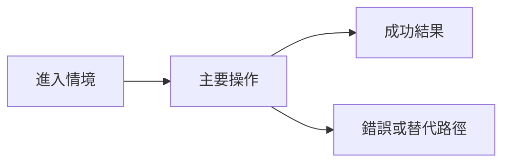

# Design Brief — <Initiative／卡ID>

## 目標與決策

- 對應 Discovery：<brief 路徑與核可版本>
- 主要使用者與任務：<誰在何種情境完成什麼>
- 設計者：<帳號／模型@工具>　需求方：<帳號>
- Design Gate：<待核可／已核可／N/A；N/A 理由>

## 使用流程與資訊架構

- 入口與資訊架構：<頁面／導航／內容層級>
- 正常流程：<步驟與使用者回饋>
- 空／載入／錯誤／權限狀態：<各狀態的資訊、操作與復原>

## 驗收與風險

- 可及性 [accessibility]：<鍵盤、焦點、語意、對比、動態效果等適用條件>
- 可用性驗收：<使用者可完成的任務、成功標準、不可接受的困惑>
- Prototype／視覺稿：<連結／N/A 與理由>
- 驗證方法：<走查／prototype 測試／真實使用者測試／N/A 與理由>
- 技術限制與待確認事項：<交由技術規劃者確認的問題>

## 核可與變更

- 需求方核可：<帳號／日期／連結>
- 基線變更：<日期、原因、受影響 Initiative／子卡、重新核可>
