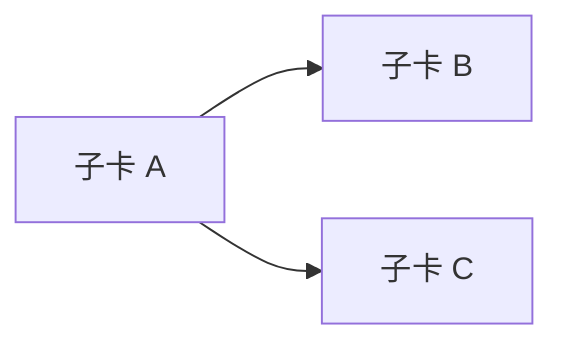

# INIT-<id> <成果導向名稱>

- 需求方：<GitHub 帳號>　owner：<帳號／模型@工具>
- Discovery：<discovery brief 路徑>　Design：<design brief 路徑／N/A 與理由>　spec 基線：v<n>
- 目標：<預期成果>　非目標：<不做事項>
- 里程碑：<checkpoint／人類確認點>

## 依賴與子卡

- <子卡 ID>：<切片與驗收>

## 基線變更紀錄

- <日期> v<n> by <actor> → <變更原因；受影響子卡；需求方重新核可連結>。

## 決策與風險

- <日期> <決策／風險／緩解方式>。
